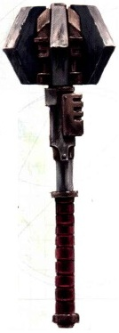
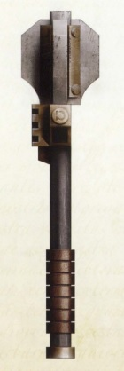
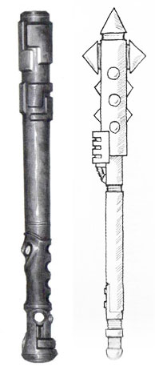

# 1153 动力槌 Power Maul

精校状态：中文行文已逐段精校，部分术语仍为暂定

分类：武器 / 近战武器

原文来源：https://www.bilibili.com/opus/998785238729490472

原作者：帝国神选罐头

原文时间：2024年11月12日 12:36

[返回分类目录](目录.md) · [全书目录](../../目录.md)

<!-- A1153-B0001 -->
**英文原文**

Power mauls are Imperial Power Weapons most commonly used by the Adeptus Arbites but also utilized by other armies such as the Adeptus Astartes.

<!-- /A1153-B0001 -->

<!-- A1153-B0002 -->

原译文

动力槌是帝国动力武器，最常被法务部使用，但也被阿斯塔特修会等其他军队使用。

**校订译文**

动力槌是帝国的一类动力武器，最常由法务部使用，阿斯塔特等其他武装力量也会配备。

<!-- /A1153-B0002 -->

<!-- A1153-B0003 图片 -->

<!-- A1153-B0004 -->

原译文

Space Marine Power Maul 星际战士动力槌

**校订译文**

Space Marine Power Maul 星际战士动力槌

<!-- /A1153-B0004 -->

<!-- A1153-B0005 -->
## Overview 概述

<!-- /A1153-B0005 -->

<!-- A1153-B0006 -->
**英文原文**

Effectively a baton surrounded by a power field, the power maul has a hidden subtlety: the power field setting can be extensively adjusted so that its disruption effect can vary from bashing a hole through a wall, to delivering a sudden knock-out blow to an individual. This tactical depth-of-use makes it a valued tool of Imperial law enforcement. Arbites shock troops employ the weapon in combination with the suppression shield in breaking up riots.

<!-- /A1153-B0006 -->

<!-- A1153-B0007 -->

原译文

实际上，这是一个被力场包围的棒，动力槌有一个隐藏的微妙之处：力场的设置可以广泛调整，这样它的破坏力就可以从在墙上砸一个洞，到对个人进行突然的击倒。这种战术性深度的使用使其成为帝国执法的重要工具。法务部震慑部队将这种武器与镇压盾牌相结合，以驱散骚乱。

**校订译文**

动力槌本质上是一根包覆动力场的棍棒，但它的精妙之处在于力场强度可以大幅调节：既能在墙壁上砸出破洞，也能突然将一个人击昏。这种灵活性使它成为帝国执法力量的重要工具。法务部突击部队常将动力槌与镇压盾搭配，用于驱散暴动人群。

**校注：** knock-out 是击昏而非仅推倒；shock troops 在此为执法突击力量，不表示另一个叫震慑的组织。

<!-- /A1153-B0007 -->

<!-- A1153-B0008 -->
**英文原文**

A variety of power maul patterns exist, with distinctive features that can affect a user's fighting style. For example, the classic Ultima pattern maul is short and heavy with little ornamentation, making it well suited for choppy strokes. They are effective as truncheons, even without activating their power fields, and can easily break the bones of an assailant. In contrast, the Hydraphur pattern is longer, lighter and more slender, with a spiked handguard which impedes reverse-grip techniques. Lacking the weight of other patterns, they require greater finesse to wield, with users lightly jabbing opponents with the tip and letting the power field do the rest, almost as if they were fencing.

<!-- /A1153-B0008 -->

<!-- A1153-B0009 -->

原译文

存在多种动力槌型号，具有独特的特征，可以影响使用者的战斗风格。例如，经典的极限型短而重，几乎没有装饰，非常适合连贯的敲击。它们就像警棍一样有效，即使不激活它们的能量场，也能很容易地打断袭击者的骨头。相比之下，海德拉弗型更长、更轻、更纤细，带有尖刺的护手，阻碍了反向抓握的技巧。由于缺乏其他型号的重量，它们需要更好的技巧来挥舞，使用者用尖端轻轻戳击对手，让力场完成剩下的动作，几乎就像击剑一样。

**校订译文**

动力槌有多种型号，结构差异也会影响使用方式。例如，经典的极限型短而沉重，几乎没有装饰，适合短促劈砸。即使不开启动力场，它也能像警棍一样有效打击，轻易敲断袭击者的骨头。海德拉弗型则更长、更轻、更纤细，带尖刺的护手不便反握。由于缺少其他型号的重量，它对技巧要求更高：使用者往往像击剑一样，以尖端轻刺对手，再让动力场完成杀伤。

**校注：** choppy strokes 为短促劈砸，原“连贯敲击”不准确；reverse-grip即反握。

<!-- /A1153-B0009 -->

<!-- A1153-B0010 图片 -->

<!-- A1153-B0011 -->

原译文

Heresy-era Meridius Pattern Mk.VI Power Maul 叛乱时代梅里迪乌斯型Mk.VI动力槌

**校订译文**

Heresy-era Meridius Pattern Mk.VI Power Maul 叛乱时代梅里迪乌斯型Mk.VI动力槌

<!-- /A1153-B0011 -->

<!-- A1153-B0012 -->
**英文原文**

A similar weapon is the shock maul, which uses an electrical discharge instead of a power field to incapacitate the enemy.

<!-- /A1153-B0012 -->

<!-- A1153-B0013 -->

原译文

一种类似的武器是震撼槌，它使用放电而不是力场来使敌人丧失能力。

**校订译文**

震撼槌是一种相似武器，但它以放电而非动力场使敌人丧失行动能力。

<!-- /A1153-B0013 -->

<!-- A1153-B0014 图片 -->

<!-- A1153-B0015 -->

原译文

Adeptus Arbites power maul and shock maul 法务部动力槌与震撼槌

**校订译文**

Adeptus Arbites power maul and shock maul 法务部动力槌与震撼槌

<!-- /A1153-B0015 -->

<!-- A1153-B0016 -->
## Famous Power Mauls 著名动力槌

<!-- /A1153-B0016 -->

<!-- A1153-B0017 -->
**英文原文**

Worldbreaker — Wielded by Horus Lupercal

<!-- /A1153-B0017 -->

<!-- A1153-B0018 -->

原译文

破世者 — 荷鲁斯·卢佩卡尔挥舞

**校订译文**

破世者 — 荷鲁斯·卢佩卡尔挥舞

<!-- /A1153-B0018 -->

<!-- A1153-B0019 -->
**英文原文**

Illuminarum — Wielded by Lorgar

<!-- /A1153-B0019 -->

<!-- A1153-B0020 -->

原译文

启明之光 — 珞珈挥舞

**校订译文**

启明之光 — 珞珈挥舞

<!-- /A1153-B0020 -->

<!-- A1153-B0021 -->
**英文原文**

Weight of Duty — Hammers of Dorn

<!-- /A1153-B0021 -->

<!-- A1153-B0022 -->

原译文

职责之重 — 多恩之锤

**校订译文**

职责之重 — 多恩之锤

<!-- /A1153-B0022 -->

<!-- A1153-B0023 -->
**英文原文**

Lost Mace of Corswain — Dark Angels

<!-- /A1153-B0023 -->

<!-- A1153-B0024 -->

原译文

考斯韦恩的失落之杖 — 黑暗天使

**校订译文**

考斯韦恩的失落之槌——黑暗天使。

**校注：** Mace是槌类武器，原失落之杖会与法杖或灵能杖混淆，暂改失落之槌。

<!-- /A1153-B0024 -->

本篇核心术语与暂定项

以下列出本篇出现的英文原形及核心术语表用词。同形词可能指不同对象，具体词义以本篇正文和校注为准；单复数、别名和仅见于图注的名称可能尚未列入。完整候选见[术语表](../../术语表/双语术语候选.csv)。

| 英文 | 采用中文 | 状态 |
| --- | --- | --- |
| Adeptus Astartes | 阿斯塔特修会 | 官方已核对 |
| Dark Angels | 黑暗天使 | 官方已核对 |
| Adeptus Arbites | 法务部 | 暂定 |
| Horus | 荷鲁斯 | 暂定·官方待核 |
| Hydraphur | 海德拉弗 | 暂定·官方待核 |
| Horus Lupercal | 荷鲁斯·卢佩卡尔 | 暂定·官方待核 |
| Lupercal | 卢佩卡尔 | 暂定·官方待核 |
| Corswain | 考斯韦恩 | 暂定·官方待核 |
| Hammers of Dorn | 多恩之锤 | 暂定·官方待核 |
| Lorgar | 珞珈 | 暂定·官方待核 |
| The Weapon | 武器 | 暂定·官方待核 |
| Power Maul | 动力槌 | 暂定·官方待核 |
| Shock Maul | 震撼槌 | 暂定·官方待核 |
| Worldbreaker | 破世者 | 暂定·官方待核 |
| Illuminarum | 启明之光 | 暂定·官方待核 |
| Weight of Duty | 职责之重 | 暂定·官方待核 |
| Lost Mace of Corswain | 考斯韦恩的失落之槌 | 暂定·官方待核 |
| Power Weapons | 动力武器 | 暂定·官方待核 |

