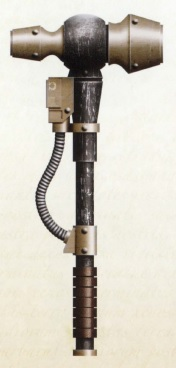
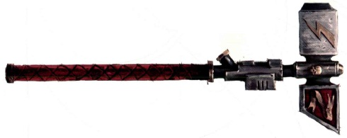
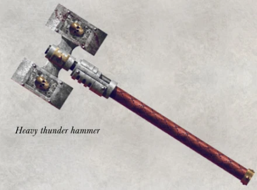

# 1154 雷霆锤 Thunder Hammer

精校状态：中文行文已逐段精校，部分术语仍为暂定

分类：武器 / 近战武器

原文来源：https://www.bilibili.com/opus/998786303864602626

原作者：帝国神选罐头

原文时间：2024年11月12日 12:40

[返回分类目录](目录.md) · [全书目录](../../目录.md)

<!-- A1154-B0001 -->
**英文原文**

Thunder hammers are weapons of ancient design, utilizing a power field similar to a power sword or fist, and used by Space Marines and Daemonhunters, primarily by Terminator Assault Squads and characters with access to the relevant armoury.

<!-- /A1154-B0001 -->

<!-- A1154-B0002 -->

原译文

雷霆锤是一种古老设计的武器，利用类似于动力剑或拳的力场，由星际战士和恶魔猎手使用，主要是由突击终结者小队和可以进入相关军械库的角色使用。

**校订译文**

雷霆锤是一种设计古老的武器，使用与动力剑、动力拳相似的动力场。星际战士和恶魔猎手都会配备，主要使用者是终结者突击小队，以及有权从相应军械库领取装备的人物。

**校注：** 对照本段英文确认同一实体，与全书核心译名统一；不改变同形异义词或省略称呼。

<!-- /A1154-B0002 -->

<!-- A1154-B0003 图片 -->

<!-- A1154-B0004 -->

原译文

Heresy-era Thunder Hammer 叛乱时期雷霆锤

**校订译文**

Heresy-era Thunder Hammer 叛乱时期雷霆锤

<!-- /A1154-B0004 -->

<!-- A1154-B0005 -->
## Overview 概述

<!-- /A1154-B0005 -->

<!-- A1154-B0006 -->
**英文原文**

Where other power weapons emit a constant energy field, the thunder hammer is designed to energize the power field only upon impact, enabling it to conserve energy until it is actually needed, and allowing the weapon to deliver a particularly devastating blow. Upon impact, the thunder hammer's blue energy field explodes with a thunderous crack, more often than not smashing through armour, and leaving a smoking hole that crackles with blue sparks. The power unleashed on impact is such that a warrior not in Terminator armour will likely be knocked over. The weapon's main drawback in combat is its slowness in delivering a strike compared to most other close combat weapons.

<!-- /A1154-B0006 -->

<!-- A1154-B0007 -->

原译文

在其他动力武器发出恒定能量场的情况下，雷霆锤的设计是仅在撞击时为能量场供能，使其能够保存能量，直到实际需要为止，并使武器能够发出尤其毁灭性的打击。撞击后，雷霆锤的蓝色能量场会爆炸出雷霆般的裂纹，通常会穿透盔甲，留下一个冒着烟的洞，上面会发出蓝色火花。撞击时释放的力量如此之大，以至于没有穿终结者盔甲的战士很可能会被撞倒。这种武器在战斗中的主要缺点是，与大多数其他近战武器相比，它的打击速度较慢。

**校订译文**

多数动力武器持续释放能量场，雷霆锤则只在命中瞬间激活动力场，将能量保留至真正需要时，再集中释放毁灭性一击。撞击时，蓝色能量场伴着雷鸣般的巨响爆发，往往能击穿装甲，留下冒烟的破洞，蓝色电火花劈啪作响。它释放的力量足以掀翻未穿终结者甲的战士。与大多数其他近战武器相比，雷霆锤的主要缺点在于挥击缓慢。

**校注：** thunderous crack 为雷鸣般的响声，不是雷电形状的裂纹。原句未明确被震倒者一定是持锤者或目标，译文不擅作限定。

<!-- /A1154-B0007 -->

<!-- A1154-B0008 图片 -->

<!-- A1154-B0009 -->

原译文

"Stormlord" Pattern Thunder Hammer “风暴领主”型雷霆锤

**校订译文**

"Stormlord" Pattern Thunder Hammer “风暴领主”型雷霆锤

<!-- /A1154-B0009 -->

<!-- A1154-B0010 -->
**英文原文**

The thunder hammer is often combined with a Storm Shield, giving the wielder a combination of unmatched lethality and superb protection in close combat. It has in the past been recorded that thunder hammers could release their titanic energies in one attack, self-destructing the weapon and killing not only the wielder but any surrounding enemies. However, this function has either been removed from currently-used thunder hammers, or it is not considered an appropriate tactic.

<!-- /A1154-B0010 -->

<!-- A1154-B0011 -->

原译文

雷霆锤通常与风暴盾结合使用，在近距离战斗中为使用者提供无与伦比的杀伤力和出色的保护。过去有记录表明，雷霆锤可以在一次攻击中释放出巨大的能量，自毁武器，不仅杀死使用者，还杀死周围的任何敌人。然而，该功能要么已从目前使用的雷霆锤中删除，要么被认为不是一种合适的策略。

**校订译文**

雷霆锤常与风暴盾搭配，为使用者提供强悍的近战杀伤力与防护。据旧记录，雷霆锤还能在一次攻击中释放全部巨大能量，使武器自毁，同时杀死使用者及周围敌人。但如今的雷霆锤似乎已移除这一功能，或者这种用法不再被视为合适的战术。

<!-- /A1154-B0011 -->

<!-- A1154-B0012 -->
### Heavy Thunder Hammer 重型雷霆锤

<!-- /A1154-B0012 -->

<!-- A1154-B0013 -->
**英文原文**

Heavy Thunder Hammers are a larger pattern of Thunder Hammer. These weapons are equipped with two heads, each swathed in a powerful disruptor field. Heavy Thunder Hammers are extremely powerful weapons, able to smash the midsection of a Carnifex in twain.

<!-- /A1154-B0013 -->

<!-- A1154-B0014 -->

原译文

重型雷霆锤是雷霆锤的较大型号。这些武器配备了两个锤头，每个锤头都包裹在一个强大的破坏力场中。重型雷霆锤是一种极其强大的武器，能够将刽子手从腰腹部分粉碎成两半。

**校订译文**

重型雷霆锤是更庞大的雷霆锤型号，具有两个锤头，每个都包覆强大的破坏力场。它威力惊人，足以将刽子手生物的躯干砸成两段。

**校注：** Carnifex在此是泰伦刽子手生物，按GW09/GW10已核复数单位名处理，区别药剂师同名医疗器具。

<!-- /A1154-B0014 -->

<!-- A1154-B0015 图片 -->

<!-- A1154-B0016 -->

原译文

Heavy Thunder Hammer 重型雷霆锤

**校订译文**

Heavy Thunder Hammer 重型雷霆锤

<!-- /A1154-B0016 -->

<!-- A1154-B0017 -->
## Unique Thunder Hammers 著名雷霆锤

<!-- /A1154-B0017 -->

<!-- A1154-B0018 -->
**英文原文**

Forgebreaker was the famous weapon of Iron Hands Primarch Ferrus Manus.

<!-- /A1154-B0018 -->

<!-- A1154-B0019 -->

原译文

破炉者是钢铁之手原体费鲁斯·马努斯的著名武器。

**校订译文**

破炉者是钢铁之手原体费鲁斯·马努斯的著名武器。

<!-- /A1154-B0019 -->

<!-- A1154-B0020 -->
**英文原文**

Vulkan is known to have wielded various potent Thunder Hammers such as Thunderhead, Dawnbringer, Urdrakule, and Doomtremor.

<!-- /A1154-B0020 -->

<!-- A1154-B0021 -->

原译文

众所周知，沃坎曾使用过各种强大的雷霆锤，如雷暴云砧、黎明使者、燃烧之手和毁灭震颤。

**校订译文**

沃坎使用过多种强大的雷霆锤，包括雷霆之首、黎明使者、燃烧之手和末日震颤。

**校注：** 统一708等篇既定战锤名称；原雷暴云砧和毁灭震颤保留于原译对照。

<!-- /A1154-B0021 -->

<!-- A1154-B0022 -->
**英文原文**

The Fist of Dorn is a huge thunder hammer passed down by the Captains of the Imperial Fists' First Company. Its current bearer is 1st Company Captain Darnath Lysander.

<!-- /A1154-B0022 -->

<!-- A1154-B0023 -->

原译文

多恩之拳是帝国之拳第一连长传下来的一把巨大的雷锤。它的现任持有者是第一连长达纳斯·莱山德。

**校订译文**

多恩之拳是一把巨型雷霆锤，由帝国之拳历任第一连连长传承；现由达纳斯·莱山德持有。

<!-- /A1154-B0023 -->

<!-- A1154-B0024 -->
**英文原文**

The Foehammer is a thunder hammer with an integrated teleporter that allows its bearer, Arjac Rockfist of the Space Wolves, to throw it and have it return to him.

<!-- /A1154-B0024 -->

<!-- A1154-B0025 -->

原译文

克敌之锤是一个带有集成传送器的雷霆锤，它允许其持有者、太空狼的阿贾克·石拳投掷并回收。

**校订译文**

破敌锤内置传送装置，使其主人、太空野狼的阿贾克·石拳能够投出战锤后，再将它传送回手中。

<!-- /A1154-B0025 -->

<!-- A1154-B0026 -->
**英文原文**

The Malleus Noctum is wielded by Salamanders Captain Adrax Agatone.

<!-- /A1154-B0026 -->

<!-- A1154-B0027 -->

原译文

夜之锤由火蜥蜴连长阿德拉克斯·阿伽顿挥舞。

**校订译文**

夜曲之锤由火蜥蜴连长阿德拉克斯·阿伽顿使用。

<!-- /A1154-B0027 -->

<!-- A1154-B0028 -->

原译文

Maekr of the Space Wolves 太空野狼的迈凯尔

**校订译文**

Maekr of the Space Wolves 太空野狼的迈凯尔

<!-- /A1154-B0028 -->

<!-- A1154-B0029 -->

原译文

Hammer of Baal of the Blood Angels 圣血天使的巴尔之锤

**校订译文**

Hammer of Baal of the Blood Angels 圣血天使的巴尔之锤

<!-- /A1154-B0029 -->

<!-- A1154-B0030 -->

原译文

Veikskell of the Space Wolves 太空野狼的维克斯凯尔

**校订译文**

Veikskell of the Space Wolves 太空野狼的维克斯凯尔

<!-- /A1154-B0030 -->

本篇核心术语与暂定项

以下列出本篇出现的英文原形及核心术语表用词。同形词可能指不同对象，具体词义以本篇正文和校注为准；单复数、别名和仅见于图注的名称可能尚未列入。完整候选见[术语表](../../术语表/双语术语候选.csv)。

| 英文 | 采用中文 | 状态 |
| --- | --- | --- |
| Space Marines | 星际战士 | 官方已核对 |
| Space Wolves | 太空野狼 | 官方已核对 |
| Terminator | 终结者 | 官方已核对 |
| Imperial Fists | 帝国之拳 | 暂定 |
| Darnath Lysander | 达纳斯·莱山德 | 官方已核对 |
| Primarch | 原体 | 官方已核对 |
| Ferrus Manus | 费鲁斯·马努斯 | 暂定·官方待核 |
| Iron Hands | 钢铁之手 | 暂定·官方待核 |
| Vulkan | 沃坎 | 暂定·官方待核 |
| Salamanders | 火蜥蜴 | 暂定·官方待核 |
| Carnifex | 刽子手 | 暂定·官方待核 |
| Ancient | 旗手 | 官方已核对 |
| Captain | 连长 | 暂定·官方待核 |
| Arjac Rockfist | 阿贾克·石拳 | 官方已核 |
| Adrax Agatone | 阿德拉克斯·阿伽顿 | 官方已核 |
| Armoury | 军械库 | 暂定·官方待核 |
| Assault Squads | 突击小队 | 暂定·官方待核 |
| Terminator Assault Squads | 终结者突击小队 | 暂定·官方待核 |
| Malleus Noctum | 夜曲之锤 | 暂定·官方待核 |
| The Weapon | 武器 | 暂定·官方待核 |
| Forgebreaker | 破炉者 | 暂定·官方待核 |
| Dawnbringer | 黎明使者 | 暂定·官方待核 |
| Urdrakule | 燃烧之手 | 暂定·官方待核 |
| Doomtremor | 末日震颤 | 暂定·官方待核 |
| Thunderhead | 雷霆之首 | 暂定·官方待核 |
| Foehammer | 破敌锤 | 暂定·官方待核 |
| Fist of Dorn | 多恩之拳 | 暂定·官方待核 |
| Thunder Hammer | 雷霆锤 | 暂定·官方待核 |
| Power Weapons | 动力武器 | 暂定·官方待核 |
| The Fist of Dorn | 多恩之拳 | 暂定·官方待核 |
| Storm Shield | 风暴盾 | 暂定·官方待核 |
| Terminator Armour | 终结者盔甲 | 暂定·官方待核 |

