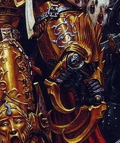

# 1156 帝皇闪电爪 Emperor's Lightning Claw

精校状态：中文行文已逐段精校，部分术语仍为暂定

分类：武器 / 近战武器

原文来源：https://www.bilibili.com/opus/1084131882485940290

原作者：帝国神选罐头

原文时间：2025年06月30日 12:25

[返回分类目录](目录.md) · [全书目录](../../目录.md)

<!-- A1156-B0001 -->
**英文原文**

The Emperor's Lightning Claw is an as of yet unnamed Lightning Claw that was usually seen on the Emperor's left hand during the Great Crusade and Horus Heresy. It varies in depictions, having anywhere between three to five digits.

<!-- /A1156-B0001 -->

<!-- A1156-B0002 -->

原译文

帝皇闪电爪是一个尚未命名的闪电爪，通常在大远征和荷鲁斯叛乱期间出现在帝皇的左手上。它的描述各不相同，有三到五种描述。

**校订译文**

帝皇的闪电爪至今没有专属名称。大远征与荷鲁斯之乱时期的描绘中，它通常戴在帝皇左手；不同图像所画出的爪刃数量不一，从三根到五根都有。

**校注：** digits 指手指状爪刃的数量，不是图像描述的种数；Emperor’s Lightning Claw为描述性名称，并非原文确认的武器真名。

<!-- /A1156-B0002 -->

<!-- A1156-B0003 图片 -->

<!-- A1156-B0004 -->

原译文

The Emperor's Lightning Claw 帝皇闪电爪

**校订译文**

The Emperor's Lightning Claw 帝皇闪电爪

<!-- /A1156-B0004 -->

<!-- A1156-B0005 -->
**英文原文**

It is unknown what ultimately became of the weapon, as contemporary art of the Emperor does not depict him with it.

<!-- /A1156-B0005 -->

<!-- A1156-B0006 -->

原译文

目前尚不清楚这件武器最终变成了什么，因为现在有关帝皇的作品并没有用它来描述帝皇。

**校订译文**

这件武器最终下落不明；后世描绘帝皇的图像中，不再出现这副闪电爪。

**校注：** contemporary art 指底稿所说当代的帝皇图像，不据此断言现实此后所有官方新画作均未描绘该武器。

<!-- /A1156-B0006 -->

本篇核心术语与暂定项

以下列出本篇出现的英文原形及核心术语表用词。同形词可能指不同对象，具体词义以本篇正文和校注为准；单复数、别名和仅见于图注的名称可能尚未列入。完整候选见[术语表](../../术语表/双语术语候选.csv)。

| 英文 | 采用中文 | 状态 |
| --- | --- | --- |
| Horus Heresy | 荷鲁斯之乱 | 官方已核对 |
| Emperor | 帝皇 | 官方已核对 |
| Great Crusade | 大远征 | 暂定·官方待核 |
| Horus | 荷鲁斯 | 暂定·官方待核 |
| The Weapon | 武器 | 暂定·官方待核 |
| Emperor's Lightning Claw | 帝皇闪电爪 | 暂定·官方待核 |
| claw | 利爪分队 | 暂定·官方待核 |

