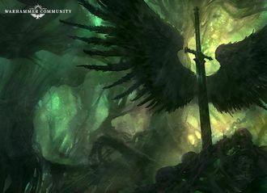

# 1159 忠诚 Fealty

精校状态：中文行文已逐段精校，部分术语仍为暂定

分类：武器 / 近战武器

原文来源：https://www.bilibili.com/opus/1189467239640727554

原作者：帝国神选罐头

原文时间：2026年04月10日 09:00

[返回分类目录](目录.md) · [全书目录](../../目录.md)

原篇名：效忠 Fealty

<!-- A1159-B0001 -->
**英文原文**

Fealty is a radiant power sword that is being wielded by the reborn Primarch Lion El'Jonson in M42. It is named for what the Lion believes he owes to his Father and the Imperium as a whole.

<!-- /A1159-B0001 -->

<!-- A1159-B0002 -->

原译文

效忠是一把光芒四射的动力剑，由M42中重生的莱昂·艾尔庄森挥舞。它以莱昂认为他欠父亲和整个帝国的东西命名。

**校订译文**

忠诚是一把光芒四射的动力剑，在第42个千年由重归世间的原体莱昂·艾尔’庄森执掌。这个名字代表了雄狮认为自己应当向父亲和整个帝国献上的忠诚。

<!-- /A1159-B0002 -->

<!-- A1159-B0003 图片 -->

<!-- A1159-B0004 -->

原译文

Fealty within Mirror-Caliban 镜像卡利班内的效忠

**校订译文**

Fealty within Mirror-Caliban 镜像卡利班中的“忠诚”

<!-- /A1159-B0004 -->

<!-- A1159-B0005 -->
**英文原文**

Upon his reawakening, Lion El'Jonson discovered the weapon within the mysterious realm known as Mirror-Caliban.

<!-- /A1159-B0005 -->

<!-- A1159-B0006 -->

原译文

在他醒来后，莱昂·艾尔庄森在被称为镜像卡利班的神秘领域内发现了武器。

**校订译文**

莱昂·艾尔’庄森重新苏醒后，在名为镜像卡利班的神秘领域中发现了这把剑。

<!-- /A1159-B0006 -->

本篇核心术语与暂定项

以下列出本篇出现的英文原形及核心术语表用词。同形词可能指不同对象，具体词义以本篇正文和校注为准；单复数、别名和仅见于图注的名称可能尚未列入。完整候选见[术语表](../../术语表/双语术语候选.csv)。

| 英文 | 采用中文 | 状态 |
| --- | --- | --- |
| Imperium | 帝国 | 暂定·简称 |
| Primarch | 原体 | 官方已核对 |
| Lion El'Jonson | 莱昂·艾尔’庄森 | 官方已核对 |
| Caliban | 卡利班 | 暂定·官方待核 |
| Reborn | 复生者（战团）／重生者（死神军自称） | 语境定译·官方待核 |
| Mirror-Caliban | 镜像卡利班 | 暂定·官方待核 |
| Fealty | 忠诚 | 暂定·官方待核 |
| The Weapon | 武器 | 暂定·官方待核 |

