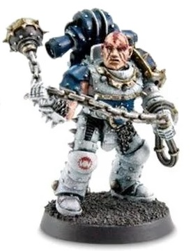

# 1160 屠戮武器 Caedere Weapon

精校状态：中文行文已逐段精校，部分术语仍为暂定

分类：武器 / 近战武器

原文来源：https://www.bilibili.com/opus/1008790304928563219

原作者：帝国神选罐头

原文时间：编辑于 2025年08月31日 16:08

[返回分类目录](目录.md) · [全书目录](../../目录.md)

<!-- A1160-B0001 -->
**英文原文**

Caedere Weapons were a type of close combat weapon used by the World Eaters during the Great Crusade. Based on the ritual weapons of the gladiators of Nuceria, they were brutal and difficult to master. Caedere Weapons were the favored weapons of World Eaters Rampagers.

<!-- /A1160-B0001 -->

<!-- A1160-B0002 -->

原译文

屠戮武器是大远征期间吞世者使用的一种近战武器。基于努凯里亚角斗士的仪式武器，它们残忍且难以掌握。屠戮武器是吞世者狂暴者的常用武器。

**校订译文**

屠戮武器是大远征期间吞世者使用的一类近战武器。它们仿自努凯里亚角斗士的仪式武器，凶狠残酷，且难以掌握，是吞世者狂暴者偏爱的武器。

<!-- /A1160-B0002 -->

<!-- A1160-B0003 图片 -->

<!-- A1160-B0004 -->

原译文

Rampager with Meteor Hammer 装备流星锤的狂暴者

**校订译文**

Rampager with Meteor Hammer 装备流星锤的狂暴者

<!-- /A1160-B0004 -->

<!-- A1160-B0005 -->
## Types 类别

<!-- /A1160-B0005 -->

<!-- A1160-B0006 -->

原译文

Meteor Hammer 流星锤

**校订译文**

Meteor Hammer 流星锤

<!-- /A1160-B0006 -->

<!-- A1160-B0007 -->

原译文

Excoriator Chainaxe 严斥者链锯斧

**校订译文**

Excoriator Chainaxe 剥皮者链锯斧

**校注：** Excoriator 在武器语境中指剥皮者，原“严斥者”取了不合语境的词义。与战团名 Excoriators（责难者）分别登记；本武器名仍为暂定。

<!-- /A1160-B0007 -->

<!-- A1160-B0008 -->

原译文

Twin Falax Blades 双法拉克斯刃

**校订译文**

Twin Falax Blades 双法拉克斯刃

<!-- /A1160-B0008 -->

<!-- A1160-B0009 -->

原译文

Barb-hook Lash 倒钩鞭

**校订译文**

Barb-hook Lash 倒钩鞭

<!-- /A1160-B0009 -->

本篇核心术语与暂定项

以下列出本篇出现的英文原形及核心术语表用词。同形词可能指不同对象，具体词义以本篇正文和校注为准；单复数、别名和仅见于图注的名称可能尚未列入。完整候选见[术语表](../../术语表/双语术语候选.csv)。

| 英文 | 采用中文 | 状态 |
| --- | --- | --- |
| World Eaters | 吞世者 | 官方已核对 |
| Great Crusade | 大远征 | 暂定·官方待核 |
| Nuceria | 努凯里亚 | 暂定·官方待核 |
| Master | 导师（审判庭职衔）／舰务官（舰员职务） | 语境定译·官方待核 |
| Rampagers | 狂暴者 | 暂定·官方待核 |
| Gladiators | 角斗士 | 暂定·官方待核 |

