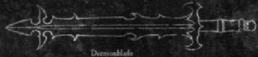
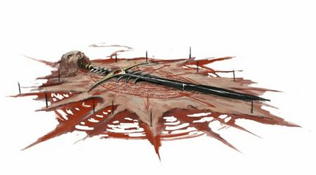

# 1162 恶魔武器 Daemon Weapon

精校状态：中文行文已逐段精校，部分术语仍为暂定

分类：武器 / 近战武器

原文来源：https://www.bilibili.com/opus/1192067902467997700

原作者：帝国神选罐头

原文时间：2026年04月17日 09:12

[返回分类目录](目录.md) · [全书目录](../../目录.md)

<!-- A1162-B0001 -->

原译文

Willingly you picked me up. Your first mistake. Willingly you drew me. Your second mistake. I do not allow my servants to make three mistakes, foolish mortal... - A Daemon Weapon 你心甘情愿的拿起我。你的第一个错误。你心甘情愿的挥动我。你的第二个错误。我不允许我的仆人犯三个错误，愚蠢的凡人... - 一把恶魔武器

**校订译文**

Willingly you picked me up. Your first mistake. Willingly you drew me. Your second mistake. I do not allow my servants to make three mistakes, foolish mortal... - A Daemon Weapon 你自愿拿起了我，这是你的第一个错误。你自愿将我出鞘，这是你的第二个错误。我不允许仆人犯下第三个错误，愚蠢的凡人……——一把恶魔武器

<!-- /A1162-B0001 -->

<!-- A1162-B0002 -->
**英文原文**

Daemon Weapons are gifts of the Gods of Chaos, used by Chaos Champions and Daemons. Bound (sometimes willingly) in the form of the weapon, and imprisoned there for an eternity, is the spirit of a Daemon.

<!-- /A1162-B0002 -->

<!-- A1162-B0003 -->

原译文

恶魔武器是混沌诸神的礼物，由混沌冠军和恶魔使用。以武器的形式被束缚（有时是自愿的），并被永远囚禁在那里的，是恶魔的灵魂。

**校订译文**

恶魔武器是混沌诸神赐予的礼物，供混沌冠军和恶魔使用。每件武器中都束缚着一个恶魔的灵魂，永远囚禁于此；有时，恶魔甚至是自愿接受束缚的。

<!-- /A1162-B0003 -->

<!-- A1162-B0004 图片 -->

<!-- A1162-B0005 -->

原译文

Daemonblade 恶魔之刃

**校订译文**

Daemonblade 恶魔之刃

<!-- /A1162-B0005 -->

<!-- A1162-B0006 -->
## Overview 概述

<!-- /A1162-B0006 -->

<!-- A1162-B0007 -->
**英文原文**

Daemon Weapons are only granted to the most powerful of a Chaos God's servants: Greater Daemons, Daemon Princes and still-mortal Champions of Chaos. Each weapon is unique and grants considerable power to those who wield it, however the daemon bound to the weapon can sometimes overcome the will of its would-be master.

<!-- /A1162-B0007 -->

<!-- A1162-B0008 -->

原译文

恶魔武器只授予混沌之神最强大的仆人：大魔、恶魔王子和仍然是凡人的混沌冠军。每件武器都是独一无二的，并赋予使用它的人相当强大的力量，然而，束缚到武器上的恶魔有时可以战胜其潜在主人的意志。

**校订译文**

只有混沌诸神最强大的仆从才会获赐恶魔武器，包括大魔、恶魔亲王，以及尚为凡人之身的混沌冠军。每件武器都独一无二，能赋予持有者强大的力量。不过，武器中受缚的恶魔有时也会压倒企图驾驭它的主人的意志。

<!-- /A1162-B0008 -->

<!-- A1162-B0009 图片 -->

<!-- A1162-B0010 -->

原译文

Daemon Weapon 恶魔武器

**校订译文**

Daemon Weapon 恶魔武器

<!-- /A1162-B0010 -->

<!-- A1162-B0011 -->
**英文原文**

No Daemon enjoys being bound and they are particularly frustrated when bound to a non-killing implement, such as a shield. The absence of murder and blood for so long can drive Daemons insane.

<!-- /A1162-B0011 -->

<!-- A1162-B0012 -->

原译文

没有一个恶魔喜欢被束缚，当他们被束缚在非杀伤性工具上时，比如盾牌，他们会特别沮丧。这么长时间没有谋杀和流血事件会让恶魔发疯。

**校订译文**

没有恶魔喜欢受人束缚；若被困在盾牌这类并非用于杀戮的器物中，它们尤其愤懑。长期得不到杀戮与鲜血的滋养，足以使恶魔发疯。

<!-- /A1162-B0012 -->

<!-- A1162-B0013 -->
## Daemon Weapons of Khorne 恐虐恶魔武器

<!-- /A1162-B0013 -->

<!-- A1162-B0014 -->

原译文

A'rgath 阿'加斯

**校订译文**

A'rgath 阿'加斯

<!-- /A1162-B0014 -->

<!-- A1162-B0015 -->
**英文原文**

The Axe of Khorne - a massive, ornate axe imbued with Khorne's own insatiable bloodlust. They are wielded by Bloodthirsters and are also gifted on occasion to other worthy champions of Khorne.

<!-- /A1162-B0015 -->

<!-- A1162-B0016 -->

原译文

恐虐之斧 — 一把巨大，华丽的斧头，充满了恐虐自己永不满足的嗜血欲望。它们由嗜血狂魔挥舞，有时也会赠送给其他值得尊敬的恐虐冠军。

**校订译文**

恐虐之斧——巨大而华丽的战斧，其中灌注着恐虐永不餍足的嗜血欲望。它们通常由嗜血狂魔使用，有时也会赐给其他配得上这份赏赐的恐虐冠军。

<!-- /A1162-B0016 -->

<!-- A1162-B0017 -->
**英文原文**

The Berzerker Glaive is a weapon that the bearer must constantly fight with to remain in control of. The blade contains the bound essence of a Bloodletter which has been driven truly insane by its captivity.

<!-- /A1162-B0017 -->

<!-- A1162-B0018 -->

原译文

狂战士长刀是一种武器，持有者必须不断与其一起战斗才能保持控制。这把刀刃包含了一个放血者的被束本质，它被囚禁后变得非常疯狂。

**校订译文**

狂战士长刀——持有者必须不断与这件武器抗争，才能维持对它的控制。刀刃中束缚着一名放血者的精魄，长期囚禁已使它彻底陷入疯狂。

**校注：** fight with 此处是持有者与武器意志抗争，原译“与其一起战斗”颠倒关系。

<!-- /A1162-B0018 -->

<!-- A1162-B0019 -->

原译文

Blade of Blood 鲜血之刃

**校订译文**

Blade of Blood 鲜血之刃

<!-- /A1162-B0019 -->

<!-- A1162-B0020 -->
**英文原文**

Bloodfeeder - Often taking the form of an axe, the Bloodfeeder contains the bound essence of a raging Bloodthirster.

<!-- /A1162-B0020 -->

<!-- A1162-B0021 -->

原译文

嗜血者 - 通常呈斧头的形式，嗜血者含有狂暴的嗜血狂魔的被束本质。

**校订译文**

嗜血者——通常呈战斧形态，其中束缚着一名狂怒的嗜血狂魔的精魄。

<!-- /A1162-B0021 -->

<!-- A1162-B0022 -->

原译文

Bloodflail 鲜血连枷

**校订译文**

Bloodflail 鲜血连枷

<!-- /A1162-B0022 -->

<!-- A1162-B0023 -->

原译文

Brazen Skull 黄铜颅骨

**校订译文**

Brazen Skull 黄铜颅骨

<!-- /A1162-B0023 -->

<!-- A1162-B0024 -->

原译文

Crimson Crown 深红王冠

**校订译文**

Crimson Crown 深红王冠

<!-- /A1162-B0024 -->

<!-- A1162-B0025 -->

原译文

Deathdealer 死亡贩子

**校订译文**

Deathdealer 死亡贩子

<!-- /A1162-B0025 -->

<!-- A1162-B0026 -->

原译文

Dreadaxe 畏惧之斧

**校订译文**

Dreadaxe 畏惧之斧

<!-- /A1162-B0026 -->

<!-- A1162-B0027 -->
**英文原文**

Firestorm Blades are massive fiery blades sometimes wielded by Bloodthirsters.

<!-- /A1162-B0027 -->

<!-- A1162-B0028 -->

原译文

火焰风暴刃是巨大的火焰刀刃，有时由嗜血狂魔挥舞。

**校订译文**

火焰风暴刃——巨大而炽烈的火焰刀刃，有些嗜血狂魔会使用这类武器。

<!-- /A1162-B0028 -->

<!-- A1162-B0029 -->

原译文

Gorewhip 凝血之鞭

**校订译文**

Gorewhip 凝血之鞭

<!-- /A1162-B0029 -->

<!-- A1162-B0030 -->

原译文

Goreseeker 凝血追踪者

**校订译文**

Goreseeker 凝血追踪者

<!-- /A1162-B0030 -->

<!-- A1162-B0031 -->

原译文

Great Axe of Khorne 恐虐巨斧

**校订译文**

Great Axe of Khorne 恐虐巨斧

<!-- /A1162-B0031 -->

<!-- A1162-B0032 -->

原译文

Great Cleaver of Khorne 恐虐巨刃

**校订译文**

Great Cleaver of Khorne 恐虐巨刃

<!-- /A1162-B0032 -->

<!-- A1162-B0033 -->
**英文原文**

Hellblades are wielded by Bloodletters.

<!-- /A1162-B0033 -->

<!-- A1162-B0034 -->

原译文

放血者挥舞的地狱之刃

**校订译文**

地狱之刃——放血者使用的武器。

<!-- /A1162-B0034 -->

<!-- A1162-B0035 -->
**英文原文**

Khartoth the Bloodhunger - A blade wielded by Khorne himself

<!-- /A1162-B0035 -->

<!-- A1162-B0036 -->

原译文

饥血者卡托斯 - 恐虐自己挥舞的刀刃

**校订译文**

饥血者卡托斯——恐虐亲自使用的利刃。

<!-- /A1162-B0036 -->

<!-- A1162-B0037 -->

原译文

Lash of Khorne 恐虐之鞭

**校订译文**

Lash of Khorne 恐虐之鞭

<!-- /A1162-B0037 -->

<!-- A1162-B0038 -->

原译文

Rod of Khorne 恐虐之杖

**校订译文**

Rod of Khorne 恐虐之杖

<!-- /A1162-B0038 -->

<!-- A1162-B0039 -->
**英文原文**

Schlack'ta - Sword of Khorne wielded by Inquisitor Lichtenstein.

<!-- /A1162-B0039 -->

<!-- A1162-B0040 -->

原译文

斯拉克'塔 - 由审判官利希滕斯坦挥舞的恐虐之剑。

**校订译文**

斯拉克'塔 - 由审判官利希滕斯坦挥舞的恐虐之剑。

<!-- /A1162-B0040 -->

<!-- A1162-B0041 -->

原译文

Skullreaver 掠颅者

**校订译文**

Skullreaver 掠颅者

<!-- /A1162-B0041 -->

<!-- A1162-B0042 -->

原译文

Zaall 扎尔

**校订译文**

Zaall 扎尔

<!-- /A1162-B0042 -->

<!-- A1162-B0043 -->
## Daemon Weapons of Nurgle 纳垢恶魔武器

<!-- /A1162-B0043 -->

<!-- A1162-B0044 -->
**英文原文**

An'garrach - Chainsword

<!-- /A1162-B0044 -->

<!-- A1162-B0045 -->

原译文

安'加拉赫 - 链锯剑

**校订译文**

安'加拉赫 - 链锯剑

<!-- /A1162-B0045 -->

<!-- A1162-B0046 -->

原译文

Balesword 灾祸之剑

**校订译文**

Balesword 灾祸之剑

<!-- /A1162-B0046 -->

<!-- A1162-B0047 -->

原译文

Bilesword 胆汁之剑

**校订译文**

Bilesword 胆汁之剑

<!-- /A1162-B0047 -->

<!-- A1162-B0048 -->

原译文

Bileblade 胆汁之刃

**校订译文**

Bileblade 胆汁之刃

<!-- /A1162-B0048 -->

<!-- A1162-B0049 -->

原译文

Blade of Decay 腐烂之刃

**校订译文**

Blade of Decay 腐烂之刃

<!-- /A1162-B0049 -->

<!-- A1162-B0050 -->

原译文

Contagion Spray 传染喷雾

**校订译文**

Contagion Spray 传染喷雾

<!-- /A1162-B0050 -->

<!-- A1162-B0051 -->

原译文

Corruption 腐败

**校订译文**

Corruption 腐败

<!-- /A1162-B0051 -->

<!-- A1162-B0052 -->

原译文

Death's Head of Duke Olaks 奥拉克斯公爵的死亡之首

**校订译文**

Death's Head of Duke Olaks 奥拉克斯公爵的死亡之首

<!-- /A1162-B0052 -->

<!-- A1162-B0053 -->

原译文

Doomsday Bell 末日之钟

**校订译文**

Doomsday Bell 末日之钟

<!-- /A1162-B0053 -->

<!-- A1162-B0054 -->

原译文

Entropic Knell 熵之丧钟

**校订译文**

Entropic Knell 熵之丧钟

<!-- /A1162-B0054 -->

<!-- A1162-B0055 -->

原译文

Epidemia 流行病

**校订译文**

Epidemia 流行病

<!-- /A1162-B0055 -->

<!-- A1162-B0056 -->

原译文

G'holl'ax 格'霍拉'克

**校订译文**

G'holl'ax 格'霍拉'克

<!-- /A1162-B0056 -->

<!-- A1162-B0057 -->

原译文

Horn of Nurgle's Rot 纳垢腐烂号角

**校订译文**

Horn of Nurgle's Rot 纳垢腐烂号角

<!-- /A1162-B0057 -->

<!-- A1162-B0058 -->
**英文原文**

Manreapers are dipped in the filth seeping from the throne of Nurgle.

<!-- /A1162-B0058 -->

<!-- A1162-B0059 -->

原译文

收割者被浸在从纳垢王座渗出的污秽中。

**校订译文**

收割者——浸染了从纳垢王座渗出的污秽的武器。

<!-- /A1162-B0059 -->

<!-- A1162-B0060 -->
**英文原文**

Pandemic Staves are vessels for the diseases of Nurgle when they are carried from the Warp to the materium and can be released in battle to feast upon enemy units.

<!-- /A1162-B0060 -->

<!-- A1162-B0061 -->

原译文

传染法杖是用于治疗纳垢疾病的容器，当它们从亚空间被运送到物质界时，可以在战斗中释放出来，享用敌方部队。

**校订译文**

传染法杖——用来将纳垢的疾病从亚空间带入物质界的容器。战斗中，这些疾病会被释放出来，吞噬敌军。

**校注：** vessels for diseases 是装载疾病的容器，原译“用于治疗”与原义相反。

<!-- /A1162-B0061 -->

<!-- A1162-B0062 -->

原译文

Plague Flail 瘟疫连枷

**校订译文**

Plague Flail 瘟疫连枷

<!-- /A1162-B0062 -->

<!-- A1162-B0063 -->

原译文

Plague Sword 瘟疫之剑

**校订译文**

Plague Sword 瘟疫之剑

<!-- /A1162-B0063 -->

<!-- A1162-B0064 -->
**英文原文**

The Plaguebringer harbours daemonic germs that are virulent enough to kill the toughest foe.

<!-- /A1162-B0064 -->

<!-- A1162-B0065 -->

原译文

瘟疫使者体内有恶魔细菌，其毒性足以杀死最凶猛的敌人。

**校订译文**

瘟疫使者——其中藏有恶魔病菌，毒性之烈足以杀死最顽强的敌人。

<!-- /A1162-B0065 -->

<!-- A1162-B0066 -->
## Daemon Weapons of Slaanesh 色孽恶魔武器

<!-- /A1162-B0066 -->

<!-- A1162-B0067 -->

原译文

The Axe of Dominion 统治之斧

**校订译文**

The Axe of Dominion 统治之斧

<!-- /A1162-B0067 -->

<!-- A1162-B0068 -->
**英文原文**

The Blissgiver - induces coma in its victims.

<!-- /A1162-B0068 -->

<!-- A1162-B0069 -->

原译文

赐福者 - 使受害者昏迷。

**校订译文**

赐福者 - 使受害者昏迷。

<!-- /A1162-B0069 -->

<!-- A1162-B0070 -->

原译文

Forbidden Gem 禁忌宝石

**校订译文**

Forbidden Gem 禁忌宝石

<!-- /A1162-B0070 -->

<!-- A1162-B0071 -->

原译文

Lashes of Torment 折磨之鞭

**校订译文**

Lashes of Torment 折磨之鞭

<!-- /A1162-B0071 -->

<!-- A1162-B0072 -->
**英文原文**

The Needle of Desire injects the narcotic body fluids of its wielder into the enemy.

<!-- /A1162-B0072 -->

<!-- A1162-B0073 -->

原译文

欲望之针将使用者的麻醉体液注入敌人体内。

**校订译文**

欲望之针——将使用者带有麻醉作用的体液注入敌人体内。

<!-- /A1162-B0073 -->

<!-- A1162-B0074 -->

原译文

The Scourging Whip 鞭挞之鞭

**校订译文**

The Scourging Whip 鞭挞之鞭

<!-- /A1162-B0074 -->

<!-- A1162-B0075 -->

原译文

Screaming Flail 尖啸连枷

**校订译文**

Screaming Flail 尖啸连枷

<!-- /A1162-B0075 -->

<!-- A1162-B0076 -->

原译文

Silvershard 银色碎片

**校订译文**

Silvershard 银色碎片

<!-- /A1162-B0076 -->

<!-- A1162-B0077 -->

原译文

Slothful Claw 懒惰之爪

**校订译文**

Slothful Claw 懒惰之爪

<!-- /A1162-B0077 -->

<!-- A1162-B0078 -->

原译文

Soulstealer 窃魂者

**校订译文**

Soulstealer 窃魂者

<!-- /A1162-B0078 -->

<!-- A1162-B0079 -->

原译文

Thaa'ris and Rhi'ol 塔亚'里斯和里'奥尔

**校订译文**

Thaa'ris and Rhi'ol 塔亚'里斯和里'奥尔

<!-- /A1162-B0079 -->

<!-- A1162-B0080 -->

原译文

Whips of Agony 痛苦之鞭

**校订译文**

Whips of Agony 痛苦之鞭

<!-- /A1162-B0080 -->

<!-- A1162-B0081 -->

原译文

Witstealer Sword 窃智者之剑

**校订译文**

Witstealer Sword 窃智者之剑

<!-- /A1162-B0081 -->

<!-- A1162-B0082 -->
## Daemon Weapons of Tzeentch 奸奇恶魔武器

<!-- /A1162-B0082 -->

<!-- A1162-B0083 -->

原译文

Baleful Sword 恶意之剑

**校订译文**

Baleful Sword 恶意之剑

<!-- /A1162-B0083 -->

<!-- A1162-B0084 -->
**英文原文**

Bedlam Staff - Bedlam Staves are among the oldest weapons of the Thousand Sons. They temporarily daze enemies.

<!-- /A1162-B0084 -->

<!-- A1162-B0085 -->

原译文

混乱之杖 - 混乱之杖是千子最古老的武器之一。他们暂时使敌人眩晕。

**校订译文**

混乱之杖——千子最古老的武器之一，能够使敌人暂时陷入恍惚。

<!-- /A1162-B0085 -->

<!-- A1162-B0086 -->
**英文原文**

The Deathscreamer - hurls magical blasts.

<!-- /A1162-B0086 -->

<!-- A1162-B0087 -->

原译文

死亡尖啸者 - 投掷魔法爆炸。

**校订译文**

死亡尖啸者——发射魔法轰击。

<!-- /A1162-B0087 -->

<!-- A1162-B0088 -->

原译文

Endless Grimoire 无尽魔典

**校订译文**

Endless Grimoire 无尽魔典

<!-- /A1162-B0088 -->

<!-- A1162-B0089 -->

原译文

Everstave 永远之杖

**校订译文**

Everstave 永恒之杖

<!-- /A1162-B0089 -->

<!-- A1162-B0090 -->
**英文原文**

Krz'at'tchal - Flamer

<!-- /A1162-B0090 -->

<!-- A1162-B0091 -->

原译文

克'扎特'查尔 - 火焰枪

**校订译文**

克'扎特'查尔 - 火焰喷射器

**校注：** Flamer作为武器时统一官方火焰喷射器；与奸奇火妖的同形名称区分。

<!-- /A1162-B0091 -->

<!-- A1162-B0092 -->

原译文

Mutating Warpblade 变异次元刃

**校订译文**

Mutating Warpblade 变异次元刃

<!-- /A1162-B0092 -->

<!-- A1162-B0093 -->

原译文

Oracular Dais 神谕高台

**校订译文**

Oracular Dais 神谕高台

<!-- /A1162-B0093 -->

<!-- A1162-B0094 -->

原译文

Paradox 悖论

**校订译文**

Paradox 悖论

<!-- /A1162-B0094 -->

<!-- A1162-B0095 -->

原译文

Q'o'ak 科'欧'阿克

**校订译文**

Q'o'ak 科'欧'阿克

<!-- /A1162-B0095 -->

<!-- A1162-B0096 -->

原译文

Soul Bane 灵魂之祸

**校订译文**

Soul Bane 灵魂之祸

<!-- /A1162-B0096 -->

<!-- A1162-B0097 -->

原译文

Staff of Change 变化之杖

**校订译文**

Staff of Change 变化之杖

<!-- /A1162-B0097 -->

<!-- A1162-B0098 -->

原译文

Staff of Tomorrow 明日之杖

**校订译文**

Staff of Tomorrow 明日之杖

<!-- /A1162-B0098 -->

<!-- A1162-B0099 -->

原译文

Staff of Tzeentch 奸奇之杖

**校订译文**

Staff of Tzeentch 奸奇之杖

<!-- /A1162-B0099 -->

<!-- A1162-B0100 -->
**英文原文**

Warp Blades are capable of dissolving psychic powers.

<!-- /A1162-B0100 -->

<!-- A1162-B0101 -->

原译文

次元之刃能够分解灵能力量。

**校订译文**

次元之刃——能够消解灵能力量。

<!-- /A1162-B0101 -->

<!-- A1162-B0102 -->
## Unaligned Daemon Weapons 无特定神祇归属的恶魔武器

原题：Unaligned Daemon Weapons 无分恶魔武器

**校注：** unaligned 指未归属于某一特定混沌神，不等于所有使用者都信奉同一种“混沌无分”教义。

<!-- /A1162-B0102 -->

<!-- A1162-B0103 -->
**英文原文**

Ul'o'cca, the Black Axe

<!-- /A1162-B0103 -->

<!-- A1162-B0104 -->

原译文

乌尔'欧'卡，黑斧

**校订译文**

黑斧乌尔'欧'卡。

<!-- /A1162-B0104 -->

<!-- A1162-B0105 -->
**英文原文**

The Accursed Crozius is wielded by Dark Apostles.

<!-- /A1162-B0105 -->

<!-- A1162-B0106 -->

原译文

黑暗使徒使用的诅咒权杖。

**校订译文**

诅咒权杖——黑暗使徒使用的武器。

<!-- /A1162-B0106 -->

<!-- A1162-B0107 -->

原译文

The Bloody Blade 血腥之刃

**校订译文**

The Bloody Blade 血腥之刃

<!-- /A1162-B0107 -->

<!-- A1162-B0108 -->
**英文原文**

The Dark Blade is a soul-devouring weapon.

<!-- /A1162-B0108 -->

<!-- A1162-B0109 -->

原译文

黑暗之刃是一种吞噬灵魂的武器。

**校订译文**

黑暗之刃是一种吞噬灵魂的武器。

<!-- /A1162-B0109 -->

<!-- A1162-B0110 -->
**英文原文**

The Dreadaxe is a vampiric blade, effective against other Daemons.

<!-- /A1162-B0110 -->

<!-- A1162-B0111 -->

原译文

畏惧之斧是一把吸血之刃，对其他恶魔有效。

**校订译文**

畏惧之斧——具有吸血特性的利刃，对其他恶魔尤为有效。

<!-- /A1162-B0111 -->

<!-- A1162-B0112 -->

原译文

Etherblades 以太之刃

**校订译文**

Etherblades 以太之刃

<!-- /A1162-B0112 -->

<!-- A1162-B0113 -->
**英文原文**

The Ether Lance - fires bolts of warp energy.

<!-- /A1162-B0113 -->

<!-- A1162-B0114 -->

原译文

以太长枪 - 点燃亚空间能量的闪电。

**校订译文**

以太长枪——发射亚空间能量束。

<!-- /A1162-B0114 -->

<!-- A1162-B0115 -->

原译文

Icon of Chaos 混沌圣像

**校订译文**

Icon of Chaos 混沌圣像

<!-- /A1162-B0115 -->

<!-- A1162-B0116 -->

原译文

Instrument of Chaos 混沌器械

**校订译文**

Instrument of Chaos 混沌器械

<!-- /A1162-B0116 -->

<!-- A1162-B0117 -->

原译文

Iron Claw 铁爪

**校订译文**

Iron Claw 铁爪

<!-- /A1162-B0117 -->

<!-- A1162-B0118 -->
**英文原文**

The Kai Gun - a ranged weapon, fueled by the hatred of its wielder.

<!-- /A1162-B0118 -->

<!-- A1162-B0119 -->

原译文

凯枪 — 一种远程武器，由持用者的仇恨推动。

**校订译文**

凯枪——以持有者的仇恨为动力的远程武器。

<!-- /A1162-B0119 -->

<!-- A1162-B0120 -->

原译文

Warpsword 次元之剑

**校订译文**

Warpsword 次元之剑

<!-- /A1162-B0120 -->

<!-- A1162-B0121 -->
**英文原文**

Vilemaw - Bolter

<!-- /A1162-B0121 -->

<!-- A1162-B0122 -->

原译文

卑鄙之喉 - 爆矢枪

**校订译文**

卑鄙之喉 - 爆矢枪

<!-- /A1162-B0122 -->

<!-- A1162-B0123 -->
## Notable Daemon Weapons 著名恶魔武器

<!-- /A1162-B0123 -->

<!-- A1162-B0124 -->
**英文原文**

The Black Blade - Daemon sword wielded by Angron, Daemon Prince of Khorne

<!-- /A1162-B0124 -->

<!-- A1162-B0125 -->

原译文

黑刃 - 恐虐恶魔王子安格隆挥舞的恶魔之剑

**校订译文**

黑刃 - 恐虐恶魔亲王安格隆挥舞的恶魔之剑

<!-- /A1162-B0125 -->

<!-- A1162-B0126 -->
**英文原文**

Blade of Antwyr - Sword wielded by Castellan Crowe.

<!-- /A1162-B0126 -->

<!-- A1162-B0127 -->

原译文

安特威尔之剑 - 堡主克洛维挥舞的剑。

**校订译文**

安特维尔之刃——克罗堡主使用的剑。

<!-- /A1162-B0127 -->

<!-- A1162-B0128 -->

原译文

Blade of Phaedron 费德伦之刃

**校订译文**

Blade of Phaedron 费德伦之刃

<!-- /A1162-B0128 -->

<!-- A1162-B0129 -->
**英文原文**

The Blade of Magnus - Weapon of Magnus the Red

<!-- /A1162-B0129 -->

<!-- A1162-B0130 -->

原译文

马格努斯之刃 - 赤红之马格努斯的武器

**校订译文**

马格努斯之刃 - 红魔马格努斯的武器

<!-- /A1162-B0130 -->

<!-- A1162-B0131 -->
**英文原文**

The Blade of Shadows - Daemonic sword of Be'lakor

<!-- /A1162-B0131 -->

<!-- A1162-B0132 -->

原译文

暗影之刃 - 比'拉克的恶魔之剑

**校订译文**

暗影之刃——比拉克尔的恶魔之剑。

<!-- /A1162-B0132 -->

<!-- A1162-B0133 -->
**英文原文**

Borhg'ash - Daemonic chainsword wielded by Marduk of the Word Bearers.

<!-- /A1162-B0133 -->

<!-- A1162-B0134 -->

原译文

博尔格'阿什 - 怀言者马杜克挥舞的恶魔链锯剑。

**校订译文**

博尔格'阿什 - 怀言者马尔杜克挥舞的恶魔链锯剑。

<!-- /A1162-B0134 -->

<!-- A1162-B0135 -->
**英文原文**

Carnage and Slaughter - Weapons of Skarbrand

<!-- /A1162-B0135 -->

<!-- A1162-B0136 -->

原译文

屠杀与杀戮 — 斯卡布兰德的武器

**校订译文**

屠杀与杀戮 — 斯卡布兰德的武器

<!-- /A1162-B0136 -->

<!-- A1162-B0137 -->
**英文原文**

Deii’Sh’thuhl - Daemon sword of Slaanesh

<!-- /A1162-B0137 -->

<!-- A1162-B0138 -->

原译文

黛伊'斯'朔尔 - 色孽恶魔之剑

**校订译文**

黛伊'斯'朔尔 - 色孽恶魔之剑

<!-- /A1162-B0138 -->

<!-- A1162-B0139 -->
**英文原文**

Drach'nyen - Daemon sword wielded by Abaddon the Despoiler.

<!-- /A1162-B0139 -->

<!-- A1162-B0140 -->

原译文

德拉科'尼恩 - 恶魔之剑，由掠夺者阿巴顿挥舞。

**校订译文**

德拉科尼恩——掠夺者阿巴顿使用的恶魔之剑。

<!-- /A1162-B0140 -->

<!-- A1162-B0141 -->
**英文原文**

Forgebreaker - Daemonic Thunder hammer wielded by Perturabo, Daemon Primarch of the Iron Warriors;

<!-- /A1162-B0141 -->

<!-- A1162-B0142 -->

原译文

破炉者 - 钢铁勇士的恶魔原体佩图拉博所持的恶魔雷霆锤；

**校订译文**

破炉者——钢铁勇士的恶魔原体佩图拉博使用的恶魔雷霆锤。

<!-- /A1162-B0142 -->

<!-- A1162-B0143 -->
**英文原文**

Helspear - Wielded by Haarken Worldclaimer

<!-- /A1162-B0143 -->

<!-- A1162-B0144 -->

原译文

狱矛 - 由夺世者哈肯挥舞

**校订译文**

狱矛——夺星者哈尔肯使用的武器。

<!-- /A1162-B0144 -->

<!-- A1162-B0145 -->
**英文原文**

Kharnagar - Daemon sword wielded by Inquisitor Quixos, contains the bound essence of Kharnagar the Deathly.

<!-- /A1162-B0145 -->

<!-- A1162-B0146 -->

原译文

卡纳加尔 - 由审判官奇科斯挥舞的恶魔之剑，蕴含着思死者卡纳加尔的被束本质。

**校订译文**

卡纳加尔——审判官奇科索斯使用的恶魔之剑，其中束缚着“死亡者卡纳加尔”的精魄。

**校注：** the Deathly 暂译死亡者；原“思死者”没有明确英文依据，完整称号待核。

<!-- /A1162-B0146 -->

<!-- A1162-B0147 -->
**英文原文**

The Lash of Torment - a living whip with wicked spikes along its length and is warm to the touch. It feeds on the pain and fear of its victims, amplifying such emotions and inducing terror in those nearby.

<!-- /A1162-B0147 -->

<!-- A1162-B0148 -->

原译文

折磨之鞭 — 一种长着恶毒尖刺的活鞭，摸起来很暖和。它以受害者的痛苦和恐惧为食，放大了这种情绪，并在附近的人中引发了恐惧。

**校订译文**

折磨之鞭——一条活生生的长鞭，通体布满凶恶的尖刺，触手温热。它以受害者的痛苦和恐惧为食，还会放大这些情绪，使周围的人陷入惊恐。

<!-- /A1162-B0148 -->

<!-- A1162-B0149 -->

原译文

Nach'ra'ael the Hungering 饥饿者纳克'拉'瑞尔

**校订译文**

Nach'ra'ael the Hungering 饥饿者纳克'拉'瑞尔

<!-- /A1162-B0149 -->

<!-- A1162-B0150 -->
**英文原文**

Screaming Flail - A Daemonic Flail of Slaanesh. Taken by the Relictors and rechristened The Artekus Scourge.

<!-- /A1162-B0150 -->

<!-- A1162-B0151 -->

原译文

尖啸连枷 - 色孽的恶魔连枷。由遗物守护者携带，并重新命名为阿特库斯之灾。

**校订译文**

尖啸连枷——色孽的恶魔连枷，被遗物守护者夺取后，重新命名为“阿特库斯之灾”。

**校注：** Taken by 指被夺取，不只是携带。

<!-- /A1162-B0151 -->

<!-- A1162-B0152 -->
**英文原文**

Silver Blade of the Laer - Daemon sword wielded by Fulgrim, Primarch of the Emperor's Children.

<!-- /A1162-B0152 -->

<!-- A1162-B0153 -->

原译文

莱尔银刃 - 帝皇之子的原体福格瑞姆挥舞的恶魔之剑。

**校订译文**

莱尔银刃 - 帝皇之子的原体福格瑞姆挥舞的恶魔之剑。

<!-- /A1162-B0153 -->

<!-- A1162-B0154 -->
**英文原文**

The Souleater Sword — wielded by Zarakynel

<!-- /A1162-B0154 -->

<!-- A1162-B0155 -->

原译文

食魂者之剑 — 由扎拉基尼尔挥舞

**校订译文**

食魂者之剑 — 由扎拉基尼尔挥舞

<!-- /A1162-B0155 -->

<!-- A1162-B0156 -->

原译文

Sword of St. Aquitaine 圣阿奎坦之剑

**校订译文**

Sword of St. Aquitaine 圣阿奎坦之剑

<!-- /A1162-B0156 -->

本篇核心术语与暂定项

以下列出本篇出现的英文原形及核心术语表用词。同形词可能指不同对象，具体词义以本篇正文和校注为准；单复数、别名和仅见于图注的名称可能尚未列入。完整候选见[术语表](../../术语表/双语术语候选.csv)。

| 英文 | 采用中文 | 状态 |
| --- | --- | --- |
| Thousand Sons | 千子 | 官方已核对 |
| Chainsword | 链锯剑 | 官方已核对 |
| Be'lakor | 比拉克尔 | 官方已核对 |
| Warp | 亚空间 | 官方已核对 |
| Inquisitor | 审判官 | 官方已核对 |
| Khorne | 恐虐 | 官方已核对 |
| Nurgle | 纳垢 | 官方已核对 |
| Emperor | 帝皇 | 官方已核对 |
| Primarch | 原体 | 官方已核对 |
| Word Bearers | 怀言者 | 暂定·官方待核 |
| Daemon Prince | 恶魔亲王 | 官方已核对 |
| Emperor's Children | 帝皇之子 | 官方已核对 |
| Slaanesh | 色孽 | 官方已核对 |
| Iron Warriors | 钢铁勇士 | 暂定·官方待核 |
| Murder | 谋杀 | 暂定·官方待核 |
| Fulgrim | 福格瑞姆 | 官方已核对 |
| Magnus the Red | 红魔马格努斯 | 官方已核对 |
| Master | 导师（审判庭职衔）／舰务官（舰员职务） | 语境定译·官方待核 |
| Marduk | 马尔杜克 | 暂定·官方待核 |
| Lance | 骑士矛阵 | 暂定·官方待核 |
| Lash | 鞭笞号 | 暂定·官方待核 |
| Despoiler | 劫掠者 | 暂定·官方待核 |
| Mortal | 凡人 | 暂定·官方待核 |
| Relictors | 遗物守护者 | 暂定·官方待核 |
| Castellan | 堡主 | 官方已核对 |
| Powers | 能天使 | 暂定·官方待核 |
| Laer | 莱尔 | 暂定·官方待核 |
| Bloodletters | 放血者 | 官方已核对 |
| Bloodthirster | 嗜血狂魔 | 官方已核对 |
| Skarbrand | 斯卡布兰德 | 官方已核对 |
| Abaddon the Despoiler | 掠夺者阿巴顿 | 官方已核对 |
| Zarakynel | 扎拉基尼尔 | 暂定·官方待核 |
| Haarken Worldclaimer | 夺星者哈尔肯 | 官方已核对 |
| Castellan Crowe | 克罗堡主 | 官方已核对 |
| Angron | 安格隆 | 官方已核对 |
| Glaive | 长刀号（舰船）／飞刃（坦克） | 语境定译·官方待核 |
| Blade of Magnus | 马格努斯之刃 | 暂定·官方待核 |
| The Weapon | 武器 | 暂定·官方待核 |
| Lichtenstein | 利希滕斯坦 | 暂定·官方待核 |
| Quixos | 奇科索斯 | 暂定·官方待核 |
| Forgebreaker | 破炉者 | 暂定·官方待核 |
| Gun | 甘 | 暂定·官方待核 |
| The Dark | 《黑暗》 | 暂定·官方待核 |
| Blade of Antwyr | 安特维尔之刃 | 暂定·官方待核 |
| Kai | 凯 | 暂定·官方待核 |
| Inquisitor Lichtenstein | 审判官利希滕斯坦 | 暂定·官方待核 |
| Thunder Hammer | 雷霆锤 | 暂定·官方待核 |
| Dreadaxe | 畏惧之斧 | 暂定·官方待核 |
| Screaming Flail | 尖啸连枷 | 暂定·官方待核 |
| Axe of Khorne | 恐虐之斧 | 暂定·官方待核 |
| Berzerker Glaive | 狂战士长刀 | 暂定·官方待核 |
| Bloodfeeder | 嗜血者 | 暂定·官方待核 |
| Firestorm Blades | 火焰风暴刃 | 暂定·官方待核 |
| Khartoth the Bloodhunger | 饥血者卡托斯 | 暂定·官方待核 |
| Schlack'ta | 斯拉克'塔 | 暂定·官方待核 |
| An'garrach | 安'加拉赫 | 暂定·官方待核 |
| Plaguebringer | 瘟疫使者 | 暂定·官方待核 |
| Blissgiver | 赐福者 | 暂定·官方待核 |
| Needle of Desire | 欲望之针 | 暂定·官方待核 |
| Bedlam Staff | 混乱之杖 | 暂定·官方待核 |
| Deathscreamer | 死亡尖啸者 | 暂定·官方待核 |
| Krz'at'tchal | 克'扎特'查尔 | 暂定·官方待核 |
| Ul'o'cca, the Black Axe | 黑斧乌尔'欧'卡 | 暂定·官方待核 |
| Accursed Crozius | 诅咒权杖 | 暂定·官方待核 |
| Dark Blade | 黑暗之刃 | 暂定·官方待核 |
| Ether Lance | 以太长枪 | 暂定·官方待核 |
| Kai Gun | 凯枪 | 暂定·官方待核 |
| Vilemaw | 卑鄙之喉 | 暂定·官方待核 |
| Black Blade | 黑刃 | 暂定·官方待核 |
| Blade of Shadows | 暗影之刃 | 暂定·官方待核 |
| Borhg'ash | 博尔格'阿什 | 暂定·官方待核 |
| Carnage and Slaughter | 屠杀与杀戮 | 暂定·官方待核 |
| Deii’Sh’thuhl | 黛伊'斯'朔尔 | 暂定·官方待核 |
| Helspear | 狱矛 | 暂定·官方待核 |
| Kharnagar | 卡纳加尔 | 暂定·官方待核 |
| Kharnagar the Deathly | 死亡者卡纳加尔 | 暂定·官方待核 |
| Lash of Torment | 折磨之鞭 | 暂定·官方待核 |
| Artekus Scourge | 阿特库斯之灾 | 暂定·官方待核 |
| Silver Blade of the Laer | 莱尔银刃 | 暂定·官方待核 |
| Souleater Sword | 食魂者之剑 | 暂定·官方待核 |
| Bolter | 爆矢枪 | 暂定·官方待核 |
| Flamer | 火焰喷射器（武器）／火妖（奸奇单位） | 语境定译·对应官译已核 |
| Daemon Weapons | 恶魔武器 | 暂定·官方待核 |

