# 1163 复合武器 Combi-weapon

精校状态：中文行文已逐段精校，部分术语仍为暂定

分类：武器 / 近战武器

原文来源：https://www.bilibili.com/opus/997807115769741369

原作者：帝国神选罐头

原文时间：编辑于 2025年08月18日 09:18

[返回分类目录](目录.md) · [全书目录](../../目录.md)

<!-- A1163-B0001 -->
**英文原文**

Combi-weapons are guns used by Imperial and Chaos armies, and are essentially two weapons combined into one. There are two ways of designating them, either Combi-(weapon) or Bolter-(weapon). Combinations of meele weapons with ranged weapons can sometimes be referred to as combi-.

<!-- /A1163-B0001 -->

<!-- A1163-B0002 -->

原译文

复合武器是帝国和混沌军队使用的枪支，本质上是两种武器组合成一种。有两种方法可以指定它们，要么是复合 -（武器），要么是爆矢 -（武器）。近战武器与远程武器的组合有时也被称为复合武器。

**校订译文**

复合武器是帝国和混沌军队使用的一类枪械，本质上是把两种武器合为一体。英文通常以 Combi- 加武器名，或 Bolter- 加另一种武器名来命名。有时，近战武器与远程武器的组合也使用 Combi- 这一前缀。

<!-- /A1163-B0002 -->

<!-- A1163-B0003 -->
## Twin-linked Bolter (Combi-Bolter) 双联爆矢枪（复合爆矢枪）

<!-- /A1163-B0003 -->

<!-- A1163-B0004 -->
**英文原文**

Used by the Space Marines since before the Horus Heresy. The Combi-Bolter is essentially two Bolters attached together. While they are no longer produced in the Imperium, in favour of the more advanced successor: the Storm Bolter, some are still held as ancient relics. They are also commonly used by Chaos Space Marines.

<!-- /A1163-B0004 -->

<!-- A1163-B0005 -->

原译文

自荷鲁斯叛乱之前就被星际战士使用。复合爆矢枪基本上是两个连接在一起的爆矢枪。虽然它们不再在帝国生产，但有了更先进的继任者：风暴爆矢枪，一些仍然被视为古代文物。混沌星际战士也经常使用它们。

**校订译文**

早在荷鲁斯之乱之前，星际战士就已使用复合爆矢枪。它实际上是将两把爆矢枪并装而成。帝国后来转而生产更先进的后继型号——风暴爆矢枪，不再制造复合爆矢枪，但仍将少量存品作为古老遗物保存。混沌星际战士也普遍使用这种武器。

<!-- /A1163-B0005 -->

<!-- A1163-B0006 图片 -->
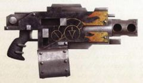

<!-- A1163-B0007 -->

原译文

Phobos-pattern combi-bolter 火卫一型复合爆矢枪

**校订译文**

Phobos-pattern combi-bolter 火卫一型复合爆矢枪

<!-- /A1163-B0007 -->

<!-- A1163-B0008 图片 -->
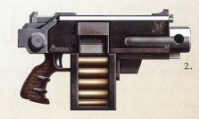

<!-- A1163-B0009 -->

原译文

Tigrus Pattern Combi-Bolter 泰格鲁斯型复合爆矢枪

**校订译文**

Tigrus Pattern Combi-Bolter 泰格鲁斯型复合爆矢枪

<!-- /A1163-B0009 -->

<!-- A1163-B0010 图片 -->
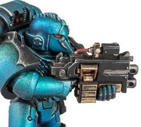

<!-- A1163-B0011 -->

原译文

Alpha Legion Seeker with an Umbra-Ferrox pattern Combi-Bolter 装备影铁型复合爆矢枪的阿尔法军团追踪者

**校订译文**

Alpha Legion Seeker with an Umbra-Ferrox pattern Combi-Bolter 装备影铁型复合爆矢枪的阿尔法军团追踪者

<!-- /A1163-B0011 -->

<!-- A1163-B0012 -->
## Bolter-Flamer (Combi-Flamer) 喷火爆矢枪（复合喷火器）

<!-- /A1163-B0012 -->

<!-- A1163-B0013 -->
**英文原文**

A Bolter with a Flamer attachment.

<!-- /A1163-B0013 -->

<!-- A1163-B0014 -->

原译文

带有喷火器配件的爆矢枪。

**校订译文**

带有喷火器配件的爆矢枪。

<!-- /A1163-B0014 -->

<!-- A1163-B0015 图片 -->
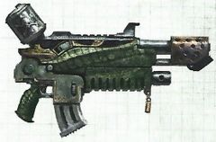

<!-- A1163-B0016 -->

原译文

Combi-Flamer 复合喷火器

**校订译文**

Combi-Flamer 复合喷火器

<!-- /A1163-B0016 -->

<!-- A1163-B0017 图片 -->
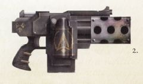

<!-- A1163-B0018 -->

原译文

Salamanders Tigrus Pattern Combi-Flamer 火蜥蜴泰格鲁斯型复合喷火器

**校订译文**

Salamanders Tigrus Pattern Combi-Flamer 火蜥蜴泰格鲁斯型复合喷火器

<!-- /A1163-B0018 -->

<!-- A1163-B0019 图片 -->
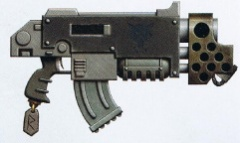

<!-- A1163-B0020 -->

原译文

Space Wolves 'Vulkan' Pattern Combi-Flamer 太空野狼‘火神’型复合喷火器

**校订译文**

Space Wolves 'Vulkan' Pattern Combi-Flamer 太空野狼‘火神’型复合喷火器

<!-- /A1163-B0020 -->

<!-- A1163-B0021 图片 -->
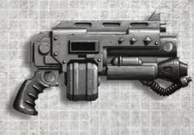

<!-- A1163-B0022 -->

原译文

House Goliath Combi-Flamer 歌利亚家族复合喷火器

**校订译文**

House Goliath Combi-Flamer 歌利亚家族复合喷火器

<!-- /A1163-B0022 -->

<!-- A1163-B0023 -->
## Infernus Heavy Bolter 炼狱重型爆矢枪

<!-- /A1163-B0023 -->

<!-- A1163-B0024 -->
**英文原文**

The Infernus Heavy Bolter is a heavy weapons version of combi-flamer used by the Deathwatch. The weapon incorporates a heavy bolter and heavy flamer. This weapon is mag-clamped with suspensor discs that reduce the weapon's weight.

<!-- /A1163-B0024 -->

<!-- A1163-B0025 -->

原译文

炼狱重型爆矢枪是死亡守望使用的重型武器版本的复合喷火器。该武器结合了重型爆矢枪和重型喷火器。这种武器是用悬吊盘夹紧的，可以减轻武器的重量。

**校订译文**

炼狱重型爆矢枪是死亡守望使用的重型复合喷火武器，将重型爆矢枪与重型火焰喷射器合为一体，并以磁性夹具固定悬浮减重盘，减轻持用负担。

**校注：** 已核同一人物、组织、型号或事件，与全书核心术语及后续专篇统一；原译保留对照。

<!-- /A1163-B0025 -->

<!-- A1163-B0026 图片 -->
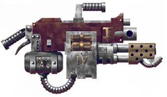

<!-- A1163-B0027 -->

原译文

Infernus Heavy Bolter 炼狱重型爆矢枪

**校订译文**

Infernus Heavy Bolter 炼狱重型爆矢枪

<!-- /A1163-B0027 -->

<!-- A1163-B0028 -->
## Bolter-Meltagun (Combi-Meltagun) 热熔爆矢枪（复合热熔枪）

<!-- /A1163-B0028 -->

<!-- A1163-B0029 -->
**英文原文**

A Bolter with a Meltagun attachment.

<!-- /A1163-B0029 -->

<!-- A1163-B0030 -->

原译文

带有热熔枪配件的爆矢枪

**校订译文**

带有热熔枪配件的爆矢枪

<!-- /A1163-B0030 -->

<!-- A1163-B0031 图片 -->
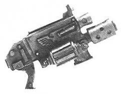

<!-- A1163-B0032 -->

原译文

Combi-Melta 复合热熔枪

**校订译文**

Combi-Melta 复合热熔枪

<!-- /A1163-B0032 -->

<!-- A1163-B0033 图片 -->
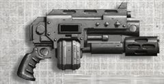

<!-- A1163-B0034 -->

原译文

House Goliath Combi-Melta 歌利亚家族复合热熔枪

**校订译文**

House Goliath Combi-Melta 歌利亚家族复合热熔枪

<!-- /A1163-B0034 -->

<!-- A1163-B0035 图片 -->
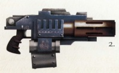

<!-- A1163-B0036 -->

原译文

Raven Guard Heresy-era Tigris Pattern Combi-Melta 暗鸦守卫叛乱前泰格鲁斯型复合热熔枪

**校订译文**

Raven Guard Heresy-era Tigris Pattern Combi-Melta 暗鸦守卫在荷鲁斯之乱时期使用的泰格鲁斯型复合热熔枪

**校注：** Heresy-era 指叛乱时期，原译“叛乱前”误将时代前移；40、51段同改。Tigris/Tigrus 英文保留异拼，中文按同类武器型号沿泰格鲁斯。

<!-- /A1163-B0036 -->

<!-- A1163-B0037 图片 -->
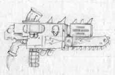

<!-- A1163-B0038 -->

原译文

Chaos Space Marine Combi-Melta 混沌星际战士复合热熔枪

**校订译文**

Chaos Space Marine Combi-Melta 混沌星际战士复合热熔枪

<!-- /A1163-B0038 -->

<!-- A1163-B0039 图片 -->

<!-- A1163-B0040 -->

原译文

Alpha Legion Heresy-era Phobos Pattern Combi-Melta 阿尔法军团叛乱前火卫一型复合热熔枪

**校订译文**

Alpha Legion Heresy-era Phobos Pattern Combi-Melta 阿尔法军团在荷鲁斯之乱时期使用的火卫一型复合热熔枪

<!-- /A1163-B0040 -->

<!-- A1163-B0041 -->
## Bolter-Plasma Gun (Combi-Plasma Gun) 等离子爆矢枪（复合等离子枪）

<!-- /A1163-B0041 -->

<!-- A1163-B0042 -->
**英文原文**

A Bolter combined with a Plasma Gun or Plasma Blaster.

<!-- /A1163-B0042 -->

<!-- A1163-B0043 -->

原译文

结合了等离子枪或等离子爆破枪的爆矢枪。

**校订译文**

结合了等离子枪或等离子爆破枪的爆矢枪。

<!-- /A1163-B0043 -->

<!-- A1163-B0044 图片 -->
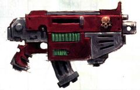

<!-- A1163-B0045 -->

原译文

Combi-Plasma Gun 复合等离子枪

**校订译文**

Combi-Plasma Gun 复合等离子枪

<!-- /A1163-B0045 -->

<!-- A1163-B0046 图片 -->
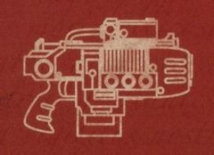

<!-- A1163-B0047 -->

原译文

diagram of a Tigris pattern Combi-Plasma 泰格鲁斯型复合等离子枪示意图

**校订译文**

diagram of a Tigris pattern Combi-Plasma 泰格鲁斯型复合等离子枪示意图

<!-- /A1163-B0047 -->

<!-- A1163-B0048 图片 -->
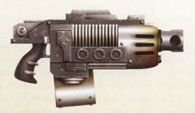

<!-- A1163-B0049 -->

原译文

Word Bearers Phobos-Pattern Combi-Plasma Gun 怀言者火卫一型复合等离子枪

**校订译文**

Word Bearers Phobos-Pattern Combi-Plasma Gun 怀言者火卫一型复合等离子枪

<!-- /A1163-B0049 -->

<!-- A1163-B0050 图片 -->
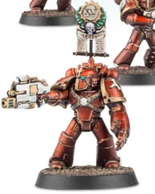

<!-- A1163-B0051 -->

原译文

Horus Heresy-era Thousand Son with an Umbra-Ferrox pattern Combi-Plasma 荷鲁斯叛乱前千子装备影铁型复合等离子枪

**校订译文**

Horus Heresy-era Thousand Son with an Umbra-Ferrox pattern Combi-Plasma 荷鲁斯之乱时期，装备影铁型复合等离子枪的千子战士

<!-- /A1163-B0051 -->

<!-- A1163-B0052 -->
## Bolter-Graviton gun (Combi-Grav gun) 重力爆矢枪（复合重力枪）

<!-- /A1163-B0052 -->

<!-- A1163-B0053 -->
**英文原文**

Used by Space Mariness, it consists of a Graviton gun combined with a Bolter.

<!-- /A1163-B0053 -->

<!-- A1163-B0054 -->

原译文

它由星际战士使用，由重力炮和爆矢枪组成。

**校订译文**

星际战士使用的复合武器，由重力枪与爆矢枪组合而成。

<!-- /A1163-B0054 -->

<!-- A1163-B0055 图片 -->
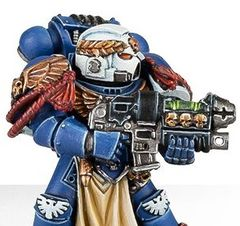

<!-- A1163-B0056 -->

原译文

Ultramarine Sternguard Veteran with a master-crafted Combi-Grav Gun 极限战士老兵军士装备大师级复合重力枪

**校订译文**

Ultramarine Sternguard Veteran with a master-crafted Combi-Grav Gun 装备精工复合重力枪的极限战士肃卫老兵

**校注：** Sternguard Veteran 为肃卫老兵，不是老兵军士；master-crafted 译精工。

<!-- /A1163-B0056 -->

<!-- A1163-B0057 -->
## Bolter-Volkite (Combi-Volkite) 爆燃爆矢枪（复合爆燃枪）

<!-- /A1163-B0057 -->

<!-- A1163-B0058 -->
**英文原文**

A Bolter with integrated Volkite Charger.

<!-- /A1163-B0058 -->

<!-- A1163-B0059 -->

原译文

带有集成爆燃突击枪的爆矢枪。

**校订译文**

带有集成爆燃突击铳的爆矢枪。

**校注：** 对照本段英文确认同一实体，与全书核心译名统一；不改变同形异义词或省略称呼。

<!-- /A1163-B0059 -->

<!-- A1163-B0060 图片 -->
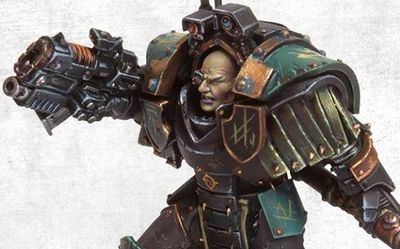

<!-- A1163-B0061 -->

原译文

Sons of Horus Legion Praetor with a Combi-Volkite 荷鲁斯之子军团执政官装备复合爆燃枪

**校订译文**

Sons of Horus Legion Praetor with a Combi-Volkite 荷鲁斯之子军团执政官装备复合爆燃枪

<!-- /A1163-B0061 -->

<!-- A1163-B0062 -->
## Bolter-Grenade Launcher (Combi-Grenade Launcher) 榴弹爆矢枪（复合榴弹枪）

<!-- /A1163-B0062 -->

<!-- A1163-B0063 -->
**英文原文**

A Bolter with an auxiliary grenade launcher attachment.

<!-- /A1163-B0063 -->

<!-- A1163-B0064 -->

原译文

带有辅助榴弹发射器附件的爆矢枪。

**校订译文**

带有辅助榴弹发射器附件的爆矢枪。

<!-- /A1163-B0064 -->

<!-- A1163-B0065 图片 -->

<!-- A1163-B0066 -->

原译文

Combi-Grenade Launcher 复合榴弹枪

**校订译文**

Combi-Grenade Launcher 复合榴弹枪

<!-- /A1163-B0066 -->

<!-- A1163-B0067 -->
## Bolter-Needler Combi Weapon (Combi-Needler) 针刺爆矢枪（复合针刺枪）

<!-- /A1163-B0067 -->

<!-- A1163-B0068 -->
**英文原文**

A Bolter with a Needler used by House Escher of Necromunda.

<!-- /A1163-B0068 -->

<!-- A1163-B0069 -->

原译文

涅克罗蒙达的埃舍尔家族使用的带针刺的爆矢枪。

**校订译文**

涅克罗蒙达埃舍尔家族使用的武器，将爆矢枪与针刺枪合为一体。

<!-- /A1163-B0069 -->

<!-- A1163-B0070 图片 -->
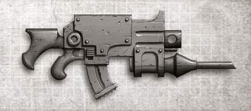

<!-- A1163-B0071 -->

原译文

House Escher Combi-Needler 埃舍尔家族复合针刺枪

**校订译文**

House Escher Combi-Needler 埃舍尔家族复合针刺枪

<!-- /A1163-B0071 -->

<!-- A1163-B0072 -->
## Needlespine Blaster 针脊冲击枪

<!-- /A1163-B0072 -->

<!-- A1163-B0073 -->
**英文原文**

A Bolter with a Needler used by Imperial Assassins of the Adamus Temple.

<!-- /A1163-B0073 -->

<!-- A1163-B0074 -->

原译文

阿达姆斯神庙帝国刺客使用的针刺爆矢枪。

**校订译文**

阿达姆斯神庙帝国刺客使用的针刺爆矢枪。

<!-- /A1163-B0074 -->

<!-- A1163-B0075 图片 -->
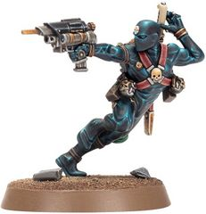

<!-- A1163-B0076 -->

原译文

Adamus Assassin with a Needlespine Blaster 阿达姆斯刺客装备针脊冲击枪

**校订译文**

Adamus Assassin with a Needlespine Blaster 阿达姆斯刺客装备针脊冲击枪

<!-- /A1163-B0076 -->

<!-- A1163-B0077 -->
## Bolt-Needle Pistol (Combi-Needle Pistol) 针刺爆矢手枪（复合针刺手枪）

<!-- /A1163-B0077 -->

<!-- A1163-B0078 -->
**英文原文**

A Bolt Pistol with an Needle Pistol attachment.

<!-- /A1163-B0078 -->

<!-- A1163-B0079 -->

原译文

带有针刺手枪附件的爆矢手枪。

**校订译文**

带有针刺手枪附件的爆矢手枪。

<!-- /A1163-B0079 -->

<!-- A1163-B0080 图片 -->
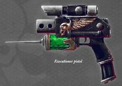

<!-- A1163-B0081 -->

原译文

Executioner Pistol a Combi-Needle Pistol used by the Eversor Temple of the Officio Assassinorum 刽子手手枪刺客庭埃弗森神庙使用的复合针刺手枪

**校订译文**

Executioner Pistol a Combi-Needle Pistol used by the Eversor Temple of the Officio Assassinorum 刽子手手枪，刺客庭艾弗森神庙使用的复合针刺手枪

<!-- /A1163-B0081 -->

<!-- A1163-B0082 图片 -->

<!-- A1163-B0083 -->

原译文

ganger of House Escher with an Escher pattern Combi-Needler 埃舍尔家族成员装备埃舍尔型复合针刺手枪

**校订译文**

ganger of House Escher with an Escher pattern Combi-Needler 装备埃舍尔型复合针刺枪的埃舍尔家族帮派成员

<!-- /A1163-B0083 -->

<!-- A1163-B0084 -->
## Condemnor Boltgun (Combi-Stake Crossbow) 宣判者爆矢枪（复合桩弩）

原题：Condemnor Boltgun (Combi-Stake Crossbow) 宣判者爆矢枪（复合木桩十字弓）

<!-- /A1163-B0084 -->

<!-- A1163-B0085 -->
**英文原文**

A Bolter with a Stake Crossbow strapped to the side, useful against psykers. Used almost only by the Ordo Hereticus and Sisters of Battle.

<!-- /A1163-B0085 -->

<!-- A1163-B0086 -->

原译文

一种侧面绑有木桩十字弓的爆矢枪，可用于对付灵能者。几乎只被圣锤修会和战斗修女使用。

**校订译文**

这种爆矢枪在侧面装有一具桩弩，适合对付灵能者，使用者几乎全是异端审判庭成员和战斗修女。

**校注：** Ordo Hereticus 是异端审判庭，原译圣锤修会误指另一分支。

<!-- /A1163-B0086 -->

<!-- A1163-B0087 -->
**英文原文**

The aptly named Condemnor boltgun strikes fear into the hearts of psykers across the galaxy. While the bolter is deadly enough, the blessed Purgatus stake-bolts fired from the crossbow mounted upon the weapon can fell Daemons and witches alike. Precious few of these holy weapons are to be found, but they are a potent instrument against those who wield the powers of the Warp.

<!-- /A1163-B0087 -->

<!-- A1163-B0088 -->

原译文

名字恰如其分的宣判者爆矢枪让整个银河系的灵能者感到恐惧。虽然爆矢枪已经足够致命，但从武器上安装的弩上射出的受祝福的净化木桩爆矢可以击伤恶魔和巫师。这些神圣武器很少有人能找到，但它们是对抗那些使用亚空间力量的人的有力工具。

**校订译文**

宣判者爆矢枪名副其实，令银河各处的灵能者闻之胆寒。爆矢枪本身就已足够致命，而安装在枪身上的弩还能射出经过祝福的“净化者”桩形弩矢，击倒恶魔与巫师。这类神圣武器极其稀少，却是对抗亚空间力量使用者的强大兵器。

<!-- /A1163-B0088 -->

<!-- A1163-B0089 图片 -->
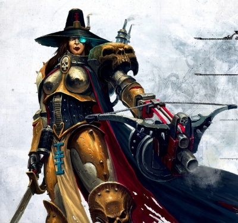

<!-- A1163-B0090 -->

原译文

Inquisitor Greyfax with a Condemnor Boltgun 审判官格雷法克斯装备宣判者爆矢枪

**校订译文**

Inquisitor Greyfax with a Condemnor Boltgun 审判官格雷法克斯装备宣判者爆矢枪

<!-- /A1163-B0090 -->

<!-- A1163-B0091 -->
## Disintegration Combi-gun 复合分解枪

<!-- /A1163-B0091 -->

<!-- A1163-B0092 -->
**英文原文**

Extremely rare weapons used by some Space Marines. These relics of the Dark Age of Technology combine a Bolter with a secondary Disintegration Gun.

<!-- /A1163-B0092 -->

<!-- A1163-B0093 -->

原译文

一些星际战士使用的极其罕见的武器。这些黑暗技术时代的遗物将爆矢枪与分解枪结合在一起。

**校订译文**

少数星际战士使用的极罕见武器。这些黑暗科技时代的遗物，将爆矢枪与一支辅助分解枪合为一体。

<!-- /A1163-B0093 -->

<!-- A1163-B0094 图片 -->
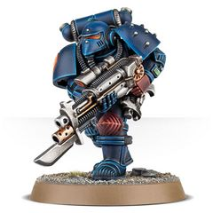

<!-- A1163-B0095 -->

原译文

Space Marine with Disintegration Combi-gun 星际战士装备复合分解枪

**校订译文**

Space Marine with Disintegration Combi-gun 星际战士装备复合分解枪

<!-- /A1163-B0095 -->

<!-- A1163-B0096 -->
## Adrastus bolt caliver 阿德拉斯托斯速射爆矢枪

原题：Adrastus bolt caliver 阿德剌斯托斯速射爆矢枪

<!-- /A1163-B0096 -->

<!-- A1163-B0097 -->
**英文原文**

Developed as a hybrid of later pattern Imperium bolt weapon designs and Dark Age of Technology 'Adrastite' disintegration beam weapons prohibited from general Great Crusade issue, the Adrastus bolt caliver is a potent shoulder arm serving as a portable heavy weapon for the Legio Custodes. This combination weapon is able to unleash a fusillade of explosive rounds at long range with the potency of the heavy bolters carried by the Legiones Astartes, or at shorter ranges fire a disintegration beam able to rip a target apart at a molecular level, causing its victims to cease to exist in a howling flare of energy.

<!-- /A1163-B0097 -->

<!-- A1163-B0098 -->

原译文

阿德剌斯托斯速射爆矢枪是后来的帝国爆矢武器设计和黑暗时代技术“阿德剌斯托斯”分解光束武器的混合体，被禁止在大远征期间使用，是一种可作为禁军军团的便携式重型武器的有力臂膀。这种复合武器能够以阿斯塔特军团携带的重型爆矢枪的威力在远距离发射爆炸性弹药，或者在较短的距离发射能够在分子水平上将目标撕裂的分解光束，使受害者不再存在于咆哮的能量闪光中。

**校订译文**

阿德拉斯托斯速射爆矢枪结合了较后期的帝国爆矢武器设计与黑暗科技时代的“阿德拉斯泰特”分解光束技术；后者在大远征中被禁止普遍配发。这种威力强大的肩射武器，是禁军军团使用的便携式重武器。它既能在远距离连射爆炸弹丸，威力堪比阿斯塔特军团使用的重型爆矢枪，也能在较近距离发射分解光束，从分子层面撕裂目标，使受害者在轰鸣的能量闪光中化为乌有。

**校注：** prohibited from general issue 限定阿德拉斯泰特分解武器不得普遍配发，不是整个复合武器被禁用；shoulder arm 是肩射武器，不是臂膀。

<!-- /A1163-B0098 -->

<!-- A1163-B0099 图片 -->
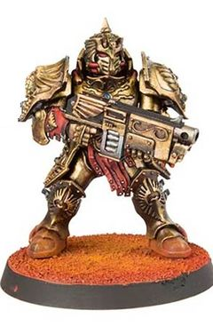

<!-- A1163-B0100 -->

原译文

Sagittarum Guard Custodes with a Adrastus bolt caliver 禁军射手座卫士装备阿德剌斯托斯速射爆矢枪

**校订译文**

Sagittarum Guard Custodes with a Adrastus bolt caliver 装备阿德拉斯托斯速射爆矢枪的禁军射手

<!-- /A1163-B0100 -->

<!-- A1163-B0101 -->
## Plasma Blaster 等离子爆破枪

<!-- /A1163-B0101 -->

<!-- A1163-B0102 -->
**英文原文**

The Plasma Blaster is essentially two plasma guns combined. It has a somewhat shorter range than plasma guns, but when fired both of its chambers are discharged which double the damage output. These weapons are more reliable than modern plasma guns, as plasma technology was far better understood at the dawn of the Imperium. Dating back to the era of the Great Crusade, these weapons are all but unknown in the battlefields of the 41st Millennium, although a few remain as relics within the armouries of the Adeptus Astartes. Saul Invictus, First Captain of the Ultramarines during the First Tyrannic War, is noted as having wielded a Plasma Blaster in battle.

<!-- /A1163-B0102 -->

<!-- A1163-B0103 -->

原译文

等离子爆破枪本质上是两个等离子枪的组合。它的射程比等离子枪稍短，但当发射时，它的两个腔室都会放电，从而使伤害输出加倍。这些武器比现代等离子枪更可靠，因为等离子技术在帝国初期得到了更好的理解。这些武器可以追溯到大远征时代，在第41个千年的战场上几乎不为人知，尽管有一些仍然作为遗物保存在阿斯塔特的军械库中。索尔·因维克图斯，第一次泰伦战争期间的极限战士第一连长，以在战斗中使用等离子爆破枪而闻名。

**校订译文**

等离子爆破枪实际上是将两支等离子枪合为一体。它的射程略短，但两个发射腔会同时放电，使杀伤力加倍。这类武器比现代等离子枪更可靠，因为帝国初创时对等离子技术的掌握远比后世深入。它们诞生于大远征时代，在第41个千年的战场上已几乎绝迹，只有少数作为遗物留存在阿斯塔特的军械库中。第一次泰伦战争期间，极限战士第一连长索尔·英维克图斯就曾在战斗中使用等离子爆破枪。

<!-- /A1163-B0103 -->

<!-- A1163-B0104 图片 -->

<!-- A1163-B0105 -->

原译文

Ryza 'Hellshot' Pattern Plasma Blaster 瑞扎‘狱击’型等离子爆破枪

**校订译文**

Ryza 'Hellshot' Pattern Plasma Blaster 瑞扎‘狱击’型等离子爆破枪

<!-- /A1163-B0105 -->

<!-- A1163-B0106 -->
## Laspistol-Melta Magna-Needle 巨型针刺热熔激光手枪

<!-- /A1163-B0106 -->

<!-- A1163-B0107 -->
**英文原文**

Used by House Van Saar of Necromunda. It consists of a Melta Pistol and a Laspistol.

<!-- /A1163-B0107 -->

<!-- A1163-B0108 -->

原译文

由涅克罗蒙达的凡邵尔家族使用。它由热熔手枪和激光手枪组成。

**校订译文**

涅克罗蒙达凡·萨尔家族使用的武器，由热熔手枪与激光手枪组合而成。

<!-- /A1163-B0108 -->

<!-- A1163-B0109 图片 -->
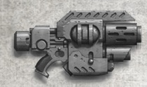

<!-- A1163-B0110 -->

原译文

Magna-Needle Mk.X Pattern Pistol 巨型针刺Mk.X型手枪

**校订译文**

Magna-Needle Mk.X Pattern Pistol 巨型针刺 Mk.X 型手枪

<!-- /A1163-B0110 -->

<!-- A1163-B0111 -->
## Laspistol-Plasma Ultra-Needle 极限针刺等离子激光手枪

<!-- /A1163-B0111 -->

<!-- A1163-B0112 -->
**英文原文**

Used by House Van Saar of Necromunda. It consists of a Plasma pistol and a Laspistol.

<!-- /A1163-B0112 -->

<!-- A1163-B0113 -->

原译文

由涅克罗蒙达的凡邵尔家族使用。它由等离子手枪和激光手枪组成。

**校订译文**

涅克罗蒙达凡·萨尔家族使用的武器，由等离子手枪与激光手枪组合而成。

<!-- /A1163-B0113 -->

<!-- A1163-B0114 图片 -->
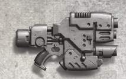

<!-- A1163-B0115 -->

原译文

Ultra-Needle Mk.IX Pattern Pistol 极限针刺Mk.IX型手枪

**校订译文**

Ultra-Needle Mk.IX Pattern Pistol 极限针刺 Mk.IX 型手枪

<!-- /A1163-B0115 -->

<!-- A1163-B0116 -->
## Stub Gun-Plasma Combi-Pistol 短管枪—等离子复合手枪

原题：Stub Gun-Plasma Combi-Pistol 等离子短管手枪

<!-- /A1163-B0116 -->

<!-- A1163-B0117 -->
**英文原文**

Consists of a Plasma Pistol with Stub Gun attachment. Used by House Goliath of Necromunda.

<!-- /A1163-B0117 -->

<!-- A1163-B0118 -->

原译文

由带有短管枪附件的等离子手枪组成。由涅克罗蒙达的歌利亚家族使用。

**校订译文**

在等离子手枪上附装短管枪而成的复合武器，由涅克罗蒙达的歌利亚家族使用。

<!-- /A1163-B0118 -->

<!-- A1163-B0119 图片 -->
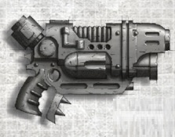

<!-- A1163-B0120 -->

原译文

Stub Gun-Plasma Combi-Pistol 等离子短管手枪

**校订译文**

Stub Gun-Plasma Combi-Pistol 短管枪—等离子复合手枪

<!-- /A1163-B0120 -->

<!-- A1163-B0121 -->
## Combi-Fist 复合拳套

<!-- /A1163-B0121 -->

<!-- A1163-B0122 -->
**英文原文**

The Combi-Fist is a Power Fist with a ranged weapon attached to it.

<!-- /A1163-B0122 -->

<!-- A1163-B0123 -->

原译文

复合拳套是一种附有远程武器的动力拳。

**校订译文**

复合拳套是一种附有远程武器的动力拳。

<!-- /A1163-B0123 -->

<!-- A1163-B0124 图片 -->
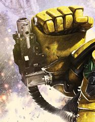

<!-- A1163-B0125 -->

原译文

Alexis Polux's combi-fist. Integrated with a Combi-Melta 亚历克西斯·普罗克斯的复合拳套。与复合热熔枪集成

**校订译文**

Alexis Polux's combi-fist. Integrated with a Combi-Melta 亚历克西斯·泼鲁克斯的复合拳套，内置复合热熔枪

<!-- /A1163-B0125 -->

<!-- A1163-B0126 图片 -->
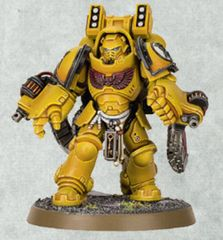

<!-- A1163-B0127 -->

原译文

Auto Boltstorm Gauntlets, used by Aggressors. Integrated with boltguns 侵略者使用的自动爆矢风暴臂铠。与爆矢枪集成

**校订译文**

Auto Boltstorm Gauntlets, used by Aggressors. Integrated with boltguns 侵略者使用的自动爆矢风暴臂铠，内置爆矢枪

<!-- /A1163-B0127 -->

<!-- A1163-B0128 图片 -->
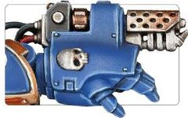

<!-- A1163-B0129 -->

原译文

Flame Gauntlet, used by Aggressors. Integrated with a flamer 侵略者使用的烈焰臂铠。与喷火器集成

**校订译文**

Flame Gauntlet, used by Aggressors. Integrated with a flamer 侵略者使用的烈焰臂铠，内置喷火器

<!-- /A1163-B0129 -->

<!-- A1163-B0130 -->
## Autoch-Pattern Combi-Bolter 奥托克型复合爆矢枪

原题：Autoch-Pattern Combi-Bolter 自动型复合爆矢枪

**校注：** Autoch 为专有型号名，不能按 auto 直接译“自动”；暂音译奥托克。

<!-- /A1163-B0130 -->

<!-- A1163-B0131 -->
**英文原文**

Twin-barreled Bolter weapon used by the Leagues of Votann.

<!-- /A1163-B0131 -->

<!-- A1163-B0132 -->

原译文

沃坦联盟使用的双管爆矢武器。

**校订译文**

沃坦联盟使用的双管爆矢武器。

<!-- /A1163-B0132 -->

<!-- A1163-B0133 图片 -->
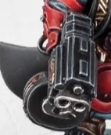

<!-- A1163-B0134 -->

原译文

Autoch-Pattern Combi-Bolter 自动型复合爆矢枪

**校订译文**

Autoch-Pattern Combi-Bolter 奥托克型复合爆矢枪

<!-- /A1163-B0134 -->

<!-- A1163-B0135 图片 -->
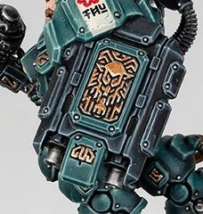

<!-- A1163-B0136 -->

原译文

RAM Shield with built-in Autoch-Pattern Combi-Bolter RAM盾，内置自动型复合爆矢枪

**校订译文**

RAM Shield with built-in Autoch-Pattern Combi-Bolter 内置奥托克型复合爆矢枪的 RAM 盾

<!-- /A1163-B0136 -->

<!-- A1163-B0137 -->
## Notable Combi-Weapons 著名复合武器

<!-- /A1163-B0137 -->

<!-- A1163-B0138 -->
**英文原文**

The Arbitrator - Combi-Bolter used as a side arm by Roboute Guilliman during the Horus Heresy

<!-- /A1163-B0138 -->

<!-- A1163-B0139 -->

原译文

仲裁者 - 荷鲁斯叛乱时期罗伯特·基里曼侧臂使用的复合爆矢枪

**校订译文**

仲裁者——荷鲁斯之乱期间，罗保特·基里曼作为随身副武器使用的复合爆矢枪。

<!-- /A1163-B0139 -->

<!-- A1163-B0140 -->
**英文原文**

Lion's Wrath - Combi-Plasma, Relic of the Dark Angels

<!-- /A1163-B0140 -->

<!-- A1163-B0141 -->

原译文

雄狮之怒 - 复合等离子枪，黑暗天使的遗物

**校订译文**

狮子之怒 - 复合等离子枪，黑暗天使的遗物

**校注：** Lion's Wrath/The Lion's Wrath为同一组合等离子枪，沿634现稿统一。

<!-- /A1163-B0141 -->

<!-- A1163-B0142 图片 -->
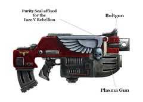

<!-- A1163-B0143 -->

原译文

Lion's Wrath 雄狮之怒

**校订译文**

Lion's Wrath 狮子之怒

**校注：** Lion's Wrath/The Lion's Wrath为同一组合等离子枪，沿634现稿统一。

<!-- /A1163-B0143 -->

<!-- A1163-B0144 -->
**英文原文**

Lion's Roar - Combi-Plasma, Relic of the Dark Angels

<!-- /A1163-B0144 -->

<!-- A1163-B0145 -->

原译文

狮之咆哮 - 复合等离子枪，黑暗天使的遗物

**校订译文**

狮之咆哮 - 复合等离子枪，黑暗天使的遗物

<!-- /A1163-B0145 -->

<!-- A1163-B0146 图片 -->
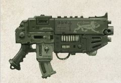

<!-- A1163-B0147 -->

原译文

Lion's Roar, a relic Combi-Plasma that uses a Plasma Blaster instead of a Plasma Gun 狮之咆哮，一个遗物复合等离子枪使用等离子爆破枪替代了等离子枪

**校订译文**

Lion's Roar, a relic Combi-Plasma that uses a Plasma Blaster instead of a Plasma Gun 狮之咆哮，一件以等离子爆破枪替代常规等离子枪的复合等离子枪遗物

<!-- /A1163-B0147 -->

<!-- A1163-B0148 -->
**英文原文**

Hand of Dominion - Combi-Fist used by Roboute Guilliman

<!-- /A1163-B0148 -->

<!-- A1163-B0149 -->

原译文

统御之手 - 罗伯特·基里曼使用的复合拳套

**校订译文**

统御之手——罗保特·基里曼使用的复合拳套。

<!-- /A1163-B0149 -->

<!-- A1163-B0150 图片 -->
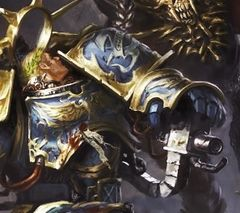

<!-- A1163-B0151 -->

原译文

Hand of Dominion Integrated with a boltgun 统御之手与爆矢枪集成

**校订译文**

Hand of Dominion Integrated with a boltgun 统御之手，内置爆矢枪

<!-- /A1163-B0151 -->

<!-- A1163-B0152 -->
**英文原文**

Gauntlets of Ultramar - A matching pair of combi-fists used by Marneus Calgar

<!-- /A1163-B0152 -->

<!-- A1163-B0153 -->

原译文

奥特拉玛之拳 - 马涅乌斯·卡尔加使用的一对复合拳套

**校订译文**

奥特拉玛之拳 - 马涅乌斯·卡尔加使用的一对复合拳套

<!-- /A1163-B0153 -->

<!-- A1163-B0154 图片 -->
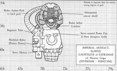

<!-- A1163-B0155 -->

原译文

Gauntlets of Ultramar. Integrated with a boltgun 奥特拉玛之拳与爆矢枪集成

**校订译文**

Gauntlets of Ultramar. Integrated with a boltgun 奥特拉玛之拳，内置爆矢枪

<!-- /A1163-B0155 -->

<!-- A1163-B0156 -->
**英文原文**

Talon of Horus - a lightning claw integrated with a stormbolter, used by Horus Lupercal & Ezekyle Abaddon

<!-- /A1163-B0156 -->

<!-- A1163-B0157 -->

原译文

荷鲁斯之爪 - 一个与风暴爆矢枪集成的闪电爪，由荷鲁斯·卢佩卡尔和以泽凯尔·阿巴顿使用

**校订译文**

荷鲁斯之爪——内置风暴爆矢枪的闪电爪，由荷鲁斯·卢佩卡尔和以泽凯尔·阿巴顿先后使用。

<!-- /A1163-B0157 -->

<!-- A1163-B0158 -->
**英文原文**

Black Spear - a power spear integrated with a powerful las weapon, used by Asterion Moloc

<!-- /A1163-B0158 -->

<!-- A1163-B0159 -->

原译文

黑矛 - 一种与强大的激光武器相结合的动力长矛，由阿斯特吕翁·摩洛克使用

**校订译文**

黑矛——内置强力激光武器的动力长矛，由阿斯忒里昂·摩洛克使用。

<!-- /A1163-B0159 -->

<!-- A1163-B0160 -->
**英文原文**

Crozius Arkanos - a Crozius Arcanum integrated with an auxiliary grenade launcher, used by Ivanus Enkomi

<!-- /A1163-B0160 -->

<!-- A1163-B0161 -->

原译文

阿卡诺斯之杖 - 与伊万努斯·恩科米使用的辅助榴弹发射器集成的牧师权杖

**校订译文**

阿卡诺斯权杖——内置辅助榴弹发射器的教士权杖，由伊万努斯·恩科米使用。

<!-- /A1163-B0161 -->

<!-- A1163-B0162 -->
**英文原文**

Gate Maker - a Combi-Melta from the Invaders chapter, currently in use by Watchfortress Jericho.

<!-- /A1163-B0162 -->

<!-- A1163-B0163 -->

原译文

门扉制造者-侵袭者战团中的复合热熔枪，目前由守望要塞杰里科使用。

**校订译文**

门扉制造者——来自侵略者战团的复合热熔枪，目前由杰里科守望要塞使用。

<!-- /A1163-B0163 -->

本篇核心术语与暂定项

以下列出本篇出现的英文原形及核心术语表用词。同形词可能指不同对象，具体词义以本篇正文和校注为准；单复数、别名和仅见于图注的名称可能尚未列入。完整候选见[术语表](../../术语表/双语术语候选.csv)。

| 英文 | 采用中文 | 状态 |
| --- | --- | --- |
| Space Marines | 星际战士 | 官方已核对 |
| Adeptus Astartes | 阿斯塔特修会 | 官方已核对 |
| Dark Angels | 黑暗天使 | 官方已核对 |
| Deathwatch | 死亡守望 | 官方已核对 |
| Chaos Space Marines | 混沌星际战士 | 官方已核对 |
| Leagues of Votann | 沃坦联盟 | 官方已核对 |
| Boltgun | 爆矢枪 | 官方已核对 |
| Bolt Pistol | 爆矢手枪 | 官方已核对 |
| Roboute Guilliman | 罗保特·基里曼 | 官方已核对 |
| Ultramar | 奥特拉玛 | 官方已核对 |
| Ultramarines | 极限战士 | 官方已核对 |
| Horus Heresy | 荷鲁斯之乱 | 官方已核对 |
| Warp | 亚空间 | 官方已核对 |
| Imperium | 帝国 | 暂定·简称 |
| Dark Age of Technology | 黑暗科技时代 | 暂定 |
| Necromunda | 涅克罗蒙达 | 暂定·官方待核 |
| House Goliath | 歌利亚家族 | 暂定·官方待核 |
| Goliath | 歌利亚 | 暂定·官方待核 |
| House Van Saar | 凡·萨尔家族 | 暂定·官方待核 |
| House Escher | 埃舍尔家族 | 暂定·官方待核 |
| Great Crusade | 大远征 | 暂定·官方待核 |
| Horus | 荷鲁斯 | 暂定·官方待核 |
| Sisters of Battle | 战斗修女 | 暂定·官方待核 |
| Ordo Hereticus | 异端审判庭 | 用户指定 |
| Legiones Astartes | 阿斯塔特军团 | 暂定·官方待核 |
| Ivanus Enkomi | 伊万努斯·恩科米 | 暂定·官方待核 |
| Crozius Arcanum | 教士权杖 | 暂定·官方待核 |
| Ancient | 旗手 | 官方已核对 |
| Arbitrator | 仲裁官 | 暂定·官方待核 |
| Horus Lupercal | 荷鲁斯·卢佩卡尔 | 暂定·官方待核 |
| Lupercal | 卢佩卡尔 | 暂定·官方待核 |
| First Captain | 第一连长 | 暂定·官方待核 |
| Ezekyle Abaddon | 以泽凯尔·阿巴顿 | 暂定·官方待核 |
| Chapter | 战团 | 暂定·官方待核 |
| Captain | 连长 | 暂定·官方待核 |
| Marneus Calgar | 马涅乌斯·卡尔加 | 暂定·官方待核 |
| Asterion Moloc | 阿斯忒里昂·摩洛克 | 暂定·官方待核 |
| Invaders | 侵略者 | 暂定·官方待核 |
| Powers | 能天使 | 暂定·官方待核 |
| Dominion | 主天使 | 暂定·官方待核 |
| Gauntlets of Ultramar | 奥特拉玛之拳 | 暂定·官方待核 |
| Saul Invictus | 索尔·英维克图斯 | 暂定·官方待核 |
| The Weapon | 武器 | 暂定·官方待核 |
| Gun | 甘 | 暂定·官方待核 |
| The Dark | 《黑暗》 | 暂定·官方待核 |
| Black Spear | 黑矛 | 暂定·官方待核 |
| Crozius Arkanos | 阿卡诺斯权杖 | 暂定·官方待核 |
| Power Spear | 动力长矛 | 暂定·官方待核 |
| Combi-Bolter | 复合爆矢枪 | 暂定·官方待核 |
| Combi-Flamer | 复合喷火器 | 暂定·官方待核 |
| Infernus Heavy Bolter | 炼狱重型爆矢枪 | 暂定·官方待核 |
| Combi-Melta | 复合热熔枪 | 暂定·官方待核 |
| Condemnor Boltgun | 宣判者爆矢枪 | 暂定·官方待核 |
| Purgatus | 净化者 | 暂定·官方待核 |
| Adrastus bolt caliver | 阿德拉斯托斯速射爆矢枪 | 暂定·官方待核 |
| Adrastite | 阿德拉斯泰特 | 暂定·官方待核 |
| Plasma Blaster | 等离子爆破枪 | 暂定·官方待核 |
| Combi-Fist | 复合拳套 | 暂定·官方待核 |
| Lion's Wrath | 狮子之怒 | 暂定·官方待核 |
| Lion's Roar | 狮之咆哮 | 暂定·官方待核 |
| Hand of Dominion | 统御之手 | 暂定·官方待核 |
| Talon of Horus | 荷鲁斯之爪 | 暂定·官方待核 |
| Gate Maker | 门扉制造者 | 暂定·官方待核 |
| Needler | 针刺枪 | 暂定·官方待核 |
| Needle pistol | 针刺手枪 | 暂定·官方待核 |
| Grenade launcher | 榴弹发射器 | 暂定·官方待核 |
| Auxiliary Grenade Launcher | 辅助榴弹发射器 | 暂定·官方待核 |
| Stub Gun | 短管枪 | 暂定·官方待核 |
| claw | 利爪分队 | 暂定·官方待核 |
| Bolt Weapon | 爆矢武器 | 暂定·官方待核 |
| Bolt | 爆矢 | 暂定·官方待核 |
| Bolter | 爆矢枪 | 暂定·官方待核 |
| Heavy bolter | 重型爆矢枪 | 官方已核对 |
| Storm bolter | 风暴爆矢枪 | 官方已核对 |
| Flamer | 火焰喷射器（武器）／火妖（奸奇单位） | 语境定译·对应官译已核 |
| Heavy flamer | 重型火焰喷射器 | 官方已核对 |
| Meltagun | 热熔枪 | 官方已核对 |
| Graviton Gun | 重力枪 | 暂定·官方待核 |
| Plasma pistol | 等离子手枪 | 官方已核对 |
| Volkite Charger | 爆燃突击铳 | 暂定·官方待核 |
| Grenade | 手榴弹 | 暂定·官方待核 |
| Plasma gun | 等离子枪 | 官方已核对 |
| Power fist | 动力拳 | 官方已核对 |
| Suspensor | 悬浮装置 | 暂定·官方待核 |

