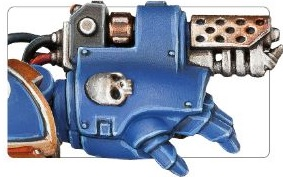

# 1164 烈焰臂铠 Flame Gauntlet

精校状态：中文行文已逐段精校，部分术语仍为暂定

分类：武器 / 近战武器

原文来源：https://www.bilibili.com/opus/1000617909854142464

原作者：帝国神选罐头

原文时间：2024年11月17日 11:08

[返回分类目录](目录.md) · [全书目录](../../目录.md)

原篇名：火焰臂铠 Flame Gauntlet

<!-- A1164-B0001 -->
**英文原文**

Flame Gauntlets are a type of Flame Weapon used by Primaris Space Marine Aggressor Squads. The Flame Gauntlet is similar to the Boltstorm Gauntlet, replacing its Bolter with a Flamer.

<!-- /A1164-B0001 -->

<!-- A1164-B0002 -->

原译文

火焰臂铠是原铸星际战士侵略者小队使用的一种火焰武器。火焰臂铠类似于爆矢风暴臂铠，用火焰枪代替了它的爆矢枪。

**校订译文**

烈焰臂铠是原铸星际战士侵略者小队使用的一种火焰武器。它与爆矢风暴臂铠相似，只是以喷火器取代内置的爆矢枪。

**校注：** 与1163图注所指同一装备统一为烈焰臂铠，原别名火焰臂铠保留原译栏。

<!-- /A1164-B0002 -->

<!-- A1164-B0003 图片 -->

<!-- A1164-B0004 -->

原译文

Flame Gauntlets 火焰臂铠

**校订译文**

Flame Gauntlets 烈焰臂铠

<!-- /A1164-B0004 -->

本篇核心术语与暂定项

以下列出本篇出现的英文原形及核心术语表用词。同形词可能指不同对象，具体词义以本篇正文和校注为准；单复数、别名和仅见于图注的名称可能尚未列入。完整候选见[术语表](../../术语表/双语术语候选.csv)。

| 英文 | 采用中文 | 状态 |
| --- | --- | --- |
| Space Marine | 星际战士 | 暂定·官方待核 |
| Aggressor | 侵略者 | 暂定·官方待核 |
| Primaris Space Marine | 原铸星际战士 | 暂定·官方待核 |
| Aggressor Squads | 侵略者小队 | 暂定·官方待核 |
| Flame Gauntlet | 烈焰臂铠 | 暂定·官方待核 |
| Boltstorm Gauntlet | 爆矢风暴臂铠 | 暂定·官方待核 |
| Bolter | 爆矢枪 | 暂定·官方待核 |
| Flame Weapon | 火焰武器 | 暂定·官方待核 |
| Flamer | 火焰喷射器（武器）／火妖（奸奇单位） | 语境定译·对应官译已核 |

