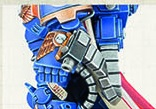
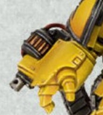

# 1165 爆矢风暴臂铠 Boltstorm Gauntlet

精校状态：中文行文已逐段精校，部分术语仍为暂定

分类：武器 / 近战武器

原文来源：https://www.bilibili.com/opus/1001726823190495241

原作者：帝国神选罐头

原文时间：2024年11月20日 10:51

[返回分类目录](目录.md) · [全书目录](../../目录.md)

<!-- A1165-B0001 -->
**英文原文**

The Boltstorm Gauntlet is a Bolt Weapon used by the Primaris Space Marines.

<!-- /A1165-B0001 -->

<!-- A1165-B0002 -->

原译文

爆矢风暴臂铠是原铸星际战士使用的爆矢武器。

**校订译文**

爆矢风暴臂铠是原铸星际战士使用的爆矢武器。

<!-- /A1165-B0002 -->

<!-- A1165-B0003 图片 -->

<!-- A1165-B0004 -->

原译文

Boltstorm Gauntlet 爆矢风暴臂铠

**校订译文**

Boltstorm Gauntlet 爆矢风暴臂铠

<!-- /A1165-B0004 -->

<!-- A1165-B0005 -->
## Overview 概述

<!-- /A1165-B0005 -->

<!-- A1165-B0006 -->
**英文原文**

Often wielded by Captains, it bares a strong resemblance and function to Roboute Guilliman's famed weapon Hand of Dominion. The Boltstorm Gauntlet consists of a Power Fist with built-in Bolter so aside from firing bolts at a astonishing rate, each gauntlet is reinforced with a crackling power field, and when swung can crush armour, bone and even thick vehicle plating.

<!-- /A1165-B0006 -->

<!-- A1165-B0007 -->

原译文

它经常被连长使用，与罗伯特·基里曼著名的武器“统御之手”有着很强的相似性和功能。爆矢风暴臂铠由一个内置爆矢枪的动力拳组成，因此除了以惊人的速度发射爆矢外，每个臂铠都用一个爆裂力场加固，挥舞时可以压碎盔甲、骨头甚至厚厚的车辆装甲。

**校订译文**

爆矢风暴臂铠常由连长使用，外形和功能都与罗保特·基里曼的著名武器“统御之手”十分相似。它是在动力拳中内置爆矢枪而成，既能以惊人的射速倾泻爆矢，也能凭借噼啪作响的动力场强化拳击，击碎护甲、骨骼，甚至厚重的载具装甲板。

<!-- /A1165-B0007 -->

<!-- A1165-B0008 -->
**英文原文**

A variant known as the Auto Boltstorm Gauntlet is wielded by Aggressors.

<!-- /A1165-B0008 -->

<!-- A1165-B0009 -->

原译文

侵略者挥舞着一种名为自动爆矢风暴臂铠的变体。

**校订译文**

侵略者使用其中一种改型，称为自动爆矢风暴臂铠。

<!-- /A1165-B0009 -->

<!-- A1165-B0010 图片 -->

<!-- A1165-B0011 -->

原译文

Auto Boltstorm Gauntlet 自动爆矢风暴臂铠

**校订译文**

Auto Boltstorm Gauntlet 自动爆矢风暴臂铠

<!-- /A1165-B0011 -->

本篇核心术语与暂定项

以下列出本篇出现的英文原形及核心术语表用词。同形词可能指不同对象，具体词义以本篇正文和校注为准；单复数、别名和仅见于图注的名称可能尚未列入。完整候选见[术语表](../../术语表/双语术语候选.csv)。

| 英文 | 采用中文 | 状态 |
| --- | --- | --- |
| Space Marines | 星际战士 | 官方已核对 |
| Roboute Guilliman | 罗保特·基里曼 | 官方已核对 |
| Dominion | 主天使 | 暂定·官方待核 |
| Hand of Dominion | 统御之手 | 暂定·官方待核 |
| Boltstorm Gauntlet | 爆矢风暴臂铠 | 暂定·官方待核 |
| Auto Boltstorm Gauntlet | 自动爆矢风暴臂铠 | 暂定·官方待核 |
| Bolt Weapon | 爆矢武器 | 暂定·官方待核 |
| Bolt | 爆矢 | 暂定·官方待核 |
| Bolter | 爆矢枪 | 暂定·官方待核 |
| Power fist | 动力拳 | 官方已核对 |

