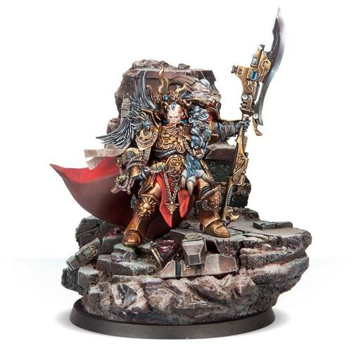

# 1166 日神之矛 Apollonian Spear

精校状态：中文行文已逐段精校，部分术语仍为暂定

分类：武器 / 近战武器

原文来源：https://www.bilibili.com/opus/1085992526764048390

原作者：帝国神选罐头

原文时间：2025年07月05日 12:45

[返回分类目录](目录.md) · [全书目录](../../目录.md)

<!-- A1166-B0001 -->
**英文原文**

The Apollonian Spear is the Guardian Spear of the first Captain-General of the Adeptus Custodes, Constantin Valdor.

<!-- /A1166-B0001 -->

<!-- A1166-B0002 -->

原译文

日神之矛是第一任禁军元帅康斯坦丁·瓦尔多的卫士之矛。

**校订译文**

日神之矛是第一任禁军元帅康斯坦丁·瓦尔多的卫士之矛。

<!-- /A1166-B0002 -->

<!-- A1166-B0003 图片 -->

<!-- A1166-B0004 -->

原译文

The Apollonian Spear 日神之矛

**校订译文**

The Apollonian Spear 日神之矛

<!-- /A1166-B0004 -->

<!-- A1166-B0005 -->
## History 历史

<!-- /A1166-B0005 -->

<!-- A1166-B0006 -->
**英文原文**

The Apollonian Spear was crafted alongside its sister the Dionysian Spear by the Emperor's own hand, deep inside his first underground fortress on Terra during the Age of Strife. Wielded for a time by the Emperor himself, he would later give the Apollonian Spear to Valdor to wield after he became the Legio Custodes' Chief Custodian. Like the signature armament of the Custodians, it incorporates both a power blade and built-in bolter weapon - though in both cases these are of a potency far exceeding those even the Emperor's elite carry into battle. Unlike the Dionysian Spear which gives truths to those it cuts, the Apollonian Spear grants truths to the wielder from those it cuts. The spear can not work on inanimate objects normally, but Valdor used it to stab the floor of the Vengeful Spirit in order to confirm his location due to the highly mutated nature of the vessel by that point.

<!-- /A1166-B0006 -->

<!-- A1166-B0007 -->

原译文

日神之矛是帝皇亲手与它的姊妹酒神之矛一起锻造的，位于他在纷争时代在泰拉上的第一个地下堡垒深处。帝皇亲自挥舞了一段时间，在瓦尔多成为禁军军团的首席禁军后，帝皇将日神之矛交给他挥舞。就像禁军的标志性武器一样，它既包含了一把动力刃，也包含了内置的爆矢武器 — 尽管在这两种情况下，它的威力都远远超过了帝皇的精英们在战斗中携带的威力。与为被击中的人提供真理的酒神之矛不同，日神之矛从它所切割的东西中给使用者真相 。矛通常不能在无生命的物体上工作，但瓦尔多用它刺穿了复仇之魂号的地板，以确认他的位置，因为在那时，战舰的性质已经发生了高度变异。

**校订译文**

纷争时代，帝皇在自己于泰拉建立的第一座地下堡垒深处，亲手铸造了日神之矛及其姊妹武器酒神之矛。帝皇曾亲自使用日神之矛一段时间，待瓦尔多成为禁军军团的首领后，便将它赐给了他。与禁军的标志性武器一样，日神之矛兼具动力刃和内置爆矢枪，但这两部分的威力都远超普通禁军的装备。酒神之矛会使被它刺伤的人获知真相，日神之矛则相反：它让持有者从受创者身上获知真相。这种能力通常无法作用于无生命之物，但复仇之魂号当时已发生严重变异，瓦尔多因而能够将矛刺入舰船地板，以确认自己身在何处。

<!-- /A1166-B0007 -->

<!-- A1166-B0008 -->
**英文原文**

After the Horus Heresy and the disappearance of Valdor, the Apollonian Spear was put into storage by the Custodes and treated as a relic. Only rarely now, in the most terrible of circumstances, can it be wielded by the Custodes' mightiest heroes in battle.

<!-- /A1166-B0008 -->

<!-- A1166-B0009 -->

原译文

荷鲁斯叛乱和瓦尔多失踪后，日神之矛被禁军存放起来，并被视为圣物。现在，在最可怕的情况下，它能被禁军最强大的英雄在战斗中使用。

**校订译文**

荷鲁斯之乱结束、瓦尔多失踪后，禁军将日神之矛收藏起来，奉为圣物。如今，只有在最危急的时刻，禁军中最强大的英雄才会罕见地获准携它出战。

<!-- /A1166-B0009 -->

本篇核心术语与暂定项

以下列出本篇出现的英文原形及核心术语表用词。同形词可能指不同对象，具体词义以本篇正文和校注为准；单复数、别名和仅见于图注的名称可能尚未列入。完整候选见[术语表](../../术语表/双语术语候选.csv)。

| 英文 | 采用中文 | 状态 |
| --- | --- | --- |
| Adeptus Custodes | 帝皇禁军 | 官方已核对 |
| Horus Heresy | 荷鲁斯之乱 | 官方已核对 |
| Emperor | 帝皇 | 官方已核对 |
| Age of Strife | 纷争时代 | 暂定·官方待核 |
| Terra | 泰拉 | 暂定·官方待核 |
| Horus | 荷鲁斯 | 暂定·官方待核 |
| Vengeful Spirit | 复仇之魂号 | 暂定·官方待核 |
| Captain-General | 禁军元帅 | 暂定·官方待核 |
| First Captain | 第一连长 | 暂定·官方待核 |
| Captain | 连长 | 暂定·官方待核 |
| Constantin Valdor | 康斯坦丁·瓦尔多 | 暂定·官方待核 |
| Apollonian Spear | 日神之矛 | 暂定·官方待核 |
| Dionysian Spear | 酒神之矛 | 暂定·官方待核 |
| Guardian Spear | 卫士之矛 | 暂定·官方待核 |
| Bolter | 爆矢枪 | 暂定·官方待核 |

