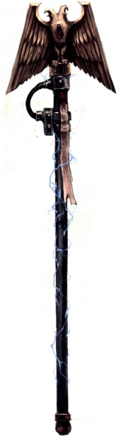
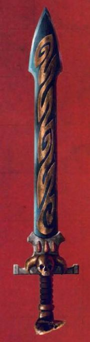

# 1167 灵能武器 Force weapon

精校状态：中文行文已逐段精校，部分术语仍为暂定

分类：武器 / 近战武器

原文来源：https://www.bilibili.com/opus/994403770825703426

原作者：帝国神选罐头

原文时间：编辑于 2025年08月28日 20:49

[返回分类目录](目录.md) · [全书目录](../../目录.md)

<!-- A1167-B0001 -->
**英文原文**

Force weapons are advanced, psychically-attuned close combat weapons that are only fully effective in the hands of a psyker. The name of the weapon derived from the word "the force" — common term for psyching energy and its use. Force weapons effectively act as deadly, psychic extensions of the wielder's own powers. They are designed to allow a psyker to channel deadly warp energies into their victim, acting as a conduit between the wielder's mind and the flesh of their target.

<!-- /A1167-B0001 -->

<!-- A1167-B0002 -->

原译文

灵能武器是先进的、协调灵能的近战武器，只有在灵能者手中才能完全有效。武器的名字来源于“原力”一词，这是精神能量及其使用的常用术语。灵能武器实际上是持用者自身的致命精神力量的延伸。它们的设计目的是让灵能者将致命的亚空间能量引导到受害者身上，作为持用者思想和目标肉体之间的链接管道。

**校订译文**

灵能武器是经过灵能调谐的先进近战武器，只有灵能者才能发挥其全部效力。名称中的 force 源于原文对灵能及其运用的一种通称。灵能武器实际上是持有者自身力量的致命延伸：它在使用者的心智与目标的血肉之间建立导流通道，将致命的亚空间能量灌入受害者体内。

**校注：** 底稿将the force解释为灵能的通称，原译“原力”易引入其他作品专名，改为说明性译法，不据此主张跨作品联系。

<!-- /A1167-B0002 -->

<!-- A1167-B0003 -->
**英文原文**

Large alien monstrosities and daemons that are resilient to conventional weapons can be slain outright by a single wound, as their bodies and minds are destroyed by the unearthly powers of the Immaterium.

<!-- /A1167-B0003 -->

<!-- A1167-B0004 -->

原译文

对常规武器有抵抗力的大型外星怪物和恶魔可以被一个创伤彻底杀死，因为他们的身体和精神被非物质的超自然力量摧毁。

**校订译文**

即使是能够抵御常规武器的巨型异形怪物与恶魔，也可能只受一处创伤便当场毙命，因为亚空间的超自然力量会同时摧毁它们的肉体与心智。

<!-- /A1167-B0004 -->

<!-- A1167-B0005 图片 -->

<!-- A1167-B0006 -->

原译文

Imperial Force Staff 帝国灵能权杖

**校订译文**

Imperial Force Staff 帝国灵能权杖

<!-- /A1167-B0006 -->

<!-- A1167-B0007 -->
**英文原文**

Force weapons take the form of swords, spears, or other close combat weapons. Within the structure of the weapon is interwoven a powerful psi-convector, formed into a precise serpentine shape which concentrates and directs psychic energy. This sometimes appears as a pattern on the blade. If a non-psyker takes up such a weapon, it functions as a standard weapon.

<!-- /A1167-B0007 -->

<!-- A1167-B0008 -->

原译文

灵能武器有剑、矛或其他近战武器的形式。在武器的结构中交织着一个强大的灵能对流器，形成一个精确的蜿蜒形状，集中和引导精神能量。这有时会在刀刃上显现出一个图案。如果非灵能者携带这种武器，它可以作为标准武器使用。

**校订译文**

灵能武器可制成剑、矛或其他近战兵器。武器内部嵌有强大的灵能导流器，其精密的蛇形结构能够汇聚、引导灵能，有时还会在刃面上呈现为纹路。非灵能者使用它时，它只相当于一件普通武器。

<!-- /A1167-B0008 -->

<!-- A1167-B0009 -->
## Types of force weapons 灵能武器类型

<!-- /A1167-B0009 -->

<!-- A1167-B0010 -->
## Force weapon 灵能武器

<!-- /A1167-B0010 -->

<!-- A1167-B0011 -->
**英文原文**

The basic force weapon is used by psykers of all races, often taking the form of a sword, axe, or staff.

<!-- /A1167-B0011 -->

<!-- A1167-B0012 -->

原译文

所有种族的灵能者都使用基本灵能武器，通常采用剑、斧头或权杖的形式。

**校订译文**

各个种族的灵能者都会使用基础型灵能武器，常见形制包括剑、斧与权杖。

<!-- /A1167-B0012 -->

<!-- A1167-B0013 图片 -->

<!-- A1167-B0014 -->

原译文

Force Sword 灵能剑

**校订译文**

Force Sword 灵能剑

<!-- /A1167-B0014 -->

<!-- A1167-B0015 -->
## Force rod 灵能杖

<!-- /A1167-B0015 -->

<!-- A1167-B0016 -->
**英文原文**

Force rods are black rods of alien origin which act as psychic batteries. Psykers may store their psychic energy in the rod to be used in the future, giving the individual an additional source of energy in combat. The rod is used as a normal force weapon in combat, with an additional bonus of being able to break protective psychic auras on contact, on top of that the wielder may draw the stored psychic energy from the rod to increase the power of the attack. Force rods are in some ways analogous to null rods.

<!-- /A1167-B0016 -->

<!-- A1167-B0017 -->

原译文

灵能杖是起源于外星人的黑色杖，充当灵能电池。灵能者可能会将他们的精神力量储存在杖中，以备将来使用，从而在战斗中为个人提供额外的能量来源。该杖在战斗中用作普通灵能武器，还有一个额外的好处，即能够在接触时打破保护性的灵能光环，此外，持用者可以从杖中提取储存的灵能能量来增加攻击的力量。灵能杖在某些方面类似于虚无杖。

**校订译文**

灵能杖是源自异形的黑色杆杖，能像电池一样储存灵能。灵能者可将力量储于其中，以备日后调用，在战斗时便多了一份力量来源。它既能像普通灵能武器一样作战，又能在接触时破除防护性的灵能光环；持有者还可抽取杖中储存的能量，增强攻击威力。在某些方面，灵能杖与虚无杖相似。

<!-- /A1167-B0017 -->

<!-- A1167-B0018 -->
## Nemesis Force Weapon 复仇女神灵能武器

<!-- /A1167-B0018 -->

<!-- A1167-B0019 -->
**英文原文**

Nemesis force weapons are used by the Grey Knights, who are all psykers, as well as some psychic Inquisitors of the Ordo Malleus, such as Torquemada Coteaz. The power unleashed by a Nemesis weapon is directly proportional to the individual wielder's own psychic capacity.

<!-- /A1167-B0019 -->

<!-- A1167-B0020 -->

原译文

复仇女神灵能武器被灰骑士使用，他们都是灵能者，以及一些圣锤修会的灵能审判官，如托尔克马达·科特兹，复仇女神武器释放的力量与使用者自己的灵能能力成正比。

**校订译文**

灰骑士全员都是灵能者，使用复仇女神灵能武器。一些具有灵能的恶魔审判庭审判官也会使用它们，例如托尔克马达·克提兹。这类武器释放的力量，与使用者自身的灵能能力成正比。

**校注：** 对照本段英文确认同一实体，与全书核心译名统一；不改变同形异义词或省略称呼。

<!-- /A1167-B0020 -->

<!-- A1167-B0021 -->
## Witch Weapons 巫术武器

原题：Witch Weapons 女巫武器

**校注：** Witch在这些灵族武器名中不限定女性；统一巫术武器、巫刃、巫杖，暂定待核。

<!-- /A1167-B0021 -->

<!-- A1167-B0022 -->
**英文原文**

A singing spear is an Eldar force weapon similar to the Witchblade, but which can be thrown, returning automatically to the wielder's hand.

<!-- /A1167-B0022 -->

<!-- A1167-B0023 -->

原译文

颂歌之矛是一种类似于女巫之刃的灵族灵能武器，但可以投掷，自动回到持用者手中。

**校订译文**

颂歌之矛是灵族使用的一种灵能武器，与巫刃相似，但可以投掷，并会自动返回持有者手中。

<!-- /A1167-B0023 -->

<!-- A1167-B0024 -->
**英文原文**

Witchblades are Eldar force weapons wielded by Farseers and Warlocks.

<!-- /A1167-B0024 -->

<!-- A1167-B0025 -->

原译文

女巫之刃是先知和战巫使用的灵族灵能武器。

**校订译文**

巫刃是灵族大先知和战巫使用的灵能武器。

<!-- /A1167-B0025 -->

<!-- A1167-B0026 -->
**英文原文**

Witch staves function in much the same way as witchblades but are preferred by Spiritseers.

<!-- /A1167-B0026 -->

<!-- A1167-B0027 -->

原译文

女巫之杖的功能与女巫之刀几乎相同，但更受灵魂先知的青睐。

**校订译文**

巫杖的工作原理与巫刃大致相同，更受灵魂先知青睐。

<!-- /A1167-B0027 -->

<!-- A1167-B0028 -->
## Other Aeldari Force Weapons 其他艾达灵族灵能武器

<!-- /A1167-B0028 -->

<!-- A1167-B0029 -->
**英文原文**

Miststaves are force weapons wielded by Shadowseers.

<!-- /A1167-B0029 -->

<!-- A1167-B0030 -->

原译文

迷雾之杖是暗影先知使用的强力武器。

**校订译文**

迷雾之杖是暗影先知使用的灵能武器。

**校注：** force weapon是灵能武器，原“强力武器”误作普通形容词。

<!-- /A1167-B0030 -->

<!-- A1167-B0031 -->
**英文原文**

Wraithspears are wielded by Wraithseers; it is not clear if they are force weapons or not.

<!-- /A1167-B0031 -->

<!-- A1167-B0032 -->

原译文

幽冥之矛由幽冥先知挥舞；目前尚不清楚它们是否是灵能武器。

**校订译文**

幽冥之矛由幽冥先知挥舞；目前尚不清楚它们是否是灵能武器。

<!-- /A1167-B0032 -->

<!-- A1167-B0033 -->
## Unique force weapons 独特灵能武器

<!-- /A1167-B0033 -->

<!-- A1167-B0034 -->
**英文原文**

Barbarisater — Carried by Gregor Eisenhorn

<!-- /A1167-B0034 -->

<!-- A1167-B0035 -->

原译文

野蛮者——格雷戈·艾森霍恩携带

**校订译文**

巴巴里萨特——格雷戈·艾森霍恩使用的武器。

<!-- /A1167-B0035 -->

<!-- A1167-B0036 -->
**英文原文**

The Black Staff of Ahriman, used by Chaos Sorcerer Ahriman of the Thousand Sons.

<!-- /A1167-B0036 -->

<!-- A1167-B0037 -->

原译文

阿里曼的黑色法杖，由千子混沌巫师阿里曼使用。

**校订译文**

阿里曼的黑杖，由千子混沌巫师阿里曼使用。

<!-- /A1167-B0037 -->

<!-- A1167-B0038 -->
**英文原文**

The Blade of Ahn-Nunurta carried by the Primarch Magnus

<!-- /A1167-B0038 -->

<!-- A1167-B0039 -->

原译文

原体马格努斯携带的安-努努尔塔之刃

**校订译文**

原体马格努斯携带的安-努努尔塔之刃

<!-- /A1167-B0039 -->

<!-- A1167-B0040 -->
**英文原文**

The Malleus Argyrum carried by Grey Knights Grand Master Voldus

<!-- /A1167-B0040 -->

<!-- A1167-B0041 -->

原译文

灰骑士团长沃尔达斯携带的阿格鲁姆之锤

**校订译文**

阿格鲁姆之锤——灰骑士沃尔达斯大导师使用的武器。

<!-- /A1167-B0041 -->

<!-- A1167-B0042 -->
**英文原文**

The Manreaper used by Typhus of the Death Guard. Shaped like a giant scythe, it is also blessed by Nurgle to infect those it touches.

<!-- /A1167-B0042 -->

<!-- A1167-B0043 -->

原译文

收割者，由死亡守卫的泰丰斯所使用。 形状像一把巨大的镰刀，被纳垢所赐福能感染它所接触到的人。

**校订译文**

收割者——死亡守卫泰弗斯使用的武器，形如一把巨大的镰刀，受纳垢赐福，能使接触到的人染病。

<!-- /A1167-B0043 -->

<!-- A1167-B0044 -->
**英文原文**

The Rod of Tigurius, used by Chief Librarian Varro Tigurius of the Ultramarines.

<!-- /A1167-B0044 -->

<!-- A1167-B0045 -->

原译文

狄格里斯之杖，由极限战士的首席智库瓦里奥·狄格里斯使用

**校订译文**

狄格里斯之杖——极限战士首席智库员瓦罗·狄格里斯使用的武器。

<!-- /A1167-B0045 -->

<!-- A1167-B0046 -->
**英文原文**

The Staff of Kelmon, belonging to Kelmon Firesight of Craftworld Iyanden

<!-- /A1167-B0046 -->

<!-- A1167-B0047 -->

原译文

科洛蒙之杖，属于伊扬登方舟世界的科洛蒙·火视

**校订译文**

科洛蒙之杖，属于伊扬登方舟世界的科洛蒙·火视

<!-- /A1167-B0047 -->

<!-- A1167-B0048 -->
**英文原文**

The Staff of Ulthamar, carried by Eldrad Ulthran of Craftworld Ulthwe

<!-- /A1167-B0048 -->

<!-- A1167-B0049 -->

原译文

乌萨玛之杖，由乌斯维方舟世界的艾尔德拉德·乌瑟兰携带

**校订译文**

乌萨玛之杖，由乌斯维方舟世界的艾尔德拉德·乌瑟兰携带

<!-- /A1167-B0049 -->

<!-- A1167-B0050 -->
**英文原文**

The Thunder of Asgard, owned by the Space Wolves

<!-- /A1167-B0050 -->

<!-- A1167-B0051 -->

原译文

阿斯加德之雷霆，太空野狼拥有

**校订译文**

阿斯加德之雷霆，太空野狼拥有

<!-- /A1167-B0051 -->

<!-- A1167-B0052 -->
**英文原文**

The Titansword carried by Grey Knights Supreme Grand Master Kaldor Draigo

<!-- /A1167-B0052 -->

<!-- A1167-B0053 -->

原译文

灰骑士至高大导师卡尔多·迪亚哥携带的泰坦之剑

**校订译文**

灰骑士至高大导师卡尔多·迪亚哥携带的泰坦之剑

<!-- /A1167-B0053 -->

<!-- A1167-B0054 -->
**英文原文**

The Traitor's Bane, used by Chief Librarian Ezekiel of the Dark Angels.

<!-- /A1167-B0054 -->

<!-- A1167-B0055 -->

原译文

叛徒之祸，由暗黑天使的首席智库以西结使用

**校订译文**

叛徒之灾——黑暗天使首席智库员以西结使用的武器。

<!-- /A1167-B0055 -->

<!-- A1167-B0056 -->
**英文原文**

Vinculum Vitae - Force Sword

<!-- /A1167-B0056 -->

<!-- A1167-B0057 -->

原译文

生命链接 - 灵能剑

**校订译文**

生命链接 - 灵能剑

<!-- /A1167-B0057 -->

<!-- A1167-B0058 -->
**英文原文**

The force sword Vitarus, used by Chief Librarian Mephiston of the Blood Angels.

<!-- /A1167-B0058 -->

<!-- A1167-B0059 -->

原译文

灵能剑维塔鲁斯, 由圣血天使首席智库墨菲斯顿使用

**校订译文**

维塔鲁斯——圣血天使首席智库员墨菲斯顿使用的灵能剑。

<!-- /A1167-B0059 -->

本篇核心术语与暂定项

以下列出本篇出现的英文原形及核心术语表用词。同形词可能指不同对象，具体词义以本篇正文和校注为准；单复数、别名和仅见于图注的名称可能尚未列入。完整候选见[术语表](../../术语表/双语术语候选.csv)。

| 英文 | 采用中文 | 状态 |
| --- | --- | --- |
| Blood Angels | 圣血天使 | 官方已核对 |
| Dark Angels | 黑暗天使 | 官方已核对 |
| Grey Knights | 灰骑士 | 官方已核对 |
| Space Wolves | 太空野狼 | 官方已核对 |
| Death Guard | 死亡守卫 | 官方已核对 |
| Thousand Sons | 千子 | 官方已核对 |
| Eldar | 灵族 | 暂定·语境区分 |
| Psyker | 灵能者 | 官方已核对 |
| Librarian | 智库员 | 官方已核对 |
| Ultramarines | 极限战士 | 官方已核对 |
| Warp | 亚空间 | 官方已核对 |
| Sorcerer | 巫师 | 官方已核对 |
| Nurgle | 纳垢 | 官方已核对 |
| Craftworld | 方舟世界 | 官方已核对 |
| Ordo Malleus | 恶魔审判庭 | 用户指定 |
| Primarch | 原体 | 官方已核对 |
| Gregor Eisenhorn | 格雷戈·艾森霍恩 | 暂定·官方待核 |
| Clear | 清明 | 暂定·官方待核 |
| Chief Librarian | 首席智库员 | 暂定·官方待核 |
| Master | 导师（审判庭职衔）／舰务官（舰员职务） | 语境定译·官方待核 |
| Torquemada Coteaz | 托尔克马达·克提兹 | 官方词根参考·全名待核 |
| Varro Tigurius | 瓦罗·狄格里斯 | 暂定·官方待核 |
| Ezekiel | 以西结 | 暂定·官方待核 |
| Mephiston | 墨菲斯顿 | 暂定·官方待核 |
| Kaldor Draigo | 卡尔多·迪亚哥 | 暂定·官方待核 |
| Nemesis | 复仇女神 | 暂定·官方待核 |
| Supreme Grand Master | 至高大导师 | 暂定·官方待核 |
| Chief Librarian Mephiston | 首席智库员墨菲斯顿 | 官方已核 |
| Powers | 能天使 | 暂定·官方待核 |
| Typhus | 泰弗斯 | 官方已核对 |
| Eldrad Ulthran | 艾尔德拉德·乌瑟兰 | 官方已核对 |
| Iyanden | 伊扬登 | 暂定·官方待核 |
| Kelmon | 科洛蒙 | 暂定·官方待核 |
| Grand Master Voldus | 沃尔达斯大导师 | 官方已核对 |
| Manreaper | 收割者 | 暂定·官方待核 |
| Grand Master | 大导师 | 暂定·官方待核 |
| The Black Staff of Ahriman | 阿里曼的黑杖 | 暂定·官方待核 |
| Traitor's Bane | 叛徒之灾 | 暂定·官方待核 |
| The Weapon | 武器 | 暂定·官方待核 |
| Barbarisater | 巴巴里萨特 | 暂定·官方待核 |
| Force Sword | 灵能剑 | 暂定·官方待核 |
| The Dark | 《黑暗》 | 暂定·官方待核 |
| The Blood | 鲜血 | 暂定·官方待核 |
| Vitarus | 维塔鲁斯 | 暂定·官方待核 |
| Titansword | 泰坦之剑 | 暂定·官方待核 |
| Malleus Argyrum | 阿格鲁姆之锤 | 暂定·官方待核 |
| Rod of Tigurius | 狄格里斯之杖 | 暂定·官方待核 |
| Staff of Ulthamar | 乌萨玛之杖 | 暂定·官方待核 |
| Force weapon | 灵能武器 | 暂定·官方待核 |
| psi-convector | 灵能导流器 | 暂定·官方待核 |
| Singing Spear | 颂歌之矛 | 暂定·官方待核 |
| Witchblade | 巫刃 | 暂定·官方待核 |
| Black Staff of Ahriman | 阿里曼的黑杖 | 暂定·官方待核 |
| Blade of Ahn-Nunurta | 安-努努尔塔之刃 | 暂定·官方待核 |
| Staff of Kelmon | 科洛蒙之杖 | 暂定·官方待核 |
| Kelmon Firesight | 科洛蒙·火视 | 暂定·官方待核 |
| Thunder of Asgard | 阿斯加德之雷霆 | 暂定·官方待核 |
| Vinculum Vitae | 生命链接 | 暂定·官方待核 |
| Force Weapons | 灵能武器 | 暂定·官方待核 |
| Resilient | 坚韧号 | 暂定·官方待核 |

