# 1168 复仇女神灵能武器 Nemesis force weapon

精校状态：中文行文已逐段精校，部分术语仍为暂定

分类：武器 / 近战武器

原文来源：https://www.bilibili.com/opus/1218914295634460704

原作者：帝国神选罐头

原文时间：2026年06月28日 17:30

[返回分类目录](目录.md) · [全书目录](../../目录.md)

原篇名：天罚灵能武器 Nemesis force weapon

<!-- A1168-B0001 -->
**英文原文**

Nemesis force weapons are the characteristic type of Force Weapon of the Grey Knights, and take the form of swords, axes, halberds, maces, and hammers. Each Nemesis force weapon houses a psi-matrix attuned to the unique psyche of its owner. The power of the weapon itself directly corresponds to the psychic talent of the wielder. In its original version, the haft incorporated a bolter weapon, similar to the Adeptus Custodes' Guardian spear; newer versions forego the bolter, which is instead wrist-mounted on the knight's power armour.

<!-- /A1168-B0001 -->

<!-- A1168-B0002 -->

原译文

天罚灵能武器是灰骑士灵能武器的特有类型，有剑、斧、戟、权杖和锤。每件天罚灵能武器都装有一个与主人独特灵能相适应的灵能矩阵。武器本身的力量直接对应于使用者的灵能天赋。在其原始版本中，柄包含了一种类似于禁军修会的卫士之矛的爆矢枪武器；较新的版本放弃了爆矢枪，而是将其安置在骑士的动力盔甲上。

**校订译文**

复仇女神灵能武器是灰骑士特有的一类灵能兵器，形制包括剑、斧、戟、槌与锤。每件武器都装有与主人独特心智相调谐的灵能矩阵，其威力直接取决于使用者的灵能天赋。早期型号的长柄内置爆矢武器，与禁军的卫士之矛相似；后来的型号则省去了这一设计，将爆矢武器改装到骑士动力盔甲的手腕处。

**校注：** 全书已采用复仇女神灵能武器系列，本文旧译天罚统一回既定名；完整机甲官译涅墨西斯骇骑机甲不扩为武器系列官译。

<!-- /A1168-B0002 -->

<!-- A1168-B0003 -->
## Types and Variants 类别和变体

<!-- /A1168-B0003 -->

<!-- A1168-B0004 -->
## Nemesis Force Sword 复仇女神灵能剑

原题：Nemesis Force Sword 天罚灵能剑

<!-- /A1168-B0004 -->

<!-- A1168-B0005 -->
**英文原文**

The most common type of weapon wielded by the Grey Knights is the Nemesis Force Sword. It exemplifies the mixture of magick and science utilised by the Grey Knights. The blade is tempered iron, flecked with shards of silver and inset with ancient runes of daemon slaying. Advanced power field generators are also contained within.

<!-- /A1168-B0005 -->

<!-- A1168-B0006 -->

原译文

灰骑士最常用的武器是天罚灵能剑。它体现了灰骑士所使用的魔法和科学的结合。刀刃由回火铁制成，上面点缀着银片，并镶嵌着古老的恶魔杀戮符文。先进的立场发生器也包含在其中。

**校订译文**

复仇女神灵能剑是灰骑士最常用的武器，体现了他们将巫术与科学相结合的方式。剑刃由淬炼的铁制成，掺有银屑，嵌着古老的屠魔符文，内部还装有先进的动力场发生器。

**校注：** 原“立场”是“力场”的错字，此处具体为动力场。

<!-- /A1168-B0006 -->

<!-- A1168-B0007 图片 -->
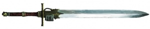

<!-- A1168-B0008 -->

原译文

Nemesis Force Sword 天罚灵能剑

**校订译文**

Nemesis Force Sword 复仇女神灵能剑

<!-- /A1168-B0008 -->

<!-- A1168-B0009 -->
## Nemesis Force Halberd 复仇女神灵能戟

原题：Nemesis Force Halberd 天罚灵能戟

<!-- /A1168-B0009 -->

<!-- A1168-B0010 -->
**英文原文**

A Nemesis Halberd is a two-handed weapon that consists of a long adamantium haft with an iron and silver blade set upon the top. This extra reach often allows a Grey Knight to land a fatal blow, killing the enemy before coming within reach of its weapons.

<!-- /A1168-B0010 -->

<!-- A1168-B0011 -->

原译文

天罚灵能戟是一种双手武器，由一根长长的精金柄组成，顶部装有铁和银刃。这种额外的范围通常允许灰骑士进行致命的打击，在敌人到达武器的范围内之前杀死敌人。

**校订译文**

复仇女神灵能戟是一种双手武器，长长的精金柄顶端装有铁银合制的利刃。较长的攻击距离，让灰骑士常能在进入敌人武器的威胁范围之前，先以致命一击将其斩杀。

<!-- /A1168-B0011 -->

<!-- A1168-B0012 图片 -->
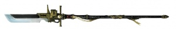

<!-- A1168-B0013 -->

原译文

Nemesis Force Halberd 天罚灵能戟

**校订译文**

Nemesis Force Halberd 复仇女神灵能戟

<!-- /A1168-B0013 -->

<!-- A1168-B0014 -->
## Nemesis Daemon Hammer 复仇女神恶魔锤

原题：Nemesis Daemon Hammer 天罚恶魔锤

<!-- /A1168-B0014 -->

<!-- A1168-B0015 -->
**英文原文**

The Nemesis Daemon Hammer is much like the Thunder Hammer used by most other Chapters, but combines the crushing power with magicks of destruction. Few enemies can survive a single blow.

<!-- /A1168-B0015 -->

<!-- A1168-B0016 -->

原译文

天罚恶魔锤与大多数其他战团使用的雷霆锤非常相似，但将粉碎力与毁灭魔法相结合。很少有敌人能在一次打击中幸存下来。

**校订译文**

复仇女神恶魔锤与大多数其他战团使用的雷霆锤相似，但将摧枯拉朽的打击力与毁灭巫术融为一体，很少有敌人能承受一击而不死。

<!-- /A1168-B0016 -->

<!-- A1168-B0017 图片 -->
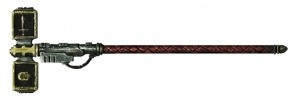

<!-- A1168-B0018 -->

原译文

Nemesis Daemon Hammer 天罚恶魔锤

**校订译文**

Nemesis Daemon Hammer 复仇女神恶魔锤

<!-- /A1168-B0018 -->

<!-- A1168-B0019 -->
## Nemesis Warding Stave 复仇女神守护杖

原题：Nemesis Warding Stave 天罚守护杖

<!-- /A1168-B0019 -->

<!-- A1168-B0020 -->
**英文原文**

Unlike most of the Nemesis Force Weapons used by the Grey Knights, the Nemesis Warding Stave has abilities used in defensive situations. The wielder of the stave can channel his psychic might into the haft to activate the refractor fields within. The refractor fields, once activated, then project a force field around the wielder, softening any blows and thus increasing the chance for retaliation.

<!-- /A1168-B0020 -->

<!-- A1168-B0021 -->

原译文

与灰骑士使用的大多数天罚灵能武器不同，天罚守护杖具有在防御情况下使用的能力。使用法杖的人可以将他的灵能力量引导到柄中，以激活里面的折射立场。折射立场一旦激活，就会在持用者周围投射一个力场，缓化任何打击，从而增加反击的机会。

**校订译文**

复仇女神守护杖具备防御能力，这使它区别于灰骑士使用的大多数同系列灵能武器。持有者可将灵能导入杖身，激活内部的折射场装置，在周身投射防护力场，减轻来袭打击，并为自己争取反击的机会。

<!-- /A1168-B0021 -->

<!-- A1168-B0022 图片 -->
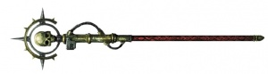

<!-- A1168-B0023 -->

原译文

Nemesis Warding Stave 天罚守护杖

**校订译文**

Nemesis Warding Stave 复仇女神守护杖

<!-- /A1168-B0023 -->

<!-- A1168-B0024 -->
## Nemesis Falchions 复仇女神弯刀

原题：Nemesis Falchions 天罚弯刀

<!-- /A1168-B0024 -->

<!-- A1168-B0025 -->
**英文原文**

Wielded in a pair, Nemesis Falchions are smaller variants of the Nemesis Force Sword. By triggering the circuitry within each Falchion, a Grey Knight can swing the Force Weapon with incredible speed, striking several blows with pinpoint accuracy.

<!-- /A1168-B0025 -->

<!-- A1168-B0026 -->

原译文

天罚弯刀是天罚灵能剑的较小变体。通过触发每个弯刀内部的回路，灰骑士可以以令人难以置信的速度挥动灵能武器，以精确的精度进行几次打击。

**校订译文**

复仇女神弯刀是灵能剑的较小改型，通常成对使用。灰骑士激活刀内的回路后，便能以惊人的速度挥动双刃，连续施展精准打击。

<!-- /A1168-B0026 -->

<!-- A1168-B0027 图片 -->
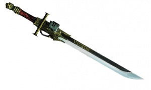

<!-- A1168-B0028 -->

原译文

Nemesis Falchion 天罚弯刀

**校订译文**

Nemesis Falchion 复仇女神弯刀

<!-- /A1168-B0028 -->

<!-- A1168-B0029 -->
## Nemesis Doomfist 复仇女神毁灭拳

原题：Nemesis Doomfist 天罚毁灭拳

<!-- /A1168-B0029 -->

<!-- A1168-B0030 -->
**英文原文**

Also known as the Nemesis Dreadfist, the power fists of the Grey Knights Dreadnought and Nemesis Dreadknight are augmented with Nemesis circuitry. In the case of the dreadnought, although the body interred within the sarcophagus is mortally wounded, his will to fight on alongside his brothers is as strong now as it was before and his psychic might is as formidable as ever.

<!-- /A1168-B0030 -->

<!-- A1168-B0031 -->

原译文

也被称为天罚恐惧拳，灰骑士无畏和天罚恐惧骑士的动力拳被天罚回路增强。就无畏而言，尽管埋葬在石棺内的躯体受了致命伤，但他与兄弟们并肩作战的意志现在和以前一样坚强，他的灵能力量也和以前一样强大。

**校订译文**

复仇女神毁灭拳又称复仇女神恐惧拳，是灰骑士无畏机甲和涅墨西斯骇骑机甲使用的动力拳，经过复仇女神回路强化。无畏机甲石棺中的战士虽身负致命伤，却依然怀有与兄弟们并肩作战的强烈意志，灵能力量也一如既往地强大。

<!-- /A1168-B0031 -->

<!-- A1168-B0032 图片 -->
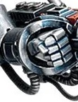

<!-- A1168-B0033 -->

原译文

Nemesis Doomfist 天罚毁灭拳

**校订译文**

Nemesis Doomfist 复仇女神毁灭拳

<!-- /A1168-B0033 -->

<!-- A1168-B0034 -->
## Nemesis Greatsword 复仇女神大剑

原题：Nemesis Greatsword 天罚大剑

<!-- /A1168-B0034 -->

<!-- A1168-B0035 -->
**英文原文**

Only Dreadknights are able to wield the gargantuan size of a Nemesis Greatsword, as no mere Grey Knight could ever hope to wield such a colossal weapon unaided.

<!-- /A1168-B0035 -->

<!-- A1168-B0036 -->

原译文

只有恐惧骑士才能挥舞天罚大剑的巨大尺寸，因为没有任何一位灰骑士能够在没有帮助的情况下挥舞如此巨大的武器。

**校订译文**

复仇女神大剑体积庞大，只有骇骑机甲才能使用。任何灰骑士都无法仅凭自身力量挥动如此巨大的武器。

<!-- /A1168-B0036 -->

<!-- A1168-B0037 图片 -->
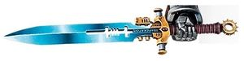

<!-- A1168-B0038 -->

原译文

Nemesis Greatsword 天罚大剑

**校订译文**

Nemesis Greatsword 复仇女神大剑

<!-- /A1168-B0038 -->

<!-- A1168-B0039 -->
## Nemesis Daemon Greathammer 复仇女神恶魔大锤

原题：Nemesis Daemon Greathammer 天罚恶魔大锤

<!-- /A1168-B0039 -->

<!-- A1168-B0040 -->
**英文原文**

A massive version of the Nemesis Daemon Hammer used by Dreadknights.

<!-- /A1168-B0040 -->

<!-- A1168-B0041 -->

原译文

恐惧骑士使用的天罚恶魔锤的大型版本。

**校订译文**

骇骑机甲使用的巨型复仇女神恶魔锤。

<!-- /A1168-B0041 -->

<!-- A1168-B0042 图片 -->
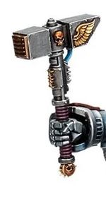

<!-- A1168-B0043 -->

原译文

Nemesis Great Daemonhammer 天罚恶魔大锤

**校订译文**

Nemesis Great Daemonhammer 复仇女神恶魔大锤

<!-- /A1168-B0043 -->

<!-- A1168-B0044 -->
## Nemesis Flail 复仇女神连枷

原题：Nemesis Flail 天罚链枷

<!-- /A1168-B0044 -->

<!-- A1168-B0045 -->
**英文原文**

A large flail used by Dreadknights.

<!-- /A1168-B0045 -->

<!-- A1168-B0046 -->

原译文

恐惧骑士使用的大型连枷。

**校订译文**

骇骑机甲使用的大型连枷。

<!-- /A1168-B0046 -->

<!-- A1168-B0047 图片 -->
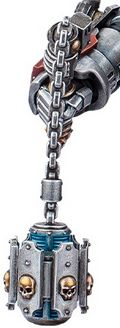

<!-- A1168-B0048 -->

原译文

Nemesis Flail 天罚链枷

**校订译文**

Nemesis Flail 复仇女神连枷

<!-- /A1168-B0048 -->

<!-- A1168-B0049 -->
## Nemesis Mace 复仇女神战槌

原题：Nemesis Mace 天罚权杖

**校注：** mace为近战战槌，不是施法权杖；与stave区分。

<!-- /A1168-B0049 -->

<!-- A1168-B0050 -->
**英文原文**

A large mace used by Dreadknights.

<!-- /A1168-B0050 -->

<!-- A1168-B0051 -->

原译文

恐惧骑士使用的大型权杖。

**校订译文**

骇骑机甲使用的大型战槌。

<!-- /A1168-B0051 -->

<!-- A1168-B0052 图片 -->
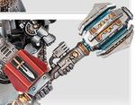

<!-- A1168-B0053 -->

原译文

Nemesis Mace 天罚权杖

**校订译文**

Nemesis Mace 复仇女神战槌

<!-- /A1168-B0053 -->

<!-- A1168-B0054 -->
## Nemesis Doomglaive 复仇女神毁灭长刀

原题：Nemesis Doomglaive 天罚毁灭长刀

<!-- /A1168-B0054 -->

<!-- A1168-B0055 -->
**英文原文**

This weapon resembles the huge sword psychically attuned to one arm of the Mk IV Dreadnought. It is one of the weapon of the Doomglaive Pattern Dreadnoughts of the Grey Knights. It is an excellent weapon to confront large hordes of enemies, its cunningly articulated mount and long blade proven to make devastating scything strikes.

<!-- /A1168-B0055 -->

<!-- A1168-B0056 -->

原译文

这种武器就像一把巨大的剑，在灵能上与Mk IV无畏的一只手臂相协调。它是灰骑士毁灭长刀型无畏的武器之一。它是对抗大批敌人的绝佳武器，其巧妙的铰接安装和长刃被证明可以进行毁灭性的镰割打击。

**校订译文**

这种武器形似一把巨剑，安装在 Mk IV 无畏机甲的一条手臂上，并与其进行灵能调谐。它是灰骑士毁灭长刀型无畏机甲的武器之一，尤其适合对付密集敌群。巧妙的关节式挂载结构配合长长的利刃，能够扫出毁灭性的横斩。

<!-- /A1168-B0056 -->

<!-- A1168-B0057 图片 -->
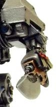

<!-- A1168-B0058 -->

原译文

Nemesis Doomglaive 天罚毁灭长刀

**校订译文**

Nemesis Doomglaive 复仇女神毁灭长刀

<!-- /A1168-B0058 -->

<!-- A1168-B0059 -->
## Notable Nemesis Force Weapons 著名复仇女神灵能武器

原题：Notable Nemesis Force Weapons 著名天罚灵能武器

<!-- /A1168-B0059 -->

<!-- A1168-B0060 -->
**英文原文**

The Malleus Argyrum - Nemesis Daemon Hammer wielded by Aldrik Voldus.

<!-- /A1168-B0060 -->

<!-- A1168-B0061 -->

原译文

阿格鲁姆之锤 -阿德里克·沃尔达斯挥舞的天罚恶魔锤。

**校订译文**

阿格鲁姆之锤——阿尔德里克·沃尔达斯使用的复仇女神恶魔锤。

<!-- /A1168-B0061 -->

<!-- A1168-B0062 -->
**英文原文**

The Titansword - Nemesis Force Sword wielded by Kaldor Draigo.

<!-- /A1168-B0062 -->

<!-- A1168-B0063 -->

原译文

泰坦之剑 - 卡尔多·迪亚哥挥舞的天罚灵能剑

**校订译文**

泰坦之剑——卡尔多·迪亚哥使用的复仇女神灵能剑。

<!-- /A1168-B0063 -->

本篇核心术语与暂定项

以下列出本篇出现的英文原形及核心术语表用词。同形词可能指不同对象，具体词义以本篇正文和校注为准；单复数、别名和仅见于图注的名称可能尚未列入。完整候选见[术语表](../../术语表/双语术语候选.csv)。

| 英文 | 采用中文 | 状态 |
| --- | --- | --- |
| Grey Knights | 灰骑士 | 官方已核对 |
| Adeptus Custodes | 帝皇禁军 | 官方已核对 |
| Nemesis Force Weapon | 复仇女神灵能武器 | 暂定·官方待核 |
| Ancient | 旗手 | 官方已核对 |
| Power Armour | 动力盔甲 | 暂定·官方待核 |
| Kaldor Draigo | 卡尔多·迪亚哥 | 暂定·官方待核 |
| Aldrik Voldus | 阿尔德里克·沃尔达斯 | 暂定·官方待核 |
| Nemesis | 复仇女神 | 暂定·官方待核 |
| Nemesis Dreadknight | 涅墨西斯骇骑机甲 | 官方已核对 |
| Dreadnought | 无畏机甲 | 暂定·官方待核 |
| Halberd | 长戟号 | 暂定·官方待核 |
| The Weapon | 武器 | 暂定·官方待核 |
| Force Sword | 灵能剑 | 暂定·官方待核 |
| Titansword | 泰坦之剑 | 暂定·官方待核 |
| Nemesis Daemon Hammer | 复仇女神恶魔锤 | 暂定·官方待核 |
| Malleus Argyrum | 阿格鲁姆之锤 | 暂定·官方待核 |
| Thunder Hammer | 雷霆锤 | 暂定·官方待核 |
| Guardian Spear | 卫士之矛 | 暂定·官方待核 |
| Force weapon | 灵能武器 | 暂定·官方待核 |
| Nemesis Force Sword | 复仇女神灵能剑 | 暂定·官方待核 |
| Nemesis Warding Stave | 复仇女神守护杖 | 暂定·官方待核 |
| Nemesis Dreadfist | 复仇女神恐惧拳 | 暂定·官方待核 |
| Nemesis Greatsword | 复仇女神大剑 | 暂定·官方待核 |
| Bolter | 爆矢枪 | 暂定·官方待核 |
| Force Weapons | 灵能武器 | 暂定·官方待核 |
| Grey Knights Dreadnought | 灰骑士无畏机甲 | 暂定·官方待核 |

