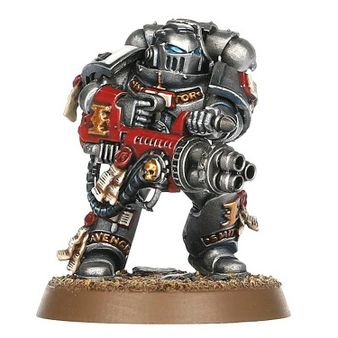
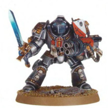
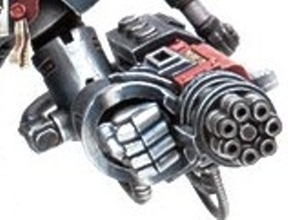

# 1169 灭灵武器 Psilencer

精校状态：中文行文已逐段精校，部分术语仍为暂定

分类：武器 / 近战武器

原文来源：https://www.bilibili.com/opus/1218929757512532006

原作者：帝国神选罐头

原文时间：2026年06月28日 18:30

[返回分类目录](目录.md) · [全书目录](../../目录.md)

原篇名：灭灵者 Psilencer

<!-- A1169-B0001 -->
**英文原文**

Psilencers are a type of psionic weapon created by an unknown xenos race and made use of by the Grey Knights chapter. Whether the technology was stolen or freely given to the Grey Knights is not known; all that is known is that it is unlike any weapon within the armouries of the Imperium.

<!-- /A1169-B0001 -->

<!-- A1169-B0002 -->

原译文

灭灵者是一种由未知的异型种族创造的灵能武器，并被灰骑士战团使用。目前尚不清楚这项技术是被盗还是免费提供给灰骑士；众所周知，它不同于帝国军械库中的任何武器。

**校订译文**

灭灵武器是一类由未知异形种族创造、被灰骑士战团采用的灵能武器。灰骑士究竟窃取了这项技术，还是由对方自愿交付，至今无人知晓；可以确定的是，它与帝国军械库中的其他武器截然不同。

**校注：** 与464篇既定Psilencer灭灵武器统一；原灭灵者为别名。异型改异形。

<!-- /A1169-B0002 -->

<!-- A1169-B0003 图片 -->

<!-- A1169-B0004 -->

原译文

Grey Knight with Psilencer 配备灭灵者的灰骑士

**校订译文**

Grey Knight with Psilencer 配备灭灵武器的灰骑士

<!-- /A1169-B0004 -->

<!-- A1169-B0005 -->
## Description 描述

<!-- /A1169-B0005 -->

<!-- A1169-B0006 -->
**英文原文**

They function by channeling, focusing, and amplifying the psychic might of the user. The unique design means that it lacks a triggering mechanism, but instead the wielder channels their psychic might into the containment core of the weapon - after which, focusing crystals channel the resultant energy into a refined azure energy pulse capable of destabilizing the physical form of a daemon.

<!-- /A1169-B0006 -->

<!-- A1169-B0007 -->

原译文

它们通过引导、聚焦和放大使用者的灵能力量来发挥作用。独特的设计意味着它缺乏触发机构，但持用者将他们的灵能力量引导到武器的控制核心 — 之后，聚焦晶体将产生的能量引导到能够破坏恶魔物理形态稳定的精炼蔚蓝能量脉冲中。

**校订译文**

灭灵武器通过引导、聚焦并放大使用者的灵能力量发动攻击。它设计独特，没有扳机；持有者须将灵能导入武器的约束核心，再由聚焦晶体将能量凝成一道纯净的蔚蓝色脉冲，足以使恶魔的实体形态失稳。

<!-- /A1169-B0007 -->

<!-- A1169-B0008 图片 -->

<!-- A1169-B0009 -->

原译文

Grey Knights Terminator with Psilencer 配备灭灵者的灰骑士终结者

**校订译文**

Grey Knights Terminator with Psilencer 配备灭灵武器的灰骑士终结者

<!-- /A1169-B0009 -->

<!-- A1169-B0010 -->
## Gatling Psilencer 灭灵加特林

<!-- /A1169-B0010 -->

<!-- A1169-B0011 -->
**英文原文**

A Gatling psilencer is far more powerful version of the regular psilencer. Far too large for a single Grey Knight, it is reserved for the mighty Nemesis Dreadknight.

<!-- /A1169-B0011 -->

<!-- A1169-B0012 -->

原译文

灭灵加特林是普通灭灵者更强的版本。对于一名灰骑士来说太大了，它是为强大的天罚恐惧骑士保留的。

**校订译文**

灭灵加特林是威力远超普通型号的重型灭灵武器，体积过大，单名灰骑士无法使用，因此专供强大的涅墨西斯骇骑机甲装备。

<!-- /A1169-B0012 -->

<!-- A1169-B0013 图片 -->

<!-- A1169-B0014 -->

原译文

Gatling psilencer 天罚加特林

**校订译文**

Gatling psilencer 灭灵加特林

**校注：** 同一Gatling psilencer此前图注为灭灵加特林，末图原“天罚加特林”不一致，统一。

<!-- /A1169-B0014 -->

本篇核心术语与暂定项

以下列出本篇出现的英文原形及核心术语表用词。同形词可能指不同对象，具体词义以本篇正文和校注为准；单复数、别名和仅见于图注的名称可能尚未列入。完整候选见[术语表](../../术语表/双语术语候选.csv)。

| 英文 | 采用中文 | 状态 |
| --- | --- | --- |
| Grey Knights | 灰骑士 | 官方已核对 |
| Imperium | 帝国 | 暂定·简称 |
| Chapter | 战团 | 暂定·官方待核 |
| Nemesis | 复仇女神 | 暂定·官方待核 |
| Xenos | 异形 | 暂定·官方待核 |
| Nemesis Dreadknight | 涅墨西斯骇骑机甲 | 官方已核对 |
| Psilencer | 灭灵武器 | 暂定·官方待核 |
| The Weapon | 武器 | 暂定·官方待核 |
| Gatling Psilencer | 灭灵加特林 | 暂定·官方待核 |

