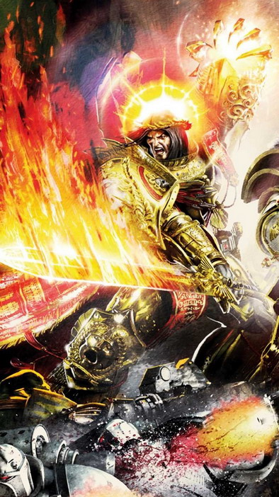
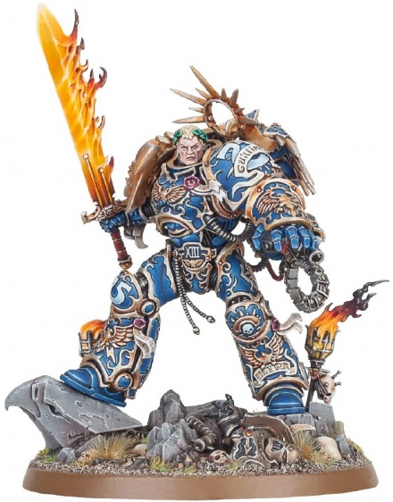

# 1170 帝皇之剑 Emperor's Sword

精校状态：中文行文已逐段精校，部分术语仍为暂定

分类：武器 / 近战武器

原文来源：https://www.bilibili.com/opus/1084131805162897429

原作者：帝国神选罐头

原文时间：2025年06月30日 12:25

[返回分类目录](目录.md) · [全书目录](../../目录.md)

<!-- A1170-B0001 -->
**英文原文**

"This is the Sword of the Emperor, the great foe of Chaos. It has laid low thousands of your kind. You shall be but an addition to the tally."

<!-- /A1170-B0001 -->

<!-- A1170-B0002 -->

原译文

“这是帝皇之剑，混沌的大敌。它已经杀死了数千名你的同类。你只会是下一个。”

**校订译文**

“这是帝皇之剑，混沌的大敌。它已斩杀数千名你的同类，你也不过是这份战绩上新增的一笔。”

<!-- /A1170-B0002 -->

<!-- A1170-B0003 -->
**英文原文**

Lord Commander Roboute Guilliman to the Daemon Qaramar

<!-- /A1170-B0003 -->

<!-- A1170-B0004 -->

原译文

领主指挥官罗伯特·基里曼对恶魔卡兰玛尔

**校订译文**

领主指挥官罗保特·基里曼对恶魔卡兰玛尔所言

<!-- /A1170-B0004 -->

<!-- A1170-B0005 -->
**英文原文**

The Emperor's Sword is a giant flame-covered blade that the Emperor created by using both his mastery of science and Warpcraft.

<!-- /A1170-B0005 -->

<!-- A1170-B0006 -->

原译文

帝皇之剑是一把巨大的火焰覆盖的剑，帝皇利用他对科学和亚空间技艺的掌握创造了这把剑。

**校订译文**

帝皇之剑是一把烈焰缠绕的巨剑，由帝皇凭借高深的科学知识与亚空间技艺铸造而成。

<!-- /A1170-B0006 -->

<!-- A1170-B0007 图片 -->

<!-- A1170-B0008 -->

原译文

The Emperor's Sword 帝皇之剑

**校订译文**

The Emperor's Sword 帝皇之剑

<!-- /A1170-B0008 -->

<!-- A1170-B0009 -->
**英文原文**

Due to the nature of its creation, the Sword is anathema to the forces of Chaos and only the most powerful of Daemons can resist being destroyed by its mere touch. The sword is capable of giving a Daemon a True Death rather than simply banishing them to the Warp. Indeed, in the Emperor's skilled hands, the Sword destroyed thousands of daemonic creatures during the Great Crusade and Horus Heresy and even ended the life of the traitorous Warmaster Horus himself. However, the Emperor was nearly killed in that final battle with his Son and afterwards he was forced to be interred within the Golden Throne to survive his mortal wounds. As for the the Sword itself, it was placed within its scabbard and rested upon one of the Emperor's knees for ten millennia, until the beginning of the Thirteenth Black Crusade.

<!-- /A1170-B0009 -->

<!-- A1170-B0010 -->

原译文

由于其创造的性质，这把剑对混沌势力来说是可憎的，只有最强大的恶魔才能抵抗被它的触碰所摧毁。这把剑能够给恶魔带来真正的死亡，而不是简单地将它们驱逐到亚空间。事实上，在帝皇熟练的手中，这把剑在大远征和荷鲁斯叛乱期间摧毁了成千上万的恶魔生物，甚至结束了叛徒战帅荷鲁斯本人的生命。然而，在与子嗣的最后一场战斗中，帝皇差点被杀，之后他被迫被安葬在黄金王座上，以度过致命的创伤。至于剑本身，它被放在剑鞘内，放在帝皇的膝盖上一万年，直到第十三次黑色远征开始。

**校订译文**

帝皇之剑的锻造方式使它成为混沌的克星，只有最强大的恶魔才可能承受其触碰而不被毁灭。它能让恶魔真正死去，而不只是将其放逐回亚空间。在大远征和荷鲁斯之乱期间，帝皇以此剑斩灭了数千只恶魔，甚至终结了叛变战帅荷鲁斯的生命。然而，在与儿子的最后一战中，帝皇也濒临死亡，只能被安置在黄金王座上，以维系重伤后的生命。宝剑则被收入鞘中，横放在帝皇膝上，历经一万年，直至第十三次黑色远征开始。

**校注：** 本段有关荷鲁斯之死、帝皇之剑长期存放位置的叙述按底稿保留，属于本条所采版本，不与后出的不同叙述擅自拼接；interred在黄金王座语境是安置维生，非死后安葬。

<!-- /A1170-B0010 -->

<!-- A1170-B0011 -->
**英文原文**

Abaddon the Despoiler's latest onslaught against the Imperium, saw the rebirth of the Primarch Roboute Guilliman and the Avenging Son wielded his Father's weapon to aid him in saving the Emperor's empire. It would go on to become the Primarch's primary weapon and, despite no longer being wielded by the Emperor, the Sword still contains an essence of its creator's immense power. Due to this, Guilliman has noted that he feels the presence of his Father whenever he wields the Sword and thinks there are still secrets to the weapon that only the Emperor knows how to unleash.

<!-- /A1170-B0011 -->

<!-- A1170-B0012 -->

原译文

掠夺者阿巴顿对帝国的最新攻击，看到了原体罗伯特·基里曼的重生，复仇之子挥舞着父亲的武器来帮助他拯救帝皇的帝国。它将继续成为原体的主要武器，尽管不再被帝皇使用，但这把剑仍然蕴含着其创造者巨大力量的精髓。因此，基里曼注意到，每当他挥舞剑时，他都会感觉到父亲的存在，并认为武器仍然有秘密，只有帝皇知道如何释放。

**校订译文**

掠夺者阿巴顿对帝国发动新一轮猛攻期间，原体罗保特·基里曼复苏。这位复仇之子执起父亲的武器，为拯救帝国而战；帝皇之剑此后成为他的主要武器。尽管如今持剑者已非帝皇，剑中仍留存着造物主浩瀚力量的一部分。基里曼因此表示，每次挥剑时都能感到父亲的存在；他相信，这件武器仍藏有唯有帝皇才知道如何唤醒的奥秘。

<!-- /A1170-B0012 -->

<!-- A1170-B0013 图片 -->

<!-- A1170-B0014 -->

原译文

The Emperor's Sword 帝皇之剑

**校订译文**

The Emperor's Sword 帝皇之剑

<!-- /A1170-B0014 -->

本篇核心术语与暂定项

以下列出本篇出现的英文原形及核心术语表用词。同形词可能指不同对象，具体词义以本篇正文和校注为准；单复数、别名和仅见于图注的名称可能尚未列入。完整候选见[术语表](../../术语表/双语术语候选.csv)。

| 英文 | 采用中文 | 状态 |
| --- | --- | --- |
| Roboute Guilliman | 罗保特·基里曼 | 官方已核对 |
| Horus Heresy | 荷鲁斯之乱 | 官方已核对 |
| Warp | 亚空间 | 官方已核对 |
| Imperium | 帝国 | 暂定·简称 |
| Emperor | 帝皇 | 官方已核对 |
| Primarch | 原体 | 官方已核对 |
| Great Crusade | 大远征 | 暂定·官方待核 |
| Horus | 荷鲁斯 | 暂定·官方待核 |
| Golden Throne | 黄金王座 | 暂定·官方待核 |
| Lord Commander | 领主指挥官 | 暂定·官方待核 |
| Despoiler | 劫掠者 | 暂定·官方待核 |
| Mortal | 凡人 | 暂定·官方待核 |
| Abaddon the Despoiler | 掠夺者阿巴顿 | 官方已核对 |
| The Weapon | 武器 | 暂定·官方待核 |
| Emperor's Sword | 帝皇之剑 | 暂定·官方待核 |
| Qaramar | 卡兰玛尔 | 暂定·官方待核 |

