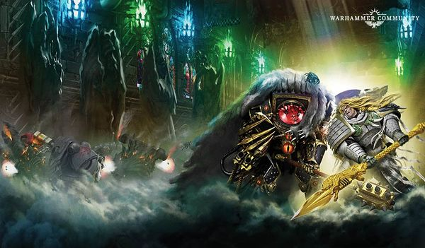

# 1173 鲁斯之矛 Spear of Russ

精校状态：中文行文已逐段精校，部分术语仍为暂定

分类：武器 / 近战武器

原文来源：https://www.bilibili.com/opus/1085993415796064272

原作者：帝国神选罐头

原文时间：编辑于 2025年08月18日 15:34

[返回分类目录](目录.md) · [全书目录](../../目录.md)

<!-- A1173-B0001 -->
**英文原文**

The Spear of Russ, known by the Emperor of Mankind as the Dionysian Spear and sometimes known as the Wolfspear or its hidden name Gungir, is a legendary artefact of the Space Wolves Chapter, which was wielded by their Primarch Leman Russ.

<!-- /A1173-B0001 -->

<!-- A1173-B0002 -->

原译文

鲁斯之矛，被人类帝皇称为酒神之矛，有时也被称为狼矛或其隐藏的名字冈格尼尔，是太空野狼战团的一件传奇造物，由他们的原体黎曼·鲁斯挥舞。

**校订译文**

鲁斯之矛是太空野狼战团的传奇遗物，曾由原体黎曼·鲁斯使用。人类帝皇称它为酒神之矛，它也被称为狼矛，另有一个隐秘名字——冈格尼尔。

**校注：** 开头写Gungir，末段写Gungnir，保留英文异拼，中文统一冈格尼尔。

<!-- /A1173-B0002 -->

<!-- A1173-B0003 图片 -->

<!-- A1173-B0004 -->

原译文

The Spear of Russ 鲁斯之矛

**校订译文**

The Spear of Russ 鲁斯之矛

<!-- /A1173-B0004 -->

<!-- A1173-B0005 -->
## History 历史

<!-- /A1173-B0005 -->

<!-- A1173-B0006 -->
**英文原文**

The Spear was forged by the Emperor himself during the Age of Strife inside His very first subterranean fortress and contains a portion of His power. The sister of the Apollonian Spear, the Dionysian Spear as it was originally known has the ability to "illuminate" those it pierces, revealing to them some aspect of truth.

<!-- /A1173-B0006 -->

<!-- A1173-B0007 -->

原译文

这把长矛是帝皇在纷争时代在他的第一个地下堡垒内锻造的，包含了他的一部分力量。日神之矛的姊妹，最初被称为酒神之矛，有能力“照亮”它刺穿的人，向他们揭示真理的某些方面。

**校订译文**

纷争时代，帝皇在自己的第一座地下堡垒中亲手铸造此矛，并将一部分力量灌注其中。它最初名为酒神之矛，与日神之矛是一对姊妹武器。它能“启迪”被刺中的人，向其揭示真相的某一面。

<!-- /A1173-B0007 -->

<!-- A1173-B0008 -->
**英文原文**

The weapon was later given to Russ on Seraphina, as a reward for the completion of the Wheel of Fire campaign, but he was made uneasy by the spear's presence and never took it with him into battle. He would often "lose" it on battlefields or "forget" it in conference chambers and he carried it only to please the Emperor. Despite his attempts to part with the weapon, it would always ultimately return to his side. While on Fenris, Russ saw a vision of himself that revealed the nature of the Spear and he pierced himself with it, revealing to him the truth regarding the nature of the Primarchs. Afterward, Russ became fonder of the weapon and used it in battle. Later, during the duel between Horus and Leman Russ at the Battle of Trisolian, Russ used the Spear to not only badly wound the Warmaster, but also restore a measure of his sanity and former glory, washing away much of the corruption that had come to plague him on Molech.

<!-- /A1173-B0008 -->

<!-- A1173-B0009 -->

原译文

后来，这把武器在塞拉芬纳被送给了鲁斯，作为完成火焰之轮战役的奖励，但长矛的存在让他感到不安，他从未将其带上战场。他经常在战场上“丢失”它，或者在会议室里“忘记”它，他携带它只是为了取悦帝皇。尽管他试图放弃武器，但它最终总是会回到他的身边。在芬里斯时，鲁斯看到了一个自己的幻象，揭示了长矛的本质，他用它刺穿了自己，向他揭示了关于原体本质的真相。后来，鲁斯更喜欢这件武器，并在战斗中使用了它。后来，在荷鲁斯和黎曼·鲁斯在特里索兰之战中的决斗中，鲁斯不仅用长矛重伤了战帅，还恢复了他的理智和昔日的荣耀，洗去了困扰他在摩洛的大部分腐化。

**校订译文**

火焰之轮战役结束后，帝皇在塞拉芬纳将此矛赐给鲁斯，以作嘉奖。鲁斯却因它的存在而感到不安，起初不愿带它作战；他时常把它“遗失”在战场上，或“忘记”在会议厅里，携带它也只是为了取悦帝皇。可无论他怎样设法摆脱它，长矛最终总会回到身边。在芬里斯，鲁斯见到了另一个自己的幻象，由此得知长矛的真正性质。他以矛刺向自己，看见了关于原体本质的真相。此后，鲁斯逐渐接受这件武器，并将其用于战斗。在特里索兰之战中，他与荷鲁斯决斗，以矛重创战帅，还使其一度恢复了部分理智与昔日光辉，洗去了许多在摩洛沾染的腐化。

**校注：** 英文先称never took it into battle，随后又说把它丢在战场上，存在表述张力；译文以起初不愿带它作战保留其抗拒态度，不据此另造时间线。

<!-- /A1173-B0009 -->

<!-- A1173-B0010 -->
**英文原文**

Later, on Yarant, the 13th Company seemed amused by the fact that the current Space Wolves view the relic with such awe. During the Battle of Yarant, during the Heresy, Russ gave the weapon to Bjorn.

<!-- /A1173-B0010 -->

<!-- A1173-B0011 -->

原译文

后来，在雅兰特上，第13连似乎被现在的太空野狼如此敬畏地看待这件遗物的事实逗乐了。在雅兰特之战，叛乱期间，鲁斯将武器交给了比约恩。

**校订译文**

后来在雅兰特，第十三连听闻如今的太空野狼如此敬畏这件遗物，似乎觉得颇为好笑。而在荷鲁斯之乱期间的雅兰特之战中，鲁斯曾将长矛交给比约恩。

**校注：** 英文将“如今”对遗物的态度与荷鲁斯之乱期间的赠矛相邻叙述，未明示前句年代，故不把二者强行合为同一次事件。

<!-- /A1173-B0011 -->

<!-- A1173-B0012 -->
**英文原文**

Later, sometime during the Great Scouring, the spear was snatched up by the Wolf Lord Garm and used to injure Magnus the Red, primarch of the Thousand Sons, when Leman Russ stumbled in battle against him, buying Russ the opportunity to drive off the traitor, albeit at the expense of Garm's own life. The Spear was stored for millennia in the Shrine of Russ on the planet Garm, named for the Wolf Lord who fell there. Prophecies of the Space Wolves state that when Leman Russ returns for the Wolf Time he will return to Garm to reclaim his weapon. The Spear was lost, however, when elements of the Thousand Sons, including the sorcerer Madox, stole it for use in a ritual to bring their primarch through to the material world from the warp. The Great Company of Wolf Lord Berek Thunderfist was able to interrupt the ritual, when (then Blood Claw) Ragnar Blackmane seized up the Spear of Russ and hurled it through the warp portal, stabbing the eye of Magnus. This stopped the ritual and closed the portal, but at the cost of losing the Spear of Russ in the warp.

<!-- /A1173-B0012 -->

<!-- A1173-B0013 -->

原译文

后来，在大清洗期间的某个时候，长矛被狼主加姆取走，用来伤害千子之主赤红之马格努斯，当时黎曼·鲁斯在与他蹒跚的作战，为鲁斯提供了赶走叛徒的机会，尽管以加姆自己的生命为代价。长矛在加姆行星上的鲁斯神殿中存放了数千年，以牺牲在那里的狼主命名。太空野狼的预言说，当黎曼·鲁斯在狼之时刻回来时，他将回到加姆取回他的武器。然而，当包括巫师马多克斯在内的千子的成员偷走长矛，用于将他们的原体从亚空间带到物质世界的仪式时，长矛丢失了。当（当时是血爪）拉格纳·黑鬃抓住鲁斯之矛并将其穿过亚空间传送门，刺伤马格努斯的眼睛时，狼主贝雷克·雷拳的大连能够打断仪式。这停止了仪式并关闭了大门，但代价是失去了亚空间中的鲁斯之矛。

**校订译文**

大清洗期间，黎曼·鲁斯与千子原体红魔马格努斯交战，一度失利。狼主加姆夺过长矛，刺伤马格努斯，为鲁斯争取到击退叛徒的机会，却付出了自己的生命。此后，这颗星球以牺牲于此的狼主命名为加姆，长矛则在当地的鲁斯神殿中供奉了数千年。太空野狼的预言说，黎曼·鲁斯将在狼之时刻归来，回到加姆取回武器。然而，包括巫师马多克斯在内的一伙千子偷走了长矛，企图以仪式将原体从亚空间召入物质世界。狼主贝雷克·雷拳的大连打断了仪式：当时仍是血爪的拉格纳·黑鬃夺起鲁斯之矛，将其掷过亚空间传送门，刺中马格努斯的眼睛。仪式随之中止，传送门关闭，但鲁斯之矛也就此遗失在亚空间中。

<!-- /A1173-B0013 -->

<!-- A1173-B0014 -->
**英文原文**

The spear was later used by Madox in a ritual that would cause all Space Wolves to succumb to the curse of the Wulfen, destroying the chapter and critically weakening the Imperium. Ragnar and several other Space Wolves made their way to the warp duplicate of the planet Charys in the Eye of Terror and, with assistance from elements of the Thirteenth Great Company, stopped the ritual before the damage was irreversible. With the help of Rune Priest Torvald the Reaver and Navigator Gabriella Belisarius, Ragnar and the survivors returned to Charys and the Spear was returned to Garm.

<!-- /A1173-B0014 -->

<!-- A1173-B0015 -->

原译文

后来，马多克斯在一场仪式中使用了长矛，这场仪式导致所有太空野狼屈服于狼人诅咒，正在摧毁这一战团，并严重削弱了帝国。拉格纳和其他几位太空野狼前往恐惧之眼中的查里斯行星的亚空间复制体，并在第十三大连成员的协助下，在损坏不可逆转之前停止了仪式。在符文牧师掠夺者托瓦德和导航者加布里埃拉·贝利撒留的帮助下，拉格纳和幸存者回到了查里斯，长矛也回到了加姆。

**校订译文**

后来，马多克斯又用此矛举行仪式，企图令所有太空野狼都屈服于狼人的诅咒，借此毁灭战团、重创帝国。拉格纳与数名同袍进入恐惧之眼，抵达查瑞斯行星在亚空间中的镜像，并在第十三大连部分成员的帮助下，赶在损害无法挽回之前阻止了仪式。借助符文牧师“掠夺者”托瓦德与导航员加布里埃拉·贝利撒留的力量，拉格纳和幸存者返回查瑞斯，长矛也被送回加姆。

**校注：** would cause说明仪式拟造成的结果，原译写成已经摧毁战团、削弱帝国，误将未遂后果当作既成事实。

<!-- /A1173-B0015 -->

<!-- A1173-B0016 -->
**英文原文**

Later, during the Siege of the Fenris System, the Spear was taken up by Egil Iron Wolf and used once again against Magnus.

<!-- /A1173-B0016 -->

<!-- A1173-B0017 -->

原译文

后来，在芬里斯星系围城中，长矛被埃吉尔·铁狼拿起，再次用于对抗马格努斯。

**校订译文**

芬里斯星系围攻战期间，埃吉尔·铁狼再次执起这支长矛，用它对抗马格努斯。

<!-- /A1173-B0017 -->

<!-- A1173-B0018 -->
**英文原文**

According to the mythology of some of Fenris's tribes, as told by their Gothi, the Spear of Russ was given to Leman Russ by the Emperor. These tales also claim that, though the primarch did not favor the Spear, it served him well and contained many powers, among them that lightning would appear in Fenris's skies whenever Russ threw it and that its touch taught the truth of a man to himself.

<!-- /A1173-B0018 -->

<!-- A1173-B0019 -->

原译文

根据芬里斯部落的一些神话，正如他们的神官所说，鲁斯之矛是帝皇送给黎曼·鲁斯的。这些故事还声称，尽管原体不喜欢长矛，但它对他很有帮助，并且包含了许多力量，其中包括每当鲁斯投掷长矛时，闪电就会出现在芬里斯的天空中，它的接触教会了一个人有关自己的真理。

**校订译文**

据一些芬里斯部落的神官传述，鲁斯之矛是帝皇赐给黎曼·鲁斯的礼物。神话还说，虽然原体并不喜爱它，它却忠实效劳，蕴含多种力量：鲁斯每次掷出长矛，芬里斯天空都会闪过雷电；被矛触及的人，则会看清关于自身的真相。

<!-- /A1173-B0019 -->

<!-- A1173-B0020 -->
## Trivia 琐事

<!-- /A1173-B0020 -->

<!-- A1173-B0021 -->
**英文原文**

The Spear of Russ, also known as Gungnir, shares a name with the mythical Gungnir, the spear of Odin. Like Gungnir, the Spear of Russ will always return to the hand of its wielder. Also, Odin pierced himself with Gungnir much like Russ did, to reveal a secret.

<!-- /A1173-B0021 -->

<!-- A1173-B0022 -->

原译文

鲁斯之矛，也被称为冈格尼尔，与神话中的冈格尼尔（奥丁之矛）同名。与冈格尼尔一样，鲁斯之矛也将永远回到使用者手中。此外，奥丁像鲁斯一样用冈格尼尔刺穿了自己，揭露了一个秘密。

**校订译文**

鲁斯之矛的另一名字冈格尼尔，与神话中奥丁的长矛同名。和神话里的冈格尼尔一样，它总会返回持有者手中。奥丁也曾如鲁斯一样，以矛刺伤自己，以求获知隐秘。

<!-- /A1173-B0022 -->

本篇核心术语与暂定项

以下列出本篇出现的英文原形及核心术语表用词。同形词可能指不同对象，具体词义以本篇正文和校注为准；单复数、别名和仅见于图注的名称可能尚未列入。完整候选见[术语表](../../术语表/双语术语候选.csv)。

| 英文 | 采用中文 | 状态 |
| --- | --- | --- |
| Space Wolves | 太空野狼 | 官方已核对 |
| Thousand Sons | 千子 | 官方已核对 |
| Navigator | 导航员 | 官方已核对 |
| Warp | 亚空间 | 官方已核对 |
| Imperium | 帝国 | 暂定·简称 |
| Sorcerer | 巫师 | 官方已核对 |
| Eye of Terror | 恐惧之眼 | 官方已核对 |
| Emperor of Mankind | 人类帝皇 | 暂定 |
| Emperor | 帝皇 | 官方已核对 |
| Primarch | 原体 | 官方已核对 |
| Age of Strife | 纷争时代 | 暂定·官方待核 |
| Horus | 荷鲁斯 | 暂定·官方待核 |
| Magnus the Red | 红魔马格努斯 | 官方已核对 |
| Fenris | 芬里斯 | 暂定·官方待核 |
| Molech | 摩洛 | 暂定·官方待核 |
| The Primarchs | 原体 | 暂定·官方待核 |
| Chapter | 战团 | 暂定·官方待核 |
| Ragnar Blackmane | 拉格纳·黑鬃 | 官方已核 |
| Wolfspear | 狼矛 | 暂定·官方待核 |
| Powers | 能天使 | 暂定·官方待核 |
| Wulfen | 狼人 | 官方已核对 |
| Great Scouring | 大清洗 | 暂定·官方待核 |
| Madox | 马多克斯 | 暂定·官方待核 |
| The Weapon | 武器 | 暂定·官方待核 |
| Berek Thunderfist | 贝雷克·雷拳 | 暂定·官方待核 |
| Apollonian Spear | 日神之矛 | 暂定·官方待核 |
| Charys | 查瑞斯 | 暂定·官方待核 |
| Trisolian | 特里索兰 | 暂定·官方待核 |
| System | 星系（恒星系统） | 暂定·官方待核 |
| Corruption | 腐败 | 暂定·官方待核 |
| Dionysian Spear | 酒神之矛 | 暂定·官方待核 |
| Spear of Russ | 鲁斯之矛 | 暂定·官方待核 |
| Gungnir | 冈格尼尔 | 暂定·官方待核 |
| Gungir | 冈格尼尔 | 暂定·官方待核 |
| Seraphina | 塞拉芬纳 | 暂定·官方待核 |
| Wheel of Fire campaign | 火焰之轮战役 | 暂定·官方待核 |
| Battle of Trisolian | 特里索兰之战 | 暂定·官方待核 |
| Shrine of Russ | 鲁斯神殿 | 暂定·官方待核 |
| Torvald the Reaver | 掠夺者托瓦德 | 暂定·官方待核 |
| Gabriella Belisarius | 加布里埃拉·贝利撒留 | 暂定·官方待核 |
| Egil Iron Wolf | 埃吉尔·铁狼 | 暂定·官方待核 |
| Gothi | 神官 | 暂定·官方待核 |
| claw | 利爪分队 | 暂定·官方待核 |

