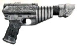

# 1175 考古科技手枪 Archaeotech Pistol

精校状态：中文行文已逐段精校，部分术语仍为暂定

分类：武器 / 远程武器

原文来源：https://www.bilibili.com/opus/1009530516779565057

原作者：帝国神选罐头

原文时间：2024年12月11日 11:34

[返回分类目录](目录.md) · [全书目录](../../目录.md)

<!-- A1175-B0001 -->
**英文原文**

The Archaeotech Pistols are ancient sidearms dating back to the Dark Age of Technology. This classification of pistol can be found firing a variety of projectiles, be they micro-atomic munitions or searing kill-rays that draw power from a planet's magnetosphere. Archaeotech Pistols were often the sidearms to high-ranking Imperial and Space Marine commanders during the Great Crusade and Horus Heresy.

<!-- /A1175-B0001 -->

<!-- A1175-B0002 -->

原译文

考古科技手枪是一种古老的手枪，可以追溯到黑暗技术时代。这种分类的手枪可以发射各种弹丸，无论是微原子弹还是从行星辐射层获取能量的灼热杀伤射线。在大远征和荷鲁斯叛乱期间，考古技术手枪经常是帝国和星际战士高级指挥官的随身武器。

**校订译文**

考古科技手枪是源自黑暗科技时代的古老随身武器。这个类别包含多种攻击方式，既可能发射微型原子弹药，也可能从行星磁层汲取能量，射出灼热的致命光束。在大远征与荷鲁斯之乱期间，帝国军队和星际战士的高级指挥官经常将这类手枪作为随身副武器。

**校注：** magnetosphere为磁层，不是辐射层；英文以projectiles统称弹药和射线，中文按后文具体形式概括为攻击方式。

<!-- /A1175-B0002 -->

<!-- A1175-B0003 图片 -->

<!-- A1175-B0004 -->

原译文

Archaeotech Laspistol 考古科技激光手枪

**校订译文**

Archaeotech Laspistol 考古科技激光手枪

<!-- /A1175-B0004 -->

本篇核心术语与暂定项

以下列出本篇出现的英文原形及核心术语表用词。同形词可能指不同对象，具体词义以本篇正文和校注为准；单复数、别名和仅见于图注的名称可能尚未列入。完整候选见[术语表](../../术语表/双语术语候选.csv)。

| 英文 | 采用中文 | 状态 |
| --- | --- | --- |
| Horus Heresy | 荷鲁斯之乱 | 官方已核对 |
| Dark Age of Technology | 黑暗科技时代 | 暂定 |
| Great Crusade | 大远征 | 暂定·官方待核 |
| Horus | 荷鲁斯 | 暂定·官方待核 |
| Ancient | 旗手 | 官方已核对 |
| Space Marine | 星际战士 | 暂定·官方待核 |
| The Dark | 《黑暗》 | 暂定·官方待核 |

