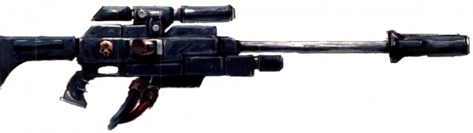
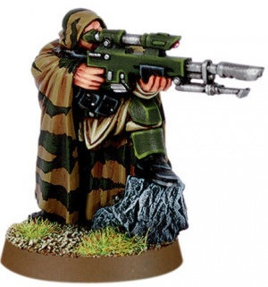
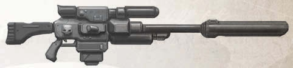
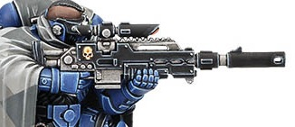
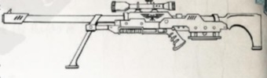

# 1176 狙击步枪 Sniper rifle

精校状态：中文行文已逐段精校，部分术语仍为暂定

分类：武器 / 远程武器

原文来源：https://www.bilibili.com/opus/999550013491118080

原作者：帝国神选罐头

原文时间：2024年11月14日 14:04

[返回分类目录](目录.md) · [全书目录](../../目录.md)

<!-- A1176-B0001 -->
**英文原文**

Sniper rifles are long-ranged and highly accurate rifles, mainly used for assassination. Small groups of snipers, and even lone snipers, can hold back the advance of an enemy force many times their number, pinning them in cover. Both Imperial and Eldar forces use sniper rifles to great effect.

<!-- /A1176-B0001 -->

<!-- A1176-B0002 -->

原译文

狙击步枪是一种远程、高精度的步枪，主要用于暗杀。一小群狙击手，甚至是独自的狙击手，可以阻挡数倍于他们的敌军的前进，将他们困在掩体中。帝国和灵族部队都使用狙击步枪，效果很好。

**校订译文**

狙击步枪射程远、精度高，主要用于刺杀。少量狙击手，甚至单独一人，就能将数量数倍于己的敌军压制在掩体中，阻滞其推进。帝国和灵族都善于发挥这类武器的效能。

<!-- /A1176-B0002 -->

<!-- A1176-B0003 -->
## Imperial types 帝国类型

<!-- /A1176-B0003 -->

<!-- A1176-B0004 -->
**英文原文**

Many forms of sniper rifles are longer ranged and high-accuracy variations of existing firearm types. The least advanced sniper rifles use solid bullets, but some lasguns are lengthened to allow them to be used in a sniper role.

<!-- /A1176-B0004 -->

<!-- A1176-B0005 -->

原译文

许多形式的狙击步枪是现有枪支类型的远程和高精度变体。最落后的狙击步枪使用实弹，但一些激光枪被加长，以便用于狙击手的角色。

**校订译文**

许多狙击步枪都由现有枪械改进而成，以获得更远的射程和更高的精度。技术最简单的型号发射实弹；另一些则通过加长激光枪，满足狙击需要。

<!-- /A1176-B0005 -->

<!-- A1176-B0006 -->
**英文原文**

There are several differences between solid-slug rifles and energy based rifles. Because a laser bolt travels much faster than a solid slug, a Long-Las is an instant hit weapon and therefore offers pinpoint accuracy; the major disadvantage of using a long-las is that the beam reveals the sniper's position when fired, while a solid-slug rifle offers better concealment if equipped with a noise suppressor.

<!-- /A1176-B0006 -->

<!-- A1176-B0007 -->

原译文

实弹步枪和基于能量的步枪之间有几个区别。由于激光的行进速度远快于固体弹头，激光长枪是一种即时命中武器，因此具有精确的定位精度；使用激光长枪的主要缺点是，发射时光束会显示狙击手的位置，而如果配备降噪器，实弹步枪可以提供更好的隐蔽性。

**校订译文**

实弹步枪与能量步枪各有特点。激光的传播速度远超实弹，因此激光长枪几乎能在开火瞬间命中目标，精度极高。不过，它射出的光束会暴露狙击手的位置；相比之下，加装消声器的实弹步枪更便于隐蔽。

<!-- /A1176-B0007 -->

<!-- A1176-B0008 -->
**英文原文**

Most weapons have specialist sights added on to enable them to pick out specific targets such as officers.

<!-- /A1176-B0008 -->

<!-- A1176-B0009 -->

原译文

大多数武器都添加了专业瞄准镜，使其能够识别出特定的目标，如军官。

**校订译文**

这类武器大多加装专用瞄准镜，以便辨认并瞄准军官等特定目标。

<!-- /A1176-B0009 -->

<!-- A1176-B0010 -->
### Space Marine Sniper Rifle 星际战士狙击步枪

<!-- /A1176-B0010 -->

<!-- A1176-B0011 -->
**英文原文**

Space Marine Chapters, particularly Scouts, utilize a unique model of Sniper Rifle. A Space Marine-pattern Sniper Rifle fires a solid shell and boasts powerful telescopic sights that allows the wielder to fire at an enemy weak points and distant foes with extreme accuracy. Primaris Scouts in the Dark Angels Chapter are armed with Mark III Shrike-pattern sniper rifles.

<!-- /A1176-B0011 -->

<!-- A1176-B0012 -->

原译文

星际战士战团，特别是侦察兵，使用了一种独特的狙击步枪。星际战士型狙击步枪发射实弹，并拥有强大的望远瞄准镜，使使用者能够以极高的精度向敌人的弱点和远处的敌人开火。黑暗天使战团的原铸侦察兵装备有Mark III伯劳鸟型狙击步枪。

**校订译文**

星际战士战团，尤其是侦察兵，使用一种独特的狙击步枪。星际战士型狙击步枪发射实弹，配有高性能望远瞄准镜，让使用者能够精准攻击敌人弱点或远处目标。黑暗天使战团的原铸侦察兵装备 Mk.III 伯劳鸟型狙击步枪。

<!-- /A1176-B0012 -->

<!-- A1176-B0013 图片 -->

<!-- A1176-B0014 -->

原译文

Space Marine Sniper Rifle 星际战士狙击步枪

**校订译文**

Space Marine Sniper Rifle 星际战士狙击步枪

<!-- /A1176-B0014 -->

<!-- A1176-B0015 -->
### Long-las 激光长枪

<!-- /A1176-B0015 -->

<!-- A1176-B0016 -->
**英文原文**

The long-las variant of the standard lasgun is a very potent weapon. Using highly charged power packs called "Hot Shots" they can take the head off an enemy with one well-placed shot.

<!-- /A1176-B0016 -->

<!-- A1176-B0017 -->

原译文

标准激光枪的激光长枪变体是一种非常强大的武器。使用被称为“热射”的高电荷能量弹夹，它们可以通过一次位置恰当的射击将敌人的头切下来。

**校订译文**

激光长枪是标准激光枪的一种强力改型，采用称为“热射”的高充能电池组，精准的一枪便足以轰掉敌人的头颅。

<!-- /A1176-B0017 -->

<!-- A1176-B0018 图片 -->

<!-- A1176-B0019 -->

原译文

A Cadian Shock Trooper equipped with a Long-las 一位装备激光长枪的卡迪亚突击队

**校订译文**

A Cadian Shock Trooper equipped with a Long-las 一名装备激光长枪的卡迪亚突击军士兵

<!-- /A1176-B0019 -->

<!-- A1176-B0020 -->
### Needle Sniper Rifle 针刺狙击步枪

<!-- /A1176-B0020 -->

<!-- A1176-B0021 -->
**英文原文**

Needle sniper rifles (or Needlers) are used by some sniper and assassin units of the Imperium. Needlers fire a needle of crystallized toxin, propelled by a form of laser technology that is invisible and flashless, allowing the weapon to be used without giving away the sniper's position. The beam which propels the sliver gives the Needler unerring accuracy, driving the toxin to its target. The secondary function of the beam is to pierce any existing armour and provide an opening for the sliver to penetrate.

<!-- /A1176-B0021 -->

<!-- A1176-B0022 -->

原译文

帝国的一些狙击手和刺客部队使用针刺狙击步枪。针刺狙击步枪发射一根结晶毒素针，由一种隐形、无焰的激光技术推动，使武器在使用时不会暴露狙击手的位置。推动针刺的光束使针头精确无误，将毒素驱向目标。光束的次要功能是穿透任何现有的装甲，并为针刺提供一个穿透的开口。

**校订译文**

帝国的一些狙击与刺客单位使用针刺狙击步枪，也简称针刺枪。武器以不可见、无闪光的激光技术推动结晶毒针，使射手不易暴露位置。推进光束确保毒针准确命中，还能预先穿开装甲，为细针进入目标开辟通道。

**校注：** 本段称光束可穿开装甲，下文又指出穿甲能力较差；译文保留两层表述，不夸大为可以穿透任何厚度的装甲。

<!-- /A1176-B0022 -->

<!-- A1176-B0023 -->
**英文原文**

Needlers are silent and the sliver itself is so fine that it is not felt even if it penetrates flesh. The crystallized toxin dissolves almost immediately after penetration. The toxin is extremely fast-acting, taking effect in a matter of a few seconds.

<!-- /A1176-B0023 -->

<!-- A1176-B0024 -->

原译文

针刺狙击步枪是寂静的，针刺本身很细，即使它穿透了血肉，也感觉不到。结晶毒素在穿透后几乎立即溶解。这种毒素反应非常快，几秒钟内就会生效。

**校订译文**

针刺枪射击无声，毒针细得即使穿入血肉，受害者也难以察觉。结晶毒素进入体内后几乎立刻溶解，数秒之内便会生效。

<!-- /A1176-B0024 -->

<!-- A1176-B0025 -->
**英文原文**

Various types of toxins can be employed by the Needler, the most common three being lethal neuro-toxins, sedatives which induce temporary coma, and intoxicants which stupefies the victim, putting him in a completely passive state.

<!-- /A1176-B0025 -->

<!-- A1176-B0026 -->

原译文

针刺狙击步枪可以使用各种类型的毒素，最常见的三种是致命的神经毒素、引起暂时昏迷的镇静剂和使受害者昏迷的麻醉剂，使其处于完全被动的状态。

**校订译文**

针刺枪可使用多种药剂，最常见的三类包括致命神经毒素、使目标暂时昏迷的镇静剂，以及令人神志迟钝、完全丧失反抗能力的致醉剂。

<!-- /A1176-B0026 -->

<!-- A1176-B0027 -->
**英文原文**

The needler's main drawback is its poor armour penetration.

<!-- /A1176-B0027 -->

<!-- A1176-B0028 -->

原译文

针刺狙击步枪的主要缺点是装甲穿透力差。

**校订译文**

针刺狙击步枪的主要缺点是装甲穿透力差。

<!-- /A1176-B0028 -->

<!-- A1176-B0029 -->
### Exitus Rifle 绝灭步枪

<!-- /A1176-B0029 -->

<!-- A1176-B0030 -->
**英文原文**

High-powered customized sniper rifles are the characteristic weapon of Vindicare Temple assassins, and are feared by troops for their ability to take down even the most heavily armoured infantry with a single shot. Vindicare sniper rifles can make use of anti-tank rounds to penetrate otherwise impenetrable armour.

<!-- /A1176-B0030 -->

<!-- A1176-B0031 -->

原译文

高功率定制狙击步枪是文迪卡圣殿刺客的特色武器，被部队所恐惧，因为它们能够用一枪击倒即使是最重装甲的步兵。文迪卡狙击步枪可以利用反坦克弹药穿透原本无法穿透的装甲。

**校订译文**

高威力定制狙击步枪是文迪卡神庙刺客的标志性武器，甚至能一枪击倒最重装甲的步兵，令军人闻之胆寒。文迪卡狙击步枪还可使用反坦克弹药，贯穿通常难以击穿的装甲。

<!-- /A1176-B0031 -->

<!-- A1176-B0032 -->

原译文

"Ultra" Pattern Mk. IX Sniper Rifle “极限”型Mk.IX狙击步枪

**校订译文**

"Ultra" Pattern Mk. IX Sniper Rifle “极限”型Mk.IX狙击步枪

<!-- /A1176-B0032 -->

<!-- A1176-B0033 -->
**英文原文**

The Mark IX Sniper rifle is a heavy Needler sniper rifle used by the Deathwatch chapter of the Space Marines for long-range anti-personnel and anti-materiel work.

<!-- /A1176-B0033 -->

<!-- A1176-B0034 -->

原译文

Mark IX狙击步枪是一种重型针刺狙击步枪，由星际战士的死亡守望战团用于远程杀伤人员和反物资工作。

**校订译文**

Mk.IX 狙击步枪是一种重型针刺狙击步枪，供星际战士死亡守望战团执行远距离反人员与反器材任务。

<!-- /A1176-B0034 -->

<!-- A1176-B0035 图片 -->

<!-- A1176-B0036 -->

原译文

Mark IX Sniper rifle Mk.IX狙击步枪

**校订译文**

Mark IX Sniper rifle Mk.IX狙击步枪

<!-- /A1176-B0036 -->

<!-- A1176-B0037 -->
**英文原文**

At just over two metres in length and weighing close to fifty kilograms, the Mark IX allows a Deathwatch sharpshooter to engage targets with incredible accuracy at very long ranges.

<!-- /A1176-B0037 -->

<!-- A1176-B0038 -->

原译文

Mark IX的长度略超过两米，重量接近五十公斤，使死亡守望神枪手能够在很长的距离内以令人难以置信的精度与目标交战。

**校订译文**

Mk.IX 枪长略超两米，重量接近五十千克，能让死亡守望神枪手在极远距离精准打击目标。

<!-- /A1176-B0038 -->

<!-- A1176-B0039 -->
**英文原文**

A highly-respected and revered weapon, it is often selected as the weapon of choice for Space Marine snipers in many Deathwatch Kill-teams. Each Mk. IX has the following integral systems:

<!-- /A1176-B0039 -->

<!-- A1176-B0040 -->

原译文

这是一种备受尊敬和崇敬的武器，它经常被选为许多死亡守望杀戮小队中星际战士狙击手的首选武器。每把Mk.IX都有以下完整系统：

**校订译文**

这类武器备受尊崇，是许多死亡守望杀戮小队狙击手的首选。每支 Mk.IX 都内置下列系统：

<!-- /A1176-B0040 -->

<!-- A1176-B0041 -->
**英文原文**

Tailor Made: Each Mk. IX is tailored to fit the Battle Brother to whom it has been issued. The weapon’s stock and hand guard are matched to the user's size and shooting stance, making carrying, pointing, and shooting the sniper rifle as easy and natural as pointing a finger. While this increases the sniper rifle’s accuracy, the custom furniture makes it uncomfortable and nearly impossible for anyone else to use it without serious modification. Each Mk. IX is also fitted with a special security system programmed with the owner’s genetic code. This system, composed of a sensor pad in the weapon’s stock, makes contact with a matching pad in the palm of the glove worn on the Space Marine's shooting hand. The Space Marine's genetic data is then transferred to the weapon’s cogitator and analysed. If the cogitator array senses the owner, the sniper rifle operates as normal. If anyone else attempts to use the weapon, the cogitator will disable the firing mechanism. This renders the sniper rifle unusable until the true owner picks it up again.

<!-- /A1176-B0041 -->

<!-- A1176-B0042 -->

原译文

量身定制：每把Mk.IX都是为其所属的战斗兄弟量身定制的。该武器的枪托和护手与使用者的尺寸和射击姿势相匹配，使携带、瞄准和射击狙击步枪像用手指一样简单自然。虽然这提高了狙击步枪的精度，但定制的设备让人感到不舒服，如果不进行认真的修改，其他人几乎不可能使用它。每把Mk.IX还配备了一个特殊的安全系统，该系统根据使用者的遗传密码进行了编程。该系统由武器枪托中的传感护垫组成，与星际战士射手戴的手套中的匹配护垫接触。然后，星际战士的基因数据被传输到武器的沉思者并进行分析。如果沉思者阵列感应到拥有者，狙击步枪就会正常工作。如果其他人试图使用该武器，沉思者将禁用射击机制。这使得狙击步枪无法使用，直到真正的主人再次拿起它。

**校订译文**

量身定制：每支 Mk.IX 都专为获配该枪的战斗兄弟制造。枪托与护木按使用者的体格及射姿调整，让携行、指向和射击如伸指一般自然。这能提高精度，却也使其他人用起来极不顺手，不经大幅改装几乎无法使用。武器还配有录入主人基因编码的安保系统：枪托上的感应垫与射击手套掌心的配套感应垫接触后，将星际战士的基因数据传给枪内沉思者进行分析。身份吻合时，枪械正常工作；换作他人，沉思者便会锁闭击发机构，直到真正的主人重新拿起它。

<!-- /A1176-B0042 -->

<!-- A1176-B0043 -->
**英文原文**

30x Scope: This powerful telescopic sight allows the sharpshooter to engage enemies at extremely long range.

<!-- /A1176-B0043 -->

<!-- A1176-B0044 -->

原译文

30倍瞄准镜：这种强大的望远镜瞄准镜使神枪手能够在极远距离与敌人交战。

**校订译文**

30 倍瞄准镜：高倍率望远瞄具使神枪手能够在极远距离打击敌人。

<!-- /A1176-B0044 -->

<!-- A1176-B0045 -->
**英文原文**

Suppressor: This combination silencer and flash concealer reduces both muzzle flash and the signature report of a needle weapon.

<!-- /A1176-B0045 -->

<!-- A1176-B0046 -->

原译文

抑制器：这种消音器和消焰器的组合可以减少枪口火焰和针刺武器的发射特征。

**校订译文**

抑制器：兼具消声与消焰功能，降低枪口闪光和针刺武器特有的发射声响。

<!-- /A1176-B0046 -->

<!-- A1176-B0047 -->
**英文原文**

Highly Accurate: With its long barrel, integral recoil compensators, and under-barrel bipod, the Mk. IX is an incredibly accurate and well-balanced weapon and its turbo-chem needle ammunition means that the weapon is toxic as well.

<!-- /A1176-B0047 -->

<!-- A1176-B0048 -->

原译文

高度精确：凭借其长枪管、整体式后坐力补偿器和枪管下双脚架，Mk.IX是一种极其精确和平衡的武器，其涡轮化学针刺意味着该武器也是有毒的。

**校订译文**

高度精确：长枪管、内置后坐力补偿器与枪管下方的两脚架，使 Mk.IX 兼具极高精度和良好平衡性；它使用的涡轮化学针刺弹药还带有毒性。

**校注：** turbo-chem为底稿武器弹药描述，暂沿涡轮化学，不擅自补充现实弹药配方或结构。

<!-- /A1176-B0048 -->

<!-- A1176-B0049 -->

原译文

Mk.III Shrike Pattern Bolt Sniper Rifle Mk.III伯劳鸟型爆矢狙击步枪

**校订译文**

Mk.III Shrike Pattern Bolt Sniper Rifle Mk.III伯劳鸟型爆矢狙击步枪

<!-- /A1176-B0049 -->

<!-- A1176-B0050 -->
**英文原文**

Mk.III Shrike Sniper Rifles are Bolt Weapons utilized by Vanguard Eliminators.

<!-- /A1176-B0050 -->

<!-- A1176-B0051 -->

原译文

Mk.III伯劳鸟狙击步枪是先锋歼灭者使用的爆矢武器。

**校订译文**

Mk.III伯劳鸟狙击步枪是先锋歼灭者使用的爆矢武器。

<!-- /A1176-B0051 -->

<!-- A1176-B0052 图片 -->

<!-- A1176-B0053 -->

原译文

Shrike Sniper Rifle 伯劳鸟狙击步枪

**校订译文**

Shrike Sniper Rifle 伯劳鸟狙击步枪

<!-- /A1176-B0053 -->

<!-- A1176-B0054 -->
### Hellshot 地狱射击枪

<!-- /A1176-B0054 -->

<!-- A1176-B0055 -->
**英文原文**

A large calibre anti-materiel sniper rifle with a bipod that uses the same ammunition as the autocannon meant for knocking out enemy equipment, suppressing light vehicles, and eliminating enemy combatants in a single hit.

<!-- /A1176-B0055 -->

<!-- A1176-B0056 -->

原译文

一种大口径反器材狙击步枪，带有双脚架，使用与自动炮相同的弹药，用于在一次打击中摧毁敌方装备、压制轻型车辆和消灭敌方战斗人员。

**校订译文**

配有两脚架的大口径反器材狙击步枪，使用与自动炮相同的弹药，可摧毁敌方装备、压制轻型载具，或一击毙杀敌方战斗人员。

<!-- /A1176-B0056 -->

<!-- A1176-B0057 -->
### Las Fusil 激光狙击枪

<!-- /A1176-B0057 -->

<!-- A1176-B0058 -->
**英文原文**

Las Fusils are long-range laser sniper weapons used by Space Marine Eliminators.

<!-- /A1176-B0058 -->

<!-- A1176-B0059 -->

原译文

激光狙击枪是星际战士歼灭者使用的远程激光狙击武器。

**校订译文**

激光狙击枪是星际战士歼灭者使用的远程激光狙击武器。

<!-- /A1176-B0059 -->

<!-- A1176-B0060 -->
### Hotshot Marskman Rifle 热射射手步枪

**校注：** 英文标题Marskman疑为Marksman误拼；原文保留，中文按射手理解。

<!-- /A1176-B0060 -->

<!-- A1176-B0061 -->
**英文原文**

Used by elite Imperial Guard units such as Kasrkin.

<!-- /A1176-B0061 -->

<!-- A1176-B0062 -->

原译文

由卡舍津等精英帝国卫队部队使用。

**校订译文**

由卡舍津等精英帝国卫队部队使用。

<!-- /A1176-B0062 -->

<!-- A1176-B0063 -->
### Absolution Sniper Rifle 赦免者狙击步枪

<!-- /A1176-B0063 -->

<!-- A1176-B0064 -->
**英文原文**

The Absolution Sniper Rifle is a common sniper rifle design used among non-military groups. Less advanced than the Needle Rifle, it still sported enough power to take down lightly armored targets.

<!-- /A1176-B0064 -->

<!-- A1176-B0065 -->

原译文

赦免者狙击步枪是非军事团体中常用的狙击步枪设计。虽然不如针刺步枪先进，但它仍然有足够的力量击毁轻装甲目标。

**校订译文**

赦免者狙击步枪是一种常见于非军事组织的枪械设计。虽然技术不及针刺步枪先进，却仍足以击倒轻装甲目标。

<!-- /A1176-B0065 -->

<!-- A1176-B0066 图片 -->

<!-- A1176-B0067 -->

原译文

Absolution Sniper Rifle 赦免者狙击步枪

**校订译文**

Absolution Sniper Rifle 赦免者狙击步枪

<!-- /A1176-B0067 -->

本篇核心术语与暂定项

以下列出本篇出现的英文原形及核心术语表用词。同形词可能指不同对象，具体词义以本篇正文和校注为准；单复数、别名和仅见于图注的名称可能尚未列入。完整候选见[术语表](../../术语表/双语术语候选.csv)。

| 英文 | 采用中文 | 状态 |
| --- | --- | --- |
| Space Marines | 星际战士 | 官方已核对 |
| Dark Angels | 黑暗天使 | 官方已核对 |
| Deathwatch | 死亡守望 | 官方已核对 |
| Imperial Guard | 帝国卫队 | 暂定·语境区分 |
| Eldar | 灵族 | 暂定·语境区分 |
| Imperium | 帝国 | 暂定·简称 |
| Equipment | 装备 | 编辑用语已统一 |
| Kasrkin | 卡舍津 | 官方已核对 |
| Vanguard Eliminators | 先锋歼灭者 | 暂定·官方待核 |
| Vindicare Temple assassins | 文迪卡神庙刺客 | 暂定·官方待核 |
| Sniper rifle | 狙击步枪 | 暂定·官方待核 |
| Absolution Sniper Rifle | 赦免者狙击步枪 | 暂定·官方待核 |
| Space Marine | 星际战士 | 暂定·官方待核 |
| Chapter | 战团 | 暂定·官方待核 |
| Brother | 修士 | 暂定·官方待核 |
| Vanguard | 先锋 | 暂定·官方待核 |
| Suppressor | 压制者 | 暂定·官方待核 |
| Battle Brother | 战斗兄弟 | 暂定·官方待核 |
| The Weapon | 武器 | 暂定·官方待核 |
| The Dark | 《黑暗》 | 暂定·官方待核 |
| System | 星系（恒星系统） | 暂定·官方待核 |
| Bullets | 子弹 | 暂定·官方待核 |
| Long-las | 激光长枪 | 暂定·官方待核 |
| Needler | 针刺枪 | 暂定·官方待核 |
| Mark IX Sniper Rifle | Mk.IX 狙击步枪 | 暂定·官方待核 |
| Needle Rifle | 针刺步枪 | 暂定·官方待核 |
| Autocannon | 自动炮 | 暂定·官方待核 |
| Bolt | 爆矢 | 暂定·官方待核 |

