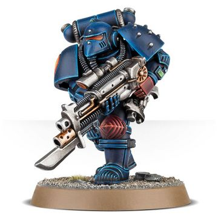

# 1180 分解武器 Disintegration Weapon

精校状态：中文行文已逐段精校，部分术语仍为暂定

分类：武器 / 远程武器

原文来源：https://www.bilibili.com/opus/1008791284189495328

原作者：帝国神选罐头

原文时间：2024年12月09日 11:45

[返回分类目录](目录.md) · [全书目录](../../目录.md)

<!-- A1180-B0001 -->
**英文原文**

Disintegration Weapons are a type of Human Archaeotech. Relics from the Dark Age of Technology, these weapons can reduce a target to atoms in the blink of an eye. Though highly dangerous, few remain in Imperial use and the ones that do are revered beyond measure.

<!-- /A1180-B0001 -->

<!-- A1180-B0002 -->

原译文

分解武器是一种人类古代技术。这些武器是黑暗技术时代的遗物，可以在眨眼间将目标还原为原子。尽管非常危险，少数仍在帝国中使用，而那些仍在使用的则被极度尊崇。

**校订译文**

分解武器属于人类考古科技，是黑暗科技时代的遗物，能在转瞬间将目标分解为原子。它们威力极其可怕，但帝国如今仍在使用的数量很少，每一件都备受尊崇。

<!-- /A1180-B0002 -->

<!-- A1180-B0003 图片 -->

<!-- A1180-B0004 -->

原译文

Space Marine with Disintegration Combi-Gun 装备复合分解枪的星际战士

**校订译文**

Space Marine with Disintegration Combi-Gun 装备复合分解枪的星际战士

<!-- /A1180-B0004 -->

<!-- A1180-B0005 -->
## Types of Disintegration Weapons 分解武器种类

<!-- /A1180-B0005 -->

<!-- A1180-B0006 -->

原译文

Disintegration Pistol 分解手枪

**校订译文**

Disintegration Pistol 分解手枪

<!-- /A1180-B0006 -->

<!-- A1180-B0007 -->

原译文

Disintegration Combi-Gun 复合分解枪

**校订译文**

Disintegration Combi-Gun 复合分解枪

<!-- /A1180-B0007 -->

本篇核心术语与暂定项

以下列出本篇出现的英文原形及核心术语表用词。同形词可能指不同对象，具体词义以本篇正文和校注为准；单复数、别名和仅见于图注的名称可能尚未列入。完整候选见[术语表](../../术语表/双语术语候选.csv)。

| 英文 | 采用中文 | 状态 |
| --- | --- | --- |
| Dark Age of Technology | 黑暗科技时代 | 暂定 |
| The Dark | 《黑暗》 | 暂定·官方待核 |
| Disintegration Weapons | 分解武器 | 暂定·官方待核 |

