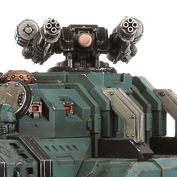

# 1182 天空收割者炮台 Skyreaper Battery

精校状态：中文行文已逐段精校，部分术语仍为暂定

分类：武器 / 远程武器

原文来源：https://www.bilibili.com/opus/1012483504333651985

原作者：帝国神选罐头

原文时间：2024年12月19日 10:33

[返回分类目录](目录.md) · [全书目录](../../目录.md)

<!-- A1182-B0001 -->
**英文原文**

The Skyreaper Battery was a type of anti-aircraft system used by Space Marine Mastodons during the Great Crusade and Horus Heresy.

<!-- /A1182-B0001 -->

<!-- A1182-B0002 -->

原译文

天空收割者炮台是星际战士乳齿象在大远征和荷鲁斯叛乱期间使用的一种防空系统。

**校订译文**

天空收割者炮台是大远征和荷鲁斯之乱期间，星际战士乳齿象运兵车使用的一种防空系统。

<!-- /A1182-B0002 -->

<!-- A1182-B0003 图片 -->

<!-- A1182-B0004 -->

原译文

Skyreaper Battery 天空收割者炮台

**校订译文**

Skyreaper Battery 天空收割者炮台

<!-- /A1182-B0004 -->

本篇核心术语与暂定项

以下列出本篇出现的英文原形及核心术语表用词。同形词可能指不同对象，具体词义以本篇正文和校注为准；单复数、别名和仅见于图注的名称可能尚未列入。完整候选见[术语表](../../术语表/双语术语候选.csv)。

| 英文 | 采用中文 | 状态 |
| --- | --- | --- |
| Horus Heresy | 荷鲁斯之乱 | 官方已核对 |
| Great Crusade | 大远征 | 暂定·官方待核 |
| Horus | 荷鲁斯 | 暂定·官方待核 |
| Space Marine | 星际战士 | 暂定·官方待核 |
| System | 星系（恒星系统） | 暂定·官方待核 |
| Skyreaper Battery | 天空收割者炮台 | 暂定·官方待核 |

