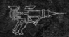
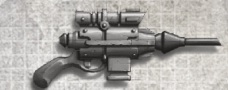
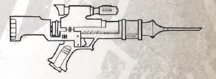
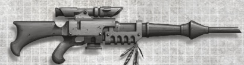
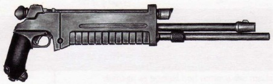

# 1183 针刺武器 Needler Weapon

精校状态：中文行文已逐段精校，部分术语仍为暂定

分类：武器 / 远程武器

原文来源：https://www.bilibili.com/opus/1009181494854287366

原作者：帝国神选罐头

原文时间：编辑于 2025年05月09日 17:49

[返回分类目录](目录.md) · [全书目录](../../目录.md)

<!-- A1183-B0001 -->
**英文原文**

Needler weapons fire a needle of crystallized agent, whether paralytic or toxic. Commonly employed by hunters, sportsmen and others who find it useful to not damage their chosen prey.

<!-- /A1183-B0001 -->

<!-- A1183-B0002 -->

原译文

针刺武器发射一针结晶针剂，无论是麻痹性的还是有毒的。通常由猎手、擅长运动的人和其他认为不伤害所选猎物有用的人使用。

**校订译文**

针刺武器发射由药剂结晶而成的细针，药剂可致麻痹，也可致命。猎人、狩猎爱好者，以及其他希望尽量保持猎物躯体完整的人，经常使用这类武器。

**校注：** sportsmen在狩猎语境指狩猎爱好者，原“擅长运动的人”误解词义；not damage指尽量保持猎物完整，不表示毒针无害。

<!-- /A1183-B0002 -->

<!-- A1183-B0003 -->
## Overview 概述

<!-- /A1183-B0003 -->

<!-- A1183-B0004 -->
**英文原文**

A needle of crystallized element propelled by a form of laser dissolves almost immediately after penetration. Needlers are silent and flashless, allowing the weapon to be used without giving away the firer's position. The beam which propels the sliver gives the Needler unerring accuracy, additionally guiding the missile to its target. The secondary function of the beam is to pierce any existing armour and provide an opening for the sliver to penetrate, as the Needler's main drawback is its poor armour penetration. This happens automatically at firing before the sliver leaves the needler's muzzle, as the laser detects the obstacle and sends a pulse punching a tiny hole through which the needle enters the target. Various types of toxins can be employed by the Needler, divided primarily between paralytic and toxic agents, paralytic agents are quite unvaried allowing for a single needler antidote to function against their effects.

<!-- /A1183-B0004 -->

<!-- A1183-B0005 -->

原译文

由激光推动的结晶元素针在穿透后几乎立即溶解。针是无声的，没有闪光，允许武器在不泄露射击者位置的情况下使用。推动针刺的光束为针刺提供了准确无误的精度，此外还将导弹引导到目标。光束的次要功能是穿透任何现有的装甲，并为针刺提供一个穿透的开口，因为针刺的主要缺点是装甲穿透力差。这一过程在发射时自动发生，当针状物离开针枪的枪口之前，激光检测到障碍物并发送一个脉冲，穿透一个小孔，使针能够进入目标。针刺可以使用各种类型的毒素，主要分为麻痹剂和毒剂，麻痹剂种类较少，因此一种针刺解毒剂就可以对抗它们的效果。

**校订译文**

激光推动药剂晶针飞向目标，晶针刺入后几乎立即溶解。针刺武器射击无声、无闪光，不易暴露射手位置；推进光束也负责引导晶针，确保命中精度。它的另一作用是穿开目标装甲，为毒针开辟通道，因为针刺本身的穿甲能力较弱。这一过程在射击时自动完成：晶针尚未离开枪口，激光便先行探测障碍、发出脉冲，穿出一个可供细针进入的小孔。针刺武器可装填多种药剂，主要分为麻痹剂与毒剂；麻痹剂的成分变化较小，因而同一种针刺解毒剂通常就能解除它们的作用。

**校注：** missile在此泛指射出的晶针，不是导弹。

<!-- /A1183-B0005 -->

<!-- A1183-B0006 -->
## Patterns 型号

<!-- /A1183-B0006 -->

<!-- A1183-B0007 -->
**英文原文**

Needle gun - baseline version of the weapon;

<!-- /A1183-B0007 -->

<!-- A1183-B0008 -->

原译文

针刺枪 - 武器的基础版本；

**校订译文**

针刺枪 - 武器的基础版本；

<!-- /A1183-B0008 -->

<!-- A1183-B0009 -->
**英文原文**

Needle pistol - highly favoured by assassins, because this weapon is flashless, silent and concealable. That's why needle pistols often used for assassination, doping, kidnapping and other secretive work;

<!-- /A1183-B0009 -->

<!-- A1183-B0010 -->

原译文

针刺手枪 - 深受刺客青睐，因为这种武器不闪光、无声、隐蔽。这就是为什么针刺手枪经常用于暗杀、麻醉、绑架和其他秘密工作；

**校订译文**

针刺手枪——无声、无闪光且易于藏匿，深受刺客青睐，常用于刺杀、下药、绑架及其他隐秘行动。

<!-- /A1183-B0010 -->

<!-- A1183-B0011 图片 -->

<!-- A1183-B0012 -->

原译文

Needle pistol 针刺手枪

**校订译文**

Needle pistol 针刺手枪

<!-- /A1183-B0012 -->

<!-- A1183-B0013 图片 -->

<!-- A1183-B0014 -->

原译文

House Escher Crone Pattern Needle Pistol 埃舍尔家族丑妇型针刺手枪

**校订译文**

House Escher Crone Pattern Needle Pistol 埃舍尔家族丑妇型针刺手枪

<!-- /A1183-B0014 -->

<!-- A1183-B0015 -->

原译文

Needle Rifle; 针刺步枪

**校订译文**

Needle Rifle; 针刺步枪

<!-- /A1183-B0015 -->

<!-- A1183-B0016 图片 -->

<!-- A1183-B0017 -->

原译文

Needle Rifle 针刺步枪

**校订译文**

Needle Rifle 针刺步枪

<!-- /A1183-B0017 -->

<!-- A1183-B0018 图片 -->

<!-- A1183-B0019 -->

原译文

House Escher Needle Rifle 埃舍尔家族针刺步枪

**校订译文**

House Escher Needle Rifle 埃舍尔家族针刺步枪

<!-- /A1183-B0019 -->

<!-- A1183-B0020 -->
**英文原文**

Needle sniper rifle - rifle-sized and more accurate form of Needler weapon, used by Space Marine Scouts, Eldar Rangers and Ratling Snipers;

<!-- /A1183-B0020 -->

<!-- A1183-B0021 -->

原译文

针刺狙击步枪 - 一种步枪大小、更精确的针刺武器，由星际战士侦察兵、灵族游侠和莱特林狙击手使用；

**校订译文**

针刺狙击步枪 - 一种步枪大小、更精确的针刺武器，由星际战士侦察兵、灵族游侠和莱特林狙击手使用；

<!-- /A1183-B0021 -->

<!-- A1183-B0022 图片 -->

<!-- A1183-B0023 -->

原译文

Needle sniper rifle 针刺狙击步枪

**校订译文**

Needle sniper rifle 针刺狙击步枪

<!-- /A1183-B0023 -->

<!-- A1183-B0024 -->
**英文原文**

Assault Needler - used by the Sisters of Silence;

<!-- /A1183-B0024 -->

<!-- A1183-B0025 -->

原译文

突击针刺枪 - 寂静修女使用；

**校订译文**

突击针刺枪 - 寂静修女使用；

<!-- /A1183-B0025 -->

<!-- A1183-B0026 -->
**英文原文**

Needle-carbine – an assault weapon, releasing a volley of solid steel needles in bursts;

<!-- /A1183-B0026 -->

<!-- A1183-B0027 -->

原译文

针刺卡宾枪 - 一种突击武器，可连发发射实心钢针；

**校订译文**

针刺卡宾枪——以短点射发射成串实心钢针的突击武器。

<!-- /A1183-B0027 -->

<!-- A1183-B0028 -->
**英文原文**

Needler digital weapon - miniaturised form of the weapon;

<!-- /A1183-B0028 -->

<!-- A1183-B0029 -->

原译文

针刺指环武器 - 武器的小型化形式；

**校订译文**

针刺指环武器——这类武器的微型化版本。

<!-- /A1183-B0029 -->

<!-- A1183-B0030 -->
**英文原文**

Needle Cannon - Heavy version used by the Sisters of Silence.

<!-- /A1183-B0030 -->

<!-- A1183-B0031 -->

原译文

针刺炮 - 寂静修女使用的重型版本。

**校订译文**

针刺炮 - 寂静修女使用的重型版本。

<!-- /A1183-B0031 -->

<!-- A1183-B0032 -->
**英文原文**

Withertouch Pistol - Chaos-corrupted.

<!-- /A1183-B0032 -->

<!-- A1183-B0033 -->

原译文

枯萎之触手枪 - 混沌堕落版

**校订译文**

枯萎之触手枪——受混沌腐化的型号。

<!-- /A1183-B0033 -->

本篇核心术语与暂定项

以下列出本篇出现的英文原形及核心术语表用词。同形词可能指不同对象，具体词义以本篇正文和校注为准；单复数、别名和仅见于图注的名称可能尚未列入。完整候选见[术语表](../../术语表/双语术语候选.csv)。

| 英文 | 采用中文 | 状态 |
| --- | --- | --- |
| Eldar | 灵族 | 暂定·语境区分 |
| Ratling | 莱特林 | 官方已核对 |
| Ratling Snipers | 莱特林狙击手 | 暂定·官方待核 |
| Space Marine Scouts | 星际战士侦察兵 | 暂定·官方待核 |
| Eldar Rangers | 灵族游侠 | 暂定·官方待核 |
| Sniper rifle | 狙击步枪 | 暂定·官方待核 |
| Needle sniper rifle | 针刺狙击步枪 | 暂定·官方待核 |
| Sisters of Silence | 寂静修女 | 暂定·官方待核 |
| Space Marine | 星际战士 | 暂定·官方待核 |
| Rangers | 游侠 | 官方已核对 |
| The Weapon | 武器 | 暂定·官方待核 |
| Gun | 甘 | 暂定·官方待核 |
| Needler | 针刺枪 | 暂定·官方待核 |
| Needler Weapon | 针刺武器 | 暂定·官方待核 |
| Needle gun | 针刺枪 | 暂定·官方待核 |
| Needle pistol | 针刺手枪 | 暂定·官方待核 |
| Assault Needler | 突击针刺枪 | 暂定·官方待核 |
| Needle-carbine | 针刺卡宾枪 | 暂定·官方待核 |
| Needler digital weapon | 针刺指环武器 | 暂定·官方待核 |
| Needle Cannon | 针刺炮 | 暂定·官方待核 |
| Withertouch Pistol | 枯萎之触手枪 | 暂定·官方待核 |

