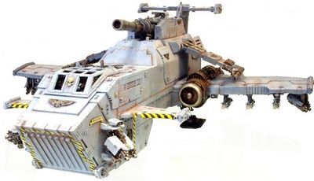

# 1185 雷鹰加农炮 Thunderhawk Cannon

精校状态：中文行文已逐段精校，部分术语仍为暂定

分类：武器 / 远程武器

原文来源：https://www.bilibili.com/opus/1006596134995492885

原作者：帝国神选罐头

原文时间：2024年12月03日 13:47

[返回分类目录](目录.md) · [全书目录](../../目录.md)

<!-- A1185-B0001 -->
**英文原文**

The Thunderhawk Cannon is a Battle cannon mounted on a Space Marine Thunderhawk Gunship. It is an over-sized version to allow it to be fired from the air at the most vulnerable parts of an enemy position or for clearing an area to land troops in. The Thunderhawk Cannon fires high explosive shells.

<!-- /A1185-B0001 -->

<!-- A1185-B0002 -->

原译文

雷鹰加农炮是一种安装在星际战士雷鹰炮艇上的战斗炮。它是一种超大版本，可以从空中向敌方阵地最脆弱的部位发射，也可以清理一个区域让部队登陆。雷鹰加农炮发射高爆弹药。

**校订译文**

雷鹰加农炮是安装在星际战士雷鹰炮艇上的战斗炮。它是尺寸更大的改型，发射高爆炮弹，可从空中攻击敌方阵地的薄弱处，或扫清区域，为部队着陆创造条件。

<!-- /A1185-B0002 -->

<!-- A1185-B0003 图片 -->

<!-- A1185-B0004 -->

原译文

Thunderhawk gunship with dorsal-mounted Thunderhawk Cannon 雷鹰炮艇背装雷鹰加农炮

**校订译文**

Thunderhawk gunship with dorsal-mounted Thunderhawk Cannon 背部装有雷鹰加农炮的雷鹰炮艇

<!-- /A1185-B0004 -->

本篇核心术语与暂定项

以下列出本篇出现的英文原形及核心术语表用词。同形词可能指不同对象，具体词义以本篇正文和校注为准；单复数、别名和仅见于图注的名称可能尚未列入。完整候选见[术语表](../../术语表/双语术语候选.csv)。

| 英文 | 采用中文 | 状态 |
| --- | --- | --- |
| Space Marine | 星际战士 | 暂定·官方待核 |
| Thunderhawk Gunship | 雷鹰炮艇 | 暂定·官方待核 |
| Battle Cannon | 战斗炮 | 暂定·官方待核 |
| Thunderhawk Cannon | 雷鹰加农炮 | 暂定·官方待核 |

