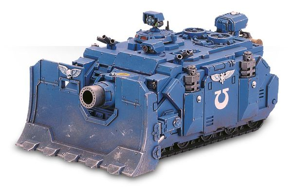

# 1187 破坏者加农炮 Demolisher Cannon

精校状态：中文行文已逐段精校，部分术语仍为暂定

分类：武器 / 远程武器

原文来源：https://www.bilibili.com/opus/1003608830583504965

原作者：帝国神选罐头

原文时间：2024年11月25日 12:34

[返回分类目录](目录.md) · [全书目录](../../目录.md)

原篇名：粉碎者加农炮 Demolisher Cannon

<!-- A1187-B0001 -->
**英文原文**

The Demolisher Cannon is a short-range, large-bore direct fire cannon mounted on various Imperial vehicles, but most commonly on the Baneblade, Leman Russ Demolisher and Vindicator. Primarily designed with siege, urban, and bunker-busting warfare in mind, the cannon has also been known to be of great use against enemy vehicles and infantry, destroying both with equal ease.

<!-- /A1187-B0001 -->

<!-- A1187-B0002 -->

原译文

粉碎者加农炮是一种短程大口径直射加农炮，安装在各种帝国车辆上，但最常见的是毒刃、黎曼鲁斯粉碎者和维护者战车。加农炮的设计主要考虑了攻城战、城市战和掩体破坏战，也被认为对敌方车辆和步兵非常有用，可以同样轻松地摧毁两者。

**校订译文**

破坏者加农炮是一种短射程、大口径直射火炮，可安装在多种帝国载具上，最常见的搭载平台是毒刃、黎曼鲁斯破坏者与维护者战车。它主要为攻城、巷战和摧毁掩体而设计，也能轻易击毁敌方载具、杀伤步兵。

<!-- /A1187-B0002 -->

<!-- A1187-B0003 图片 -->

<!-- A1187-B0004 -->

原译文

Vindicator equipped with the Demolisher cannon 配备破坏者加农炮的维护者战车

**校订译文**

Vindicator equipped with the Demolisher cannon 配备破坏者加农炮的维护者战车

<!-- /A1187-B0004 -->

<!-- A1187-B0005 -->
## Overview 概述

<!-- /A1187-B0005 -->

<!-- A1187-B0006 -->
**英文原文**

The Demolisher fires special ammunition much larger than that used in the Battle Cannon, allowing it to punch through layers of concrete and plasteel alike. A Demolisher shell is constructed with an outer layer of standard high explosive and shrapnel, which surrounds a chemical core. Upon impact, the explosive layer detonates, punching a hole in the enemy's armour and spreading shrapnel over a wide area. It also starts a chemical reaction in the core, causing it to super-heat into a jet of plasma, which lances through the compromised armour, spreading molten death over a wide area and literally ripping the target from the inside out. The tremendous recoil produced by firing the cannon is capable of lifting the front end of a tank off the ground and, were it fired while moving, risk causing it to roll over. However, the cannon has an effective range of one kilometer, limiting its utility to short-ranged combat such as urban and siege warfare.

<!-- /A1187-B0006 -->

<!-- A1187-B0007 -->

原译文

粉碎者发射的特殊弹药比战斗炮使用的弹药大得多，使其能够穿透混凝土和塑钢层。粉碎炮弹由一层标准高爆装药和弹片构成，外层围绕着一个化学核心。撞击后，爆炸层会引爆，在敌人的装甲上打一个洞，并将弹片散布到广阔的区域。它还会在核心中引发化学反应，使其过热形成等离子体射流，等离子体射流刺穿受损的装甲，在广阔的区域内传播熔融死亡，并从内到外撕裂目标。发射加农炮产生的巨大后坐力能够将坦克的前端抬离地面，如果在移动时发射，则有可能导致坦克翻车。然而，加农炮的有效射程为一公里，这限制了它在城市和攻城战等短程作战中的实用性。

**校订译文**

破坏者加农炮发射的专用炮弹远大于战斗炮弹，足以贯穿层层混凝土和塑钢。炮弹的化学核心外包覆着常规高爆装药与破片。命中时，外层装药先行爆炸，在装甲上炸开缺口，并向四周抛撒破片；同时，核心内发生化学反应，急剧升温形成等离子射流，沿破口灌入目标内部，将其由内向外撕裂。开炮时的巨大后坐力足以将坦克前部抬离地面，若在行进中发射，甚至可能造成侧翻。火炮有效射程约一千米，因此主要用于巷战、攻城等近距离交战。

**校注：** 弹药机理为底稿的虚构设定，照译，不以现实化学或弹道知识改写其原理。

<!-- /A1187-B0007 -->

<!-- A1187-B0008 -->
**英文原文**

The Demolisher Cannon used by Vindicators fires a special siege shell, consisting of an armour-piercing tip, heavy shell casing and a massive explosive charge micro-fused to allow penetration of a building or bunker before detonating. The siege shell is launched thanks to an on-board rocket engine, which uses solid propellant shaped to control its time and rate of burn for maximum accuracy. In order to avoid the build-up of rocket blast-back, this gas is vented when the cannon is fired to prevent the barrel from deforming or bursting from over-pressure. The sheer size and mass of the shell, however, reduces its stowage capacity and accuracy over long ranges, even with fin stabilisation and booster burns. As such it is also limited to being used for destroying enemy fortifications and fighting in close-quarters combat such as jungle warfare.

<!-- /A1187-B0008 -->

<!-- A1187-B0009 -->

原译文

维护者使用的破坏者加农炮发射一种特殊的攻城炮弹，由穿甲尖端、重型弹壳和微型引信组成，可在引爆前穿透建筑物或掩体。攻城炮弹的发射得益于弹载火箭发动机，该发动机使用固体推进剂来控制其燃烧时间和速度，以达到最高精度。为了避免火箭反冲的积聚，在加农炮发射时会排出这种气体，以防止炮管变形或因超压而爆裂。然而，即使在尾翼稳定和助推器燃烧的情况下，炮弹的巨大尺寸和质量也会降低其的装载能力和长距离的精度。因此，它也仅限于用于摧毁敌人的防御工事和丛林战等近距离战斗。

**校订译文**

维护者战车使用的破坏者加农炮发射专用攻城弹，由穿甲弹尖、厚重弹壳与大装药构成，并配有微型引信，使炮弹先穿入建筑或掩体，再行爆炸。弹载火箭发动机负责推进，固体推进剂的形状经过设计，以控制燃烧时间和速率、提高精度。火炮发射时会排出反冲燃气，避免积聚的高压使炮管变形或爆裂。但炮弹体积和重量都很大，即使配有稳定尾翼并采用助推燃烧，车内备弹量与远距离精度仍受到限制。因此，它主要用于摧毁防御工事，以及丛林战等近距离战斗。

**校注：** 原译遗漏massive explosive charge大装药，将炮弹写成只有弹尖、弹壳和引信，已补回。

<!-- /A1187-B0009 -->

本篇核心术语与暂定项

以下列出本篇出现的英文原形及核心术语表用词。同形词可能指不同对象，具体词义以本篇正文和校注为准；单复数、别名和仅见于图注的名称可能尚未列入。完整候选见[术语表](../../术语表/双语术语候选.csv)。

| 英文 | 采用中文 | 状态 |
| --- | --- | --- |
| Vindicator | 维护者战车 | 官方已核对 |
| Vindicators | 维护者 | 暂定·官方待核 |
| Baneblade | 毒刃 | 官方已核对 |
| Leman Russ Demolisher | 黎曼鲁斯破坏者 | 官方已核·中英对照 |
| Battle Cannon | 战斗炮 | 暂定·官方待核 |
| Demolisher Cannon | 破坏者加农炮 | 暂定·官方待核 |

