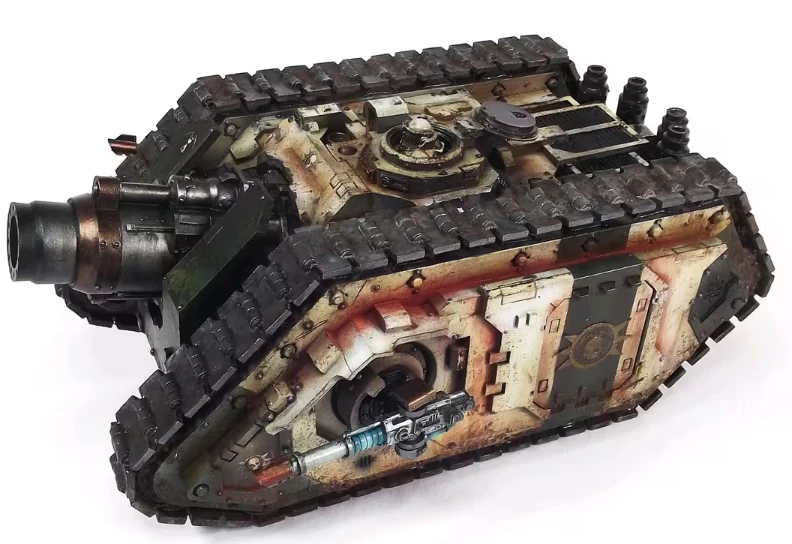

# 1189 恐惧之锤加农炮 Dreadhammer Cannon

精校状态：中文行文已逐段精校，部分术语仍为暂定

分类：武器 / 远程武器

原文来源：https://www.bilibili.com/opus/1011362075487764504

原作者：帝国神选罐头

原文时间：2024年12月16日 10:01

[返回分类目录](目录.md) · [全书目录](../../目录.md)

<!-- A1189-B0001 -->
**英文原文**

The Dreadhammer Cannon is a massive piece of Imperial artillery mounted on the Typhon Heavy Siege Tank. Essentially a massive static artillery cannon mounted on a vehicle chassis, the kinetic blast produced by its multi-tonne shells is enough to liquefy flesh and bone. Even the most well-protected bunker provides little defense against the shells of the Dreadhammer Siege Cannon.

<!-- /A1189-B0001 -->

<!-- A1189-B0002 -->

原译文

恐惧之锤加农炮是安装在提丰重型攻城坦克上的大型帝国火炮。本质上，它是一门安装在车辆底盘上的大型静态火炮，其数吨炮弹产生的动能爆炸足以液化血肉。即使是保护最完好的掩体，也很难抵御恐惧之锤攻城炮的炮弹。

**校订译文**

恐惧之锤加农炮是安装在提丰重型攻城坦克上的巨型帝国火炮，相当于将一门庞大的固定式重炮搬上载具底盘。每发重达数吨的炮弹所产生的动能冲击，足以将血肉和骨骼震成液状；即使防护最严密的掩体，也难以抵挡它的轰击。

<!-- /A1189-B0002 -->

<!-- A1189-B0003 图片 -->

<!-- A1189-B0004 -->

原译文

Dreadhammer Cannon 恐惧之锤加农炮

**校订译文**

Dreadhammer Cannon 恐惧之锤加农炮

<!-- /A1189-B0004 -->

本篇核心术语与暂定项

以下列出本篇出现的英文原形及核心术语表用词。同形词可能指不同对象，具体词义以本篇正文和校注为准；单复数、别名和仅见于图注的名称可能尚未列入。完整候选见[术语表](../../术语表/双语术语候选.csv)。

| 英文 | 采用中文 | 状态 |
| --- | --- | --- |
| Dreadhammer Cannon | 恐惧之锤加农炮 | 暂定·官方待核 |
| Dreadhammer Siege Cannon | 恐惧之锤攻城炮 | 暂定·官方待核 |
| Typhon Heavy Siege Tank | 提丰重型攻城坦克 | 暂定·官方待核 |

