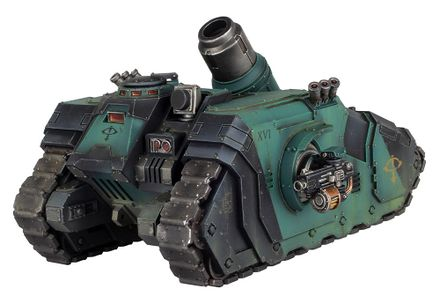

# 1190 疫病重型臼炮 Morbus Heavy Bombard

精校状态：中文行文已逐段精校，部分术语仍为暂定

分类：武器 / 远程武器

原文来源：https://www.bilibili.com/opus/1011763581913399297

原作者：帝国神选罐头

原文时间：2024年12月17日 11:59

[返回分类目录](目录.md) · [全书目录](../../目录.md)

<!-- A1190-B0001 -->
**英文原文**

The Morbus Heavy Bombard was a weapon used by the Space Marine Legions during the Great Crusade and Horus Heresy.

<!-- /A1190-B0001 -->

<!-- A1190-B0002 -->

原译文

疾病重型臼炮是星际战士在大远征和荷鲁斯叛乱期间使用的武器。

**校订译文**

疫病重型臼炮是大远征和荷鲁斯之乱期间星际战士军团使用的一种武器。

<!-- /A1190-B0002 -->

<!-- A1190-B0003 图片 -->

<!-- A1190-B0004 -->

原译文

Arquitor Bombard with Morbus Heavy Bombard 装备疾病重型臼炮的曲射手臼炮载具

**校订译文**

Arquitor Bombard with Morbus Heavy Bombard 装备疫病重型臼炮的曲射手臼炮载具

<!-- /A1190-B0004 -->

<!-- A1190-B0005 -->
**英文原文**

Fitted to the Arquitor Bombard vehicle, the Morbus was patterned on the more common Demolisher Cannon. This Heavy Bombard fired shells that could devastate even the most heavily armored units. Alongside explosive shells the Morbus could fire Carcass Shells which were loaded with biological agents capable of reducing unarmored warriors to gore splatter in a few seconds.

<!-- /A1190-B0005 -->

<!-- A1190-B0006 -->

原译文

疾病重型臼炮安装在曲射手臼炮载具上，以更常见的粉碎者加农炮为蓝本。这个重型臼炮发射的炮弹甚至可以摧毁最重的装甲部队。除了爆炸性炮弹外，疾病重型臼炮还可以发射装有生物制剂的死尸炮弹，这些生物剂能够在几秒钟内将无装甲的战士化为模糊血肉。

**校订译文**

疫病重型臼炮安装在曲射手臼炮载具上，以更常见的破坏者加农炮为设计蓝本，其炮弹足以重创防护最严密的装甲部队。除爆炸弹药外，它还可发射死尸炮弹；其中装填的生物制剂，能在数秒内将毫无装甲防护的战士化为四散血肉。

<!-- /A1190-B0006 -->

<!-- A1190-B0007 -->
**英文原文**

The weapon impressed Mortarion to the point where he incorporated its design into the Plagueburst Crawler.

<!-- /A1190-B0007 -->

<!-- A1190-B0008 -->

原译文

这种武器给莫塔里安留下了深刻的印象，以至于他将其设计融入了瘟疫散播者中。

**校订译文**

莫塔里安对这种武器印象极深，后来将其设计融入了瘟爆履带战车。

<!-- /A1190-B0008 -->

本篇核心术语与暂定项

以下列出本篇出现的英文原形及核心术语表用词。同形词可能指不同对象，具体词义以本篇正文和校注为准；单复数、别名和仅见于图注的名称可能尚未列入。完整候选见[术语表](../../术语表/双语术语候选.csv)。

| 英文 | 采用中文 | 状态 |
| --- | --- | --- |
| Horus Heresy | 荷鲁斯之乱 | 官方已核对 |
| Great Crusade | 大远征 | 暂定·官方待核 |
| Mortarion | 莫塔里安 | 官方已核对 |
| Horus | 荷鲁斯 | 暂定·官方待核 |
| Space Marine | 星际战士 | 暂定·官方待核 |
| Plagueburst Crawler | 瘟爆履带战车 | 官方已核对 |
| The Weapon | 武器 | 暂定·官方待核 |
| Demolisher Cannon | 破坏者加农炮 | 暂定·官方待核 |
| Morbus Heavy Bombard | 疫病重型臼炮 | 暂定·官方待核 |
| Arquitor Bombard | 曲射手臼炮载具 | 暂定·官方待核 |
| Carcass Shells | 死尸炮弹 | 暂定·官方待核 |

