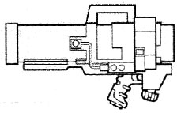
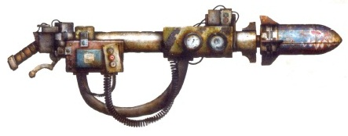
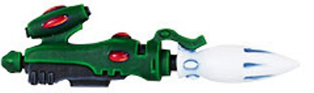
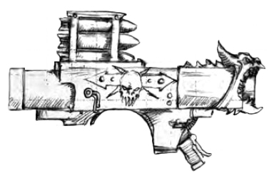

# 1191 导弹发射器 Missile Launcher

精校状态：中文行文已逐段精校，部分术语仍为暂定

分类：武器 / 远程武器

原文来源：https://www.bilibili.com/opus/1002865792677576713

原作者：帝国神选罐头

原文时间：编辑于 2026年08月26日 09:07

[返回分类目录](目录.md) · [全书目录](../../目录.md)

<!-- A1191-B0001 -->
**英文原文**

A Missile Launcher fires self-propelled guided projectiles that usually contain explosive, chemical, or destructive energy warheads. Missiles may use a chemical rocket, jet engine, or something more esoteric such as an anti-gravity drive, for propulsion.

<!-- /A1191-B0001 -->

<!-- A1191-B0002 -->

原译文

导弹发射器发射自推进制导炮弹，通常含有爆炸性、化学性或破坏性能量弹头。导弹可能使用化学火箭、喷气发动或更深奥的东西，如反重力驱动器来推进。

**校订译文**

导弹发射器发射带制导能力的自推进弹药，通常装有爆炸、化学或破坏性能量弹头。推进方式可以是化学火箭发动机、喷气发动机，也可能是反重力驱动等更特殊的技术。

<!-- /A1191-B0002 -->

<!-- A1191-B0003 -->
**英文原文**

A Rocket Launcher fires unguided, self-propelled projectiles. They contain the same types of warheads as a missile. Usually rockets are propelled by an exothermic chemical reaction, but this does not preclude other forms of propulsion.

<!-- /A1191-B0003 -->

<!-- A1191-B0004 -->

原译文

火箭发射器发射无制导、自行推进的炮弹。它们包含与导弹相同类型的弹头。通常火箭是通过放热化学反应推进的，但这并不排除其他形式的推进。

**校订译文**

火箭发射器发射不带制导能力的自推进弹药，可采用与导弹相同的各类弹头。火箭通常以放热化学反应提供推力，但也可使用其他推进方式。

<!-- /A1191-B0004 -->

<!-- A1191-B0005 -->
###### Types 类型

<!-- /A1191-B0005 -->

<!-- A1191-B0006 -->
## Imperial Missile Launchers 帝国导弹发射器

<!-- /A1191-B0006 -->

<!-- A1191-B0007 -->
**英文原文**

The standard Locke-pattern Imperial missile launcher has a built in targeting device and is fired from the shoulder. It is a single round weapon and cannot be fired on the move. Standard Imperial Guard doctrine is for one man to carry aim and fire the missile launcher, whilst a second man carries the ammunition and re-loads the weapons. A well-drilled fire team can maintain a formidable rate of fire, enough to daunt the bravest of tank commanders. Amongst the Imperial Guard, missile launchers are crew-served weapons, while Space Marines are strong enough to use and reload missile launchers alone.

<!-- /A1191-B0007 -->

<!-- A1191-B0008 -->

原译文

标准的洛克式帝国导弹发射器有一个内置的瞄准装置，从肩部发射。这是一种单发武器，不能在移动中发射。标准的帝国卫队条令是，一个人负责瞄准和发射导弹发射器，而另一个人负责携带弹药和重新装填武器。一支训练有素的火力组可以保持惊人的火力，足以吓倒最勇敢的坦克指挥官。在帝国卫队中，导弹发射器是班组操作的武器，而星际战士则足够强大，可以单独使用和重新装填导弹发射器。

**校订译文**

标准洛克型帝国导弹发射器内置瞄准装置，采用肩射方式，每次装填一发，不能边移动边射击。按照帝国卫队的通常编制，一人负责携行、瞄准和发射，另一人携带弹药并负责装填。配合熟练的小组能够维持惊人的射速，让最勇敢的坦克指挥官也心生忌惮。帝国卫队需要小组协同操作，星际战士则凭借强大体力，可以独自携行、射击和装填。

<!-- /A1191-B0008 -->

<!-- A1191-B0009 图片 -->

<!-- A1191-B0010 -->

原译文

Astartes Missile Launcher 阿斯塔特导弹发射器

**校订译文**

Astartes Missile Launcher 阿斯塔特导弹发射器

<!-- /A1191-B0010 -->

<!-- A1191-B0011 -->
## Ork 欧克

原题：Ork 兽人

<!-- /A1191-B0011 -->

<!-- A1191-B0012 -->
**英文原文**

A Rokkit Launcha is a very simple weapon often used by Orks against armoured vehicles.

<!-- /A1191-B0012 -->

<!-- A1191-B0013 -->

原译文

欧克火箭发射器是一种非常简单的武器，经常被欧克用来对付装甲车。

**校订译文**

欧克火箭发射器是一种非常简单的武器，经常被欧克用来对付装甲车。

<!-- /A1191-B0013 -->

<!-- A1191-B0014 图片 -->

<!-- A1191-B0015 -->

原译文

Ork Rokkit Launcha 欧克火箭发射器

**校订译文**

Ork Rokkit Launcha 欧克火箭发射器

<!-- /A1191-B0015 -->

<!-- A1191-B0016 -->
**英文原文**

Supa-Rokkitss: Used on Stompas

<!-- /A1191-B0016 -->

<!-- A1191-B0017 -->

原译文

超级火箭:用于古巨圾

**校订译文**

超级火箭——践踏巨机使用的武器。

<!-- /A1191-B0017 -->

<!-- A1191-B0018 -->
**英文原文**

Krooz Missiles: Used on Gargants

<!-- /A1191-B0018 -->

<!-- A1191-B0019 -->

原译文

巡航导弹：用于刚加特

**校订译文**

巡航导弹——加冈特使用的武器。

<!-- /A1191-B0019 -->

<!-- A1191-B0020 -->
**英文原文**

Skorcha Missiles: Used on Burna-Bommers

<!-- /A1191-B0020 -->

<!-- A1191-B0021 -->

原译文

炙烤导弹：用于燃烧轰炸机

**校订译文**

炙烤导弹：用于燃烧轰炸机

<!-- /A1191-B0021 -->

<!-- A1191-B0022 -->
**英文原文**

Tankbusta Rokkits: Used on Landas

<!-- /A1191-B0022 -->

<!-- A1191-B0023 -->

原译文

坦爆发射器：用于欧克陆地方舟

**校订译文**

坦爆火箭——欧克陆地方舟使用的武器。

<!-- /A1191-B0023 -->

<!-- A1191-B0024 -->
**英文原文**

Grot Bombs: Gretchin-guided munition

<!-- /A1191-B0024 -->

<!-- A1191-B0025 -->

原译文

屁精炸弹：屁精制导弹药

**校订译文**

屁精炸弹：屁精制导弹药

<!-- /A1191-B0025 -->

<!-- A1191-B0026 -->
**英文原文**

Pulsa Rokkit: Enormous Missile

<!-- /A1191-B0026 -->

<!-- A1191-B0027 -->

原译文

脉冲火箭：巨型导弹

**校订译文**

脉冲火箭：巨型导弹

<!-- /A1191-B0027 -->

<!-- A1191-B0028 -->
## Eldar 灵族

<!-- /A1191-B0028 -->

<!-- A1191-B0029 -->
**英文原文**

The Eldar Missile Launcher is the standard missile weapon for Eldar ground forces. Instead of the primitive launching-tubes favoured by the Imperium, they use complex chambered pods designed to contain several types of ammo such as krak and plasma warheads, greatly decreasing the need to reload. The ammunition held in its internal magazines is in fact so compact that they can fit scores of ordinance inside a single launcher. While portable, they are most commonly mounted on Grav Platforms and Eldar vehicles.

<!-- /A1191-B0029 -->

<!-- A1191-B0030 -->

原译文

灵族导弹发射器是灵族地面部队的标准导弹武器。他们没有使用帝国所青睐的原始发射管道，而是使用了复杂的腔室吊舱，设计用于容纳多种类型的弹药，如破甲和等离子弹头，大大减少了重新装弹的需要。事实上，其内部弹匣中的弹药非常紧凑，可以在一个发射器内容纳数十枚弹药。虽然它们是便携式的，但最常见的是安装在重力平台和灵族载具上。

**校订译文**

灵族导弹发射器是灵族地面部队的标准导弹武器。它不采用帝国惯用的简单发射管，而是将破甲、等离子等多种弹头存放在复杂的分舱式发射舱内，大幅减少重新装填的需要。弹药十分紧凑，单具发射器就能容纳数十发。尽管可由单兵携行，它仍更常见于反重力平台或灵族载具上。

<!-- /A1191-B0030 -->

<!-- A1191-B0031 图片 -->

<!-- A1191-B0032 -->

原译文

Eldar Missile Launcher 灵族导弹发射器

**校订译文**

Eldar Missile Launcher 灵族导弹发射器

<!-- /A1191-B0032 -->

<!-- A1191-B0033 -->
**英文原文**

The Eldar Aspect Warriors known as Dark Reapers carry missile launchers known as Reaper Launchers capable of rapidly firing armoured-piercing missiles.

<!-- /A1191-B0033 -->

<!-- A1191-B0034 -->

原译文

被称为黑暗死神的灵族支派战士携带被称为收割者发射器的导弹发射器，能够快速发射穿甲导弹。

**校订译文**

黑暗死神是灵族的一种支派战士，携带能够快速发射穿甲导弹的收割者发射器。

<!-- /A1191-B0034 -->

<!-- A1191-B0035 -->
**英文原文**

The Tempest Launcher is a multiple missile launcher that has indirect fire capability. It is fielded by Dark Reaper Exarchs.

<!-- /A1191-B0035 -->

<!-- A1191-B0036 -->

原译文

暴风发射器是一种具有间接火力的多管导弹发射器。它由黑暗死神主教部署。

**校订译文**

暴风发射器是一种能进行间接射击的多管导弹发射器，由黑暗死神主教使用。

<!-- /A1191-B0036 -->

<!-- A1191-B0037 -->
**英文原文**

Phantom Missile Launcher: Used on Titans

<!-- /A1191-B0037 -->

<!-- A1191-B0038 -->

原译文

幻影导弹发射器：用于泰坦

**校订译文**

幻影导弹发射器：用于泰坦

<!-- /A1191-B0038 -->

<!-- A1191-B0039 -->
**英文原文**

Phoenix Missile Launcher: Used on Gunships

<!-- /A1191-B0039 -->

<!-- A1191-B0040 -->

原译文

凤凰导弹发射器：用于炮艇

**校订译文**

凤凰导弹发射器：用于炮艇

<!-- /A1191-B0040 -->

<!-- A1191-B0041 -->
## Dark Eldar 黑暗灵族

<!-- /A1191-B0041 -->

<!-- A1191-B0042 -->
**英文原文**

Void Raven Missile Launcher: Used by Voidraven Bombers

<!-- /A1191-B0042 -->

<!-- A1191-B0043 -->

原译文

虚空鸦导弹发射器：被虚空鸦轰炸机使用

**校订译文**

虚空鸦导弹发射器：被虚空鸦轰炸机使用

<!-- /A1191-B0043 -->

<!-- A1191-B0044 -->
## Chaos Space Marines Missile Launchers 混沌星际战士导弹发射器

<!-- /A1191-B0044 -->

<!-- A1191-B0045 -->
**英文原文**

Chaos Space Marines carry a mix of issued pre-Heresy and modern Imperial missile launchers taken from defeated foes. Most Chaos missile launchers operate the same as the Imperial launchers, though they also use Havoc Launchers.

<!-- /A1191-B0045 -->

<!-- A1191-B0046 -->

原译文

混沌星际战士携带了从战败的敌人那里缴获的叛乱前和现代帝国导弹发射器。大多数混沌导弹发射器的操作与帝国发射器相同，尽管它们也使用浩劫发射器。

**校订译文**

混沌星际战士既使用荷鲁斯之乱前配发的旧式导弹发射器，也使用从战败敌军手中缴获的现代帝国型号。多数型号与帝国武器的操作方式相同，此外他们也使用浩劫发射器。

**校注：** 原译将叛乱前配发的武器也一并写成缴获品，已区分配发旧械和缴获现代型号。

<!-- /A1191-B0046 -->

<!-- A1191-B0047 图片 -->

<!-- A1191-B0048 -->

原译文

Chaos Space Marine Missile Launcher 混沌星际战士导弹发射器

**校订译文**

Chaos Space Marine Missile Launcher 混沌星际战士导弹发射器

<!-- /A1191-B0048 -->

<!-- A1191-B0049 -->
**英文原文**

Chaos Forces also use a variety of more exotic missile weapons, such as the Hellfyre Missile Rack.

<!-- /A1191-B0049 -->

<!-- A1191-B0050 -->

原译文

混沌部队还使用各种更奇特的导弹武器，如地狱火导弹架。

**校订译文**

混沌部队还使用各种更奇特的导弹武器，如地狱之火导弹架。

<!-- /A1191-B0050 -->

<!-- A1191-B0051 -->
**英文原文**

Chaos Defilers can be armed with Heavy Missile Launchers.

<!-- /A1191-B0051 -->

<!-- A1191-B0052 -->

原译文

混沌亵渎者可以装备重型导弹发射器。

**校订译文**

混沌污染者可装备重型导弹发射器。

<!-- /A1191-B0052 -->

<!-- A1191-B0053 -->
## Tau 钛

<!-- /A1191-B0053 -->

<!-- A1191-B0054 -->
**英文原文**

Tau ranged weapon technology is more advanced than that of the Imperium. This includes Missile Launcher technology, however the Tau army is organized such that standard troopers do not carry Missile Launchers like other races. Instead the two varieties of missile launchers available to the Tau are carried on Battlesuits.

<!-- /A1191-B0054 -->

<!-- A1191-B0055 -->

原译文

钛远程武器技术比帝国更先进。这包括导弹发射器技术，但钛军队的组织方式使得标准士兵不像其他种族那样携带导弹发射器。相反，钛可用的两种导弹发射器都装在战斗服上。

**校订译文**

钛族的远程武器技术，包括导弹发射器技术，比帝国更先进。不过，钛军的组织方式与其他种族不同，普通士兵不携带导弹发射器；这里列举的两类发射系统都搭载在战斗服上。

**校注：** 本段“两类”只与紧接的吊舱、智能系统说明对应，后续清单另有多种导弹，保留底稿范围差异。

<!-- /A1191-B0055 -->

<!-- A1191-B0056 -->
**英文原文**

Missile Pods are mounted on the XV8 Crisis Battlesuits and come as standard on the XV-81 and the XV-84. Missile pods are medium range, rapid-fire missiles slightly less powerful than Imperial krak missiles. A combination of their size and the Battlesuits they are mounted on, a missile pod can be fired on the move.

<!-- /A1191-B0056 -->

<!-- A1191-B0057 -->

原译文

导弹吊舱安装在XV8危机战斗服上，并作为XV-81和XV-84的标准配置。导弹吊舱是中程速射导弹，其威力略低于帝国破甲导弹。结合它们的大小和它们所穿的战斗服，导弹吊舱可以在移动中发射。

**校订译文**

导弹巢可安装在 XV8 危机战斗服上，也是 XV-81 与 XV-84 的标准装备。它发射中程速射导弹，单发威力略低于帝国破甲导弹。得益于紧凑的尺寸和战斗服平台，吊舱能够在移动中开火。

<!-- /A1191-B0057 -->

<!-- A1191-B0058 -->
**英文原文**

Smart Missile Systems are the pinnacle of battlesuit missile technology. Medium strength and capable of very rapid fire (twice as fast as missile pods), the Smart Missile System is so high tech it does not require a line of sight to its target. Instead each missile fired contains a sophisticated guidance system allowing it to maneuver around obstacles and terrain and hit and impact upon a target without risk to the firer. Due to its size, the Smart Missile System can only be mounted on the bulky Broadside Battlesuit and cannot be fired on the move (without an additional stabilizing upgrade).

<!-- /A1191-B0058 -->

<!-- A1191-B0059 -->

原译文

智能导弹系统是战斗服导弹技术的巅峰之作。中等强度，能够快速射击（是导弹吊舱的两倍），智能导弹系统技术含量很高，不需要瞄准目标。相反，发射的每枚导弹都包含一个复杂的制导系统，使其能够绕过障碍物和地形，击中并撞击目标，而不会给发射者带来风险。由于其尺寸，智能导弹系统只能安装在笨重的舷炮战斗服上，不能在移动中发射（没有额外的稳定升级）。

**校订译文**

智能导弹系统代表战斗服导弹技术的高峰，威力适中，射速可达导弹巢的两倍。先进的制导技术使射手无需与目标之间保持直达视线：每枚导弹都能绕过地形和障碍物命中目标，让射手不必暴露在危险中。按本条所述，其尺寸限制了搭载平台，只能安装在庞大的舷炮战斗服上；若无额外稳定装置，也无法在移动中射击。

**校注：** line of sight是直达视线，不是无需瞄准；只可搭载舷炮、移动开火限制等属底稿所述版本，不擅自套入当前桌面规则。

<!-- /A1191-B0059 -->

<!-- A1191-B0060 -->
**英文原文**

Seeker Missile: Used on Sky Ray Gunships and Piranhas

<!-- /A1191-B0060 -->

<!-- A1191-B0061 -->

原译文

探求者导弹：用于天鳐炮艇和水虎鱼

**校订译文**

探求者导弹：用于天鳐炮艇和食人鱼战机

**校注：** Piranhas依据GW09第35页/GW10第34页采用食人鱼战机。

<!-- /A1191-B0061 -->

<!-- A1191-B0062 -->
**英文原文**

Cluster Rocket System: Used on KV128 Stormsurge Battlesuits

<!-- /A1191-B0062 -->

<!-- A1191-B0063 -->

原译文

集群火箭系统：用于KV128风暴潮战斗服

**校订译文**

集群火箭系统：用于KV128风暴潮战斗服

<!-- /A1191-B0063 -->

<!-- A1191-B0064 -->
**英文原文**

Destroyer Missile: Used on KV128 Stormsurge Battlesuits

<!-- /A1191-B0064 -->

<!-- A1191-B0065 -->

原译文

毁灭者导弹：用于KV128风暴潮战斗服

**校订译文**

毁灭者导弹：用于KV128风暴潮战斗服

<!-- /A1191-B0065 -->

<!-- A1191-B0066 -->
**英文原文**

Nexus Missile System: Used on KX139 Battlesuits

<!-- /A1191-B0066 -->

<!-- A1191-B0067 -->

原译文

连携导弹系统：用于KX139战斗服

**校订译文**

连携导弹系统：用于KX139战斗服

<!-- /A1191-B0067 -->

<!-- A1191-B0068 -->
## Leagues of Votann 沃坦联盟

<!-- /A1191-B0068 -->

<!-- A1191-B0069 -->
**英文原文**

APM Launcher - Adaptive weapon that can change warhead types as-needed.

<!-- /A1191-B0069 -->

<!-- A1191-B0070 -->

原译文

APM发射器 - 可根据需要改变弹头类型的自适应武器。

**校订译文**

APM 发射器——可按需切换弹头种类的自适应武器。

<!-- /A1191-B0070 -->

<!-- A1191-B0071 -->
**英文原文**

L7 Missile Launcher - Missile system family.

<!-- /A1191-B0071 -->

<!-- A1191-B0072 -->

原译文

L7导弹发射器 - 导弹系统系列。

**校订译文**

L7 导弹发射器——一个导弹系统系列。

<!-- /A1191-B0072 -->

<!-- A1191-B0073 -->

原译文

Sagitaur Missile Launcher 人马座导弹发射器

**校订译文**

Sagitaur Missile Launcher 人马座导弹发射器

<!-- /A1191-B0073 -->

本篇核心术语与暂定项

以下列出本篇出现的英文原形及核心术语表用词。同形词可能指不同对象，具体词义以本篇正文和校注为准；单复数、别名和仅见于图注的名称可能尚未列入。完整候选见[术语表](../../术语表/双语术语候选.csv)。

| 英文 | 采用中文 | 状态 |
| --- | --- | --- |
| Space Marines | 星际战士 | 官方已核对 |
| Imperial Guard | 帝国卫队 | 暂定·语境区分 |
| Chaos Space Marines | 混沌星际战士 | 官方已核对 |
| Eldar | 灵族 | 暂定·语境区分 |
| Orks | 欧克蛮人 | 官方已核对 |
| Imperium | 帝国 | 暂定·简称 |
| Gretchin | 屁精 | 官方已核对 |
| Tech | 技术语 | 暂定·官方待核 |
| Seeker | 追踪者 | 暂定·官方待核 |
| Destroyer | 毁灭者 | 暂定·官方待核 |
| Missile Launchers | 导弹发射器 | 暂定·官方待核 |
| Stormsurge | 风暴潮 | 官方已核对 |
| Dark Reapers | 黑暗死神 | 官方已核对 |
| Missile Pods | 导弹巢 | 暂定·官方待核 |
| Reaper | 收割者号 | 暂定·官方待核 |
| Hellfyre Missile Rack | 地狱之火导弹架 | 暂定·官方待核 |
| System | 星系（恒星系统） | 暂定·官方待核 |
| Missile Launcher | 导弹发射器 | 暂定·官方待核 |
| Rocket Launcher | 火箭发射器 | 暂定·官方待核 |
| Locke-pattern Imperial Missile Launcher | 洛克型帝国导弹发射器 | 暂定·官方待核 |
| Rokkit Launcha | 欧克火箭发射器 | 暂定·官方待核 |
| Krooz Missiles | 巡航导弹 | 暂定·官方待核 |
| Skorcha Missiles | 炙烤导弹 | 暂定·官方待核 |
| Tankbusta Rokkits | 坦爆火箭 | 暂定·官方待核 |
| Grot Bombs | 屁精炸弹 | 暂定·官方待核 |
| Pulsa Rokkit | 脉冲火箭 | 暂定·官方待核 |
| Eldar Missile Launcher | 灵族导弹发射器 | 暂定·官方待核 |
| Tempest Launcher | 暴风发射器 | 暂定·官方待核 |
| Phantom Missile Launcher | 幻影导弹发射器 | 暂定·官方待核 |
| Phoenix Missile Launcher | 凤凰导弹发射器 | 暂定·官方待核 |
| Void Raven Missile Launcher | 虚空鸦导弹发射器 | 暂定·官方待核 |
| Missile Pod | 导弹巢 | 暂定·官方待核 |
| Smart Missile System | 智能导弹系统 | 暂定·官方待核 |
| Seeker Missile | 探求者导弹 | 暂定·官方待核 |
| Cluster Rocket System | 集群火箭系统 | 暂定·官方待核 |
| Destroyer Missile | 毁灭者导弹 | 暂定·官方待核 |
| Nexus Missile System | 连携导弹系统 | 暂定·官方待核 |
| APM Launcher | APM 发射器 | 暂定·官方待核 |
| L7 Missile Launcher | L7 导弹发射器 | 暂定·官方待核 |
| Imperial Missile Launcher | 帝国导弹发射器 | 暂定·官方待核 |
| Piranhas | 食人鱼战机 | 官方已核·中英对照 |

