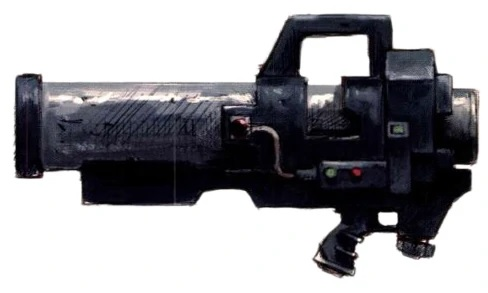
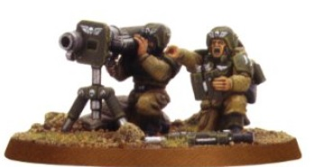
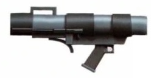
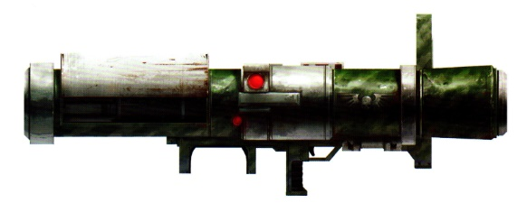
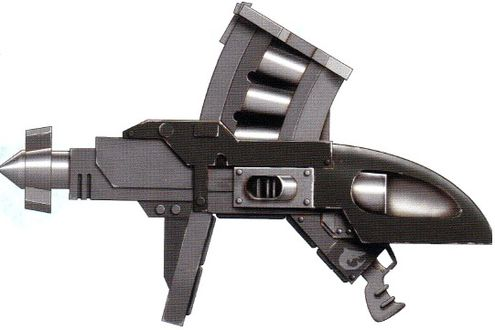
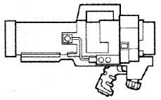

# 1192 帝国导弹发射器 Imperial missile launcher

精校状态：中文行文已逐段精校，部分术语仍为暂定

分类：武器 / 远程武器

原文来源：https://www.bilibili.com/opus/1005482647513727026

原作者：帝国神选罐头

原文时间：2024年11月30日 13:46

[返回分类目录](目录.md) · [全书目录](../../目录.md)

<!-- A1192-B0001 -->
**英文原文**

The Imperium operates a variety of Missile Launchers and Rocket Launchers.

<!-- /A1192-B0001 -->

<!-- A1192-B0002 -->

原译文

帝国使用着各种导弹发射器和火箭发射器。

**校订译文**

帝国使用着各种导弹发射器和火箭发射器。

<!-- /A1192-B0002 -->

<!-- A1192-B0003 图片 -->

<!-- A1192-B0004 -->

原译文

Imperial Missile Launcher 帝国导弹发射器

**校订译文**

Imperial Missile Launcher 帝国导弹发射器

<!-- /A1192-B0004 -->

<!-- A1192-B0005 -->
## Overview 概述

<!-- /A1192-B0005 -->

<!-- A1192-B0006 -->
**英文原文**

The standard Locke-pattern Imperial missile launcher has a built in targeting device and is fired from the shoulder. It is a single round weapon and cannot be fired on the move. Standard Imperial Guard doctrine is for one man to carry aim and fire the missile launcher, whilst a second man carries the ammunition and re-loads the weapons. A well-drilled fire team can maintain a formidable rate of fire, enough to daunt the bravest of tank commanders. Amongst the Imperial Guard, missile launchers are crew-served weapons, while Space Marines are strong enough to use and reload missile launchers alone.

<!-- /A1192-B0006 -->

<!-- A1192-B0007 -->

原译文

标准的洛克型帝国导弹发射器有一个内置的瞄准装置，从肩部发射。这是一种单发武器，不能在移动中发射。标准的帝国卫队条令是，一个人负责瞄准和发射导弹发射器，而另一个人负责携带弹药和重新装载武器。一支训练有素的火力组可以保持惊人的火力，足以吓倒最勇敢的坦克指挥官。在帝国卫队中，导弹发射器是班组人员使用的武器，而星际战士则足够强大，可以单独使用和重新装载导弹发射器。

**校订译文**

标准洛克型帝国导弹发射器内置瞄准装置，采用肩射方式，每次装填一发，不能边移动边射击。按照帝国卫队的通常编制，一人负责携行、瞄准和发射，另一人携带弹药并负责装填。配合熟练的小组能够维持惊人的射速，让最勇敢的坦克指挥官也心生忌惮。帝国卫队需要小组协同操作，星际战士则凭借强大体力，可以独自携行、射击和装填。

<!-- /A1192-B0007 -->

<!-- A1192-B0008 图片 -->

<!-- A1192-B0009 -->

原译文

Missile Launcher team 导弹发射器组

**校订译文**

Missile Launcher team 导弹发射器组

<!-- /A1192-B0009 -->

<!-- A1192-B0010 -->
### Man-Portable 单兵便携式

原题：Man-Portable 手提式

<!-- /A1192-B0010 -->

<!-- A1192-B0011 -->
**英文原文**

Accatran Pattern Missile Launcher: Compact launcher used by Elysian Drop Troops.

<!-- /A1192-B0011 -->

<!-- A1192-B0012 -->

原译文

阿卡特兰型导弹发射器：艾丽西亚空降部队使用的紧凑型发射器。

**校订译文**

阿卡特兰型导弹发射器：艾丽西亚空降部队使用的紧凑型发射器。

<!-- /A1192-B0012 -->

<!-- A1192-B0013 图片 -->

<!-- A1192-B0014 -->

原译文

Accatran Mk.II Pattern 阿卡特兰Mk.II型

**校订译文**

Accatran Mk.II Pattern 阿卡特兰Mk.II型

<!-- /A1192-B0014 -->

<!-- A1192-B0015 -->
**英文原文**

Achillan Mk III "Tread Fether" Missile Launcher: Compact missile launched by Imperial Guard teams.

<!-- /A1192-B0015 -->

<!-- A1192-B0016 -->

原译文

阿基兰 Mk III“羽距”导弹发射器：帝国卫队发射的紧凑型导弹。

**校订译文**

阿基兰 Mk.III“羽距”导弹发射器——帝国卫队武器小组使用的紧凑型发射器。

**校注：** 英文称compact missile，结合标题及全条语境应为发射器；原Tread Fether疑为口语化型号别称，暂沿羽距并标官方待核。

<!-- /A1192-B0016 -->

<!-- A1192-B0017 -->
**英文原文**

Armourbane Missile Launcher: The armourbane missile launcher is a launcher unique to the Deathwatch in the Jericho Reach. A squat, wide-barreled launcher half as tall as a Space Marine, specializing in dealing with heavily-armoured ground units, this launcher is typically loaded with hunter-killer krak missiles and fitted with an array of augurs and special cogitators to guide its missiles to their targets, and is more efficient than a Soundstrike missile launcher. The mounted special augur array combines the benefits of a preysense sight and a red-dot laser sight.

<!-- /A1192-B0017 -->

<!-- A1192-B0018 -->

原译文

盔甲杀手导弹发射器：盔甲杀手导弹发射器是杰里科星区死亡守望独有的发射器。这是一种蹲式宽管发射器，长度只有星际战士的一半，专门用于处理重型装甲地面部队，这种发射器通常装有猎杀穿甲导弹，并配有一系列鸟卜仪和特殊的定位器，将导弹引导到目标，比音袭导弹发射器更有效。安装的特殊占卜器阵列结合了猎物视觉和红点激光视觉的优点。

**校订译文**

盔甲杀手导弹发射器——杰里科疆域死亡守望独有的型号。它外形低矮粗壮，宽口径发射管约有星际战士半人高，专门用于对付地面重装甲目标。它通常装填猎杀者穿甲导弹，配有鸟卜仪阵列与专用沉思者，辅助导弹精确制导，效能高于音袭型发射器。特殊鸟卜仪阵列兼具猎感瞄具与红点激光瞄具的优势。

**校注：** squat描述低矮粗壮的外形，不是蹲姿；cogitators为沉思者，不是定位器。

<!-- /A1192-B0018 -->

<!-- A1192-B0019 -->
**英文原文**

Fury Pattern Missile Launcher: Man-portable version notably used by the Tanith First and Only.

<!-- /A1192-B0019 -->

<!-- A1192-B0020 -->

原译文

狂怒型导弹发射器：塔尼斯第一唯一团特别使用的便携式版本。

**校订译文**

狂怒型导弹发射器：塔尼斯第一唯一团特别使用的便携式版本。

<!-- /A1192-B0020 -->

<!-- A1192-B0021 图片 -->

<!-- A1192-B0022 -->

原译文

Fury Pattern 狂怒型

**校订译文**

Fury Pattern 狂怒型

<!-- /A1192-B0022 -->

<!-- A1192-B0023 -->
**英文原文**

Superfrag Rocket Launcher: Used by Space Marine Desolation Squads

<!-- /A1192-B0023 -->

<!-- A1192-B0024 -->

原译文

超级破片火箭发射器：供星际战士寂灭者小队使用

**校订译文**

超级破片火箭发射器——星际战士寂灭小队使用的武器。

<!-- /A1192-B0024 -->

<!-- A1192-B0025 -->
**英文原文**

Superkrak Rocket Launcher: Used by Space Marine Desolation Squads

<!-- /A1192-B0025 -->

<!-- A1192-B0026 -->

原译文

超级穿甲火箭发射器：供星际战士寂灭者小队使用

**校订译文**

超级穿甲火箭发射器——星际战士寂灭小队使用的武器。

<!-- /A1192-B0026 -->

<!-- A1192-B0027 -->
**英文原文**

Vengor Launcher: Used by Space Marine Desolation Squads

<!-- /A1192-B0027 -->

<!-- A1192-B0028 -->

原译文

威格尔发射器：供星际战士寂灭者小队使用

**校订译文**

威格尔发射器——星际战士寂灭小队使用的武器。

<!-- /A1192-B0028 -->

<!-- A1192-B0029 -->
**英文原文**

Castellan Launcher: Used by Space Marine Desolation Squads

<!-- /A1192-B0029 -->

<!-- A1192-B0030 -->

原译文

堡主发射器：供星际战士寂灭者小队使用

**校订译文**

堡主发射器——星际战士寂灭小队使用的武器。

<!-- /A1192-B0030 -->

<!-- A1192-B0031 -->
**英文原文**

Cyclone Missile Launcher: Used by Space Marine Terminators

<!-- /A1192-B0031 -->

<!-- A1192-B0032 -->

原译文

旋风导弹发射器：用于星际战士终结者

**校订译文**

旋风导弹发射器：用于星际战士终结者

<!-- /A1192-B0032 -->

<!-- A1192-B0033 -->
**英文原文**

Proteus Pattern: A heavy ancient design dating back to the Great Crusade and Horus Heresy, it was capable of firing multiple missiles in quick succession and was used exclusively by the Legiones Astartes. Today, it still sees sparse service in some Space Marine Chapter's.

<!-- /A1192-B0033 -->

<!-- A1192-B0034 -->

原译文

普罗透斯型：一种可以追溯到大远征和荷鲁斯叛乱时期的重型古代设计，它能够快速连续发射多枚导弹，仅供阿斯塔特军团使用。今天，它仍然在一些星际战士战团能看到稀疏的服役。

**校订译文**

普罗透斯型——源自大远征与荷鲁斯之乱时期的古老重型设计，可以快速连续发射多枚导弹，当年专供阿斯塔特军团使用。如今，仍有少数星际战士战团装备这种型号。

<!-- /A1192-B0034 -->

<!-- A1192-B0035 图片 -->

<!-- A1192-B0036 -->

原译文

Proteus-Pattern 普罗透斯型

**校订译文**

Proteus-Pattern 普罗透斯型

<!-- /A1192-B0036 -->

<!-- A1192-B0037 -->
**英文原文**

Retobi Pattern Missile Launcher: The ancient Retobi-pattern missile launcher loads from a five-round clip. While it has a faster rate of fire, Retobi-pattern launchers are less precise and much more awkward to handle and fire.

<!-- /A1192-B0037 -->

<!-- A1192-B0038 -->

原译文

雷托比型导弹发射器：古代的雷托比型导弹发射器通过五发弹夹装载。虽然它的射速更快，但雷托比型发射器的精度较低，操作和射击也更笨拙。

**校订译文**

雷托比型导弹发射器——采用五发弹夹供弹的古老型号。它的射速较快，但精度较低，操作和射击也更加不便。

<!-- /A1192-B0038 -->

<!-- A1192-B0039 -->
**英文原文**

Rocket Propelled Grenade: Unguided Rocket weapon

<!-- /A1192-B0039 -->

<!-- A1192-B0040 -->

原译文

火箭榴弹：非制导火箭武器

**校订译文**

火箭榴弹：非制导火箭武器

<!-- /A1192-B0040 -->

<!-- A1192-B0041 -->
**英文原文**

Soundstrike Pattern: The Soundstrike-pattern missile launcher is an alternative to the standard single-tube missile launcher used by Space Marines. The Soundstrike attaches a special missile rack and auto-loader to a backpack power unit. As the Space Marine fires his missiles, the auto-loader's gripping claw works rapidly to refill the launcher from the back-mounted missile rack. In effect, the Space Marine can fire his choice of missile without interruption until the missile rack is empty. A more compact version of the Soundstrike, the MK.V, is used by the Dark Angels.

<!-- /A1192-B0041 -->

<!-- A1192-B0042 -->

原译文

音袭型：音袭型导弹发射器是星际战士使用的标准单管导弹发射器的替代品。音袭将一个特殊的导弹架和自动装载机连接到背包动力装置上。当星际战士发射导弹时，自动装弹机的机械爪迅速工作，从后置导弹架上重新装满发射器。实际上，星际战士可以不间断地发射他选择的导弹，直到导弹架空空如也。更紧凑的音袭型MK.V被黑暗天使使用。

**校订译文**

音袭型——星际战士标准单管导弹发射器的另一种选择。它把专用导弹架与自动装填器安装在动力背包上；射击时，装填器的机械爪迅速从背后取弹，填入发射器。因此，只要导弹架尚未打空，战士便能连续发射所需弹种。黑暗天使使用的 Mk.V 型音袭发射器更加紧凑。

<!-- /A1192-B0042 -->

<!-- A1192-B0043 图片 -->

<!-- A1192-B0044 -->

原译文

Soundstrike-Pattern 音袭型

**校订译文**

Soundstrike-Pattern 音袭型

<!-- /A1192-B0044 -->

<!-- A1192-B0045 -->
**英文原文**

Thunderbolt Pattern Missile Launcher: Used by the Space Wolves

<!-- /A1192-B0045 -->

<!-- A1192-B0046 -->

原译文

霹雳型导弹发射器：被太空野狼使用

**校订译文**

霹雳型导弹发射器：被太空野狼使用

<!-- /A1192-B0046 -->

<!-- A1192-B0047 -->
**英文原文**

Vratine Missile Launcher: Used by the Sisters of Silence

<!-- /A1192-B0047 -->

<!-- A1192-B0048 -->

原译文

弗拉廷导弹发射器：寂静修女使用

**校订译文**

弗拉廷导弹发射器：寂静修女使用

<!-- /A1192-B0048 -->

本篇核心术语与暂定项

以下列出本篇出现的英文原形及核心术语表用词。同形词可能指不同对象，具体词义以本篇正文和校注为准；单复数、别名和仅见于图注的名称可能尚未列入。完整候选见[术语表](../../术语表/双语术语候选.csv)。

| 英文 | 采用中文 | 状态 |
| --- | --- | --- |
| Space Marines | 星际战士 | 官方已核对 |
| Dark Angels | 黑暗天使 | 官方已核对 |
| Deathwatch | 死亡守望 | 官方已核对 |
| Space Wolves | 太空野狼 | 官方已核对 |
| Imperial Guard | 帝国卫队 | 暂定·语境区分 |
| Horus Heresy | 荷鲁斯之乱 | 官方已核对 |
| Imperium | 帝国 | 暂定·简称 |
| Great Crusade | 大远征 | 暂定·官方待核 |
| Horus | 荷鲁斯 | 暂定·官方待核 |
| Hunter-Killer | 猎杀者 | 暂定·官方待核 |
| Sisters of Silence | 寂静修女 | 暂定·官方待核 |
| Legiones Astartes | 阿斯塔特军团 | 暂定·官方待核 |
| Tanith | 塔尼斯 | 暂定·官方待核 |
| Vengor Launcher | 威格尔发射器 | 暂定·官方待核 |
| Castellan Launcher | 堡主发射器 | 暂定·官方待核 |
| Ancient | 旗手 | 官方已核对 |
| Space Marine | 星际战士 | 暂定·官方待核 |
| Chapter | 战团 | 暂定·官方待核 |
| Terminators | 终结者 | 暂定·官方待核 |
| Missile Launchers | 导弹发射器 | 暂定·官方待核 |
| Castellan | 堡主 | 官方已核对 |
| Jericho Reach | 杰里科疆域 | 暂定·官方待核 |
| Proteus | 普罗透斯 | 暂定·官方待核 |
| The Dark | 《黑暗》 | 暂定·官方待核 |
| Accatran | 阿卡特兰 | 暂定·官方待核 |
| Missile Launcher | 导弹发射器 | 暂定·官方待核 |
| Rocket Launcher | 火箭发射器 | 暂定·官方待核 |
| Locke-pattern Imperial Missile Launcher | 洛克型帝国导弹发射器 | 暂定·官方待核 |
| Imperial Missile Launcher | 帝国导弹发射器 | 暂定·官方待核 |
| Accatran Pattern Missile Launcher | 阿卡特兰型导弹发射器 | 暂定·官方待核 |
| Armourbane Missile Launcher | 盔甲杀手导弹发射器 | 暂定·官方待核 |
| Fury Pattern Missile Launcher | 狂怒型导弹发射器 | 暂定·官方待核 |
| Superfrag Rocket Launcher | 超级破片火箭发射器 | 暂定·官方待核 |
| Superkrak Rocket Launcher | 超级穿甲火箭发射器 | 暂定·官方待核 |
| Cyclone Missile Launcher | 旋风导弹发射器 | 暂定·官方待核 |
| Retobi Pattern Missile Launcher | 雷托比型导弹发射器 | 暂定·官方待核 |
| Rocket Propelled Grenade | 火箭榴弹 | 暂定·官方待核 |
| Thunderbolt Pattern Missile Launcher | 霹雳型导弹发射器 | 暂定·官方待核 |
| Vratine Missile Launcher | 弗拉廷导弹发射器 | 暂定·官方待核 |
| claw | 利爪分队 | 暂定·官方待核 |
| Grenade | 手榴弹 | 暂定·官方待核 |
| Elysian Drop Troops | 艾丽西亚空降兵 | 暂定·官方待核 |

