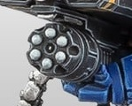

# 1194 堡主发射器 Castellan Launcher

精校状态：中文行文已逐段精校，部分术语仍为暂定

分类：武器 / 远程武器

原文来源：https://www.bilibili.com/opus/1003243380431388693

原作者：帝国神选罐头

原文时间：2024年11月24日 12:56

[返回分类目录](目录.md) · [全书目录](../../目录.md)

<!-- A1194-B0001 -->
**英文原文**

Castellan Launchers are a type of Rocket Launcher used by Primaris Space Marine Desolation Squads.

<!-- /A1194-B0001 -->

<!-- A1194-B0002 -->

原译文

堡主发射器是原铸星际战士寂灭者小队使用的一种火箭发射器。

**校订译文**

堡主发射器是原铸星际战士寂灭小队使用的一种火箭发射器。

<!-- /A1194-B0002 -->

<!-- A1194-B0003 -->
**英文原文**

These belt-fed sub-weapons are attached to the various rocket launchers used by Desolation Squads, such as the Superkrak Rocket Launcher, Superfrag Rocket Launcher, and Vengor Launcher. They saturate the sky with guided bomblets that are perfect for forcing enemies out of cover.

<!-- /A1194-B0003 -->

<!-- A1194-B0004 -->

原译文

这些用弹药带的次级武器附在寂灭者小队使用的各种火箭发射器上，如超级穿甲火箭发射器、超级破片火箭发射器和威格尔发射器。它们在天空中布满了小型制导炸弹，非常适合迫使敌人离开掩体。

**校订译文**

这类弹链供弹的辅助武器附装在寂灭小队的其他火箭发射器上，包括超级穿甲、超级破片和威格尔发射器。它能向空中倾泻小型制导炸弹，尤其适合逼迫敌人离开掩体。

<!-- /A1194-B0004 -->

<!-- A1194-B0005 图片 -->

<!-- A1194-B0006 -->

原译文

Castellan Launcher 堡主发射器

**校订译文**

Castellan Launcher 堡主发射器

<!-- /A1194-B0006 -->

本篇核心术语与暂定项

以下列出本篇出现的英文原形及核心术语表用词。同形词可能指不同对象，具体词义以本篇正文和校注为准；单复数、别名和仅见于图注的名称可能尚未列入。完整候选见[术语表](../../术语表/双语术语候选.csv)。

| 英文 | 采用中文 | 状态 |
| --- | --- | --- |
| Vengor Launcher | 威格尔发射器 | 暂定·官方待核 |
| Space Marine | 星际战士 | 暂定·官方待核 |
| Primaris Space Marine | 原铸星际战士 | 暂定·官方待核 |
| Castellan | 堡主 | 官方已核对 |
| Rocket Launcher | 火箭发射器 | 暂定·官方待核 |
| Superfrag Rocket Launcher | 超级破片火箭发射器 | 暂定·官方待核 |
| Superkrak Rocket Launcher | 超级穿甲火箭发射器 | 暂定·官方待核 |

