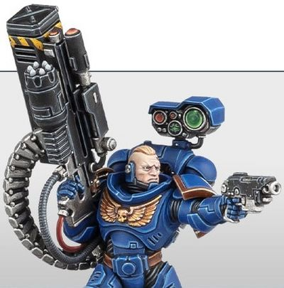

# 1195 威格尔发射器 Vengor Launcher

精校状态：中文行文已逐段精校，部分术语仍为暂定

分类：武器 / 远程武器

原文来源：https://www.bilibili.com/opus/1006596328267972640

原作者：帝国神选罐头

原文时间：2024年12月03日 13:47

[返回分类目录](目录.md) · [全书目录](../../目录.md)

<!-- A1195-B0001 -->
**英文原文**

Vengor Launchers are a type of Missile Launcher used by Primaris Space Marine Desolation Squad Sergeants.

<!-- /A1195-B0001 -->

<!-- A1195-B0002 -->

原译文

威格尔发射器是一种导弹发射器，由原铸星际战士寂灭者小队军士使用。

**校订译文**

威格尔发射器是一种由原铸星际战士寂灭小队军士使用的导弹发射器。

<!-- /A1195-B0002 -->

<!-- A1195-B0003 -->
## Description 描述

<!-- /A1195-B0003 -->

<!-- A1195-B0004 -->
**英文原文**

Vengor Launchers also come attached with a belt-fed Castellan Launcher, which can be fired separately. Together the two weapons provide maximum indirect fire and can wipe out whole squads before they ever come into view.

<!-- /A1195-B0004 -->

<!-- A1195-B0005 -->

原译文

威格尔发射器还配有带式堡主发射器，可以单独发射。这两种武器共同提供了最大的间接火力，可以在整个小队出现之前消灭他们。

**校订译文**

威格尔发射器附带一具弹链供弹、可以独立射击的堡主发射器。两者配合，能够发挥强大的间接火力，甚至在敌人进入视野之前，就将整支小队消灭。

<!-- /A1195-B0005 -->

<!-- A1195-B0006 图片 -->

<!-- A1195-B0007 -->

原译文

Desolation Squad Vengor Launcher 寂灭者小队威格尔发射器

**校订译文**

Desolation Squad Vengor Launcher 寂灭小队的威格尔发射器

<!-- /A1195-B0007 -->

本篇核心术语与暂定项

以下列出本篇出现的英文原形及核心术语表用词。同形词可能指不同对象，具体词义以本篇正文和校注为准；单复数、别名和仅见于图注的名称可能尚未列入。完整候选见[术语表](../../术语表/双语术语候选.csv)。

| 英文 | 采用中文 | 状态 |
| --- | --- | --- |
| Castellan Launcher | 堡主发射器 | 暂定·官方待核 |
| Desolation Squad | 寂灭小队 | 官方已核对 |
| Space Marine | 星际战士 | 暂定·官方待核 |
| Primaris Space Marine | 原铸星际战士 | 暂定·官方待核 |
| Castellan | 堡主 | 官方已核对 |
| Missile Launcher | 导弹发射器 | 暂定·官方待核 |

