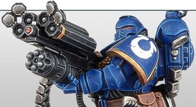

# 1196 超级破片火箭发射器 Superfrag Rocket Launcher

精校状态：中文行文已逐段精校，部分术语仍为暂定

分类：武器 / 远程武器

原文来源：https://www.bilibili.com/opus/1006185188208672790

原作者：帝国神选罐头

原文时间：2024年12月02日 11:12

[返回分类目录](目录.md) · [全书目录](../../目录.md)

<!-- A1196-B0001 -->
**英文原文**

Superfrag Rocket Launchers are a type of Rocket Launcher used by Primaris Space Marine Desolation Squads, which fire Frag Missiles.

<!-- /A1196-B0001 -->

<!-- A1196-B0002 -->

原译文

超级破片火箭发射器是原铸星际战士寂灭者小队使用的一种火箭发射器，用于发射破片导弹。

**校订译文**

超级破片火箭发射器是原铸星际战士寂灭小队使用的一种武器，用于发射破片导弹。

<!-- /A1196-B0002 -->

<!-- A1196-B0003 图片 -->

<!-- A1196-B0004 -->

原译文

Desolation Squad Superfrag Rocket Launcher 寂灭者小队超级破片火箭发射器

**校订译文**

Desolation Squad Superfrag Rocket Launcher 寂灭小队的超级破片火箭发射器

<!-- /A1196-B0004 -->

<!-- A1196-B0005 -->
## Description 描述

<!-- /A1196-B0005 -->

<!-- A1196-B0006 -->
**英文原文**

They have an effective range that exceeds even a sniper rifle, and are extremely effective against hordes of enemies. A single pull of the trigger will result in leaving nothing behind but a smouldering crater. Superfrag Rocket Launchers also come attached with a belt-fed Castellan Launcher, which can be fired separately.

<!-- /A1196-B0006 -->

<!-- A1196-B0007 -->

原译文

它们的有效射程甚至超过狙击步枪，对成群的敌人非常有效。扣动扳机只会留下一个闷燃的坑。超级破片火箭发射器还配有带式堡主发射器，可以单独发射。

**校订译文**

它的有效射程甚至超过狙击步枪，对密集敌群极为有效。一次击发便能将目标区域化为冒烟的弹坑。发射器还附带一具弹链供弹的堡主发射器，可以独立开火。

<!-- /A1196-B0007 -->

本篇核心术语与暂定项

以下列出本篇出现的英文原形及核心术语表用词。同形词可能指不同对象，具体词义以本篇正文和校注为准；单复数、别名和仅见于图注的名称可能尚未列入。完整候选见[术语表](../../术语表/双语术语候选.csv)。

| 英文 | 采用中文 | 状态 |
| --- | --- | --- |
| Sniper rifle | 狙击步枪 | 暂定·官方待核 |
| Castellan Launcher | 堡主发射器 | 暂定·官方待核 |
| Space Marine | 星际战士 | 暂定·官方待核 |
| Primaris Space Marine | 原铸星际战士 | 暂定·官方待核 |
| Castellan | 堡主 | 官方已核对 |
| Rocket Launcher | 火箭发射器 | 暂定·官方待核 |

