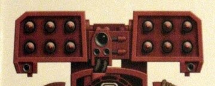

# 1198 旋风导弹发射器 Cyclone Missile Launcher

精校状态：中文行文已逐段精校，部分术语仍为暂定

分类：武器 / 远程武器

原文来源：https://www.bilibili.com/opus/1003608435475873831

原作者：帝国神选罐头

原文时间：2024年11月25日 12:33

[返回分类目录](目录.md) · [全书目录](../../目录.md)

<!-- A1198-B0001 -->
**英文原文**

The Cyclone Missile Launcher is a Missile Launcher variant specially designed to be fitted on Terminator Armour.

<!-- /A1198-B0001 -->

<!-- A1198-B0002 -->

原译文

旋风导弹发射器是一种专门设计用于安装在终结者装甲上的导弹发射器变体。

**校订译文**

旋风导弹发射器是专门为终结者装甲设计的导弹发射器改型。

<!-- /A1198-B0002 -->

<!-- A1198-B0003 图片 -->

<!-- A1198-B0004 -->

原译文

Cyclone Missile Launcher 旋风导弹发射器

**校订译文**

Cyclone Missile Launcher 旋风导弹发射器

<!-- /A1198-B0004 -->

<!-- A1198-B0005 -->
**英文原文**

Loaded with Krak and Frag Missiles, the Cyclone consists of two cube-shaped missile boxes, twin-linked, with a targeter and sensor array. The missile and sensor unit is fixed on the back of standard terminator armour, allowing the Space Marine to use a Storm Bolter and Power Fist with the Cyclone. Older designs of the Cyclone missile launcher had the sensor array hand-carried by the Terminator, thus taking away the option of a power fist but making it more accurate.

<!-- /A1198-B0005 -->

<!-- A1198-B0006 -->

原译文

旋风导弹发射器装载着穿甲和破片导弹，由两个立方体形状的导弹箱组成，双联，带有一个目标和传感器阵列。导弹和传感器单元固定在标准终结者装甲的背面，使星际战士能够在使用旋风导弹发射器同时使用风暴爆矢枪和动力拳。旋风导弹发射器的旧设计让终结者手持传感器阵列，从而取消了动力拳的选择，但使其更准确。

**校订译文**

旋风导弹发射器由两个联动的立方形导弹箱组成，可装填穿甲与破片导弹，并配有瞄准器和传感器阵列。导弹与传感器组件安装在标准终结者装甲背部，让星际战士在使用发射器时，仍能同时持有风暴爆矢枪与动力拳。旧式设计则要求终结者手持传感器阵列，牺牲了装备动力拳的空间，却能获得更高的精度。

<!-- /A1198-B0006 -->

<!-- A1198-B0007 -->
**英文原文**

The forerunner of this weapon was mounted (and still mounted in M41) on the Javelin Attack Speeder - anti-grav relic vehicles of the Great Crusade.

<!-- /A1198-B0007 -->

<!-- A1198-B0008 -->

原译文

这种武器的前身被安装在（现在仍然安装在M41中）标枪突击速攻艇上，这是大远征的反重力圣物载具。

**校订译文**

这种武器的前身安装在标枪突击速攻艇上；这些源自大远征时代的反重力载具作为遗物留存至第41个千年，仍在使用该型号。

<!-- /A1198-B0008 -->

本篇核心术语与暂定项

以下列出本篇出现的英文原形及核心术语表用词。同形词可能指不同对象，具体词义以本篇正文和校注为准；单复数、别名和仅见于图注的名称可能尚未列入。完整候选见[术语表](../../术语表/双语术语候选.csv)。

| 英文 | 采用中文 | 状态 |
| --- | --- | --- |
| Terminator | 终结者 | 官方已核对 |
| Great Crusade | 大远征 | 暂定·官方待核 |
| Space Marine | 星际战士 | 暂定·官方待核 |
| Missile Launcher | 导弹发射器 | 暂定·官方待核 |
| Cyclone Missile Launcher | 旋风导弹发射器 | 暂定·官方待核 |
| Bolter | 爆矢枪 | 暂定·官方待核 |
| Storm bolter | 风暴爆矢枪 | 官方已核对 |
| Power fist | 动力拳 | 官方已核对 |
| Terminator Armour | 终结者盔甲 | 暂定·官方待核 |
| Javelin Attack Speeder | 标枪突击艇 | 暂定·官方待核 |

