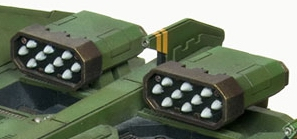

# 1200 复仇发射器 Vengeance Launcher

精校状态：中文行文已逐段精校，部分术语仍为暂定

分类：武器 / 远程武器

原文来源：https://www.bilibili.com/opus/1012483590263406612

原作者：帝国神选罐头

原文时间：2024年12月19日 10:33

[返回分类目录](目录.md) · [全书目录](../../目录.md)

<!-- A1200-B0001 -->
**英文原文**

The Vengeance Launcher is a weapon found on the Space Marine Storm Eagle Gunship. Consisting of a multi-chambered rocket battery, the Vengeance Launcher saturates the targeted area with anti-personnel fragmentation rounds. Designed for close range combat, the Vengeance Launcher allows the Storm Eagle to both clear a landing zone and provide supporting fire to Space Marines it brings to the battlefield.

<!-- /A1200-B0001 -->

<!-- A1200-B0002 -->

原译文

复仇发射器是在星际战士风暴鹰炮艇上发现的一种武器。复仇发射器由一排多管火箭组成，用杀伤人员破片弹饱和轰炸目标区域。复仇发射器专为近距离作战而设计，它允许风暴鹰清除着陆区，并为其带到战场的星际战士提供支援火力。

**校订译文**

复仇发射器是星际战士风暴鹰炮艇的武器之一，由多腔火箭发射装置组成，使用反人员破片弹对目标区域实施饱和轰击。它专为近距离战斗设计，既能扫清着陆区，也能为炮艇运送到战场的星际战士提供火力支援。

<!-- /A1200-B0002 -->

<!-- A1200-B0003 图片 -->

<!-- A1200-B0004 -->

原译文

Vengeance Launcher on the Storm Eagle Gunship 风暴鹰炮艇上的复仇发射器

**校订译文**

Vengeance Launcher on the Storm Eagle Gunship 风暴鹰炮艇上的复仇发射器

<!-- /A1200-B0004 -->

本篇核心术语与暂定项

以下列出本篇出现的英文原形及核心术语表用词。同形词可能指不同对象，具体词义以本篇正文和校注为准；单复数、别名和仅见于图注的名称可能尚未列入。完整候选见[术语表](../../术语表/双语术语候选.csv)。

| 英文 | 采用中文 | 状态 |
| --- | --- | --- |
| Space Marines | 星际战士 | 官方已核对 |
| Clear | 清明 | 暂定·官方待核 |
| Space Marine | 星际战士 | 暂定·官方待核 |
| Storm Eagle Gunship | 风暴鹰炮艇 | 暂定·官方待核 |
| Vengeance | 复仇号 | 暂定·官方待核 |
| Vengeance Launcher | 复仇发射器 | 暂定·官方待核 |

