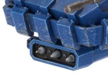

# 1201 三头犬发射器 Cerberus Launcher

精校状态：中文行文已逐段精校，部分术语仍为暂定

分类：武器 / 远程武器

原文来源：https://www.bilibili.com/opus/1003608259361243192

原作者：帝国神选罐头

原文时间：2024年11月25日 12:32

[返回分类目录](目录.md) · [全书目录](../../目录.md)

<!-- A1201-B0001 -->
**英文原文**

The Cerberus Launcher is an Imperial weapon commonly mounted on Space Marine Land Speeder Storms. This tri-barreled launcher can launch fragmentation or stun rockets.

<!-- /A1201-B0001 -->

<!-- A1201-B0002 -->

原译文

三头犬发射器是一种帝国武器，通常安装在星际战士风暴兰德速攻艇上。这种三管发射器可以发射破片或眩晕火箭。

**校订译文**

三头犬发射器是一种帝国武器，通常安装在星际战士风暴型兰德速攻艇上。它有三根发射管，可发射破片火箭或眩晕火箭。

<!-- /A1201-B0002 -->

<!-- A1201-B0003 图片 -->

<!-- A1201-B0004 -->

原译文

Cerberus Launcher 三头犬发射器

**校订译文**

Cerberus Launcher 三头犬发射器

<!-- /A1201-B0004 -->

本篇核心术语与暂定项

以下列出本篇出现的英文原形及核心术语表用词。同形词可能指不同对象，具体词义以本篇正文和校注为准；单复数、别名和仅见于图注的名称可能尚未列入。完整候选见[术语表](../../术语表/双语术语候选.csv)。

| 英文 | 采用中文 | 状态 |
| --- | --- | --- |
| Space Marine | 星际战士 | 暂定·官方待核 |
| Cerberus Launcher | 三头犬发射器 | 暂定·官方待核 |

