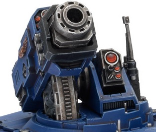

# 1202 天矛导弹发射器 Skyspear Missile Launcher

精校状态：中文行文已逐段精校，部分术语仍为暂定

分类：武器 / 远程武器

原文来源：https://www.bilibili.com/opus/1006184960589037573

原作者：帝国神选罐头

原文时间：编辑于 2024年12月05日 20:27

[返回分类目录](目录.md) · [全书目录](../../目录.md)

<!-- A1202-B0001 -->
**英文原文**

The Skyspear Missile Launcher is a type of surface-to-air Missile Launcher mounted on Space Marine Hunters. These launchers are able to fire a salvo of missiles, each of which is guided by the interred remains of a Chapter Serf, using the brain to enhance the advanced targeting systems incorporated in a Skyspear Missile.

<!-- /A1202-B0001 -->

<!-- A1202-B0002 -->

原译文

天矛导弹发射器是一种安装在星际战士猎手战车身上的地对空导弹发射器。这些发射器能够发射一系列导弹，每一枚导弹都由埋葬的战团侍从遗骸中的大脑引导天矛导弹中包含的先进瞄准系统。

**校订译文**

天矛导弹发射器是安装在星际战士猎手战车上的地对空武器，能够齐射多枚导弹。每枚天矛导弹内都封存着一名战团农奴的遗骸，利用其大脑强化先进的瞄准系统，引导导弹命中目标。

<!-- /A1202-B0002 -->

<!-- A1202-B0003 图片 -->

<!-- A1202-B0004 -->

原译文

Skyspear Missile Launcher 天矛导弹发射器

**校订译文**

Skyspear Missile Launcher 天矛导弹发射器

<!-- /A1202-B0004 -->

<!-- A1202-B0005 -->
**英文原文**

The missile itself is extremely powerful, able to blow apart Tau Barracudas to Eldar Vampire Raiders. It can even destroy creatures such as Bloodthirsters and Hive Tyrants.

<!-- /A1202-B0005 -->

<!-- A1202-B0006 -->

原译文

导弹本身非常强大，能够炸毁从钛梭鱼战机到灵族吸血鬼掠袭者战机。它甚至可以摧毁渴血者和蜂巢暴君等生物。

**校订译文**

天矛导弹威力强大，既能炸毁钛族梭鱼战机，也能击落灵族吸血鬼掠袭者，甚至足以消灭嗜血狂魔和虫巢暴君。

<!-- /A1202-B0006 -->

<!-- A1202-B0007 -->
**英文原文**

The Skyspear Missile Launcher can also be used as a stationary anti-aircraft installation as part of a wider network of air-defence systems.

<!-- /A1202-B0007 -->

<!-- A1202-B0008 -->

原译文

天矛导弹发射器也可以作为更广泛的防空网络系统的一部分用作固定防空设施。

**校订译文**

天矛导弹发射器也可作为固定防空设施，接入更大规模的防空网络。

<!-- /A1202-B0008 -->

本篇核心术语与暂定项

以下列出本篇出现的英文原形及核心术语表用词。同形词可能指不同对象，具体词义以本篇正文和校注为准；单复数、别名和仅见于图注的名称可能尚未列入。完整候选见[术语表](../../术语表/双语术语候选.csv)。

| 英文 | 采用中文 | 状态 |
| --- | --- | --- |
| Eldar | 灵族 | 暂定·语境区分 |
| Chapter Serf | 战团农奴 | 暂定·官方待核 |
| Space Marine | 星际战士 | 暂定·官方待核 |
| Chapter | 战团 | 暂定·官方待核 |
| Missile Launcher | 导弹发射器 | 暂定·官方待核 |
| Skyspear Missile Launcher | 天矛导弹发射器 | 暂定·官方待核 |
| Skyspear Missile | 天矛导弹 | 暂定·官方待核 |

