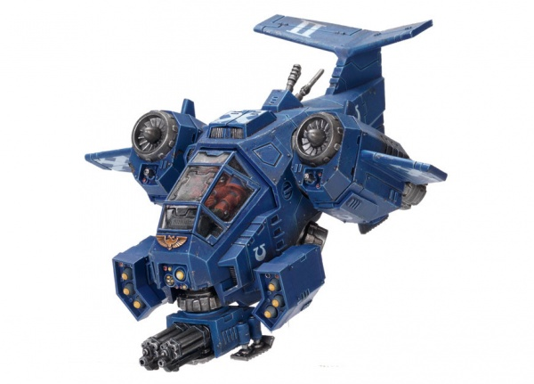

# 1203 天锤导弹发射器 Skyhammer Missile Launcher

精校状态：中文行文已逐段精校，部分术语仍为暂定

分类：武器 / 远程武器

原文来源：https://www.bilibili.com/opus/1005823405916684292

原作者：帝国神选罐头

原文时间：2024年12月01日 11:48

[返回分类目录](目录.md) · [全书目录](../../目录.md)

<!-- A1203-B0001 -->
**英文原文**

The Skyhammer Missile Launcher is a Missile Launcher platform employed on Space Marine Stormtalon Gunships. These weapons fire a volley of hyper-velocity missiles that smash into their targets and are ideal tank-killers.

<!-- /A1203-B0001 -->

<!-- A1203-B0002 -->

原译文

天锤导弹发射器是一种用于星际战士风暴爪炮艇的导弹发射器平台。这些武器发射一系列超高速导弹，击中目标，是理想的坦克杀手。

**校订译文**

天锤导弹发射器是星际战士风暴爪炮艇搭载的导弹武器平台，能齐射超高速导弹，猛烈撞击目标，是理想的反坦克武器。

<!-- /A1203-B0002 -->

<!-- A1203-B0003 图片 -->

<!-- A1203-B0004 -->

原译文

Stormtalon with Skyhammer Missile Launchers 装备天锤导弹发射器的风暴爪

**校订译文**

Stormtalon with Skyhammer Missile Launchers 装备天锤导弹发射器的风暴爪

<!-- /A1203-B0004 -->

本篇核心术语与暂定项

以下列出本篇出现的英文原形及核心术语表用词。同形词可能指不同对象，具体词义以本篇正文和校注为准；单复数、别名和仅见于图注的名称可能尚未列入。完整候选见[术语表](../../术语表/双语术语候选.csv)。

| 英文 | 采用中文 | 状态 |
| --- | --- | --- |
| Space Marine | 星际战士 | 暂定·官方待核 |
| Missile Launcher | 导弹发射器 | 暂定·官方待核 |
| Skyhammer Missile Launcher | 天锤导弹发射器 | 暂定·官方待核 |

