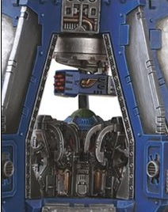

# 1205 死风导弹发射器 Deathwind missile launcher

精校状态：中文行文已逐段精校，部分术语仍为暂定

分类：武器 / 远程武器

原文来源：https://www.bilibili.com/opus/1003608525665992833

原作者：帝国神选罐头

原文时间：2024年11月25日 12:33

[返回分类目录](目录.md) · [全书目录](../../目录.md)

<!-- A1205-B0001 -->
**英文原文**

Deathwind missile launchers are weapons equipped on Space Marine Drop Pods. They replace the standard Storm Bolter, offering short-range explosive support fire.

<!-- /A1205-B0001 -->

<!-- A1205-B0002 -->

原译文

死风导弹发射器是装备在星际战士空投舱上的武器。它们取代了标准的风暴爆矢枪，提供短程爆炸支援火力。

**校订译文**

死风导弹发射器是星际战士空降舱可搭载的武器，以它替换标准风暴爆矢枪后，便能提供短距离爆炸火力支援。

<!-- /A1205-B0002 -->

<!-- A1205-B0003 -->
**英文原文**

They may be deployed en masse as a Deathwind Orbital Strike Force.

<!-- /A1205-B0003 -->

<!-- A1205-B0004 -->

原译文

它们可能会作为死风轨道打击部队大规模部署。

**校订译文**

这类武器还可大批部署，组成死风轨道打击部队。

<!-- /A1205-B0004 -->

<!-- A1205-B0005 图片 -->

<!-- A1205-B0006 -->

原译文

Drop Pod with Deathwind missile launchers 配备死风导弹发射器的空投舱

**校订译文**

Drop Pod with Deathwind missile launchers 配备死风导弹发射器的空降舱

<!-- /A1205-B0006 -->

本篇核心术语与暂定项

以下列出本篇出现的英文原形及核心术语表用词。同形词可能指不同对象，具体词义以本篇正文和校注为准；单复数、别名和仅见于图注的名称可能尚未列入。完整候选见[术语表](../../术语表/双语术语候选.csv)。

| 英文 | 采用中文 | 状态 |
| --- | --- | --- |
| Space Marine | 星际战士 | 暂定·官方待核 |
| Missile Launchers | 导弹发射器 | 暂定·官方待核 |
| Deathwind Orbital Strike Force | 死风轨道打击部队 | 暂定·官方待核 |
| Bolter | 爆矢枪 | 暂定·官方待核 |
| Storm bolter | 风暴爆矢枪 | 官方已核对 |

