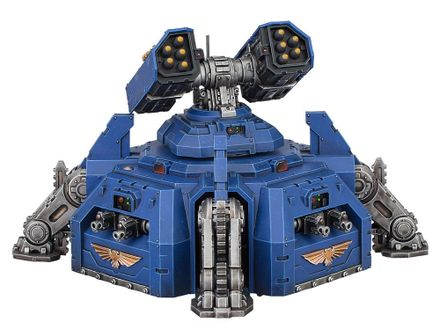

# 1206 落锤导弹发射器 Hammerfall Missile Launcher

精校状态：中文行文已逐段精校，部分术语仍为暂定

分类：武器 / 远程武器

原文来源：https://www.bilibili.com/opus/1003958324963573764

原作者：帝国神选罐头

原文时间：2024年11月26日 11:11

[返回分类目录](目录.md) · [全书目录](../../目录.md)

<!-- A1206-B0001 -->
**英文原文**

The Hammerfall Missile Launcher is a type of missile weapon mounted on the tops of Hammerfall Bunkers.

<!-- /A1206-B0001 -->

<!-- A1206-B0002 -->

原译文

落锤导弹发射器是一种安装在落锤堡顶部的导弹武器。

**校订译文**

落锤导弹发射器是一种安装在落锤堡顶部的导弹武器。

<!-- /A1206-B0002 -->

<!-- A1206-B0003 图片 -->

<!-- A1206-B0004 -->

原译文

Hammerfall Bunker with Hammerfall Missile Launcher 带落锤导弹发射器的落锤堡

**校订译文**

Hammerfall Bunker with Hammerfall Missile Launcher 带落锤导弹发射器的落锤堡

<!-- /A1206-B0004 -->

本篇核心术语与暂定项

以下列出本篇出现的英文原形及核心术语表用词。同形词可能指不同对象，具体词义以本篇正文和校注为准；单复数、别名和仅见于图注的名称可能尚未列入。完整候选见[术语表](../../术语表/双语术语候选.csv)。

| 英文 | 采用中文 | 状态 |
| --- | --- | --- |
| Missile Launcher | 导弹发射器 | 暂定·官方待核 |
| Hammerfall Missile Launcher | 落锤导弹发射器 | 暂定·官方待核 |

