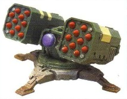

# 1208 许珀里翁导弹发射器 Hyperios Missile Launcher

精校状态：中文行文已逐段精校，部分术语仍为暂定

分类：武器 / 远程武器

原文来源：https://www.bilibili.com/opus/1004737814315663379

原作者：帝国神选罐头

原文时间：2024年11月28日 13:35

[返回分类目录](目录.md) · [全书目录](../../目录.md)

<!-- A1208-B0001 -->
**英文原文**

The Hyperios Missile Launcher is a specialized, anti-aircraft missile launcher mounted on Space Marine Whirlwind Hyperios. It is capable of firing up to twenty Hyperios missiles at fast, low-flying targets, making it ideal for defense against ground-attack craft making strafing runs.

<!-- /A1208-B0001 -->

<!-- A1208-B0002 -->

原译文

许珀里翁导弹发射器是一种安装在星际战士许珀里翁型旋风战车上的专用防空导弹发射器。它能够向快速、低空飞行的目标发射多达20枚许珀里翁导弹，使其成为防御地面攻击艇扫射的理想选择。

**校订译文**

许珀里翁导弹发射器是星际战士许珀里翁型旋风战车使用的专用防空武器，可向快速低飞的目标发射多达二十枚导弹，尤其适合拦截实施扫射的对地攻击机。

<!-- /A1208-B0002 -->

<!-- A1208-B0003 -->
**英文原文**

Due to a lack of manpower for dedicated air defense units in Space Marine Chapters, It is common for Hyperios Missile Launchers equipped with automated remotely-activated defense systems to be utilized by Space Marine forces for local air defense. These automated platforms are dropped in by Thunderhawks, activated by the chapters Techmarines, and can be monitored via command vehicles.

<!-- /A1208-B0003 -->

<!-- A1208-B0004 -->

原译文

由于星际战士战团缺乏专门的防空部队，配备自动远程激活防御系统的许珀里翁导弹发射器被星际战士用于当地防空是很常见的。这些自动化平台由雷鹰炮艇投放，由战团技术军士激活，并可通过指挥车进行监控。

**校订译文**

星际战士战团兵力有限，难以编成专门的防空部队，因此常以配有遥控启动装置的自动化许珀里翁发射器承担局地防空任务。这些平台由雷鹰炮艇运送投放，交由战团科技战士启动，再通过指挥车监控。

<!-- /A1208-B0004 -->

<!-- A1208-B0005 图片 -->

<!-- A1208-B0006 -->

原译文

automated Hyperios Missile launcher 自动许珀里翁导弹发射器

**校订译文**

automated Hyperios Missile launcher 自动许珀里翁导弹发射器

<!-- /A1208-B0006 -->

<!-- A1208-B0007 -->
## Hyperios Missile 许珀里翁导弹

<!-- /A1208-B0007 -->

<!-- A1208-B0008 -->
**英文原文**

The Hyperios Anti-Aircraft Missile functions in a similar fashion to a Hunter-Killer Missile. Tracking equipment within the missile locks onto a target, which feeds information to a logis-engine. Once fired, the logis-engine manipulates the missile's fins in order match the target's movements, avoid obstacles, and destroy it. Most of the missile's mass is taken up by fuel needed to intercept fast-moving targets, allowing it to fly short distances at high velocity. The Hyperios missile does not contain enough fuel to reach high-altitude targets, which are better suited to Manticore AA missiles.

<!-- /A1208-B0008 -->

<!-- A1208-B0009 -->

原译文

许珀里翁防空导弹的功能与猎杀飞弹相似。导弹内的跟踪设备锁定目标，并将信息传递给逻辑引擎。发射后，逻辑引擎操纵导弹的稳定翼，以匹配目标的运动，避开障碍物并摧毁它。导弹的大部分质量被拦截快速移动目标所需的燃料所占据，使其能够高速短距离飞行。许珀里翁导弹的燃料不足以抵达高空目标，而高空目标更适合蝎尾狮对空导弹。

**校订译文**

许珀里翁防空导弹的工作原理与猎杀导弹相似。弹内追踪设备锁定目标，将信息传给逻辑引擎；发射后，逻辑引擎控制舵翼，跟随目标运动、绕过障碍，直至命中。为拦截高速目标，燃料占了导弹重量的大部分，使其能在短距离内高速飞行。但它的燃料不足以攻击高空目标，此类任务更适合交由蝎尾狮防空导弹执行。

**校注：** 对照本段英文确认同一实体，与全书核心译名统一；不改变同形异义词或省略称呼。

<!-- /A1208-B0009 -->

<!-- A1208-B0010 -->
**英文原文**

Due to the versatility of its tracking equipment the missile can also be used against ground targets, although this is often a case of last resort for a Space Marine Commander.

<!-- /A1208-B0010 -->

<!-- A1208-B0011 -->

原译文

由于其追踪设备的多功能性，该导弹也可用于打击地面目标，尽管这通常是星际战士指挥官的最后手段。

**校订译文**

追踪设备用途广泛，因此许珀里翁导弹也能攻击地面目标，不过星际战士指挥官通常只在不得已时这样使用。

<!-- /A1208-B0011 -->

本篇核心术语与暂定项

以下列出本篇出现的英文原形及核心术语表用词。同形词可能指不同对象，具体词义以本篇正文和校注为准；单复数、别名和仅见于图注的名称可能尚未列入。完整候选见[术语表](../../术语表/双语术语候选.csv)。

| 英文 | 采用中文 | 状态 |
| --- | --- | --- |
| Equipment | 装备 | 编辑用语已统一 |
| Hunter-Killer | 猎杀者 | 暂定·官方待核 |
| Whirlwind | 旋风战车 | 官方已核对 |
| Logis | 逻辑士 | 暂定·官方待核 |
| Space Marine | 星际战士 | 暂定·官方待核 |
| Space Marine Commander | 星际战士指挥官 | 暂定·官方待核 |
| Missile Launchers | 导弹发射器 | 暂定·官方待核 |
| Missile Launcher | 导弹发射器 | 暂定·官方待核 |
| Hunter-killer missile | 猎杀导弹 | 官方已核对 |
| Hyperios Missile Launcher | 许珀里翁导弹发射器 | 暂定·官方待核 |
| Hyperios Missile | 许珀里翁导弹 | 暂定·官方待核 |
| Manticore | 蝎尾狮导弹车 | 官方已核对 |
| Whirlwind Hyperios | 许珀里翁型旋风战车 | 暂定·官方待核 |

