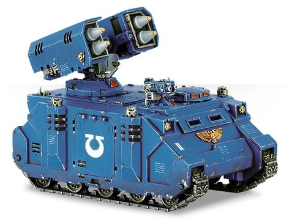

# 1209 旋风多管导弹发射器 Whirlwind multiple missile launcher

精校状态：中文行文已逐段精校，部分术语仍为暂定

分类：武器 / 远程武器

原文来源：https://www.bilibili.com/opus/1006986457314754581

原作者：帝国神选罐头

原文时间：2024年12月04日 15:01

[返回分类目录](目录.md) · [全书目录](../../目录.md)

<!-- A1209-B0001 -->
**英文原文**

The Whirlwind multiple missile launcher is mounted on the Space Marine Whirlwind vehicle. It is capable of firing various types of missiles, the most common types being the standard Vengeance missile or Incendiary Castellan missile.

<!-- /A1209-B0001 -->

<!-- A1209-B0002 -->

原译文

旋风多管导弹发射器安装在星际战士旋风载具上。它能够发射各种类型的导弹，最常见的类型是标准的复仇导弹或燃烧堡主导弹。

**校订译文**

旋风多管导弹发射器安装在星际战士旋风战车上，可发射多种导弹，其中最常见的是标准复仇导弹和燃烧堡主导弹。

<!-- /A1209-B0002 -->

<!-- A1209-B0003 图片 -->

<!-- A1209-B0004 -->

原译文

Mk.IIb Whirlwind multiple missile launcher Mk.IIb旋风多管导弹发射器

**校订译文**

Mk.IIb Whirlwind multiple missile launcher Mk.IIb旋风多管导弹发射器

<!-- /A1209-B0004 -->

<!-- A1209-B0005 -->
**英文原文**

The Whirlwind can be loaded with multiple types of munitions, but can only launch one type at a time. The most current versions of the launcher, are either 2 pods of 5 missiles each, fired in tandem pairs, or larger missiles fired one at a time from 2 pods of 2 missiles each.

<!-- /A1209-B0005 -->

<!-- A1209-B0006 -->

原译文

旋风可以装载多种类型的弹药，但一次只能发射一种。最新版本的发射器要么是2个舱室，每个舱室5枚导弹，成对发射，要么是更大的导弹，每个舱室2枚导弹，一次发射一枚。

**校订译文**

旋风可装载不同弹种，但同一轮射击只能使用一种。底稿所述的较新型号有两种配置：一种有两个发射舱，每舱五枚导弹，以两枚一组联动发射；另一种装填更大的导弹，两个舱各容纳两枚，每次单发。

<!-- /A1209-B0006 -->

本篇核心术语与暂定项

以下列出本篇出现的英文原形及核心术语表用词。同形词可能指不同对象，具体词义以本篇正文和校注为准；单复数、别名和仅见于图注的名称可能尚未列入。完整候选见[术语表](../../术语表/双语术语候选.csv)。

| 英文 | 采用中文 | 状态 |
| --- | --- | --- |
| Whirlwind | 旋风战车 | 官方已核对 |
| Space Marine | 星际战士 | 暂定·官方待核 |
| Castellan | 堡主 | 官方已核对 |
| Vengeance | 复仇号 | 暂定·官方待核 |
| Missile Launcher | 导弹发射器 | 暂定·官方待核 |
| Whirlwind multiple missile launcher | 旋风多管导弹发射器 | 暂定·官方待核 |
| Vengeance Missile | 复仇导弹 | 暂定·官方待核 |
| Castellan Missile | 堡主导弹 | 暂定·官方待核 |
| Incendiary Castellan Missile | 燃烧堡主导弹 | 暂定·官方待核 |

