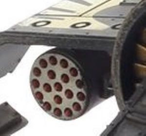

# 1210 火箭吊舱 Rocket Pod

精校状态：中文行文已逐段精校，部分术语仍为暂定

分类：武器 / 远程武器

原文来源：https://www.bilibili.com/opus/1002866067560726537

原作者：帝国神选罐头

原文时间：2024年11月23日 12:32

[返回分类目录](目录.md) · [全书目录](../../目录.md)

<!-- A1210-B0001 -->
**英文原文**

Rocket Pods, aka Multiple Rocket Pods, are weapons most commonly mounted on Imperial Aircraft such as the Vulture Gunship or Valkyrie.

<!-- /A1210-B0001 -->

<!-- A1210-B0002 -->

原译文

火箭吊舱，又名多管火箭吊舱，是帝国飞机上最常见的武器，如秃鹫炮舰或瓦尔基里。

**校订译文**

火箭吊舱又称多管火箭吊舱，最常搭载于秃鹫炮艇、女武神炮艇等帝国飞行器上。

<!-- /A1210-B0002 -->

<!-- A1210-B0003 图片 -->

<!-- A1210-B0004 -->

原译文

Vulture Rocket Pod 秃鹫火箭吊舱

**校订译文**

Vulture Rocket Pod 秃鹫火箭吊舱

<!-- /A1210-B0004 -->

<!-- A1210-B0005 -->
**英文原文**

They work by firing large numbers of small fragmentation rockets, covering a large area in lethal shrapnel. They are an anti-infantry weapon and are particularly effective against high density concentrations of poorly-armoured opponents.

<!-- /A1210-B0005 -->

<!-- A1210-B0006 -->

原译文

他们通过发射大量小型破片火箭来工作，用致命的弹片覆盖大片区域。它们是一种反步兵武器，对高密度集中的装甲较差的对手特别有效。

**校订译文**

它们发射大量小型破片火箭，以致命破片覆盖大片区域。这是一类反步兵武器，对密集聚集、装甲防护薄弱的敌人尤其有效。

<!-- /A1210-B0006 -->

本篇核心术语与暂定项

以下列出本篇出现的英文原形及核心术语表用词。同形词可能指不同对象，具体词义以本篇正文和校注为准；单复数、别名和仅见于图注的名称可能尚未列入。完整候选见[术语表](../../术语表/双语术语候选.csv)。

| 英文 | 采用中文 | 状态 |
| --- | --- | --- |
| Valkyrie | 女武神炮艇 | 官方已核对 |

