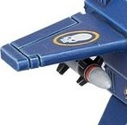

# 1216 风暴之怒导弹 Stormfury Missile

精校状态：中文行文已逐段精校，部分术语仍为暂定

分类：武器 / 远程武器

原文来源：https://www.bilibili.com/opus/1006185033610821632

原作者：帝国神选罐头

原文时间：2024年12月02日 11:11

[返回分类目录](目录.md) · [全书目录](../../目录.md)

<!-- A1216-B0001 -->
**英文原文**

The Stormfury Missile is a type of heavy missile launched from the Storm Speeder Thunderstrike.

<!-- /A1216-B0001 -->

<!-- A1216-B0002 -->

原译文

风暴之怒导弹是一种从雷击型风暴速攻艇发射的重型导弹。

**校订译文**

风暴之怒导弹是一种从雷击型风暴速攻艇发射的重型导弹。

<!-- /A1216-B0002 -->

<!-- A1216-B0003 图片 -->

<!-- A1216-B0004 -->

原译文

Stormfury Missile 风暴之怒导弹

**校订译文**

Stormfury Missile 风暴之怒导弹

<!-- /A1216-B0004 -->

本篇核心术语与暂定项

以下列出本篇出现的英文原形及核心术语表用词。同形词可能指不同对象，具体词义以本篇正文和校注为准；单复数、别名和仅见于图注的名称可能尚未列入。完整候选见[术语表](../../术语表/双语术语候选.csv)。

| 英文 | 采用中文 | 状态 |
| --- | --- | --- |
| Storm Speeder | 风暴速攻艇 | 暂定·官方待核 |
| Stormfury Missile | 风暴之怒导弹 | 暂定·官方待核 |
| Storm Speeder Thunderstrike | 雷霆型风暴速攻艇 | 官方已核对 |

