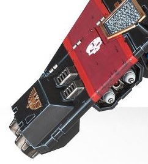

# 1217 风暴打击导弹 Stormstrike Missile

精校状态：中文行文已逐段精校，部分术语仍为暂定

分类：武器 / 远程武器

原文来源：https://www.bilibili.com/opus/1006185102300938264

原作者：帝国神选罐头

原文时间：2024年12月02日 11:12

[返回分类目录](目录.md) · [全书目录](../../目录.md)

<!-- A1217-B0001 -->
**英文原文**

Stormstrike Missiles are a type of Missile used by Space Marines. They detonate with a thunderous boom that leaves those caught in the blast reeling and disorientated. They are employed by Stormraven Gunship, Stormfang, and Corvus Blackstar gunships.

<!-- /A1217-B0001 -->

<!-- A1217-B0002 -->

原译文

风暴打击导弹是星际战士使用的一种导弹。它们以雷鸣般的爆炸声引爆，让那些被困在爆炸中的人头晕目眩。他们用于风暴鸦炮艇、风暴牙和黑星渡鸦炮艇。

**校订译文**

风暴打击导弹是星际战士使用的一种导弹，爆炸时发出雷鸣般的轰响，使爆炸范围内的敌人踉跄失衡、丧失方向感。风暴鸦炮艇、风暴牙和黑星渡鸦炮艇都可搭载这种武器。

<!-- /A1217-B0002 -->

<!-- A1217-B0003 图片 -->

<!-- A1217-B0004 -->

原译文

Stormstrike missile launcher on the wing of a Corvus Blackstar 黑星渡鸦机翼上的风暴打击导弹发射器

**校订译文**

Stormstrike missile launcher on the wing of a Corvus Blackstar 黑星渡鸦机翼上的风暴打击导弹发射器

<!-- /A1217-B0004 -->

本篇核心术语与暂定项

以下列出本篇出现的英文原形及核心术语表用词。同形词可能指不同对象，具体词义以本篇正文和校注为准；单复数、别名和仅见于图注的名称可能尚未列入。完整候选见[术语表](../../术语表/双语术语候选.csv)。

| 英文 | 采用中文 | 状态 |
| --- | --- | --- |
| Space Marines | 星际战士 | 官方已核对 |
| Stormraven Gunship | 风暴鸦炮艇 | 官方已核 |
| Corvus Blackstar | 黑星渡鸦 | 官方已核 |

