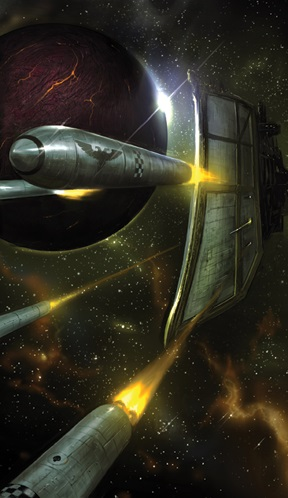
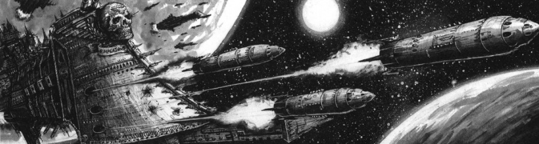
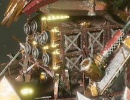
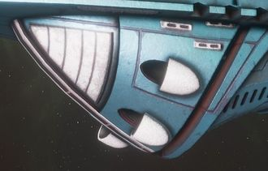
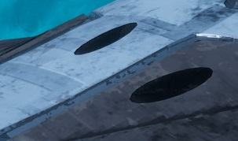
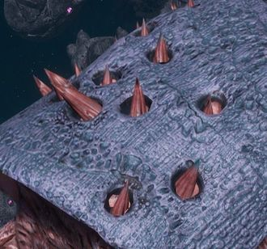

# 1218 鱼雷 Torpedo

精校状态：中文行文已逐段精校，部分术语仍为暂定

分类：武器 / 远程武器

原文来源：https://www.bilibili.com/opus/1211786367912116232

原作者：帝国神选罐头

原文时间：2026年06月09日 12:30

[返回分类目录](目录.md) · [全书目录](../../目录.md)

<!-- A1218-B0001 -->
**英文原文**

Torpedo is the name used for any long range missile carried by a space ship or used in a space battle.

<!-- /A1218-B0001 -->

<!-- A1218-B0002 -->

原译文

鱼雷是指由太空舰携带或用于太空战的任何远程导弹。

**校订译文**

鱼雷是指由太空舰携带或用于太空战的任何远程导弹。

<!-- /A1218-B0002 -->

<!-- A1218-B0003 -->
## Overview 概述

<!-- /A1218-B0003 -->

<!-- A1218-B0004 -->
**英文原文**

Some are used in local planetary defence networks while others can be launched from the planet surface, although they are required to traverse the planet's atmosphere. Anti-ship torpedoes are up to 200 feet in length and are powered by a plasma reactor, which makes up part of the warhead as well as the method of propulsion. Standard torpedoes move in a straight line and have limited sensing and targeting abilities, turning to intercept if they come within a few thousand kilometres of their target, although often they will still miss.

<!-- /A1218-B0004 -->

<!-- A1218-B0005 -->

原译文

一些用于本地行星防御网络，而另一些则可以从行星表面发射，尽管它们需要穿过行星的大气层。反舰鱼雷的长度可达200英尺，由等离子反应堆提供动力，该反应堆构成了弹头的一部分以及推进方法。标准鱼雷呈直线运动，传感和瞄准能力有限，如果它们在距离目标几千公里以内就会转向拦截，尽管它们通常仍会错过。

**校订译文**

部分鱼雷部署在行星防御网络中，另一些则能从地表发射，穿过大气层攻击目标。反舰鱼雷最长可达200英尺，以等离子反应堆提供动力；反应堆既承担推进功能，也是弹头的一部分。标准鱼雷通常沿直线前进，传感与瞄准能力有限，进入距目标数千千米的范围后才会转向拦截，即便如此仍常常落空。

<!-- /A1218-B0005 -->

<!-- A1218-B0006 图片 -->

<!-- A1218-B0007 -->

原译文

Imperial Navy Warship firing a salvo of Torpedoes 帝国海军战舰鱼雷齐射

**校订译文**

Imperial Navy Warship firing a salvo of Torpedoes 帝国海军战舰鱼雷齐射

<!-- /A1218-B0007 -->

<!-- A1218-B0008 -->
**英文原文**

Torpedoes are highly effective weapons in space combat. They are so small and fast that only defence turrets and fighters can catch and destroy them easily before they impact, although using weapons batteries, lances and Nova cannons can prove effective if the captain is desperate enough.

<!-- /A1218-B0008 -->

<!-- A1218-B0009 -->

原译文

鱼雷是太空作战中非常有效的武器。它们又小又快，只有防御炮塔和战斗机才能在它们撞击之前轻易地抓住并摧毁它们，尽管如果船长足够绝望，使用武器阵列、光矛和新星炮可以被证明是有效的。

**校订译文**

鱼雷是太空战中十分有效的武器。它们体积小、速度快，通常只有防御炮塔和战斗机能够较容易地在命中前将其拦截。舰长若已别无选择，也可动用武器阵列、光矛甚至新星炮尝试摧毁来袭鱼雷。

<!-- /A1218-B0009 -->

<!-- A1218-B0010 -->
## Variants 变体

<!-- /A1218-B0010 -->

<!-- A1218-B0011 -->
**英文原文**

Practically every race uses torpedoes, and they are often different from the "standard" torpedo familiar to Imperial Admirals.

<!-- /A1218-B0011 -->

<!-- A1218-B0012 -->

原译文

几乎每个种族都使用鱼雷，它们通常与帝国海军上将熟悉的“标准”鱼雷不同。

**校订译文**

几乎每个种族都使用鱼雷，它们通常与帝国海军上将熟悉的“标准”鱼雷不同。

<!-- /A1218-B0012 -->

<!-- A1218-B0013 -->
## Imperium 帝国

<!-- /A1218-B0013 -->

<!-- A1218-B0014 -->
**英文原文**

The Imperial Navy's standard torpedoes are armed with powerful plasma warheads, but also has several varieties of "special torpedoes" available in limited quantities:

<!-- /A1218-B0014 -->

<!-- A1218-B0015 -->

原译文

帝国海军的标准鱼雷配备了强大的等离子弹头，但也有几种数量有限的“特殊鱼雷”：

**校订译文**

帝国海军的标准鱼雷装有威力强大的等离子弹头，此外还拥有数量有限的数种特殊型号：

<!-- /A1218-B0015 -->

<!-- A1218-B0016 图片 -->

<!-- A1218-B0017 -->

原译文

Imperial Navy Warship firing a salvo of Torpedoes 帝国海军战舰鱼雷齐射

**校订译文**

Imperial Navy Warship firing a salvo of Torpedoes 帝国海军战舰鱼雷齐射

<!-- /A1218-B0017 -->

<!-- A1218-B0018 -->
**英文原文**

Short Burn Torpedoes have more powerful engines but have limited fuel.

<!-- /A1218-B0018 -->

<!-- A1218-B0019 -->

原译文

短燃鱼雷有更强大的引擎，但燃料有限。

**校订译文**

短燃鱼雷有更强大的引擎，但燃料有限。

<!-- /A1218-B0019 -->

<!-- A1218-B0020 -->
**英文原文**

Guided Torpedoes are remotely guided to their target, but are vulnerable to jamming and interference.

<!-- /A1218-B0020 -->

<!-- A1218-B0021 -->

原译文

制导鱼雷可以远程制导到目标，但容易受到干扰和干涉。

**校订译文**

制导鱼雷——以遥控方式引导至目标，但容易受到干扰。

<!-- /A1218-B0021 -->

<!-- A1218-B0022 -->
**英文原文**

Seeking Torpedoes home in on enemy targets, but are prone to premature detonation.

<!-- /A1218-B0022 -->

<!-- A1218-B0023 -->

原译文

寻找鱼雷瞄准敌方目标，但容易过早引爆。

**校订译文**

寻的鱼雷——能够自行追踪敌方目标，但容易提前引爆。

<!-- /A1218-B0023 -->

<!-- A1218-B0024 -->
**英文原文**

Barrage Bombs are designed for planetary bombardment.

<!-- /A1218-B0024 -->

<!-- A1218-B0025 -->

原译文

弹幕炸弹是为行星轰炸而设计的。

**校订译文**

弹幕炸弹是为行星轰炸而设计的。

<!-- /A1218-B0025 -->

<!-- A1218-B0026 -->
**英文原文**

Deadfall torpedoes can be left as traps in the void of space. When an enemy warship nears them, the torpedoes activate their rockets and spear towards their target, in order to explode against its hull.

<!-- /A1218-B0026 -->

<!-- A1218-B0027 -->

原译文

陷阱鱼雷可以作为陷阱留在虚空中。当敌方战舰靠近他们时，鱼雷会启动火箭并向目标发射，从而对其船体爆炸。

**校订译文**

陷阱鱼雷——可预先布设在虚空中；敌舰靠近时，它便启动火箭发动机，直刺目标，在舰体上爆炸。

<!-- /A1218-B0027 -->

<!-- A1218-B0028 -->
**英文原文**

Semi-smart Torpedoes are released in salvos by Control Craft and trail behind the Bombers until an enemy is near.

<!-- /A1218-B0028 -->

<!-- A1218-B0029 -->

原译文

半智能鱼雷由控制艇齐射，并在轰炸机后方追踪，直到敌人靠近。

**校订译文**

半智能鱼雷——由控制艇成批发射，跟随轰炸机前进，直至敌军进入附近。

<!-- /A1218-B0029 -->

<!-- A1218-B0030 -->
**英文原文**

Melta Torpedoes punch through their target's hull and start internal fires.

<!-- /A1218-B0030 -->

<!-- A1218-B0031 -->

原译文

热熔鱼雷穿透目标的船体并引发内部火灾。

**校订译文**

热熔鱼雷穿透目标的船体并引发内部火灾。

<!-- /A1218-B0031 -->

<!-- A1218-B0032 -->
**英文原文**

Cyclonic Torpedoes are planet-shattering weapons designed for Exterminatus.

<!-- /A1218-B0032 -->

<!-- A1218-B0033 -->

原译文

旋风鱼雷是专为灭绝令设计的毁灭行星的武器。

**校订译文**

旋风鱼雷是专为灭绝令设计的毁灭行星的武器。

<!-- /A1218-B0033 -->

<!-- A1218-B0034 -->
**英文原文**

Vortex Torpedoes implode, creating a warp rift that rips its target to pieces.

<!-- /A1218-B0034 -->

<!-- A1218-B0035 -->

原译文

涡流鱼雷内爆，产生亚空间裂隙，将目标撕成碎片。

**校订译文**

涡流鱼雷内爆，产生亚空间裂隙，将目标撕成碎片。

<!-- /A1218-B0035 -->

<!-- A1218-B0036 -->
**英文原文**

Virus Torpedoes are designed for destroying organic matter aboard a ship, but leave the vessel intact.

<!-- /A1218-B0036 -->

<!-- A1218-B0037 -->

原译文

病毒鱼雷的设计目的是摧毁舰船上的有机物，但不会损坏战舰。

**校订译文**

病毒鱼雷的设计目的是摧毁舰船上的有机物，但不会损坏战舰。

<!-- /A1218-B0037 -->

<!-- A1218-B0038 -->
**英文原文**

Psyk-Out Torpedoes contain the remains of multiple Pariahs and devastate the powers of the Warp within their radius.

<!-- /A1218-B0038 -->

<!-- A1218-B0039 -->

原译文

灭灵鱼雷包含多个被遗弃者的遗骸，并摧毁其半径内的亚空间力量。

**校订译文**

反灵鱼雷——装有多名贱民的遗骸，能够摧毁作用范围内的亚空间力量。

**校注：** Pariahs在此是具有反灵能特性的贱民，不是被遗弃者。

<!-- /A1218-B0039 -->

<!-- A1218-B0040 -->
**英文原文**

Magna-Torpedoes are forbidden planet-breaking weapons known to have been used by the Dark Angels during the Great Crusade.

<!-- /A1218-B0040 -->

<!-- A1218-B0041 -->

原译文

大鱼雷是禁忌的行星破坏武器，已知在大远征期间曾被黑暗天使使用。

**校订译文**

巨型鱼雷——一种能摧毁行星的禁忌武器，已知黑暗天使曾在大远征期间使用。

<!-- /A1218-B0041 -->

<!-- A1218-B0042 -->
**英文原文**

Ground-launched Orbital Torpedoes are launched from planetary silos and target orbiting spacecrafts.

<!-- /A1218-B0042 -->

<!-- A1218-B0043 -->

原译文

地面发射轨道鱼雷是从行星发射井和目标轨道航天器发射的。

**校订译文**

地射轨道鱼雷——从行星发射井升空，攻击轨道上的航天器。

**校注：** 原译将目标轨道航天器误列为发射地点，已恢复“从地面发射、攻击轨道目标”的关系。

<!-- /A1218-B0043 -->

<!-- A1218-B0044 -->
**英文原文**

Adepta Sororitas Torpedoes found on vessel like the Void-Cathedrum are eight hundred feet long and loaded with the remains of saints. Upon detonation, these torpedoes can banish daemons back into the warp by blasting them with holy fragments.

<!-- /A1218-B0044 -->

<!-- A1218-B0045 -->

原译文

在虚空教堂号等战舰上发现的修女会鱼雷长800英尺，上面装满了圣人的遗体。引爆后，这些鱼雷可以用神圣碎片将恶魔放逐回亚空间。

**校订译文**

修女会鱼雷——虚空教堂号等舰船使用的型号，长达800英尺，内部装有圣人遗骸。爆炸时迸发的神圣碎片能把恶魔放逐回亚空间。

<!-- /A1218-B0045 -->

<!-- A1218-B0046 -->
## Orks 欧克蛮人

原题：Orks 欧克

<!-- /A1218-B0046 -->

<!-- A1218-B0047 -->
**英文原文**

Ork torpedoes are highly unreliable, so there is no telling just how strong a volley will be until it is launched. As such, the Orks prefer to use looted torpedoes instead.

<!-- /A1218-B0047 -->

<!-- A1218-B0048 -->

原译文

欧克鱼雷非常不可靠，所以在发射之前，无法知道齐射有多强。因此，欧克更喜欢使用劫掠来的鱼雷。

**校订译文**

欧克鱼雷极不可靠，齐射究竟能发挥多大威力，往往要等发射后才知道。因此，欧克更喜欢使用掠夺来的鱼雷。

<!-- /A1218-B0048 -->

<!-- A1218-B0049 图片 -->

<!-- A1218-B0050 -->

原译文

Ork Torpedo Launcher 欧克鱼雷发射器

**校订译文**

Ork Torpedo Launcher 欧克鱼雷发射器

<!-- /A1218-B0050 -->

<!-- A1218-B0051 -->
## Eldar 灵族

<!-- /A1218-B0051 -->

<!-- A1218-B0052 -->
**英文原文**

Eldar torpedoes carry sophisticated scrambling systems and targeting sensors. These make them highly accurate and difficult to shoot down. While most commonly equipped with Neutron Warheads the Eldar also use a specialized variant of Torpedo known as the Sonic Torpedo, which is a gigantic Sonic Weapon.

<!-- /A1218-B0052 -->

<!-- A1218-B0053 -->

原译文

灵族鱼雷携带复杂的扰乱系统和瞄准传感器。这使得它们非常精确，很难被击落。虽然灵族最常配备中子弹头，但也使用一种被称为声波鱼雷的鱼雷的特殊变体，这是一种巨大的声波武器。

**校订译文**

灵族鱼雷装有精密的干扰系统与瞄准传感器，命中精度极高，也很难被击落。它们最常使用中子弹头，另有一种称为声波鱼雷的特殊型号，本质上是巨型声波武器。

<!-- /A1218-B0053 -->

<!-- A1218-B0054 图片 -->

<!-- A1218-B0055 -->

原译文

Eldar Torpedo Launcher 灵族鱼雷发射器

**校订译文**

Eldar Torpedo Launcher 灵族鱼雷发射器

<!-- /A1218-B0055 -->

<!-- A1218-B0056 -->
## Dark Eldar 黑暗灵族

<!-- /A1218-B0056 -->

<!-- A1218-B0057 -->
**英文原文**

"Normal" Dark Eldar torpedoes are just as sophisticated as those of their Eldar cousins.

<!-- /A1218-B0057 -->

<!-- A1218-B0058 -->

原译文

“普通”的黑暗灵族鱼雷和它们的灵族表亲一样复杂。

**校订译文**

“普通”的黑暗灵族鱼雷和它们的灵族表亲一样复杂。

<!-- /A1218-B0058 -->

<!-- A1218-B0059 -->
**英文原文**

The Dark Eldar also use Leech Torpedoes that drain the target ship's engine power.

<!-- /A1218-B0059 -->

<!-- A1218-B0060 -->

原译文

黑暗灵族也使用水蛭鱼雷，消耗目标舰船的引擎功率。

**校订译文**

黑暗灵族还使用水蛭鱼雷，汲取目标舰船的引擎能量。

<!-- /A1218-B0060 -->

<!-- A1218-B0061 -->
## Tau 钛

<!-- /A1218-B0061 -->

<!-- A1218-B0062 -->
**英文原文**

Rather than single large torpedoes, the Tau use volleys of smaller Drone-controlled missiles fired from Railgun-like Gravitic Launchers. The Drone AIs in these weapons allow them to track targets much more effectively than other races' torpedoes.

<!-- /A1218-B0062 -->

<!-- A1218-B0063 -->

原译文

钛没有使用单个大型鱼雷，而是使用类磁轨炮重力发射器发射的小型无人机控制导弹进行齐射。这些武器中的无人机AI使它们能够比其他种族的鱼雷更有效地跟踪目标。

**校订译文**

钛族使用成批发射的小型无人机控制导弹，取代单枚大型鱼雷。这些导弹由类似磁轨炮的重力发射器射出，内置的无人机人工智能，使其追踪目标的效率高于其他种族的鱼雷。

<!-- /A1218-B0063 -->

<!-- A1218-B0064 图片 -->

<!-- A1218-B0065 -->

原译文

Tau Torpedo Launcher 钛鱼雷发射器

**校订译文**

Tau Torpedo Launcher 钛鱼雷发射器

<!-- /A1218-B0065 -->

<!-- A1218-B0066 -->
## Tyranids 泰伦虫族

原题：Tyranids 泰伦

<!-- /A1218-B0066 -->

<!-- A1218-B0067 -->
**英文原文**

Tyranid Bio-Ships can launch living missiles dubbed Bio-Torpedoes.

<!-- /A1218-B0067 -->

<!-- A1218-B0068 -->

原译文

泰伦生物舰可以发射被称为生物鱼雷的活体导弹。

**校订译文**

泰伦生物舰可以发射被称为生物鱼雷的活体导弹。

<!-- /A1218-B0068 -->

<!-- A1218-B0069 图片 -->

<!-- A1218-B0070 -->

原译文

Tyranid Bio-Torpedoes 泰伦生物鱼雷

**校订译文**

Tyranid Bio-Torpedoes 泰伦生物鱼雷

<!-- /A1218-B0070 -->

<!-- A1218-B0071 -->
## Votann 沃坦

<!-- /A1218-B0071 -->

<!-- A1218-B0072 -->
**英文原文**

Votann torpedoes incorporate magna-coil cores in their warheads, spinning up to incredible speeds before erupting as vortices on impact, tearing apart hull superstructures.

<!-- /A1218-B0072 -->

<!-- A1218-B0073 -->

原译文

沃坦鱼雷在弹头中加入了大线圈核心，在撞击时以惊人的速度旋转，然后以涡旋的形式爆发，撕裂船体上部结构。

**校订译文**

沃坦鱼雷的弹头中装有巨型线圈核心，先加速旋转至惊人速度，在撞击时爆发出涡旋，撕裂舰体结构。

**校注：** magna-coil暂译巨型线圈，未进一步臆定电磁或亚空间机理；spinning发生在命中前，非撞击后才开始旋转。

<!-- /A1218-B0073 -->

<!-- A1218-B0074 -->
## General 通用

<!-- /A1218-B0074 -->

<!-- A1218-B0075 -->
**英文原文**

These are torpedoes used in one form or another by multiple races:

<!-- /A1218-B0075 -->

<!-- A1218-B0076 -->

原译文

这些是多个种族以某种形态使用的鱼雷：

**校订译文**

这些是多个种族以某种形态使用的鱼雷：

<!-- /A1218-B0076 -->

<!-- A1218-B0077 -->
**英文原文**

Boarding Torpedoes pierce an enemy ship's hull to deliver a squad of raiders to attack the target ship from within.

<!-- /A1218-B0077 -->

<!-- A1218-B0078 -->

原译文

跳帮鱼雷穿透敌舰船体，派遣一队袭击者从内部攻击目标舰。

**校订译文**

跳帮鱼雷——贯穿敌舰外壳，将一队突击者送入舰内，从内部发起攻击。

<!-- /A1218-B0078 -->

本篇核心术语与暂定项

以下列出本篇出现的英文原形及核心术语表用词。同形词可能指不同对象，具体词义以本篇正文和校注为准；单复数、别名和仅见于图注的名称可能尚未列入。完整候选见[术语表](../../术语表/双语术语候选.csv)。

| 英文 | 采用中文 | 状态 |
| --- | --- | --- |
| Dark Angels | 黑暗天使 | 官方已核对 |
| Adepta Sororitas | 修女会 | 官方已核对 |
| Eldar | 灵族 | 暂定·语境区分 |
| Dark Eldar | 黑暗灵族 | 暂定·旧称对应 |
| Orks | 欧克蛮人 | 官方已核对 |
| Warp | 亚空间 | 官方已核对 |
| Imperial Navy | 帝国海军 | 暂定 |
| Great Crusade | 大远征 | 暂定·官方待核 |
| Banish | 巴尼什 | 暂定·官方待核 |
| Captain | 连长 | 暂定·官方待核 |
| Torpedo | 鱼雷 | 暂定·官方待核 |
| Powers | 能天使 | 暂定·官方待核 |
| Railgun | 磁轨炮 | 暂定·官方待核 |
| The Dark | 《黑暗》 | 暂定·官方待核 |
| Void-Cathedrum | 虚空教堂号 | 暂定·官方待核 |
| Sonic Torpedo | 声波鱼雷 | 暂定·官方待核 |
| Weapons Batteries | 舰炮组 | 暂定·官方待核 |

