# 1219 霰弹枪 Shotgun

精校状态：中文行文已逐段精校，部分术语仍为暂定

分类：武器 / 远程武器

原文来源：https://www.bilibili.com/opus/1002474692927291417

原作者：帝国神选罐头

原文时间：2024年11月22日 11:13

[返回分类目录](目录.md) · [全书目录](../../目录.md)

<!-- A1219-B0001 -->
**英文原文**

My trusty old shotgun. Primitive in some people's eyes, but reliable.

<!-- /A1219-B0001 -->

<!-- A1219-B0002 -->

原译文

我信赖的旧霰弹枪。在某些人看来，它很原始，但很可靠。

**校订译文**

我信赖的旧霰弹枪。在某些人看来，它很原始，但很可靠。

<!-- /A1219-B0002 -->

<!-- A1219-B0003 -->

原译文

— Colonel 'Iron Hand' Straken “铁手”斯塔肯上校

**校订译文**

— Colonel 'Iron Hand' Straken “铁手”斯塔肯上校

<!-- /A1219-B0003 -->

<!-- A1219-B0004 -->
**英文原文**

A shotgun is a projectile weapon, which uses the energy of a fixed shell to fire a number of small spherical pellets called shot, or a solid projectile called a slug.

<!-- /A1219-B0004 -->

<!-- A1219-B0005 -->

原译文

霰弹枪是一种实弹武器，它利用固定弹药的能量发射许多称为霰弹的小球形弹丸，或称为独头弹的固体弹丸。

**校订译文**

霰弹枪是一种实弹武器，以定装枪弹内的装药发射多枚小型球状弹丸，即霰弹，也可发射称为独头弹的单枚实体弹丸。

<!-- /A1219-B0005 -->

<!-- A1219-B0006 图片 -->
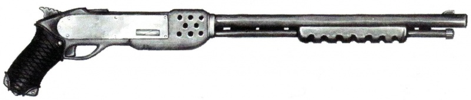

<!-- A1219-B0007 -->

原译文

Imperial shotgun 帝国霰弹枪

**校订译文**

Imperial shotgun 帝国霰弹枪

<!-- /A1219-B0007 -->

<!-- A1219-B0008 -->
## Overview 概述

<!-- /A1219-B0008 -->

<!-- A1219-B0009 -->
**英文原文**

The shotgun fires a large, solid slug or a dispersed fragment shot. Some shotguns are drum-fed, others are pump-action, while the most primitive are single shot weapons. They are strongly made, simple weapons that have only a short range but are quite effective against unarmoured targets. Their versatility and ease of construction compared to weapons such as lasguns, makes them widely used. Even the lowest-tech factories can produce these weapons, making them a common sight in the galaxy. Favoured for urban and shipboard combat, where their short-range stopping power comes into play, shotguns have found their way into the arsenal of many Imperial organisations. One of the non-common shell type - the gas shells - release a deadly gas that can kill target and quickly disperse after that.

<!-- /A1219-B0009 -->

<!-- A1219-B0010 -->

原译文

霰弹枪发射大而坚固的子弹或分散的破片。一些霰弹枪是鼓式的，另一些是泵式的，而最原始的是单发武器。它们是制作精良、简单的武器，射程很短，但对无装甲目标非常有效。与激光枪等武器相比，它们的多功能性和易于制造，使其得到了广泛的应用。即使是技术含量最低的工厂也能生产这些武器，使它们成为银河系中常见的景象。霰弹枪在城市和舰载战斗中很受欢迎，在那里它们的短程拦截能力发挥作用，霰弹枪已经进入了许多帝国组织的武器库。其中一种非常见的炮弹类型——气体弹——会释放出一种致命的气体，可以杀死目标并迅速消散。

**校订译文**

霰弹枪可发射大型独头弹，也可发射散布开的霰弹。有些型号以弹鼓供弹，有些采用泵动机构，最原始的则每次只能装填一发。它们结构坚固、设计简单，虽然射程短，对无装甲目标却很有效。相比激光枪，霰弹枪用途多样且易于制造，即使技术水平最低的工厂也能生产，因此在银河中十分常见。巷战和舰内战斗能够充分发挥其近距离停止作用，许多帝国组织都将其列入武器库。一种较少见的气体弹还会释放致命气体，杀伤目标后很快消散。

<!-- /A1219-B0010 -->

<!-- A1219-B0011 -->
**英文原文**

They are also popular with hive-world scum and local police. The weapon is sometimes used by the Imperial Guard, although the Lasgun is preferred. It is not highly accurate but it is easier to fire from the hip than the Lasgun. It is easy to produce however and is an ideal weapon for worlds without the technological base to produce laser weapons. Shotguns are extensively used by the Adeptus Arbites for both combat and crowd control, and various types of rounds have been developed for such tasks. Space Marine Scouts also sometimes employ shotguns. Though their shotguns seem to be more powerful than those of other Imperial organizations, they still lack some of the range, power and armour piercing qualities of bolters. However, they are, in some cases, more useful than bolters because they can be fired easily while advancing and charging into close combat.

<!-- /A1219-B0011 -->

<!-- A1219-B0012 -->

原译文

它们也很受巢都世界渣滓和当地警察的欢迎。帝国卫队有时会使用这种武器，但激光枪更受欢迎。它不是很准确，但从腰部射击比激光枪更容易。然而，它很容易生产，对于没有生产激光武器技术基础的世界来说，它是一种理想的武器。法务部广泛使用霰弹枪进行战斗和控制人群，并为此类任务开发了各种类型的弹药。星际战士侦察兵有时也会使用霰弹枪。尽管他们的霰弹枪似乎比其他帝国组织的霰弹枪更强大，但他们仍然缺乏一些射程、威力和穿甲能力。然而，在某些情况下，它们比爆矢枪更有用，因为它们在推进和冲进近距离战斗时可以很容易地发射。

**校订译文**

巢都不法之徒和地方警察也喜爱霰弹枪。帝国卫队偶尔装备，但总体更偏好激光枪。霰弹枪精度不高，却更便于抵腰射击；对于没有激光武器生产基础的世界，它也是理想选择。法务部广泛用它执行战斗与人群管控任务，并开发了相应的多种弹药。星际战士侦察兵有时也使用霰弹枪，其型号似乎比其他帝国组织的装备更强劲，射程、威力和穿甲能力仍不及爆矢枪。不过，霰弹枪便于边推进边开火，在冲入近战的某些场合，反而更为实用。

<!-- /A1219-B0012 -->

<!-- A1219-B0013 -->
## Variants 变体

<!-- /A1219-B0013 -->

<!-- A1219-B0014 -->
### Pump-action shotgun 泵动霰弹枪

<!-- /A1219-B0014 -->

<!-- A1219-B0015 -->
**英文原文**

Favoured by Enforcers, pump-action shotguns have all the strengths of their double-barrelled cousins with the added benefits of increased clip capacity. There are also few things as distinctive as the sound of pump-action shotgun chambering a shell.

<!-- /A1219-B0015 -->

<!-- A1219-B0016 -->

原译文

受到执法人员的青睐，泵动霰弹枪具有双管霰弹枪的所有优点，还具有增加弹夹容量的额外好处。几乎没有什么比泵动霰弹枪发射子弹的声音更独特的了。

**校订译文**

泵动霰弹枪深受执法者青睐，既有双管霰弹枪的优点，又能携带更多弹药。拉动护木将弹药送入膛内的声音，也极具辨识度。

**校注：** chambering是上膛，原译发射子弹错误。

<!-- /A1219-B0016 -->

<!-- A1219-B0017 图片 -->
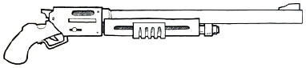

<!-- A1219-B0018 -->

原译文

Pump-action shotgun 泵动霰弹枪

**校订译文**

Pump-action shotgun 泵动霰弹枪

<!-- /A1219-B0018 -->

<!-- A1219-B0019 -->
### Artificer shotgun 工匠霰弹枪

<!-- /A1219-B0019 -->

<!-- A1219-B0020 -->
**英文原文**

Among the voidsmen-at-arms of the Imperial Navy, these large pump-action Shotguns are the favoured tool of the experienced officers who lead their forces. These masterfully crafted Shotguns are devastating in the close confines of the naval boarding engagements for which they were designed, repelling corridors of boarders one shot at a time. Along with their devastating effectiveness against lightly armoured foes, the standard projectile ammunition used with an Artificer Shotgun is less likely to penetrate the hull of smaller craft than that of other weapons. When used outside the confines of a void ship, these weapons continue to excel in many other areas of close-quarters engagement where enemies of the Imperium may be found trespassing.

<!-- /A1219-B0020 -->

<!-- A1219-B0021 -->

原译文

在帝国海军的武装水兵中，这些大型泵动霰弹枪是领导部队的有经验的军官的首选工具。这些精心制作的霰弹枪在海军跳帮作战的近距离战斗中具有毁灭性，一枪一枪地在走廊击退了登船者。除了对轻装甲敌人的毁灭性效果外，与其他武器相比，与工匠霰弹枪一起使用的标准实弹弹药不太可能穿透小型飞行器的船体。当在虚空舰的防线之外使用时，这些武器在许多其他近距离交战的领域仍然表现出色，在这些领域，帝国的敌人可能会被发现他们做错了。

**校订译文**

帝国海军武装船兵中，经验丰富的带队军官尤其偏爱这种大型泵动霰弹枪。精工制造的武器专为狭窄舰内的跳帮战设计，能逐枪击退挤满走廊的入侵者。它对轻装甲敌人杀伤力惊人，而常规实弹又较不容易击穿小型舰艇的外壳。离开舰内环境后，它在对付帝国入侵之敌的其他近距离战斗中，同样表现出色。

**校注：** 对照本段英文确认同一实体，与全书核心译名统一；不改变同形异义词或省略称呼。

<!-- /A1219-B0021 -->

<!-- A1219-B0022 -->
**英文原文**

As they are an officer’s weapon, they are of a more robust construction than other Navy Shotguns, and in the hands of an experienced and well-trained user they are capable of a surprising rate of fire in a short amount of time.

<!-- /A1219-B0022 -->

<!-- A1219-B0023 -->

原译文

由于它们是军官的武器，因此它们的结构比其他海军霰弹枪更坚固，在经验丰富、训练有素的使用者手中，它们能够在短时间内以惊人的速度开火。

**校订译文**

作为军官武器，工匠霰弹枪比普通海军型号更为坚固。经验丰富、训练有素的射手，能在短时间内用它打出惊人的射速。

<!-- /A1219-B0023 -->

<!-- A1219-B0024 -->
### Auxilliary shotgun 辅助霰弹枪

<!-- /A1219-B0024 -->

<!-- A1219-B0025 -->
**英文原文**

An Auxiliary Shogun is an underfitting modification that can be attached to most standard-pattern firearms in place of a bayonet. The attachment allows for a single, brutal short-range blast — a fine compliment to a weapon designed for longer-ranged engagements.

<!-- /A1219-B0025 -->

<!-- A1219-B0026 -->

原译文

辅助霰弹枪是一种不合适的改装，可以连接到大多数标准样式的枪支上，代替刺刀。该附件允许进行一次残酷的短距爆炸，这是对为远程作战设计的武器的完美补充。

**校订译文**

辅助霰弹枪是一种下挂式改装附件，可代替刺刀安装在多数标准枪械上。它能够提供一次猛烈的近距离射击，为原本侧重远程交战的主武器补足火力。

**校注：** underfitting指下挂安装，不是不合适；Shogun为Shotgun疑误拼。

<!-- /A1219-B0026 -->

<!-- A1219-B0027 -->
**英文原文**

The combined weight of the Auxiliary Shotgun and its ammunition usually makes the weapon bearing the attachment more difficult to wield. Most users find it an acceptable inconvenience given the reassurance of having the devastating stopping power of the Auxiliary Shotgun at hand.

<!-- /A1219-B0027 -->

<!-- A1219-B0028 -->

原译文

辅助霰弹枪及其弹药的组合重量通常会使带有附件的武器更难使用。考虑到辅助霰弹枪具有毁灭性的制动能力，大多数使用者认为这是一种可以接受的不便。

**校订译文**

附件和弹药增加了重量，通常会降低主武器的操控便利性。不过，多数使用者认为，随时拥有这种强大的近距离制止能力，足以抵偿这点不便。

<!-- /A1219-B0028 -->

<!-- A1219-B0029 -->
### Combat shotgun 战斗霰弹枪

<!-- /A1219-B0029 -->

<!-- A1219-B0030 -->
**英文原文**

Across the breadth of the Imperium the Combat Shotgun is the favoured firearm of boarding parties of both the Imperial Navy and Astra Militarum. These automatic shotguns larger and more robustly constructed than the common shotgun, the combat variant is designed purely for warfare. Combat shotguns are usually fed from a drum magazine (and so rarely need to be reloaded)and are capable of both single shot and fully automatic fire and are even deadlier than the normal shotgun. In addition to their short-range destructive power, they hammer out an intimidating racket when being fired.

<!-- /A1219-B0030 -->

<!-- A1219-B0031 -->

原译文

在整个帝国范围内，战斗霰弹枪是帝国海军和星界军跳帮队最喜欢的枪支。这些自动霰弹枪比普通霰弹枪更大、结构更坚固，战斗变体纯粹是为战争而设计的。战斗霰弹枪通常由弹鼓供弹（因此很少需要重新装弹），既能单发射击，也能全自动射击，甚至比普通霰弹枪更致命。除了它们的短程破坏力外，它们在被射击时还会发出令人生畏的噪音。

**校订译文**

战斗霰弹枪在整个帝国都受到海军与星界军跳帮队的青睐。这些自动霰弹枪比常规型号更大、更坚固，纯粹为战争而造。它们通常采用弹鼓供弹，减少了装填次数，既可单发，也可全自动射击，杀伤力更胜普通型号。除了近距离破坏力，开火时震耳的轰鸣也颇具威慑。

<!-- /A1219-B0031 -->

<!-- A1219-B0032 图片 -->
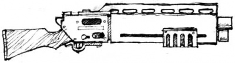

<!-- A1219-B0033 -->

原译文

Combat shotgun 战斗霰弹枪

**校订译文**

Combat shotgun 战斗霰弹枪

<!-- /A1219-B0033 -->

<!-- A1219-B0034 -->
**英文原文**

When used up close the Combat Shotgun can quickly put down a target with a single brutal slug, or can quickly suppress a larger area or grouping of individuals, rapidly spitting out a dense cloud of rending shot over its thunderous roar.

<!-- /A1219-B0034 -->

<!-- A1219-B0035 -->

原译文

当近距离使用时，战斗霰弹枪可以用一法凶猛的子弹快速击倒目标，或者可以快速压制更大的区域或一组人，在雷鸣般的轰鸣声中迅速喷出密集的云状弹药。

**校订译文**

近距离内，战斗霰弹枪既能以一枚猛烈的独头弹击倒目标，也能在雷鸣般的轰响中连续喷出密集霰弹，压制一片区域或一群敌人。

<!-- /A1219-B0035 -->

<!-- A1219-B0036 -->
### Astartes assault shotgun 阿斯塔特突击霰弹枪

<!-- /A1219-B0036 -->

<!-- A1219-B0037 -->
**英文原文**

The Astartes assault shotgun is a much more powerful and versatile version of the shotgun, even larger than the Combat Shotgun, used by Space Marine Scouts. They are bulky, clip-fed weapons that can fire in single shots and in both semi and fully automatic modes, and use an array of specialty ammunition ranging from armour-piercing penetrator rounds to the powerful man-stopping rounds. These variants are specially designed to be used by members of Adeptus Astartes and as such are of much better quality and much more deadly than normal shotguns. Assault shotguns are best used in urban and close-quarters combat, as well as in boarding actions aboard voidships.

<!-- /A1219-B0037 -->

<!-- A1219-B0038 -->

原译文

阿斯塔特突击霰弹枪是霰弹枪的一个更强大、更通用的版本，甚至比星际战士侦察兵使用的战斗霰弹枪更大。它们是笨重的子弹武器，可以单发射击，也可以半自动和全自动模式射击，并使用一系列特种弹药，从穿甲弹到强大的拦截弹。这些变体是专门为阿斯塔特修会成员设计的，因此质量要好得多，比普通霰弹枪更致命。突击霰弹枪最适合在城市和近距离战斗中使用，以及在虚空舰上的跳帮行动中使用。

**校订译文**

阿斯塔特突击霰弹枪由星际战士侦察兵使用，威力更强、用途更多，体积甚至超过战斗霰弹枪。它十分粗大，采用弹匣供弹，能够单发、半自动或全自动射击，还能使用从穿甲弹到强效停止弹在内的多种专用弹药。这种武器专为阿斯塔特设计，制造品质与杀伤力都高于普通霰弹枪，尤其适合巷战、近距离交战和舰内跳帮战。

**校注：** used by Space Marine Scouts修饰突击霰弹枪，原译错安到比较项战斗霰弹枪。

<!-- /A1219-B0038 -->

<!-- A1219-B0039 图片 -->
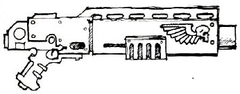

<!-- A1219-B0040 -->

原译文

Astartes assault shotgun 阿斯塔特突击霰弹枪

**校订译文**

Astartes assault shotgun 阿斯塔特突击霰弹枪

<!-- /A1219-B0040 -->

<!-- A1219-B0041 -->
**英文原文**

Due to being designed and constructed specifically for use by those who have undertaken the extensive gene modification required to become Astartes, their sheer size and associated recoil make these weapons almost impossible to use except by the strongest of unmodified Humans.

<!-- /A1219-B0041 -->

<!-- A1219-B0042 -->

原译文

由于这些武器是专门为那些进行了成为阿斯塔特所需的广泛基因改造的人设计和制造的，它们的巨大尺寸和相应的后坐力使这些武器几乎不可能使用，除非是最强壮的未经改造的人类。

**校订译文**

它专为接受过大规模基因改造的阿斯塔特制造。巨大的体积与后坐力，使未经改造的人类中只有最强壮者才有可能使用。

<!-- /A1219-B0042 -->

<!-- A1219-B0043 -->
### Preacher shotgun 传教士霰弹枪

<!-- /A1219-B0043 -->

<!-- A1219-B0044 -->
**英文原文**

Used by the Ecclesiarchy's Preachers that serve in the Astra Militarum.

<!-- /A1219-B0044 -->

<!-- A1219-B0045 -->

原译文

在星界军服务的国教传教士使用。

**校订译文**

在星界军中服役的国教会传教士使用的武器。

<!-- /A1219-B0045 -->

<!-- A1219-B0046 -->
### Sawn-off shotgun 锯短式霰弹枪

原题：Sawn-off shotgun 锯断式霰弹枪

<!-- /A1219-B0046 -->

<!-- A1219-B0047 -->
**英文原文**

Sawn-off shotguns are a type of shotgun with a shorter gun barrel and often a shorter or absent stock. These variants come very handy during fighting in confined space. It is mostly popular on agricultural and primitive worlds.

<!-- /A1219-B0047 -->

<!-- A1219-B0048 -->

原译文

锯断式霰弹枪是一种枪管较短、枪托较短或没有枪托的霰弹枪。这些变体在密闭空间作战时非常方便。它主要在农业和原始世界流行。

**校订译文**

锯短式霰弹枪具有较短的枪管，枪托也常被缩短或去除，在狭窄空间作战时十分方便，尤其流行于农业世界和技术原始的世界。

<!-- /A1219-B0048 -->

<!-- A1219-B0049 图片 -->
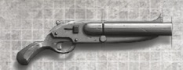

<!-- A1219-B0050 -->

原译文

Sawn-off shotgun 锯断式霰弹枪

**校订译文**

Sawn-off shotgun 锯短式霰弹枪

<!-- /A1219-B0050 -->

<!-- A1219-B0051 -->
### Naval shotcannon 海军霰弹炮

原题：Naval shotcannon 海军射击炮

<!-- /A1219-B0051 -->

<!-- A1219-B0052 -->
**英文原文**

These much larger variants of a regular shotgun fire a huge shell nearly twice the normal size. They can lay waste to large hordes of attackers - a close hit from one can literally explode a man into a burst of shredded clothing and flesh. However, they generate tremendous recoil and must be mounted down or fired from a braced position to be effective.

<!-- /A1219-B0052 -->

<!-- A1219-B0053 -->

原译文

这些比普通霰弹枪大得多的变体发射的炮弹几乎是正常大小的两倍。它们可以摧毁大批袭击者——一个人的近距离攻击几乎可以把一个人炸成一堆撕碎的衣服和肉。然而，它们会产生巨大的后坐力，必须安装下来或从支撑位置发射才能有效。

**校订译文**

这种武器比普通霰弹枪大得多，发射的弹药尺寸接近常规弹药的两倍，能重创大批进攻者。近距离命中甚至可将一个人连同衣物炸成血肉碎片。不过，它的后坐力极大，必须固定安装或以稳固支撑姿势使用，才能有效发挥威力。

<!-- /A1219-B0053 -->

<!-- A1219-B0054 -->
### Shotgun pistol 霰弹手枪

<!-- /A1219-B0054 -->

<!-- A1219-B0055 -->
**英文原文**

Also known as "Foehammer", this weapon takes a form of a squat, brutal pistol resembling a single-shot hand cannon. It can fire a standard shotgun shell, and is popular with many naval ship's officers as well as crew chiefs who need an intimidating weapon close at hand.

<!-- /A1219-B0055 -->

<!-- A1219-B0056 -->

原译文

这种武器也被称为“敌者之锤”，它采用了一种矮宽、残忍的手枪形式，类似于单发手枪。它可以发射标准的霰弹枪子弹，受到许多海军舰艇军官以及需要近距离威胁武器的船员的欢迎。

**校订译文**

霰弹手枪又称“破敌锤”，外形短粗凶悍，类似单发手炮，可发射标准霰弹枪弹药。许多海军军官和船员领班需要随身携带威慑性武器，因而十分喜爱它。

<!-- /A1219-B0056 -->

<!-- A1219-B0057 图片 -->
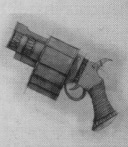

<!-- A1219-B0058 -->

原译文

Shotgun pistol 霰弹手枪

**校订译文**

Shotgun pistol 霰弹手枪

<!-- /A1219-B0058 -->

<!-- A1219-B0059 -->

原译文

'Incisor' Shotgun pistol ‘煽动者’霰弹枪

**校订译文**

'Incisor' Shotgun pistol ‘切牙’霰弹手枪

**校注：** Incisor是切牙，原煽动者误读为inciter一类词。

<!-- /A1219-B0059 -->

<!-- A1219-B0060 -->
**英文原文**

Notorious for its sheer destructive power and known colloquially by officers and the junior staff of the Imperial Navy as the ‘Incisor’, this weapon takes the form of a robust and short-barrelled, yet brutally destructive Pistol. Armed with only a single shot, the Pistol is often worn more for its intimidating appearance and fearsome reputation than it is as a practical sidearm. However, when required, the devastating force and thunderous roar of the Shotgun Pistol can instil fear among the ranks and, as recorded in more than one such instance, leave an observable hole through the chest cavity of the unfortunate target.

<!-- /A1219-B0060 -->

<!-- A1219-B0061 -->

原译文

这种武器以其纯粹的破坏力而闻名，被帝国海军的军官和初级人员通俗地称为“煽动者”，其形式为坚固的短管，但具有残酷的破坏性。手枪只有一次射击，与其说它是一种实用的手枪，不如说它因其令人生畏的外观和可怕的声誉而被佩戴。然而，在必要时，霰弹枪的毁灭性力量和雷鸣般的咆哮会在队伍中灌输恐惧，正如不止一次这样的例子所记录的那样，会在不幸目标的胸腔中留下一个可观察到的洞。

**校订译文**

这种武器破坏力惊人，帝国海军军官与基层人员俗称它为“切牙”。它是一支结构坚固的短管手枪，一次只能装填一发；人们佩戴它，往往更看重凶悍外形与可怕名声，而非实用性。但在必要时，其猛烈火力和雷霆般的轰鸣足以震慑队伍；已有不止一例记录称，它能在不幸受害者的胸腔上轰出一个贯穿大洞。

<!-- /A1219-B0061 -->

<!-- A1219-B0062 图片 -->
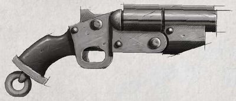

<!-- A1219-B0063 -->

原译文

'Incisor' Shotgun pistol ‘煽动者’霰弹枪

**校订译文**

'Incisor' Shotgun pistol ‘切牙’霰弹手枪

<!-- /A1219-B0063 -->

<!-- A1219-B0064 -->
### Navis heavy shotgun 海军重型霰弹枪

<!-- /A1219-B0064 -->

<!-- A1219-B0065 -->
**英文原文**

The Navis heavy shotgun is a large double-barreled Shotgun used by Imperial Navy Breachers.

<!-- /A1219-B0065 -->

<!-- A1219-B0066 -->

原译文

海军重型霰弹枪是帝国海军跳帮队使用的大型双管霰弹枪。

**校订译文**

海军重型霰弹枪是帝国海军跳帮者使用的大型双管霰弹枪。

**校注：** 对照本段英文确认同一实体，与全书核心译名统一；不改变同形异义词或省略称呼。

<!-- /A1219-B0066 -->

<!-- A1219-B0067 图片 -->
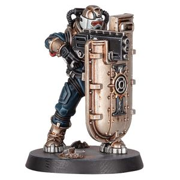

<!-- A1219-B0068 -->

原译文

Navis heavy shotgun 海军重型霰弹枪

**校订译文**

Navis heavy shotgun 海军重型霰弹枪

<!-- /A1219-B0068 -->

<!-- A1219-B0069 -->
### Executioner Shotgun 刽子手霰弹枪

原题：Executioner Shotgun 执行者霰弹枪

<!-- /A1219-B0069 -->

<!-- A1219-B0070 -->
**英文原文**

The Executioner Shotgun is a type of scoped Shotgun used by the Adeptus Arbites.

<!-- /A1219-B0070 -->

<!-- A1219-B0071 -->

原译文

执行者霰弹枪是一种范围类型的霰弹枪，由法务部使用。

**校订译文**

刽子手霰弹枪是法务部使用的一种带瞄准镜的霰弹枪。

<!-- /A1219-B0071 -->

<!-- A1219-B0072 图片 -->
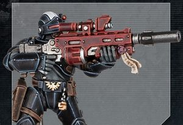

<!-- A1219-B0073 -->

原译文

Executioner Shotgun 执行者霰弹枪

**校订译文**

Executioner Shotgun 刽子手霰弹枪

<!-- /A1219-B0073 -->

<!-- A1219-B0074 -->
### Shotpistol 霰弹短枪

原题：Shotpistol 射击手枪

**校注：** 为便于区分本条分别列出的Shotgun pistol与Shotpistol，后者暂译霰弹短枪；不据此臆造二者详细分类差异。

<!-- /A1219-B0074 -->

<!-- A1219-B0075 -->
**英文原文**

The Shotpistol is a type of handheld Shotgun used by the Adeptus Arbites.

<!-- /A1219-B0075 -->

<!-- A1219-B0076 -->

原译文

射击手枪是法务部使用的一种手持式霰弹枪。

**校订译文**

霰弹短枪是法务部使用的一种手持式霰弹武器。

<!-- /A1219-B0076 -->

<!-- A1219-B0077 图片 -->
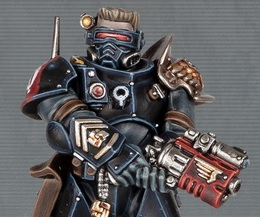

<!-- A1219-B0078 -->

原译文

Shotpistol 射击手枪

**校订译文**

Shotpistol 霰弹短枪

<!-- /A1219-B0078 -->

<!-- A1219-B0079 -->
## Known Patterns 已知型号

<!-- /A1219-B0079 -->

<!-- A1219-B0080 -->

原译文

Accatran pattern Mk XI 阿卡特兰型MK.XI

**校订译文**

Accatran pattern Mk XI 阿卡特兰型MK.XI

<!-- /A1219-B0080 -->

<!-- A1219-B0081 -->
**英文原文**

This model has an eight round internal magazine and uses a manual pump action to to fire a single shot then re-cock the weapon. It can fire a variety of ammunition. The stock is removable and at close quarters many users prefer to discard it, shortening the weapon for extra manoeuvrability. The pistol grip allows the weapon to be fired single handed, but this makes it wildly inaccurate and requires a very strong firer. This weapon is known to be used by Cadian Shock Troopers Regiments of the Imperial Guard.

<!-- /A1219-B0081 -->

<!-- A1219-B0082 -->

原译文

该型号有一个8发的内部弹匣，使用泵动动作发射一发子弹，然后重新扣动武器。它可以发射各种弹药。枪托是可拆卸的，在近距离使用时，许多用户更喜欢丢弃它，缩短武器以获得额外的机动性。手枪握把允许武器单手射击，但这使得它非常不准确，需要一个非常强壮的射击手。众所周知，这种武器被帝国卫队的卡迪亚突击队使用。

**校订译文**

该型号有容量八发的内置弹仓，采用手动泵动机构，每次射击后需重新推拉上膛，可兼容多种弹药。枪托可以拆卸，许多使用者在近战时会将其取下，缩短全枪以提高灵活性。手枪式握把允许单手开火，但这样会严重损害精度，也要求射手力量极强。帝国卫队的卡迪亚突击军团曾使用这种武器。

<!-- /A1219-B0082 -->

<!-- A1219-B0083 图片 -->
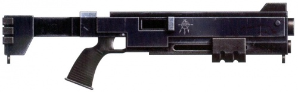

<!-- A1219-B0084 -->

原译文

Accatran pattern Mk XI 阿卡特兰型MK.XI

**校订译文**

Accatran pattern Mk XI 阿卡特兰型MK.XI

<!-- /A1219-B0084 -->

<!-- A1219-B0085 -->

原译文

Length: 92 cm 长度：92厘米

**校订译文**

Length: 92 cm 长度：92厘米

<!-- /A1219-B0085 -->

<!-- A1219-B0086 -->

原译文

Barrel: 40 cm 枪管：40厘米

**校订译文**

Barrel: 40 cm 枪管：40厘米

<!-- /A1219-B0086 -->

<!-- A1219-B0087 -->

原译文

Weight: 5.6 kg 重量：5.6公斤

**校订译文**

Weight: 5.6 kg 重量：5.6公斤

<!-- /A1219-B0087 -->

<!-- A1219-B0088 -->

原译文

Calibre: 12 口径：12

**校订译文**

Calibre: 12 口径：12

<!-- /A1219-B0088 -->

<!-- A1219-B0089 -->

原译文

Feed: 8 round tubular magazine 弹夹：8个圆形管状弹仓

**校订译文**

Feed: 8 round tubular magazine 供弹：容量8发的管状弹仓

**校注：** 8 round指容量八发，不是八个圆形弹仓。

<!-- /A1219-B0089 -->

<!-- A1219-B0090 -->

原译文

Cyclic rate of fire: n/a 理论射速：n/a

**校订译文**

Cyclic rate of fire: n/a 理论射速：n/a

<!-- /A1219-B0090 -->

<!-- A1219-B0091 -->

原译文

Muzzle velocity: 500 m/sec - approx 枪口速度：约500米/秒

**校订译文**

Muzzle velocity: 500 m/sec - approx 枪口速度：约500米/秒

<!-- /A1219-B0091 -->

<!-- A1219-B0092 -->
### Accatran pattern, model 34 阿卡特兰型，34型

<!-- /A1219-B0092 -->

<!-- A1219-B0093 -->
**英文原文**

This patttern is a self-loading, semi-automatic weapon with a 8-round internal magazine. Produced of Accatran Forge World, it features an extending stock and pistol grip. The model is frequently used by Elysian Drop Troops Regiments of the Imperial Guard.

<!-- /A1219-B0093 -->

<!-- A1219-B0094 -->

原译文

这种型号是一种自装式半自动武器，配有8发内部弹匣。它由阿卡特兰铸造世界生产，具有加长枪托和手枪握把。帝国卫队的艾丽西亚空降部队经常使用该型号。

**校订译文**

该型号由阿卡特兰铸造世界生产，是采用八发内置弹仓的自动装填半自动武器，配有伸缩枪托和手枪式握把，常见于帝国卫队的艾丽西亚空降部队。

<!-- /A1219-B0094 -->

<!-- A1219-B0095 图片 -->
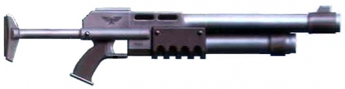

<!-- A1219-B0096 -->

原译文

Accatran pattern, model 34 阿卡特兰型，34型

**校订译文**

Accatran pattern, model 34 阿卡特兰型，34型

<!-- /A1219-B0096 -->

<!-- A1219-B0097 -->
### Arbites Pattern III 'Lawbringer' 法务III型‘执法者’

<!-- /A1219-B0097 -->

<!-- A1219-B0098 -->
**英文原文**

This pattern of combat shotgun is used by members of Adeptus Arbites.

<!-- /A1219-B0098 -->

<!-- A1219-B0099 -->

原译文

这种样式的战斗霰弹枪被法务部的成员使用。

**校订译文**

这种样式的战斗霰弹枪被法务部的成员使用。

<!-- /A1219-B0099 -->

<!-- A1219-B0100 -->
### Arbites Vox Legi-pattern 法务律法之音型

<!-- /A1219-B0100 -->

<!-- A1219-B0101 -->
**英文原文**

Effectively a large-bore, locally manufactured version of the shotgun designs used by many planetary enforcers, the Vox Legi is a devastating and adaptable weapon that fires shotgun shells nearly the size of those of Astartes Assault shotgun. The increased size of the weapon reduces its ammunition capacity compared to that of its fellow shotguns, but it still remains more powerful and adaptable than a standard shotgun. Most patrolling Arbitrators take advantage of this flexibility by carrying a variety of shotgun shell types so as to offer them different tactical options in the event of encountering a situation that requires their intervention. Over-engineered by a considerable margin, the weapon is also perfectly capable of being used as a large club in close combat. It is also designed for maximum psychological impact, with a very audible pump action (standard Arbites riot training makes use of this). The sound of a hundred Arbitrators simultaneously chambering their weapons has ended countless riots over the millennia. This pattern of combat shotgun is particularly widespread amongst the Arbitrators of The Periphery, and is broadly typical of the weapons favoured by Calixian Arbitrators.

<!-- /A1219-B0101 -->

<!-- A1219-B0102 -->

原译文

律法之音实际上是许多行星执法者使用的霰弹枪设计的大口径、本地制造版本，是一种毁灭性和适应性强的武器，发射的霰弹几乎与阿斯塔特突击霰弹枪的大小相当。与其他霰弹枪相比，武器尺寸的增加降低了其弹药容量，但它仍然比标准霰弹枪更强大、适应性更强。大多数巡逻仲裁员利用这种灵活性，携带各种霰弹枪弹药，以便在遇到需要他们干预的情况时为他们提供不同的战术选择。在相当大的程度上过度设计，该武器也完全能够在近距离战斗中用作大型击棍。它还设计用于产生最大的心理影响，具有非常明显的泵动（标准的法务部防暴训练利用了这一点）。一百名仲裁员同时拿起武器的声音结束了数千年来无数的骚乱。这种战斗霰弹枪在边缘区域的仲裁员中尤其普遍，并且是卡利西斯仲裁员青睐的武器的典型代表。

**校订译文**

律法之音是本地生产的大口径霰弹枪，改良自许多行星执法者使用的设计。它威力强大、用途广泛，弹药尺寸几乎与阿斯塔特突击霰弹枪弹药相当。尺寸增大限制了备弹量，却也带来更强火力。巡逻仲裁官常携带多种弹药，以应对不同状况。武器结构远超通常所需的坚固程度，近战中也可当大棍挥击；其泵动上膛声尤其响亮，旨在制造心理威慑，标准防暴训练也会利用这一点。数千年来，百名仲裁官同时上膛的声音，曾平息无数骚乱。这种战斗霰弹枪在边陲仲裁官中尤其普遍，也代表了卡利西斯仲裁官偏爱的武器风格。

<!-- /A1219-B0102 -->

<!-- A1219-B0103 -->
### Avachrus II-B Enochian Sanctified shotgun 阿瓦赫鲁斯 II-B 以诺圣化霰弹枪

原题：Avachrus II-B Enochian Sanctified shotgun 阿瓦克鲁斯II-B圣以诺霰弹枪

<!-- /A1219-B0103 -->

<!-- A1219-B0104 -->
**英文原文**

Carried by only a handful of bodyguards and servants who protect the hallowed priests and cardinals in the upper echelons of Enoch’s many spires, the Avachrus II-B is a rare and illustrious firearm. This variant is a magazine-fed, triple-barrelled Combat Shotgun enclosed in a solid adamantium casing and capable of both single and semi-automatic firing. Originally produced in the manufactorums of Avachrus, longstanding and ancient decree sees each completed weapon then transported to Enoch under the watchful eye of the Archdeacon Merramar Clade. — this despite a longstanding rivalry between the two worlds that borders on outright disgust.

<!-- /A1219-B0104 -->

<!-- A1219-B0105 -->

原译文

在以诺众多尖塔的上层，只有少数保镖和仆人保护着神圣的牧师和红衣主教，阿瓦克鲁斯II-B是一个罕见而杰出的武器。这种变体是一种弹匣式三管战斗霰弹枪，装在坚固的金刚合金外壳中，既能单发射击，也能半自动射击。最初在阿瓦克鲁斯的铸造厂生产，长期而古老的法令规定，每一件完成的武器都在梅拉马尔·克莱德副主教的监督下运往以诺，尽管这两个世界之间存在着近乎彻底厌恶的长期竞争。

**校订译文**

阿瓦赫鲁斯 II-B 是一种罕见而声名显赫的武器，只有少数负责保护以诺高层尖塔中祭司与红衣主教的卫士和仆从能够携带。它采用弹匣供弹，装有三根枪管，外覆坚固的精金机匣，可进行单发与半自动射击。武器最初在阿瓦赫鲁斯的制造厂生产，再依一项古老法令，在梅拉马尔·克莱德会吏长的监管下运往以诺，尽管两个世界长期竞争，彼此几近憎恶。

**校注：** Merramar Clade为人物全名，参照《Forsaken System Player’s Guide》第65页人物条目（https://files.spawningpool.net/docs/Vault2.0.-.TTRPG-Gamebooks/Warhammer/40k/Wrath%20%26%20Glory/W40k%20-%20Wrath%20%26%20Glory%20-%20Forsaken%20System%20Players%20Guide%20%7BCB72602%7D%20%5BOEF%5D%5B26-01-2021%5D.pdf）；不是集团。Archdeacon暂译会吏长，原副主教保留对照；人物汉译未经官方核对。

<!-- /A1219-B0105 -->

<!-- A1219-B0106 -->
**英文原文**

On Enoch the II-B undergoes a sequence of sacred blessings and sanctification rituals. Once blessed and purified the weapon is biometrically locked to its designated user. This lengthy and arduous process ensures that only those in service to individuals held in the highest regard within the priesthood may requisition one, and outside of Enoch’s highest spires they remain a rare, yet deadly, sight.

<!-- /A1219-B0106 -->

<!-- A1219-B0107 -->

原译文

在以诺上，II-B经历了一系列神圣的祝福和圣化仪式。一旦经过祝福和净化，武器就会被生物识别锁定在指定的使用者身上。这个漫长而艰巨的过程确保了只有那些为神职人员中最受尊敬的人服务的人才能征用一个，在以诺最高的尖顶之外，他们仍然是一个罕见但致命的景象。

**校订译文**

抵达以诺后，II-B 型要接受一系列祝福与圣化仪式，随后以生物识别系统锁定指定使用者。这道漫长而繁复的程序，确保只有为最高阶、最受尊敬神职者服务的人，才有资格申领这种武器。在以诺最高层尖塔之外，它仍然罕见，却同样致命。

<!-- /A1219-B0107 -->

<!-- A1219-B0108 -->
### Avachrus XII Pattern 'Gravefiller' shotgun 阿瓦赫鲁斯 XII 型‘填墓者’霰弹枪

原题：Avachrus XII Pattern 'Gravefiller' shotgun 阿瓦克鲁斯XII型‘掘墓人’霰弹枪

**校注：** Gravefiller填墓者与Gravediggers掘墓人部队分开，避免同译。

<!-- /A1219-B0108 -->

<!-- A1219-B0109 -->
**英文原文**

In the illustrious manufactorums of Avachrus, the Shotgun variant known across Gilead by the rank and file of the Astra Militarum as the ‘Gravefiller’ is produced en masse. The Avachrus XII is a non-standard, fully automatic, drum-fed combat Shotgun, commonly carried by officers and engineers of the Gilead Gravediggers. When operated on fully automatic, its extensive magazine allows it to create a continuous hail of deadly shot which can quickly suppress enemy movement. The robust stock is fully removable and also functions as a multi-purpose entrenchment tool.

<!-- /A1219-B0109 -->

<!-- A1219-B0110 -->

原译文

在阿瓦克鲁斯著名的铸造厂里，基列各地被星界军称为‘掘墓人’的霰弹枪变种是批量生产的。阿瓦克鲁斯XII是一种非标准、全自动、弹鼓战斗霰弹枪，通常由基列掘墓人的军官和工程师携带。当全自动操作时，其宽大的弹匣使其能够产生连续的致命射击，从而迅速压制敌人的行动。坚固的枪托可以完全拆卸，也可以作为多用途的加固工具。

**校订译文**

阿瓦赫鲁斯的著名制造厂大批生产 XII 型霰弹枪，基列星系的星界军官兵俗称它为“填墓者”。这是一种非标准、全自动、弹鼓供弹的战斗霰弹枪，常由基列掘墓人部队的军官和工兵使用。大容量弹鼓使其能连续倾泻致命霰弹，迅速压制敌人行动。坚固的枪托可完全拆下，充当多用途工兵掘具。

<!-- /A1219-B0110 -->

<!-- A1219-B0111 -->
**英文原文**

Designed for use in close quarters or clearing enemy positions, recent in-system developments have seen it come to be viewed as an instrument of both authority and control over the vast swathes of penal legionnaires drafted by order of the Lord-Militant Fylamon.

<!-- /A1219-B0111 -->

<!-- A1219-B0112 -->

原译文

设计用于近距离作战或清理敌方阵地，最近的星系内发展使其被视为对军事领主费拉蒙命令征召的大量刑罚军团展示权威和控制的工具。

**校订译文**

这种武器原为近距离交战和清剿敌方阵地设计。但星系内近期的变化，使它也成为管束军事领主费拉蒙下令征募的大批惩戒军士兵、彰显权威的工具。

<!-- /A1219-B0112 -->

<!-- A1219-B0113 -->
### Cypra Mundi ‘Ironclaw’ Shotgun 塞浦拉·蒙迪‘铁爪’霰弹枪

原题：Cypra Mundi ‘Ironclaw’ Shotgun 赛普拉·蒙迪‘铁爪’霰弹枪

<!-- /A1219-B0113 -->

<!-- A1219-B0114 -->
**英文原文**

The Cypra Mundi “Ironclaw” Shotgun is a standard weapon issued to voidship crewmen. Featuring a reinforced, weighted stock, Ironclads are commonplace on Navy vessels, where they are stored in storage lockers that automatically unlock if the ship is boarded.

<!-- /A1219-B0114 -->

<!-- A1219-B0115 -->

原译文

赛普拉·蒙迪‘铁爪’霰弹枪是发给虚空舰船员的标准武器。铁爪具有加固、加重的枪托，在海军舰艇上很常见，它们被存放在储物柜中，如果登舰，储物柜会自动解锁。

**校订译文**

塞浦拉·蒙迪“铁爪”霰弹枪是发给虚空舰船员的标准武器，配有加固、加重的枪托。海军舰船上十分常见，平时收存在武器柜中；一旦遭敌方跳帮，柜门便会自动解锁。

<!-- /A1219-B0115 -->

<!-- A1219-B0116 -->
### Deathwatch shotgun 死亡守望霰弹枪

<!-- /A1219-B0116 -->

<!-- A1219-B0117 -->
**英文原文**

The Deathwatch shotgun is a variant used by the Deathwatch Space Marines. It is optimized for close-quarters warfare on Space Hulks and xenos-infected asteroids. It can fire several distinct types of cartridges, ranging from explosive cylinders of shot known as cryptclearer rounds to flame-bursting wyrmsbreath shells.

<!-- /A1219-B0117 -->

<!-- A1219-B0118 -->

原译文

死亡守望霰弹枪是死亡守望星际战士使用的一种变体。它已针对太空废船和受异形感染的小行星的近距离作战进行了优化。它可以发射几种不同类型的弹药，从被称为墓穴清除者的爆炸性弹药到火焰爆裂的龙息弹。

**校订译文**

死亡守望霰弹枪专为太空废船和异形盘踞小行星上的近距离作战优化，可使用多种弹药，从爆炸后散布霰弹的墓穴清除者，到喷吐火焰的龙息弹，皆在其列。

<!-- /A1219-B0118 -->

<!-- A1219-B0119 图片 -->
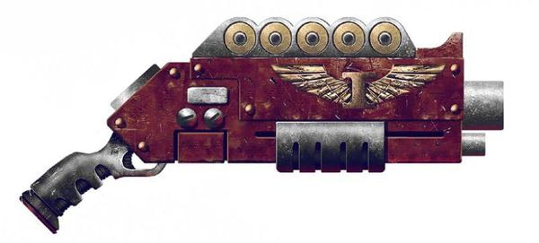

<!-- A1219-B0120 -->

原译文

Deathwatch shotgun 死亡守望霰弹枪

**校订译文**

Deathwatch shotgun 死亡守望霰弹枪

<!-- /A1219-B0120 -->

<!-- A1219-B0121 -->
### Deliverance pattern shotgun 拯救型霰弹枪

<!-- /A1219-B0121 -->

<!-- A1219-B0122 -->
**英文原文**

Compact shotgun design manufactured on the Raven Guard's homeworld of Deliverance. Optimal for security roles.

<!-- /A1219-B0122 -->

<!-- A1219-B0123 -->

原译文

紧凑型霰弹枪设计，在暗鸦守卫的家园世界拯救星制造。最适合护卫角色。

**校订译文**

暗鸦守卫母星拯救星生产的紧凑型霰弹枪，尤其适合执行警戒任务。

<!-- /A1219-B0123 -->

<!-- A1219-B0124 图片 -->
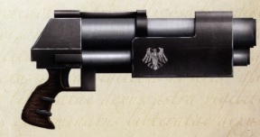

<!-- A1219-B0125 -->

原译文

Deliverance pattern shotgun 拯救型霰弹枪

**校订译文**

Deliverance pattern shotgun 拯救型霰弹枪

<!-- /A1219-B0125 -->

<!-- A1219-B0126 -->
### Doghammer 狗锤

<!-- /A1219-B0126 -->

<!-- A1219-B0127 -->
**英文原文**

A highly modifiable combat shotgun pattern, popular amongst the gangers and hired guns of Necromunda.

<!-- /A1219-B0127 -->

<!-- A1219-B0128 -->

原译文

一种高度可修改的战斗霰弹枪型号，在涅克罗蒙达的歹徒和雇佣枪手中很受欢迎。

**校订译文**

一种高度可修改的战斗霰弹枪型号，在涅克罗蒙达的歹徒和雇佣枪手中很受欢迎。

<!-- /A1219-B0128 -->

<!-- A1219-B0129 图片 -->
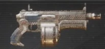

<!-- A1219-B0130 -->

原译文

Doghammer 狗锤

**校订译文**

Doghammer 狗锤

<!-- /A1219-B0130 -->

<!-- A1219-B0131 -->
### Engager-pattern shotgun 衔接型霰弹枪

<!-- /A1219-B0131 -->

<!-- A1219-B0132 -->
**英文原文**

A highly advanced pump-action shotgun, issued to the Helots of the Mentors Chapter. Keyed to the users biometrics, the weapon's were designed and crafted by the Chapter's Techmarines to kill their fellow Astartes. At standard range the shotgun can breach ceramite and at close range it can buckle adamantium. The Mentors will typically modify the weapon further after its construction with attachments such as a suspensor-studded three-shot auxiliary grenade launcher capable of launching vortex grenades.

<!-- /A1219-B0132 -->

<!-- A1219-B0133 -->

原译文

一种高度先进的泵动霰弹枪，发给导师战团的武装奴隶。该武器以使用者的生物识别技术为关键，由该战团的技术军士设计和制造，用于杀死他们的阿斯塔特同类。在标准射程内，霰弹枪可以击破陶钢，在近距离内，它可以击破精金。导师们通常会在武器制造完成后对其进行进一步修改，并配备附件，如能够发射旋涡手榴弹的带镶钉吊带的三发型辅助榴弹发射器。

**校订译文**

这是一种配发给导师战团农奴的先进泵动霰弹枪，以生物识别系统锁定使用者。战团科技战士设计并制造它，目的正是对付其他阿斯塔特：常规射程内可以击穿陶钢，近距离则能打弯精金。制造完成后，导师战团通常还会增添附件，例如配有悬浮减重装置、能发射涡流榴弹的三发辅助榴弹发射器。

**校注：** suspensor-studded指配有悬浮减重装置，原带镶钉吊带误解。

<!-- /A1219-B0133 -->

<!-- A1219-B0134 -->
### Epitaph 墓志铭

<!-- /A1219-B0134 -->

<!-- A1219-B0135 -->
**英文原文**

A highly modifiable sawn-off shotgun pattern popular, amongst the gangers and hired guns of Necromunda.

<!-- /A1219-B0135 -->

<!-- A1219-B0136 -->

原译文

一种高度可修改的锯断霰弹枪型号，在涅克罗蒙达的歹徒和雇佣枪手中很受欢迎。

**校订译文**

一种高度可修改的锯短式霰弹枪型号，在涅克罗蒙达的歹徒和雇佣枪手中很受欢迎。

<!-- /A1219-B0136 -->

<!-- A1219-B0137 图片 -->
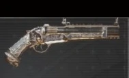

<!-- A1219-B0138 -->

原译文

Epitaph 墓志铭

**校订译文**

Epitaph 墓志铭

<!-- /A1219-B0138 -->

<!-- A1219-B0139 -->
### Hack shotgun 截短式霰弹枪

原题：Hack shotgun 骇客霰弹枪

**校注：** Hack在此指截短改制，非计算机骇客。

<!-- /A1219-B0139 -->

<!-- A1219-B0140 -->
**英文原文**

Known by a wide variety of nicknames on different worlds, this is a conventional double-barrel shotgun, cut down to the smallest possible size and rigged to fire both of its barrels at once from a single trigger pull. Although very short-ranged and hardly a precision weapon, the twin blast is still devastating against unarmoured targets, and the sight of one can have a very salutary effect on bystanders. A Hack is no substitute for a true combat weapon though, as many a ganger faced with carapace-armoured enforcers has found to their cost.

<!-- /A1219-B0140 -->

<!-- A1219-B0141 -->

原译文

这是一种传统的双管霰弹枪，在不同的世界里有着各种各样的绰号，它被削减到尽可能小的尺寸，并被改装成一次扣动扳机即可同时发射两个枪管。虽然射程很短，很难成为精确武器，但双连爆炸对无装甲目标仍然具有毁灭性，看到一个目标会对旁观者产生非常有益的影响。然而，骇客并不能替代真正的战斗武器，正如许多面对甲壳甲执法者的歹徒所付出的代价。

**校订译文**

这种常规双管霰弹枪在不同世界有许多绰号。它被截短到尽可能小的尺寸，并改为扣动一次扳机便双管齐发。它射程极短、精度有限，但对无装甲目标仍有毁灭性杀伤，单是亮出武器就足以让旁人收敛。不过，它终究不能替代正规的战斗武器；许多帮派分子在面对甲壳甲执法者时，已为此付出惨痛代价。

<!-- /A1219-B0141 -->

<!-- A1219-B0142 -->
### Lucius pattern Mk 22c 卢修斯型Mk 22c

<!-- /A1219-B0142 -->

<!-- A1219-B0143 -->
**英文原文**

Produced on Lucius Forge World, this model has an eight round revolving magazine and can be loaded with a variety of ammunition, including solid slugs, pellet loaded canisters and low velocity flares. The weapon uses a gas-operated self-loading action to fire. The revolver action is prone to mechanical failure, but the weapon's high gauge and the heavy cartridge fired fired make it a deadly weapon at close quarters at the cost of a strong recoil. This model is known to be used by Death Korps of Krieg engineers.

<!-- /A1219-B0143 -->

<!-- A1219-B0144 -->

原译文

该型号在卢修斯铸造世界上生产，有一个八发旋转弹匣，可以装载各种弹药，包括独头弹、霰弹和低速照明弹。该武器使用气动自装弹动作进行射击。左轮手枪的动作容易发生机械故障，但武器的高规格和发射的重型弹药使其成为近距离致命的武器，代价是强大的后坐力。众所周知，克里格死亡军团的工程师们使用了这种型号。

**校订译文**

卢修斯铸造世界生产的 Mk.22c 型有八发转轮弹仓，可装填独头弹、霰弹和低速照明弹等多种弹药，采用导气式自动装填机构。转轮机构较易出现故障，但大口径与重型弹药使它在近距离极其致命，代价是强烈的后坐力。克里格死亡军团工兵曾使用这一型号。

<!-- /A1219-B0144 -->

<!-- A1219-B0145 图片 -->
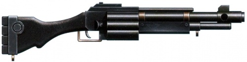

<!-- A1219-B0146 -->

原译文

Lucius pattern Mk 22c 卢修斯型Mk 22c

**校订译文**

Lucius pattern Mk 22c 卢修斯型Mk 22c

<!-- /A1219-B0146 -->

<!-- A1219-B0147 -->
### Mosgant90 tactical shotgun 莫斯甘特90战术霰弹枪

<!-- /A1219-B0147 -->

<!-- A1219-B0148 -->
**英文原文**

Issued to PDF forces the shotgun is pump-action operated and has a six-slug capacity. Accurate out to one hundred and fifty meters the shotgun can be parkerised with a phosphate to prevent corrosion in humid climates.

<!-- /A1219-B0148 -->

<!-- A1219-B0149 -->

原译文

发放给PDF的霰弹枪采用泵动操作，具有六弹夹容量。精确到150米，霰弹枪可以用磷酸盐进行表面处理，以防止在潮湿气候下腐蚀。

**校订译文**

莫斯甘特90战术霰弹枪配发给行星防卫军，采用泵动机构，容量为六发。它可在150米内保持准确射击，并可作磷化表面处理，以抵抗潮湿环境中的腐蚀。

<!-- /A1219-B0149 -->

<!-- A1219-B0150 -->
### Pious Legacy 虔诚遗产

<!-- /A1219-B0150 -->

<!-- A1219-B0151 -->
**英文原文**

A highly modifiable pump action shotgun pattern, popular amongst the gangers and hired guns of Necromunda.

<!-- /A1219-B0151 -->

<!-- A1219-B0152 -->

原译文

一种高度可修改的泵动霰弹枪型号，在涅克罗蒙达的歹徒和雇佣枪手中很受欢迎。

**校订译文**

一种高度可修改的泵动霰弹枪型号，在涅克罗蒙达的歹徒和雇佣枪手中很受欢迎。

<!-- /A1219-B0152 -->

<!-- A1219-B0153 图片 -->
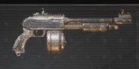

<!-- A1219-B0154 -->

原译文

Pious Legacy 虔诚遗产

**校订译文**

Pious Legacy 虔诚遗产

<!-- /A1219-B0154 -->

<!-- A1219-B0155 -->
### Raven pattern 渡鸦型

<!-- /A1219-B0155 -->

<!-- A1219-B0156 -->
**英文原文**

The 'Raven pattern' shotgun is a upgraded model of Astartes Assault Shotgun exclusive to Space Marines of the Raven Guard. It uses an ancient technique incorporating flash and sound suppressors into the scout’s muzzle (a long black cylinder attached to the weapon’s barrel) making it completely silent when fired, without reducing damage or the ability to make use of variant forms of ammo.

<!-- /A1219-B0156 -->

<!-- A1219-B0157 -->

原译文

‘渡鸦式’霰弹枪是暗鸦守卫星际战士专用的阿斯塔特突击霰弹枪的升级型号。它使用了一种古老的技术，将闪光和声音抑制器结合到侦察兵的枪口（一个连接到武器枪管上的黑色长圆柱体）中，使其在发射时完全安静，而不会减少伤害或使用不同形式弹药的能力。

**校订译文**

渡鸦型是暗鸦守卫专用的阿斯塔特突击霰弹枪改进型号。它采用古老技术，把消焰、消声装置整合进枪口上的黑色长圆筒，让射击完全无声，同时不削弱杀伤力，也不妨碍使用不同弹种。

<!-- /A1219-B0157 -->

<!-- A1219-B0158 -->
### Scatheros 'Blackhammer' defence shotgun 斯卡瑟罗斯‘黑锤’防御霰弹枪

<!-- /A1219-B0158 -->

<!-- A1219-B0159 -->
**英文原文**

Notorious for its sheer destructive power, the Blackhammer has a carefully crafted barrel fitted and an equally well-crafted stock and firing mechanism, all constructed to safely fire a single massive shell, more than twice the size of a standard shotgun cartridge with many times the power. Each shell is custom-made and filled with dozens of heavy pellets the size of stubber rounds, backed by a huge charge; the quality of the barrel breach and stock are vital to keep the weapon from tearing itself apart with every firing The weapon’s short range and single-shot capacity are often overlooked in favour of its immense stopping power, although, like many such weapons, it can prove dramatically less effective against targets with heavy armour. It has a ferocious recoil and its ammo is as hard to come by as the Blackhammer itself.

<!-- /A1219-B0159 -->

<!-- A1219-B0160 -->

原译文

黑锤以其纯粹的破坏力而闻名，它有一个精心制作的枪管和一个同样精心制作的枪托和射击机制，所有这些都是为了安全地发射一个巨大的子弹，是标准霰弹枪子弹大小的两倍多，威力是标准霰弹的许多倍。每个弹壳都是定制的，里面装着几十个短粗弹大小的重型弹丸，并配有巨大的炸药；枪管破口和枪托的质量对于防止武器在每次射击时自行撕裂至关重要。武器的短程和单发能力往往因其巨大的拦截能力而被忽视了，尽管与许多此类武器一样，它对重装甲目标的效果可能要差得多。它具有凶猛的后坐力，它的弹药就像黑锤本身一样难以获得。

**校订译文**

斯卡瑟罗斯“黑锤”防御霰弹枪以惊人的破坏力闻名。精制枪管、枪托与击发机构，都是为了安全发射一枚体积超过标准霰弹两倍、威力达其数倍的巨型枪弹。定制弹药内装有数十枚大小近似伐木枪弹丸的重弹丸和大装药；枪管、膛室与枪托的品质，关系到武器是否会在开火时自行崩裂。人们往往因其强大的停止作用而容忍短射程与单发装填，但它对重装甲目标的效果仍可能骤减。武器后坐力极其猛烈，专用弹药与枪械本身一样难以取得。

**校注：** 底稿barrel breach疑为breech枪膛/后膛，不能按缺口译枪管破口。

<!-- /A1219-B0160 -->

<!-- A1219-B0161 -->
### Vanaheim pattern 华纳海姆型

<!-- /A1219-B0161 -->

<!-- A1219-B0162 -->
**英文原文**

These robust and tested shotguns are standard in the armies of the Skitarii Provosts that take the rule of enforcers on Mechanicum worlds. The weapons feature an inbuilt red-dot laser sight and attached saw-bladed bayonet.

<!-- /A1219-B0162 -->

<!-- A1219-B0163 -->

原译文

这些坚固耐用、经过测试的霰弹枪是护教军教长的标准武器，他们在机械教世界上执行执法者的规则。这些武器内置红点激光瞄准器和锯片刺刀。

**校订译文**

瓦纳海姆型坚固可靠，是机械教世界中承担执法职责的护教军纠察部队的标准武器，内置红点激光瞄具，并装有锯齿刃刺刀。

<!-- /A1219-B0163 -->

<!-- A1219-B0164 -->
### Varonia Honorbound pattern 瓦罗尼亚荣誉束缚型

<!-- /A1219-B0164 -->

<!-- A1219-B0165 -->
**英文原文**

Throughout the various vessels of the Varonius Flotilla, the “Honorbound” is perhaps the most commonly found variant of Shotgun-type weaponry. Made available to all crew via security-controlled defence lockers in instances of incursion, this pattern is favoured in such circumstances due to both the multiple functional applications of its design and its ease of use by untrained personnel.

<!-- /A1219-B0165 -->

<!-- A1219-B0166 -->

原译文

在瓦罗尼亚舰队的各种船只中，“荣誉束缚”可能是霰弹枪式武器最常见的变体。在被入侵的情况下，所有船员都可以通过安全控制的防御储物柜获得这种型号，在这种情况下，由于其设计的多功能应用及其易于未经训练的人员使用，这种型号更受欢迎。

**校订译文**

在瓦罗尼乌斯舰队各舰上，“荣誉束缚”可能是最常见的霰弹武器型号。遭到入侵时，全体船员都可从安保系统控制的防卫武器柜中取用。它用途多样，未经训练的人员也容易上手，因此尤其适合这种情形。

<!-- /A1219-B0166 -->

<!-- A1219-B0167 -->
**英文原文**

Robustly constructed, the Varonia Pattern consists of a simple, magazine-fed squared body and wide-bore barrel specifically designed for the rigours of ship-board combat; at short range this weapon can be devastatingly effective in stopping an enemy advance. Should the user be engaged at close quarters, the weapon’s stock is reinforced and contains an elongated ceramite weighted component at its base allowing for the firearm to be utilised as a simple, yet effective, bludgeoning type combat weapon.

<!-- /A1219-B0167 -->

<!-- A1219-B0168 -->

原译文

瓦罗尼亚型结构坚固，由一个简单的弹匣式方形机身和宽口径枪管组成，专为舰载战斗的严酷环境而设计；在短距离内，这种武器可以非常有效地阻止敌人的前进。如果使用者在近距离作战，武器的枪托会被加固，并在其底部包含一个细长的陶钢加重部件，使其能够作为一种简单但有效的重击型战斗武器使用。

**校订译文**

瓦罗尼亚型结构结实，由弹匣供弹的简单方形机匣与大口径枪管组成，专为舰内恶战打造，近距离内能猛烈阻滞敌人前进。它的枪托预先经过强化，底部装有细长的陶钢配重件，必要时可当作简单有效的近战钝器。

<!-- /A1219-B0168 -->

<!-- A1219-B0169 -->
### Varonia Primus pattern 瓦罗尼亚普赖姆型

原题：Varonia Primus pattern 瓦罗尼亚主星型

**校注：** Primus为武器型号，不是地名主星，暂音译以保留型号。

<!-- /A1219-B0169 -->

<!-- A1219-B0170 -->
**英文原文**

The Varonia Primus is a manual pump-action single-shot non-standard variant used most notably by petty officers within the Varonius Flotilla. The body of the weapon is fully enclosed and features an internal magazine that holds eight standard shells or similar sized variant ammunition. The stock is removable, and when used in breaching or boarding actions many users prefer the shortened form as it allows for increased manoeuvrability within enclosed spaces. One unique feature that differentiates the Varonia Primus from other Shotguns commonly found in the Gilead System is that it utilises a pistol-style grip and firing mechanism which allows the weapon to be wielded single-handed, however, this practise is discouraged due to operator risk.

<!-- /A1219-B0170 -->

<!-- A1219-B0171 -->

原译文

瓦罗尼亚主星型是一种手动泵动单发非标准变体，最著名的是瓦罗尼亚船队内的下级军官使用。武器的主体是完全封闭的，内部有一个弹匣，可容纳八枚标准子弹或类似尺寸的变体弹药。该枪托是可拆卸的，当用于突破或跳帮行动时，许多使用者更喜欢缩短的型号，因为它允许在封闭空间内增加机动性。瓦罗尼亚主星型与基列星系中常见的其他霰弹枪的一个独特之处在于，它使用手枪式握把和击发机制，允许单手使用武器，但由于操作员风险，这种做法是不鼓励的。

**校订译文**

瓦罗尼亚普赖姆型是一种非标准手动泵动型号，每次击发一发，常由瓦罗尼乌斯舰队的军士使用。全封闭机匣内设八发弹仓，可装标准枪弹或尺寸相近的其他弹种。枪托可以拆卸，许多人在突入和跳帮战中更喜爱缩短后的形态，便于在狭窄空间操控。它与基列星系常见其他霰弹枪的一个区别，是采用允许单手使用的手枪式握把及击发机构；但这样存在操作风险，因此并不鼓励。

<!-- /A1219-B0171 -->

<!-- A1219-B0172 -->
### Volg “Meat Hammer” Scattergun 伏尔格“肉锤”霰弹枪

原题：Volg “Meat Hammer” Scattergun 伏尔加‘肉锤’散弹枪

<!-- /A1219-B0172 -->

<!-- A1219-B0173 -->
**英文原文**

The Volg “Meat Hammer” Scattergun, named after the tendency to turn flesh into unrecognisable chunks, is a specially constructed, triple-barrelled, open choke shotgun. It is usually fired from point-blank range and can all but destroy a living person’s body in a single shot.

<!-- /A1219-B0173 -->

<!-- A1219-B0174 -->

原译文

伏尔加“肉锤”散弹枪，以将肉变成无法辨认的大块的倾向而命名，是一种特殊构造的三管敞口霰弹枪。它通常是从近距离发射的，几乎可以在一次射击中摧毁一个人的身体。

**校订译文**

伏尔格“肉锤”霰弹枪能将血肉轰成难以辨认的碎块，因而得名。它是特殊的三管、无收束枪口霰弹枪，通常在极近距离开火，一枪几乎就能摧毁一个人的躯体。

<!-- /A1219-B0174 -->

<!-- A1219-B0175 -->

原译文

Vostroyan-pattern mark III 沃斯托尼亚型mark.III

**校订译文**

Vostroyan-pattern mark III 沃斯特洛亚型 Mk.III

<!-- /A1219-B0175 -->

<!-- A1219-B0176 -->
**英文原文**

A combat shotgun used by Vostroyan military provosts, the weapon is a heavy, crude and ugly firearm. It is, however, supremely effective in cramped environments.

<!-- /A1219-B0176 -->

<!-- A1219-B0177 -->

原译文

沃斯托尼亚军事教务长使用的战斗霰弹枪，这种武器是一种沉重、粗糙、丑陋的枪支。然而，它在狭窄的环境中非常有效。

**校订译文**

沃斯特洛亚军中纠察人员使用的战斗霰弹枪，沉重、粗糙而丑陋，却在狭窄环境中极其有效。

**校注：** provost为军中执法纠察职务，不是教务长。

<!-- /A1219-B0177 -->

<!-- A1219-B0178 -->
### Westingkrup “Slayer” Pump Shotgun 韦斯庭克鲁普‘屠杀者’泵式霰弹枪

<!-- /A1219-B0178 -->

<!-- A1219-B0179 -->
**英文原文**

The Westingkrup “Slayer” Pump Shotgun is produced by the Westingkrup Fane and is intended as a backup weapon for vehicle crews and PDF troopers, but is also common across the Calixis Sector. In its endless copies the shotgun can sport minor variations in design and fittings or, unusually, can even be crafted out of heat-resistant ceramics and scrimshaw.

<!-- /A1219-B0179 -->

<!-- A1219-B0180 -->

原译文

韦斯庭克鲁普‘屠杀者’泵式霰弹枪由韦斯庭克鲁普神殿生产，旨在作为车辆乘员和PDF士兵的备用武器，但在卡利西斯星区也很常见。在其无尽的复制品中，霰弹枪的设计和配件可以有细微的变化，或者，不同寻常的是，甚至可以用耐热陶钢和粗布制成。

**校订译文**

韦斯庭克鲁普“屠杀者”泵动霰弹枪由韦斯庭克鲁普神殿制造，原是载具乘员与行星防卫军的备用武器，如今在整个卡利西斯星区都很常见。大量仿制型号在设计和配件上各有细微差别，有些罕见版本甚至以耐热陶瓷和雕饰骨材制成。

**校注：** ceramics是陶瓷，scrimshaw是雕饰骨材，原陶钢和粗布均误。

<!-- /A1219-B0180 -->

<!-- A1219-B0181 -->
## Famous users 著名使用者

<!-- /A1219-B0181 -->

<!-- A1219-B0182 -->

原译文

Colonel "Iron Hand" Straken “铁手”斯塔肯上校

**校订译文**

Colonel "Iron Hand" Straken “铁手”斯塔肯上校

<!-- /A1219-B0182 -->

<!-- A1219-B0183 -->

原译文

Chaos Cultist Champion Tetchvar 混沌邪教徒冠军特奇瓦尔

**校订译文**

Chaos Cultist Champion Tetchvar 混沌邪教徒冠军特奇瓦尔

<!-- /A1219-B0183 -->

<!-- A1219-B0184 -->

原译文

Missionary Uriah Jacobus 传教士乌利亚·雅各布斯

**校订译文**

Missionary Uriah Jacobus 传教士乌利亚·雅各布斯

<!-- /A1219-B0184 -->

<!-- A1219-B0185 -->

原译文

Scout Sergeant Cyrus 侦察军士赛勒斯

**校订译文**

Scout Sergeant Cyrus 侦察军士赛勒斯

<!-- /A1219-B0185 -->

本篇核心术语与暂定项

以下列出本篇出现的英文原形及核心术语表用词。同形词可能指不同对象，具体词义以本篇正文和校注为准；单复数、别名和仅见于图注的名称可能尚未列入。完整候选见[术语表](../../术语表/双语术语候选.csv)。

| 英文 | 采用中文 | 状态 |
| --- | --- | --- |
| Space Marines | 星际战士 | 官方已核对 |
| Adeptus Astartes | 阿斯塔特修会 | 官方已核对 |
| Deathwatch | 死亡守望 | 官方已核对 |
| Astra Militarum | 星界军 | 官方已核对 |
| Imperial Guard | 帝国卫队 | 暂定·语境区分 |
| Imperium | 帝国 | 暂定·简称 |
| Imperial Navy | 帝国海军 | 暂定 |
| Mechanicum | 机械教 | 暂定·历史称谓 |
| Ecclesiarchy | 国教会 | 暂定 |
| Adeptus Arbites | 法务部 | 暂定 |
| Forge World | 铸造世界 | 暂定·官方待核 |
| Necromunda | 涅克罗蒙达 | 暂定·官方待核 |
| Space Marine Scouts | 星际战士侦察兵 | 暂定·官方待核 |
| Executioner Shotgun | 刽子手霰弹枪 | 暂定·官方待核 |
| Skitarii | 护教军 | 暂定·官方待核 |
| Enforcers | 地方执法者 | 暂定·官方待核 |
| Arbitrators | 仲裁官 | 暂定·官方待核 |
| Sector | 星区 | 暂定·官方待核 |
| Lucius | 卢修斯 | 暂定·官方待核 |
| Cypra Mundi | 塞浦拉·蒙迪 | 暂定·官方待核 |
| Deliverance | 拯救星 | 暂定·官方待核 |
| Blank | 空白者 | 暂定·官方待核 |
| Tech | 技术语 | 暂定·官方待核 |
| Mentors | 导师战团 | 暂定·官方待核 |
| Ancient | 旗手 | 官方已核对 |
| Raven Guard | 暗鸦守卫 | 官方已核 |
| Space Marine | 星际战士 | 暂定·官方待核 |
| Chapter | 战团 | 暂定·官方待核 |
| Scout | 侦察兵 | 暂定·官方待核 |
| Death Korps of Krieg | 克里格死亡军团 | 官方已核对 |
| Xenos | 异形 | 暂定·官方待核 |
| Scrimshaw | 骨雕 | 暂定·官方待核 |
| Primus | 领军 | 官方已核对 |
| The Weapon | 武器 | 暂定·官方待核 |
| Foehammer | 破敌锤 | 暂定·官方待核 |
| Gun | 甘 | 暂定·官方待核 |
| System | 星系（恒星系统） | 暂定·官方待核 |
| Gilead System | 基列星系 | 暂定·官方待核 |
| Calixis Sector | 卡利西斯星区 | 暂定·官方待核 |
| Krieg | 克里格 | 暂定·官方待核 |
| Accatran | 阿卡特兰 | 暂定·官方待核 |
| Avachrus | 阿瓦赫鲁斯 | 暂定·官方待核 |
| The Periphery | 边陲 | 暂定·官方待核 |
| Projectile Weapon | 实弹武器 | 暂定·官方待核 |
| Pump-action shotgun | 泵动霰弹枪 | 暂定·官方待核 |
| Combat shotgun | 战斗霰弹枪 | 暂定·官方待核 |
| Astartes assault shotgun | 阿斯塔特突击霰弹枪 | 暂定·官方待核 |
| Sawn-off shotgun | 锯短式霰弹枪 | 暂定·官方待核 |
| Shotgun pistol | 霰弹手枪 | 暂定·官方待核 |
| Navis heavy shotgun | 海军重型霰弹枪 | 暂定·官方待核 |
| Shotpistol | 霰弹短枪 | 暂定·官方待核 |
| Deathwatch shotgun | 死亡守望霰弹枪 | 暂定·官方待核 |
| Raven pattern | 渡鸦型 | 暂定·官方待核 |
| Volg “Meat Hammer” Scattergun | 伏尔格“肉锤”霰弹枪 | 暂定·官方待核 |
| Westingkrup “Slayer” Pump Shotgun | 韦斯庭克鲁普‘屠杀者’泵式霰弹枪 | 暂定·官方待核 |
| Shotgun | 霰弹枪 | 暂定·官方待核 |
| Incisor | 切牙 | 暂定·官方待核 |
| Varonius Flotilla | 瓦罗尼乌斯舰队 | 暂定·官方待核 |
| Skitarii Provosts | 护教军纠察部队 | 暂定·官方待核 |
| Merramar Clade | 梅拉马尔·克莱德 | 暂定·官方待核 |
| Cryptclearer | 墓穴清除者 | 暂定·官方待核 |
| Wyrmsbreath | 龙息弹药 | 暂定·官方待核 |
| Grenade launcher | 榴弹发射器 | 暂定·官方待核 |
| Auxiliary Grenade Launcher | 辅助榴弹发射器 | 暂定·官方待核 |
| Hand Cannon | 手炮 | 暂定·官方待核 |
| Cadian Shock Troopers | 卡迪亚突击军 | 暂定·官方待核 |
| Laser Weapons | 激光武器 | 暂定·官方待核 |
| Imperial Navy Breachers | 帝国海军跳帮者 | 官方已核 |
| Voidsmen-at-Arms | 武装船兵 | 官方已核 |
| Grenade | 手榴弹 | 暂定·官方待核 |
| Suspensor | 悬浮装置 | 暂定·官方待核 |
| Elysian Drop Troops | 艾丽西亚空降兵 | 暂定·官方待核 |

