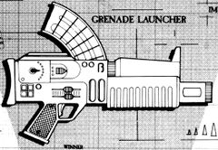
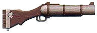
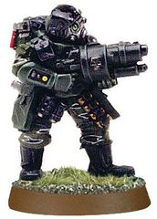
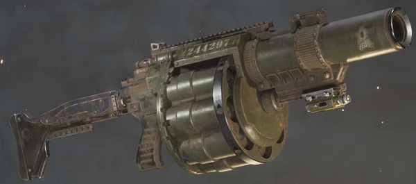
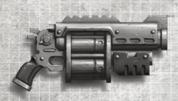
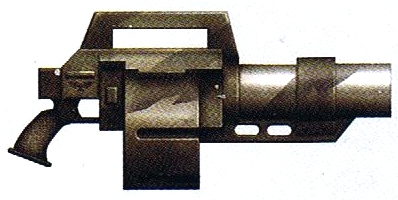
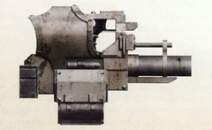
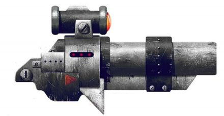

# 1221 榴弹发射器 Grenade launcher

精校状态：中文行文已逐段精校，部分术语仍为暂定

分类：武器 / 远程武器

原文来源：https://www.bilibili.com/opus/997769156820467769

原作者：帝国神选罐头

原文时间：编辑于 2025年03月18日 13:31

[返回分类目录](目录.md) · [全书目录](../../目录.md)

<!-- A1221-B0001 -->
**英文原文**

Grenade launchers are relatively simple tubular weapons which can launch several different types of grenades using means such as compressed gas or an electromagnetic charge. Grenade launchers benefit from their ability to fire ordnance on an arcing trajectory, allowing their shots to clear obstacles and lay down suppressive fire on unseen foes. While a variety of common grenade types can be fired by grenade launchers they are almost universally loaded with frag and krak grenades. Other types include anti-plant, blind, hallucinogenic, plasma, smoke, stun, virus, and xeno-filament grenades.

<!-- /A1221-B0001 -->

<!-- A1221-B0002 -->

原译文

榴弹发射器是一种相对简单的管状武器，可以使用压缩气体或电磁装药等手段发射几种不同类型的榴弹。榴弹发射器受益于其在弧形轨迹上发射弹药的能力，使其射击能够清除障碍物，并对看不见的敌人进行压制。虽然榴弹发射器可以发射各种常见的手榴弹类型，但它们几乎都装有破片和破甲榴弹。其他类型包括反植物榴弹、致盲榴弹、致幻榴弹、等离子榴弹、烟雾榴弹、眩晕榴弹、病毒榴弹和异丝榴弹。

**校订译文**

榴弹发射器是结构相对简单的管状武器，利用压缩气体、电磁力等方式发射多种榴弹。它能让弹药沿弧线飞行，越过障碍，压制视线之外的敌人。尽管兼容多种常见榴弹，实际最常装填的是破片与穿甲榴弹。其他弹种包括反植物、致盲、致幻、等离子、烟雾、眩晕、病毒和异丝榴弹。

**校注：** clear obstacles指越过障碍，不是清除障碍；electromagnetic charge按发射机制理解为电磁力，不是电磁装药。

<!-- /A1221-B0002 -->

<!-- A1221-B0003 图片 -->

<!-- A1221-B0004 -->

原译文

Grenade Launcher 榴弹发射器

**校订译文**

Grenade Launcher 榴弹发射器

<!-- /A1221-B0004 -->

<!-- A1221-B0005 -->
**英文原文**

Grenade launchers are a common weapon used by Imperial Guard infantry squads thanks to their ability to lob grenades greater distances and with more accuracy than can be thrown. Their primary duty is to lay down suppressive fire and destroy light vehicles and buildings. Other races also make use of grenade launchers. Among the Eldar the Aspect Warriors known as the Swooping Hawks use launchers strapped to their legs, while Harlequin Shadowseers make use of a launcher which fits on their shoulders. The Tau Pulse Carbine is also equipped with an underslung grenade launcher for launching EMP grenades.

<!-- /A1221-B0005 -->

<!-- A1221-B0006 -->

原译文

榴弹发射器是帝国卫队步兵班使用的一种常见武器，因为它们能够以比投掷更远的距离和更高的精度投掷手榴弹。他们的主要职责是压制火力，摧毁轻型车辆和建筑物。其他种族也使用榴弹发射器。在灵族中，被称为翔鹰的支派战士使用绑在腿上的发射器，而丑角暗影先知则使用适合肩膀的发射器。钛脉冲卡宾枪还配备了用于发射EMP手榴弹的下挂榴弹发射器。

**校订译文**

榴弹发射器的射程与精度都优于手投，因此是帝国卫队步兵班的常见武器，主要负责火力压制，以及摧毁轻型载具和建筑。其他种族同样使用它：灵族翔鹰支派战士将发射器绑在腿部，丑角暗影先知则使用肩部安装的型号；钛族脉冲卡宾枪也下挂榴弹发射器，用来发射电磁脉冲榴弹。

<!-- /A1221-B0006 -->

<!-- A1221-B0007 图片 -->

<!-- A1221-B0008 -->

原译文

Krieg Grenade Launcher 克里格榴弹发射器

**校订译文**

Krieg Grenade Launcher 克里格榴弹发射器

<!-- /A1221-B0008 -->

<!-- A1221-B0009 -->
## Known Patterns 已知型号

<!-- /A1221-B0009 -->

<!-- A1221-B0010 -->
### Cadian pattern grenade launcher 卡迪亚型榴弹发射器

原题：Cadian pattern grenade launcher 卡迪安型榴弹发射器

<!-- /A1221-B0010 -->

<!-- A1221-B0011 -->
**英文原文**

The Cadian pattern grenade launcher is the standard launcher used by the Cadian Shock Troopers. This drum-fed weapon is capable of a relatively high rate of fire and carries twenty 40mm grenades, with the weapon pivoting forward to reload. Front and rear sights, the latter of which flips up and is notched for different ranges, assist the user in aiming the weapon. A wide-legged stance is required to fire the grenade launcher, as its recoil is comparable to that of a boltgun and liable to cause injury if improperly used.

<!-- /A1221-B0011 -->

<!-- A1221-B0012 -->

原译文

卡迪安型榴弹发射器是卡迪安突击队使用的标准发射器。这种鼓式武器的射速相对较高，可携带20枚40毫米榴弹，武器向前旋转以重新装弹。前后瞄准器，后者可以向上翻转并为不同的射程开槽，帮助使用者瞄准武器。发射榴弹发射器需要宽腿站立，因为它的后坐力与霰弹枪相当，如果使用不当，很容易造成伤害。

**校订译文**

卡迪亚型是卡迪亚突击军的标准榴弹发射器，采用弹鼓供弹，容量二十发，口径40毫米，射速较高，装填时需将武器前部转开。前方准星和可翻起的后照门辅助瞄准，后者设有不同射程的标记。射击时需要双腿分开、稳固站立，因为后坐力堪比爆矢枪，操作不当容易受伤。

**校注：** boltgun是爆矢枪，原译霰弹枪错误。

<!-- /A1221-B0012 -->

<!-- A1221-B0013 图片 -->

<!-- A1221-B0014 -->

原译文

Stormtrooper with a Grenade Launcher 装备榴弹发射器的风暴突击兵

**校订译文**

Stormtrooper with a Grenade Launcher 装备榴弹发射器的风暴突击兵

<!-- /A1221-B0014 -->

<!-- A1221-B0015 图片 -->

<!-- A1221-B0016 -->

原译文

An Armageddon Steel Legion member with a Grenade Launcher 装备榴弹发射器的阿米吉多顿钢铁军团士兵

**校订译文**

An Armageddon Steel Legion member with a Grenade Launcher 装备榴弹发射器的阿玛吉多顿钢铁军团士兵

<!-- /A1221-B0016 -->

<!-- A1221-B0017 图片 -->

<!-- A1221-B0018 -->

原译文

Mordian Iron Guardian with a Grenade Launcher 装备榴弹发射器的莫迪安铁卫

**校订译文**

Mordian Iron Guardian with a Grenade Launcher 装备榴弹发射器的莫迪安铁卫

<!-- /A1221-B0018 -->

<!-- A1221-B0019 图片 -->

<!-- A1221-B0020 -->

原译文

Vostroyan Firstborn with a Grenade Launcher 装备榴弹发射器的沃斯托尼亚长子团

**校订译文**

Vostroyan Firstborn with a Grenade Launcher 装备榴弹发射器的沃斯特洛亚长子团士兵

<!-- /A1221-B0020 -->

<!-- A1221-B0021 -->
### Funeral Ball 葬礼之球

<!-- /A1221-B0021 -->

<!-- A1221-B0022 -->
**英文原文**

A highly modifiable grenade launcher pattern popular amongst the gangers and hired guns of Necromunda.

<!-- /A1221-B0022 -->

<!-- A1221-B0023 -->

原译文

一种高度可修改的榴弹发射器型号，在涅克罗蒙达的歹徒和雇佣枪手中很受欢迎。

**校订译文**

一种便于深度改装的榴弹发射器型号，深受涅克罗蒙达帮派成员和雇佣枪手欢迎。

<!-- /A1221-B0023 -->

<!-- A1221-B0024 图片 -->

<!-- A1221-B0025 -->

原译文

Funeral Ball Grenade Launcher 葬礼之球榴弹发射器

**校订译文**

Funeral Ball Grenade Launcher 葬礼之球榴弹发射器

<!-- /A1221-B0025 -->

<!-- A1221-B0026 -->
### Gorge Pattern Grenade Launcher 峡谷型榴弹发射器

<!-- /A1221-B0026 -->

<!-- A1221-B0027 -->
**英文原文**

The Gorge is a simply made, single shot break-open grenade launcher. The simplicity of its design does not diminish its effectiveness, being relatively compact and very reliable, which makes it one of the most widely used squad support weapons carried by enforcers, mercenaries and PDF troopers. Thanks to its widespread availability on the black market, the Gorge is also one of the most common weapons recidivists and rebel groups obtain for insurgencies and attacks.

<!-- /A1221-B0027 -->

<!-- A1221-B0028 -->

原译文

峡谷是一款制作简单、单次击发的榴弹发射器。其设计的简单性不会降低其有效性，相对紧凑且非常可靠，这使其成为执法人员、雇佣兵和行星护卫部队士兵携带的最广泛使用的小队支援武器之一。由于其在黑市上的广泛可用性，峡谷也是累犯和反叛组织为叛乱和袭击而获得的最常见的武器之一。

**校订译文**

峡谷型是一款结构简单的单发折开式榴弹发射器。简单的设计并未削弱其效能；它紧凑可靠，是执法者、雇佣兵与行星防卫军最常使用的班组支援武器之一。黑市上也很容易取得，因此不法分子和叛乱组织常用它发动袭击与暴动。

<!-- /A1221-B0028 -->

<!-- A1221-B0029 -->
### Mezoa Grenade Launcher 梅佐亚榴弹发射器

<!-- /A1221-B0029 -->

<!-- A1221-B0030 -->
**英文原文**

Produced on the Forge World of Mezoa this launcher, despite its single-shot nature, is considered a superior weapon in the Koronus Expanse thanks to its superiority in range, accuracy and firing systems compared to other available weapons.

<!-- /A1221-B0030 -->

<!-- A1221-B0031 -->

原译文

这款发射器在梅佐亚铸造世界上生产，尽管具有单发性，但与其他可用武器相比，它在射程、精度和射击系统方面具有优势，因此被认为是克洛诺斯星区的一种优越武器。

**校订译文**

这种武器产自梅佐亚铸造世界。虽然是单发型号，但射程、精度和击发系统都优于当地其他常见武器，因此在克洛诺斯广域备受推崇。

<!-- /A1221-B0031 -->

<!-- A1221-B0032 -->
### SLHG Pattern Assault Ram SLHG 型突击破门锤

原题：SLHG Pattern Assault Ram SLHG型突击艇

**校注：** Assault Ram在这里是执法者手持破门装备，不是突击艇；若其他条目为Caestus Assault Ram载具，须分义。

<!-- /A1221-B0032 -->

<!-- A1221-B0033 -->
**英文原文**

Enforcer Assault Ram fitted with an underslung Auxiliary grenade launcher.

<!-- /A1221-B0033 -->

<!-- A1221-B0034 -->

原译文

执法者突击艇配备了一个下挂式辅助榴弹发射器。

**校订译文**

执法者使用的突击破门锤，下挂辅助榴弹发射器。

<!-- /A1221-B0034 -->

<!-- A1221-B0035 -->
### Subjugator Pattern Grenade Launcher 压制者型榴弹发射器

<!-- /A1221-B0035 -->

<!-- A1221-B0036 -->
**英文原文**

ingle-hand grenade launchers by Enforcer squads.

**校注：** 英文ingle-hand缺首字母S，按single-hand理解单手，保留原文。

<!-- /A1221-B0036 -->

<!-- A1221-B0037 -->

原译文

执法小队的单手榴弹发射器。

**校订译文**

执法小队的单手榴弹发射器。

<!-- /A1221-B0037 -->

<!-- A1221-B0038 图片 -->

<!-- A1221-B0039 -->

原译文

Subjugator-Pattern Grenade Launcher 压制者型榴弹发射器

**校订译文**

Subjugator-Pattern Grenade Launcher 压制者型榴弹发射器

<!-- /A1221-B0039 -->

<!-- A1221-B0040 -->
### Voss pattern Grenade Launcher 沃斯型榴弹发射器

<!-- /A1221-B0040 -->

<!-- A1221-B0041 -->
**英文原文**

This automatic grenade launcher carries six rounds in a revolving drum magazine, its lack of accuracy reduces its appeal to many users. The MkV variant attempts to remedy this with its rapid-fire capabilities which can launch grenades almost as fast as the firer can pull the trigger, allowing for target saturation. It is commonly used by Drop Regiments and other elite formations as a means of making up for their small numbers. The Elysian Drop Troops for example, carry the Voss pattern grenade launcher.

<!-- /A1221-B0041 -->

<!-- A1221-B0042 -->

原译文

这种自动榴弹发射器在一个旋转鼓弹匣中携带六发子弹，其缺乏准确性降低了它对许多使用者的吸引力。MkV变体试图通过其快速射击能力来弥补这一点，该能力可以发射榴弹几乎与引爆者扣动扳机的速度一样快，从而实现目标饱和。它通常被空降部队和其他精英编队用作弥补其人数不足的手段。例如，艾丽西亚空降部队携带沃斯型榴弹发射器。

**校订译文**

沃斯型自动榴弹发射器采用六发转轮弹仓，但精度不足，使许多人望而却步。Mk.V 改型以高射速弥补这一缺点，几乎能跟随射手每次扣动扳机发射榴弹，用密集火力覆盖目标。空降团等精锐部队常以此弥补人数不足，艾丽西亚空降部队就是其使用者。

<!-- /A1221-B0042 -->

<!-- A1221-B0043 图片 -->

<!-- A1221-B0044 -->

原译文

Voss Pattern MkV Automatic Grenade Launcher 沃斯式MkV自动榴弹发射器

**校订译文**

Voss Pattern MkV Automatic Grenade Launcher 沃斯式MkV自动榴弹发射器

<!-- /A1221-B0044 -->

<!-- A1221-B0045 -->
## Known Variants 已知种类

<!-- /A1221-B0045 -->

<!-- A1221-B0046 -->
### Imperial/Chaos 帝国/混沌

<!-- /A1221-B0046 -->

<!-- A1221-B0047 -->
### Angel's Tears Grenade Launcher 天使之泪榴弹发射器

<!-- /A1221-B0047 -->

<!-- A1221-B0048 -->
### Assault Grenade Launcher 突击榴弹发射器

<!-- /A1221-B0048 -->

<!-- A1221-B0049 -->
**英文原文**

A Grenade Launcher unique to Death Guard Grave Wardens. A smaller hand-held version often used in pairs has been seen in use by House Goliath gangers.

<!-- /A1221-B0049 -->

<!-- A1221-B0050 -->

原译文

死亡守卫守墓人独有的榴弹发射器。一种通常成对使用的小型手持版本已被歌利亚家族歹徒使用。

**校订译文**

死亡守卫守墓人使用的专属榴弹发射器。歌利亚家族帮派中也出现过较小的手持版本，通常成对使用。

<!-- /A1221-B0050 -->

<!-- A1221-B0051 图片 -->

<!-- A1221-B0052 -->

原译文

A Death Guard Grave Warden with an Astartes Assault Grenade Launcher 装备阿斯塔特突击榴弹发射器的死亡守卫守墓人

**校订译文**

A Death Guard Grave Warden with an Astartes Assault Grenade Launcher 装备阿斯塔特突击榴弹发射器的死亡守卫守墓人

<!-- /A1221-B0052 -->

<!-- A1221-B0053 图片 -->

<!-- A1221-B0054 -->

原译文

Assault Grenade Launcher 突击榴弹发射器

**校订译文**

Assault Grenade Launcher 突击榴弹发射器

<!-- /A1221-B0054 -->

<!-- A1221-B0055 图片 -->

<!-- A1221-B0056 -->

原译文

House Goliath ganger with paired Assault Grenade Launchers 配备突击榴弹发射器的歌利亚家族成员

**校订译文**

House Goliath ganger with paired Assault Grenade Launchers 装备一对突击榴弹发射器的歌利亚家族帮派成员

<!-- /A1221-B0056 -->

<!-- A1221-B0057 -->
### Astartes Grenade Launcher 阿斯塔特榴弹发射器

<!-- /A1221-B0057 -->

<!-- A1221-B0058 -->
**英文原文**

Space Marine Scout Bikes can employ grenade launchers outfitted with adaptive targeters to compensate for the high speed at which they move. They are also sometimes attached to Terminators.

<!-- /A1221-B0058 -->

<!-- A1221-B0059 -->

原译文

星际战士侦察摩托可以使用配备自适应瞄准器的榴弹发射器来补偿它们的高速移动。它们有时也配备在终结者上。

**校订译文**

星际战士侦察摩托可装配这种榴弹发射器，其自适应瞄准装置能补偿高速移动带来的影响。有时它也安装在终结者装甲上。

<!-- /A1221-B0059 -->

<!-- A1221-B0060 图片 -->

<!-- A1221-B0061 -->

原译文

Astartes Grenade Launcher 阿斯塔特榴弹发射器

**校订译文**

Astartes Grenade Launcher 阿斯塔特榴弹发射器

<!-- /A1221-B0061 -->

<!-- A1221-B0062 图片 -->

<!-- A1221-B0063 -->

原译文

Space Marine Scout Bike with an Astartes Grenade Launcher 装备阿斯塔特榴弹发射器的星际战士侦查摩托

**校订译文**

Space Marine Scout Bike with an Astartes Grenade Launcher 装备阿斯塔特榴弹发射器的星际战士侦察摩托

<!-- /A1221-B0063 -->

<!-- A1221-B0064 -->
### Auto-Launcher 自动发射器

<!-- /A1221-B0064 -->

<!-- A1221-B0065 -->
**英文原文**

Vehicle and emplacment-mounted grenade launchers designed to disrupt infantry.

<!-- /A1221-B0065 -->

<!-- A1221-B0066 -->

原译文

车载和安置式榴弹发射器，旨在扰乱步兵。

**校订译文**

安装在载具或固定阵地上、用于扰乱敌方步兵的榴弹发射器。

<!-- /A1221-B0066 -->

<!-- A1221-B0067 -->
### Auxiliary Grenade Launcher 辅助榴弹发射器

<!-- /A1221-B0067 -->

<!-- A1221-B0068 -->
**英文原文**

Grenade Launcher underslung to the barrels of some Imperial weapons.

<!-- /A1221-B0068 -->

<!-- A1221-B0069 -->

原译文

榴弹发射器悬挂在一些帝国武器的枪管下。

**校订译文**

榴弹发射器悬挂在一些帝国武器的枪管下。

<!-- /A1221-B0069 -->

<!-- A1221-B0070 -->
### Balistus Grenade Launcher 巴利斯图斯榴弹发射器

<!-- /A1221-B0070 -->

<!-- A1221-B0071 -->
**英文原文**

Wrist-mounted Adeptus Custodes grenade launcher.

<!-- /A1221-B0071 -->

<!-- A1221-B0072 -->

原译文

腕戴式禁军榴弹发射器。

**校订译文**

腕戴式禁军榴弹发射器。

<!-- /A1221-B0072 -->

<!-- A1221-B0073 -->
### Blackstar Cluster Launcher 黑星集群发射器

<!-- /A1221-B0073 -->

<!-- A1221-B0074 -->
**英文原文**

An array of full automatic grenade launchers used by Deathwatch Corvus Blackstars.

<!-- /A1221-B0074 -->

<!-- A1221-B0075 -->

原译文

死亡守望黑星渡鸦使用的一系列全自动榴弹发射器。

**校订译文**

死亡守望黑星渡鸦使用的一系列全自动榴弹发射器。

<!-- /A1221-B0075 -->

<!-- A1221-B0076 -->
### Blight Launcher 枯萎发射器

原题：Blight Launcher 疫病发射器

<!-- /A1221-B0076 -->

<!-- A1221-B0077 -->
**英文原文**

Heavy grenade launcher used by Death Guard Blightlord Terminators and Plague Marines.

<!-- /A1221-B0077 -->

<!-- A1221-B0078 -->

原译文

死亡守卫凋零霸主终结者和瘟疫战士使用的重型榴弹发射器。

**校订译文**

死亡守卫腐毒领主终结者和瘟疫战士使用的重型榴弹发射器。

<!-- /A1221-B0078 -->

<!-- A1221-B0079 -->
### Disposable Grenade Launcher 一次性榴弹发射器

<!-- /A1221-B0079 -->

<!-- A1221-B0080 -->
**英文原文**

Single shot, disposable grenade launchers, popular with PDF for their ease of use.

<!-- /A1221-B0080 -->

<!-- A1221-B0081 -->

原译文

单发一次性榴弹发射器，因其易用性而在PDF中广受欢迎。

**校订译文**

单发一次性榴弹发射器，操作简便，受到行星防卫军欢迎。

<!-- /A1221-B0081 -->

<!-- A1221-B0082 -->
### Fragstorm Grenade Launcher 破片风暴榴弹发射器

<!-- /A1221-B0082 -->

<!-- A1221-B0083 -->
**英文原文**

Grenade launcher used by Primaris Aggressor Squads and Redemptor Dreadnoughts.

<!-- /A1221-B0083 -->

<!-- A1221-B0084 -->

原译文

原铸侵略者小队和救赎者无畏使用的榴弹发射器。

**校订译文**

原铸星际战士侵略者小队和救赎者无畏机甲使用的榴弹发射器。

<!-- /A1221-B0084 -->

<!-- A1221-B0085 -->
### Grenade Discharger 掷弹筒

<!-- /A1221-B0085 -->

<!-- A1221-B0086 -->
**英文原文**

Wrist-mounted Grenade Launcher used by Blood Angels Dawnbreaker Cohorts during the Great Crusade and Horus Heresy.

<!-- /A1221-B0086 -->

<!-- A1221-B0087 -->

原译文

圣血天使破晓者大队在大远征和荷鲁斯叛乱期间使用的腕戴式榴弹发射器。

**校订译文**

大远征和荷鲁斯之乱期间，圣血天使破晓者大队使用的腕部榴弹发射器。

<!-- /A1221-B0087 -->

<!-- A1221-B0088 -->
### Grenade Harness 背带式榴弹发射器

原题：Grenade Harness 背装榴弹

<!-- /A1221-B0088 -->

<!-- A1221-B0089 -->
**英文原文**

Terminator-mounted grenade launcher used during the Great Crusade and Horus Heresy.

<!-- /A1221-B0089 -->

<!-- A1221-B0090 -->

原译文

在大远征和荷鲁斯叛乱期间使用的终结者式榴弹发射器。

**校订译文**

大远征和荷鲁斯之乱期间，安装在终结者装甲上的榴弹发射器。

<!-- /A1221-B0090 -->

<!-- A1221-B0091 -->
### Grenadier Gauntlet 榴弹臂铠

原题：Grenadier Gauntlet 掷弹臂铠

<!-- /A1221-B0091 -->

<!-- A1221-B0092 -->
**英文原文**

Heavy grenade launcher used by Imperial Guard Bullgryns.

<!-- /A1221-B0092 -->

<!-- A1221-B0093 -->

原译文

帝国卫队牛格林使用的重型榴弹发射器

**校订译文**

帝国卫队牛格林使用的重型榴弹发射器

<!-- /A1221-B0093 -->

<!-- A1221-B0094 -->
### Ironclad Assault Launcher 铁甲突击发射器

<!-- /A1221-B0094 -->

<!-- A1221-B0095 -->
**英文原文**

Chest-mounted grenade launcher on Primaris Centurions and Ironclad Dreadnoughts.

<!-- /A1221-B0095 -->

<!-- A1221-B0096 -->

原译文

原铸百夫长和铁甲无畏上的铁甲榴弹发射器。

**校订译文**

安装在原铸百夫长和铁甲无畏机甲胸部的榴弹发射器。

**校注：** 底稿写Primaris Centurions，身份分类可能有疑，忠实保留并标记，不擅删Primaris。

<!-- /A1221-B0096 -->

<!-- A1221-B0097 -->
### Krakstorm Grenade Launcher 破甲风暴榴弹发射器

<!-- /A1221-B0097 -->

<!-- A1221-B0098 -->
**英文原文**

Grenade launcher used by Primaris Repulsor Tanks.

<!-- /A1221-B0098 -->

<!-- A1221-B0099 -->

原译文

原铸反击者坦克使用的榴弹发射器。

**校订译文**

原铸星际战士反重力战车使用的榴弹发射器。

<!-- /A1221-B0099 -->

<!-- A1221-B0100 -->
### Ravenwing Grenade Launcher 鸦翼榴弹发射器

<!-- /A1221-B0100 -->

<!-- A1221-B0101 -->
**英文原文**

Mounted on Dark Angels Ravenwing Bikes.

<!-- /A1221-B0101 -->

<!-- A1221-B0102 -->

原译文

安装在黑暗天使鸦翼摩托上。

**校订译文**

安装在黑暗天使鸦翼摩托上。

<!-- /A1221-B0102 -->

<!-- A1221-B0103 -->
### Stormfrag Auto-Launcher 风暴破片自动发射器

原题：Stormfrag Auto-Launcher 风暴獠牙自动发射器

**校注：** Stormfrag中的frag是破片，不是獠牙。

<!-- /A1221-B0103 -->

<!-- A1221-B0104 -->
**英文原文**

A compact grenade launcher mounted on the armour of Space Wolves Wulfen.

<!-- /A1221-B0104 -->

<!-- A1221-B0105 -->

原译文

一个安装在太空野狼狼人盔甲上的紧凑型榴弹发射器

**校订译文**

一个安装在太空野狼狼人盔甲上的紧凑型榴弹发射器

<!-- /A1221-B0105 -->

<!-- A1221-B0106 -->
### Tauros Grenade Launcher 金牛座榴弹发射器

<!-- /A1221-B0106 -->

<!-- A1221-B0107 -->
**英文原文**

A fully automatic heavy grenade launcher used by the Imperial Guard.

<!-- /A1221-B0107 -->

<!-- A1221-B0108 -->

原译文

帝国卫队使用的全自动重型榴弹发射器。

**校订译文**

帝国卫队使用的全自动重型榴弹发射器。

<!-- /A1221-B0108 -->

<!-- A1221-B0109 -->
### Vengeance Grenade Launcher 复仇榴弹发射器

<!-- /A1221-B0109 -->

<!-- A1221-B0110 -->
**英文原文**

Experimental Space Marine grenade launcher created by the Adeptus Mechanicus of Graia.

<!-- /A1221-B0110 -->

<!-- A1221-B0111 -->

原译文

由格拉亚的机械神教制造的实验性星际战士榴弹发射器。

**校订译文**

格莱亚机械修会研制的实验性星际战士榴弹发射器。

<!-- /A1221-B0111 -->

<!-- A1221-B0112 -->
### Vratine Grenade Launcher 弗拉廷榴弹发射器

原题：Vratine Grenade Launcher 瓦拉廷榴弹发射器

<!-- /A1221-B0112 -->

<!-- A1221-B0113 -->
**英文原文**

Used by the Sisters of Silence.

<!-- /A1221-B0113 -->

<!-- A1221-B0114 -->

原译文

寂静修女使用

**校订译文**

寂静修女使用

<!-- /A1221-B0114 -->

<!-- A1221-B0115 -->
### Wrist-Mounted Grenade Launcher 腕戴式榴弹发射器

<!-- /A1221-B0115 -->

<!-- A1221-B0116 -->
**英文原文**

These small grenade launchers are mounted on Space Marine Terminator officers.

<!-- /A1221-B0116 -->

<!-- A1221-B0117 -->

原译文

这些小型榴弹发射器安装在星际战士终结者军官身上。

**校订译文**

这些小型榴弹发射器安装在星际战士终结者军官身上。

<!-- /A1221-B0117 -->

<!-- A1221-B0118 图片 -->

<!-- A1221-B0119 -->

原译文

Terminator Captain with Wrist-Mounted Grenade Launcher 装备腕带式榴弹发射器的终结者连长

**校订译文**

Terminator Captain with Wrist-Mounted Grenade Launcher 装备腕戴式榴弹发射器的终结者连长

<!-- /A1221-B0119 -->

<!-- A1221-B0120 -->
### Dark Eldar 黑暗灵族

<!-- /A1221-B0120 -->

<!-- A1221-B0121 -->
### Phantasm Grenade Launcher 幻影榴弹发射器

<!-- /A1221-B0121 -->

<!-- A1221-B0122 -->
**英文原文**

Fires disc-shaped grenade that emits a powerful nerve toxin.

<!-- /A1221-B0122 -->

<!-- A1221-B0123 -->

原译文

发射圆盘状手榴弹，释放出强大的神经毒素。

**校订译文**

发射圆盘状手榴弹，释放出强大的神经毒素。

<!-- /A1221-B0123 -->

<!-- A1221-B0124 -->
### Horrorfex 恐惧榴弹发射器

原题：Horrorfex 恐惧榴弹

<!-- /A1221-B0124 -->

<!-- A1221-B0125 -->
**英文原文**

Vehicle-mounted variant of the Terrorfex.

<!-- /A1221-B0125 -->

<!-- A1221-B0126 -->

原译文

恐怖榴弹的车载版本

**校订译文**

恐怖榴弹发射器的车载版本。

<!-- /A1221-B0126 -->

<!-- A1221-B0127 -->
### Terrorfex 恐怖榴弹发射器

原题：Terrorfex 恐怖榴弹

<!-- /A1221-B0127 -->

<!-- A1221-B0128 -->
**英文原文**

Wrist-mounted grenade launcher used by Dark Eldar infantry.

<!-- /A1221-B0128 -->

<!-- A1221-B0129 -->

原译文

黑暗灵族步兵使用的腕式榴弹发射器。

**校订译文**

黑暗灵族步兵使用的腕式榴弹发射器。

<!-- /A1221-B0129 -->

<!-- A1221-B0130 -->
### Torment Grenade Launcher 折磨榴弹发射器

<!-- /A1221-B0130 -->

<!-- A1221-B0131 -->
**英文原文**

A grenade launcher that fires barbed grenades designed to emit terror-causing gas.

<!-- /A1221-B0131 -->

<!-- A1221-B0132 -->

原译文

一种发射带刺手榴弹的榴弹发射器，其设计目的是发射引起恐怖的气体。

**校订译文**

发射带刺榴弹的武器，弹药能够释放引发恐惧的气体。

<!-- /A1221-B0132 -->

<!-- A1221-B0133 -->
### Eldar 灵族

<!-- /A1221-B0133 -->

<!-- A1221-B0134 -->
### Pack Grenade Launcher 背包榴弹发射器

<!-- /A1221-B0134 -->

<!-- A1221-B0135 -->
**英文原文**

backpack-style grenade launcher used by Harlequin Shadowseers.

<!-- /A1221-B0135 -->

<!-- A1221-B0136 -->

原译文

丑角暗影先知使用的背包榴弹发射器。

**校订译文**

丑角暗影先知使用的背包榴弹发射器。

<!-- /A1221-B0136 -->

<!-- A1221-B0137 -->
### Swooping Hawk grenade pack 翔鹰榴弹背包

<!-- /A1221-B0137 -->

<!-- A1221-B0138 -->
**英文原文**

Grenade launcher used by Swooping Hawks Aspect Warriors.

<!-- /A1221-B0138 -->

<!-- A1221-B0139 -->

原译文

翔鹰支派战士使用的榴弹发射器。

**校订译文**

翔鹰支派战士使用的榴弹发射器。

<!-- /A1221-B0139 -->

<!-- A1221-B0140 -->
### Leagues of Votann 沃坦联盟

<!-- /A1221-B0140 -->

<!-- A1221-B0141 -->
### Cthonian Beserk Mole Grenade Launcher 深岩狂战士鼹鼠榴弹发射器

原题：Cthonian Beserk Mole Grenade Launcher 科索尼亚狂怒鼹鼠榴弹发射器

**校注：** Cthonian Beserks在GW09与GW10第27页对应深岩狂战士，武器全名据单位词根暂译，未作完整官译认证。

<!-- /A1221-B0141 -->

<!-- A1221-B0142 -->
**英文原文**

Leagues of Votann derivative of the Mole Launcher.

<!-- /A1221-B0142 -->

<!-- A1221-B0143 -->

原译文

沃坦联盟衍生的鼹鼠发射器。

**校订译文**

沃坦联盟根据鼹鼠发射器衍生出的武器。

<!-- /A1221-B0143 -->

<!-- A1221-B0144 -->
### Exo-Armour Grenade Launcher 外骨骼装甲榴弹发射器

<!-- /A1221-B0144 -->

<!-- A1221-B0145 -->
**英文原文**

Grenade launcher, mounted on the Exo-Armour of the Einhyr Hearthguard.

<!-- /A1221-B0145 -->

<!-- A1221-B0146 -->

原译文

榴弹发射器，安装在断角炉卫的外骨骼装甲上。

**校订译文**

榴弹发射器，安装在断角炉卫的外骨骼装甲上。

<!-- /A1221-B0146 -->

<!-- A1221-B0147 -->
### Orks 欧克

原题：Orks 兽人

<!-- /A1221-B0147 -->

<!-- A1221-B0148 -->
### Stikkbomb Chukka 棍子炸弹发射器

<!-- /A1221-B0148 -->

<!-- A1221-B0149 -->
**英文原文**

A vehicle-mounted Stikkbomb launcher.

<!-- /A1221-B0149 -->

<!-- A1221-B0150 -->

原译文

一种车载棍子炸弹发射器。

**校订译文**

一种车载棍子炸弹发射器。

<!-- /A1221-B0150 -->

<!-- A1221-B0151 -->
### Tau 钛

<!-- /A1221-B0151 -->

<!-- A1221-B0152 -->
### Pulse Submunitions Rifle 脉冲子母弹步枪

原题：Pulse Submunitions Rifle 脉冲子弹步枪

<!-- /A1221-B0152 -->

<!-- A1221-B0153 -->
**英文原文**

Tau grenade launcher equivalent used by Hazard Close Support Armour.

<!-- /A1221-B0153 -->

<!-- A1221-B0154 -->

原译文

危险近距离支援装甲部队使用的钛榴弹发射器。

**校订译文**

危险型近距离支援战斗服使用的钛族武器，功能相当于榴弹发射器。

<!-- /A1221-B0154 -->

本篇核心术语与暂定项

以下列出本篇出现的英文原形及核心术语表用词。同形词可能指不同对象，具体词义以本篇正文和校注为准；单复数、别名和仅见于图注的名称可能尚未列入。完整候选见[术语表](../../术语表/双语术语候选.csv)。

| 英文 | 采用中文 | 状态 |
| --- | --- | --- |
| Blood Angels | 圣血天使 | 官方已核对 |
| Dark Angels | 黑暗天使 | 官方已核对 |
| Deathwatch | 死亡守望 | 官方已核对 |
| Space Wolves | 太空野狼 | 官方已核对 |
| Adeptus Custodes | 帝皇禁军 | 官方已核对 |
| Adeptus Mechanicus | 机械修会 | 官方已核对 |
| Imperial Guard | 帝国卫队 | 暂定·语境区分 |
| Death Guard | 死亡守卫 | 官方已核对 |
| Eldar | 灵族 | 暂定·语境区分 |
| Dark Eldar | 黑暗灵族 | 暂定·旧称对应 |
| Leagues of Votann | 沃坦联盟 | 官方已核对 |
| Terminator | 终结者 | 官方已核对 |
| Boltgun | 爆矢枪 | 官方已核对 |
| Horus Heresy | 荷鲁斯之乱 | 官方已核对 |
| Harlequin | 丑角 | 暂定 |
| Forge World | 铸造世界 | 暂定·官方待核 |
| Necromunda | 涅克罗蒙达 | 暂定·官方待核 |
| House Goliath | 歌利亚家族 | 暂定·官方待核 |
| Goliath | 歌利亚 | 暂定·官方待核 |
| Great Crusade | 大远征 | 暂定·官方待核 |
| Horus | 荷鲁斯 | 暂定·官方待核 |
| Sisters of Silence | 寂静修女 | 暂定·官方待核 |
| Enforcers | 地方执法者 | 暂定·官方待核 |
| Graia | 格莱亚 | 暂定·官方待核 |
| Mezoa | 梅佐亚 | 暂定·官方待核 |
| Koronus Expanse | 克洛诺斯广域 | 暂定·官方待核 |
| Clear | 清明 | 暂定·官方待核 |
| Krak Grenades | 穿甲手榴弹 | 暂定·官方待核 |
| Space Marine | 星际战士 | 暂定·官方待核 |
| Terminators | 终结者 | 暂定·官方待核 |
| Aggressor | 侵略者 | 暂定·官方待核 |
| Scout | 侦察兵 | 暂定·官方待核 |
| Centurions | 百夫长 | 暂定·官方待核 |
| Repulsor | 反重力战车 | 官方已核 |
| Aggressor Squads | 侵略者小队 | 暂定·官方待核 |
| Plague Marines | 瘟疫战士 | 官方已核对 |
| Blightlord Terminators | 腐毒领主终结者 | 官方已核对 |
| Wulfen | 狼人 | 官方已核对 |
| Swooping Hawks | 翔鹰 | 官方已核对 |
| Pulse Carbine | 脉冲卡宾枪 | 暂定·官方待核 |
| Bikes | 摩托 | 暂定·官方待核 |
| The Weapon | 武器 | 暂定·官方待核 |
| Voss | 沃斯 | 暂定·官方待核 |
| Grenade launcher | 榴弹发射器 | 暂定·官方待核 |
| Cadian pattern grenade launcher | 卡迪亚型榴弹发射器 | 暂定·官方待核 |
| Voss Pattern Grenade Launcher | 沃斯型榴弹发射器 | 暂定·官方待核 |
| Auxiliary Grenade Launcher | 辅助榴弹发射器 | 暂定·官方待核 |
| Terrorfex | 恐怖榴弹发射器 | 暂定·官方待核 |
| Wrist-Mounted Grenade Launcher | 腕戴式榴弹发射器 | 暂定·官方待核 |
| Einhyr Hearthguard | 断角炉卫 | 官方已核对 |
| Cadian Shock Troopers | 卡迪亚突击军 | 暂定·官方待核 |
| Grenade | 手榴弹 | 暂定·官方待核 |
| Stikkbomb | 棍子炸弹 | 暂定·官方待核 |
| Exo-Armour | 外骨骼装甲 | 暂定·官方待核 |
| Elysian Drop Troops | 艾丽西亚空降兵 | 暂定·官方待核 |

