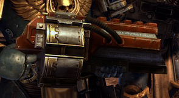

# 1223 复仇榴弹发射器 Vengeance Grenade Launcher

精校状态：中文行文已逐段精校，部分术语仍为暂定

分类：武器 / 远程武器

原文来源：https://www.bilibili.com/opus/1001366114638233606

原作者：帝国神选罐头

原文时间：2024年11月19日 11:31

[返回分类目录](目录.md) · [全书目录](../../目录.md)

<!-- A1223-B0001 -->
**英文原文**

The Vengeance Grenade Launcher is an experimental Adeptus Mechanicus weapon created on the Forge world Graia just prior to the Ork invasion of Warboss Grimskull. The Vengeance Grenade Launcher is not authorized for use off world, but those Space Marines who have field tested the weapon however, attest to its effectiveness against a range of targets. The launcher can fire out up to five charges that stick to surfaces and then be remotely detonated.

<!-- /A1223-B0001 -->

<!-- A1223-B0002 -->

原译文

复仇榴弹发射器是一种实验性的机械神教武器，在欧克军阀恐颅入侵之前在铸造世界格拉亚上制造。复仇榴弹发射器未被授权在世界各地使用，但那些对该武器进行过现场测试的星际战士证明了它对一系列目标的有效性。发射器最多可以发射五枚附着在表面的炸药，然后被远程引爆。

**校订译文**

复仇榴弹发射器是格莱亚铸造世界的机械修会研制的一种实验性武器，诞生于欧克战争头目恐颅入侵前夕。它尚未获准在星球之外使用，但参加实战测试的星际战士证实，它能有效对付多类目标。发射器最多可射出五枚能够黏附表面的爆炸装药，再以遥控方式引爆。

**校注：** off world指星球之外，原“世界各地”改变了使用限制范围。

<!-- /A1223-B0002 -->

<!-- A1223-B0003 图片 -->

<!-- A1223-B0004 -->

原译文

Vengeance Grenade Launcher 复仇榴弹发射器

**校订译文**

Vengeance Grenade Launcher 复仇榴弹发射器

<!-- /A1223-B0004 -->

本篇核心术语与暂定项

以下列出本篇出现的英文原形及核心术语表用词。同形词可能指不同对象，具体词义以本篇正文和校注为准；单复数、别名和仅见于图注的名称可能尚未列入。完整候选见[术语表](../../术语表/双语术语候选.csv)。

| 英文 | 采用中文 | 状态 |
| --- | --- | --- |
| Space Marines | 星际战士 | 官方已核对 |
| Adeptus Mechanicus | 机械修会 | 官方已核对 |
| Forge World | 铸造世界 | 暂定·官方待核 |
| Graia | 格莱亚 | 暂定·官方待核 |
| Warboss | 战争头目 | 官方已核对 |
| Vengeance | 复仇号 | 暂定·官方待核 |
| The Weapon | 武器 | 暂定·官方待核 |
| Grenade launcher | 榴弹发射器 | 暂定·官方待核 |
| Vengeance Grenade Launcher | 复仇榴弹发射器 | 暂定·官方待核 |
| Grenade | 手榴弹 | 暂定·官方待核 |

