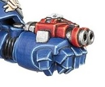

# 1224 腕戴式榴弹发射器 Wrist-Mounted Grenade Launcher

精校状态：中文行文已逐段精校，部分术语仍为暂定

分类：武器 / 远程武器

原文来源：https://www.bilibili.com/opus/1002865629456236560

原作者：帝国神选罐头

原文时间：2024年11月23日 12:30

[返回分类目录](目录.md) · [全书目录](../../目录.md)

原篇名：腕带式榴弹发射器 Wrist-Mounted Grenade Launcher

<!-- A1224-B0001 -->
**英文原文**

The Wrist-Mounted Grenade Launcher is a type of Grenade Launcher used by Space Marines. This weapon is known to be mounted on the Terminator Armour of Captains.

<!-- /A1224-B0001 -->

<!-- A1224-B0002 -->

原译文

腕戴式榴弹发射器是星际战士使用的一种榴弹发射器。众所周知，这种武器被安装在终结者连长盔甲上。

**校订译文**

腕戴式榴弹发射器是星际战士使用的一种武器，已知可安装在连长的终结者装甲上。

<!-- /A1224-B0002 -->

<!-- A1224-B0003 图片 -->

<!-- A1224-B0004 -->

原译文

Wrist-Mounted Grenade Launcher 腕戴式榴弹发射器

**校订译文**

Wrist-Mounted Grenade Launcher 腕戴式榴弹发射器

<!-- /A1224-B0004 -->

<!-- A1224-B0005 -->
## Patterns 型号

<!-- /A1224-B0005 -->

<!-- A1224-B0006 -->
**英文原文**

Thermogenic Combi-Fist - Combi-Weapon with integrated Power Fist. This weapon launches thermogenic bombs effective against armor and infantry at considerable distance.

<!-- /A1224-B0006 -->

<!-- A1224-B0007 -->

原译文

热能复合拳 - 带有集成动力拳的复合武器。这种武器可以在相当远的距离发射对装甲和步兵有效的热能炸弹。

**校订译文**

热能复合拳——内置动力拳的复合武器，可在较远距离发射热能炸弹，对付装甲目标和步兵。

<!-- /A1224-B0007 -->

<!-- A1224-B0008 -->
**英文原文**

Balistus Grenade Launcher - Adeptus Custodes grenade launcher that excels in piercing armour.

<!-- /A1224-B0008 -->

<!-- A1224-B0009 -->

原译文

巴利图斯榴弹发射器 - 禁军榴弹发射器擅长穿甲。

**校订译文**

巴利斯图斯榴弹发射器——禁军使用的榴弹发射器，擅长穿甲。

<!-- /A1224-B0009 -->

<!-- A1224-B0010 -->
**英文原文**

Grenade Discharger - grenade launcher used by Blood Angels Dawnbreaker Cohorts during the Great Crusade and Horus Heresy.

<!-- /A1224-B0010 -->

<!-- A1224-B0011 -->

原译文

掷弹筒 - 圣血天使黎明破坏者大队在大远征和荷鲁斯叛乱期间使用的榴弹发射器。

**校订译文**

掷弹筒——大远征和荷鲁斯之乱期间，圣血天使破晓者大队使用的武器。

<!-- /A1224-B0011 -->

<!-- A1224-B0012 -->
**英文原文**

Terrorfex - Used by Dark Eldar infantry.

<!-- /A1224-B0012 -->

<!-- A1224-B0013 -->

原译文

恐怖榴弹 - 由黑暗灵族步兵使用。

**校订译文**

恐怖榴弹发射器——黑暗灵族步兵使用的武器。

<!-- /A1224-B0013 -->

本篇核心术语与暂定项

以下列出本篇出现的英文原形及核心术语表用词。同形词可能指不同对象，具体词义以本篇正文和校注为准；单复数、别名和仅见于图注的名称可能尚未列入。完整候选见[术语表](../../术语表/双语术语候选.csv)。

| 英文 | 采用中文 | 状态 |
| --- | --- | --- |
| Space Marines | 星际战士 | 官方已核对 |
| Blood Angels | 圣血天使 | 官方已核对 |
| Adeptus Custodes | 帝皇禁军 | 官方已核对 |
| Eldar | 灵族 | 暂定·语境区分 |
| Dark Eldar | 黑暗灵族 | 暂定·旧称对应 |
| Terminator | 终结者 | 官方已核对 |
| Horus Heresy | 荷鲁斯之乱 | 官方已核对 |
| Great Crusade | 大远征 | 暂定·官方待核 |
| Horus | 荷鲁斯 | 暂定·官方待核 |
| Combi-weapon | 复合武器 | 暂定·官方待核 |
| Combi-Fist | 复合拳套 | 暂定·官方待核 |
| Grenade launcher | 榴弹发射器 | 暂定·官方待核 |
| Balistus Grenade Launcher | 巴利斯图斯榴弹发射器 | 暂定·官方待核 |
| Grenade Discharger | 掷弹筒 | 暂定·官方待核 |
| Terrorfex | 恐怖榴弹发射器 | 暂定·官方待核 |
| Wrist-Mounted Grenade Launcher | 腕戴式榴弹发射器 | 暂定·官方待核 |
| Thermogenic Combi-Fist | 热能复合拳 | 暂定·官方待核 |
| Grenade | 手榴弹 | 暂定·官方待核 |
| Power fist | 动力拳 | 官方已核对 |
| Terminator Armour | 终结者盔甲 | 暂定·官方待核 |

