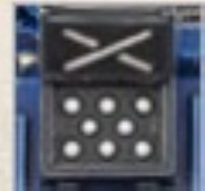

# 1226 自动发射器 Auto-launcher

精校状态：中文行文已逐段精校，部分术语仍为暂定

分类：武器 / 远程武器

原文来源：https://www.bilibili.com/opus/1003243066887241746

原作者：帝国神选罐头

原文时间：2024年11月24日 12:55

[返回分类目录](目录.md) · [全书目录](../../目录.md)

<!-- A1226-B0001 -->
**英文原文**

Auto-launchers are vehicle-mounted grenade launchers. They are simple, six-barreled weapons mounted on vehicle hulls, firing salvos of three grenades at a time. They are used on Imperial vehicles. Loaded with frag, krak or blind grenades, they are useful for close defense and laying smoke screens. The auto-launcher carries six grenades, all of the same type.

<!-- /A1226-B0001 -->

<!-- A1226-B0002 -->

原译文

自动发射器是车载榴弹发射器。它们是简单的六管武器，安装在车身上，一次发射三枚手榴弹。它们用于帝国车辆。它们装有破片、穿甲或致盲榴弹，可用于近身防御和铺设烟幕。自动发射器携带六枚同类型手榴弹。

**校订译文**

自动发射器是帝国载具使用的车载榴弹发射器。这种结构简单的六管武器安装在车体上，每轮齐射三枚榴弹，可装填破片、穿甲或致盲榴弹，用于近距离防御或施放烟幕。每具自动发射器携带六枚同类型榴弹。

<!-- /A1226-B0002 -->

<!-- A1226-B0003 图片 -->

<!-- A1226-B0004 -->

原译文

Auto Launcher 自动发射器

**校订译文**

Auto Launcher 自动发射器

<!-- /A1226-B0004 -->

<!-- A1226-B0005 -->
**英文原文**

A semi-autonomous variant designed to be mounted on emplacements and barricades as well as vehicles. Each pre-loaded canister contains either three pairs of Frag or Smoke grenades, and can be triggered remotely from nearby crew or set to activate based on detected movement or sound. When fired they shoot out a pair of grenades in a 45 degree arc from the front, designed to either disrupt or disorient nearby infantry.

<!-- /A1226-B0005 -->

<!-- A1226-B0006 -->

原译文

一种半自动变体，设计用于安装在阵地、路障和车辆上。每个预装罐包含三对破片或烟雾手榴弹，可以从附近的人员处远程触发，也可以根据检测到的运动或声音设置激活。发射时，他们对前方以45度角射出一对手榴弹，旨在扰乱或迷惑附近的步兵。

**校订译文**

另一种半自主型号可安装在固定阵位、路障或载具上。每个预装弹筒装有三对破片榴弹或烟幕榴弹，既可由附近的操作人员遥控触发，也可设为在探测到移动或声音时自动启动。每次发射时，它会向正前方的45度扇形范围射出一对榴弹，以扰乱附近步兵的行动或使其失去方向感。

**校注：** semi-autonomous指半自主控制，并非半自动射击方式；本型号每次两枚，与前段型号每次三枚的区别照原文保留。

<!-- /A1226-B0006 -->

本篇核心术语与暂定项

以下列出本篇出现的英文原形及核心术语表用词。同形词可能指不同对象，具体词义以本篇正文和校注为准；单复数、别名和仅见于图注的名称可能尚未列入。完整候选见[术语表](../../术语表/双语术语候选.csv)。

| 英文 | 采用中文 | 状态 |
| --- | --- | --- |
| Auto-launcher | 自动发射器 | 暂定·官方待核 |
| Grenade | 手榴弹 | 暂定·官方待核 |

