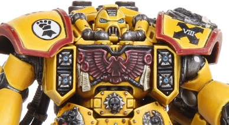

# 1227 铁甲突击发射器 Ironclad Assault Launcher

精校状态：中文行文已逐段精校，部分术语仍为暂定

分类：武器 / 远程武器

原文来源：https://www.bilibili.com/opus/1004738406983401496

原作者：帝国神选罐头

原文时间：2024年11月28日 13:38

[返回分类目录](目录.md) · [全书目录](../../目录.md)

<!-- A1227-B0001 -->
**英文原文**

The Ironclad Assault Launcher is mounted on Ironclad Dreadnoughts or Centurions. It fires both offensive and defensive grenades.

<!-- /A1227-B0001 -->

<!-- A1227-B0002 -->

原译文

铁甲突击发射器安装在铁甲无畏或百夫长身上。它发射进攻和防御手榴弹。

**校订译文**

铁甲突击发射器安装在铁甲无畏机甲或百夫长装甲上，可发射进攻型和防御型榴弹。

<!-- /A1227-B0002 -->

<!-- A1227-B0003 图片 -->

<!-- A1227-B0004 -->

原译文

Ironclad Assault Launcher mounted on a Centurion 安装在百夫长身上的铁甲突击发射器

**校订译文**

Ironclad Assault Launcher mounted on a Centurion 安装在百夫长装甲上的铁甲突击发射器

<!-- /A1227-B0004 -->

本篇核心术语与暂定项

以下列出本篇出现的英文原形及核心术语表用词。同形词可能指不同对象，具体词义以本篇正文和校注为准；单复数、别名和仅见于图注的名称可能尚未列入。完整候选见[术语表](../../术语表/双语术语候选.csv)。

| 英文 | 采用中文 | 状态 |
| --- | --- | --- |
| Centurions | 百夫长 | 暂定·官方待核 |
| Ironclad Assault Launcher | 铁甲突击发射器 | 暂定·官方待核 |

