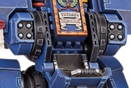

# 1228 破片风暴榴弹发射器 Fragstorm Grenade Launcher

精校状态：中文行文已逐段精校，部分术语仍为暂定

分类：武器 / 远程武器

原文来源：https://www.bilibili.com/opus/1001726655679430677

原作者：帝国神选罐头

原文时间：2024年11月20日 10:51

[返回分类目录](目录.md) · [全书目录](../../目录.md)

<!-- A1228-B0001 -->
**英文原文**

Fragstorm Grenade Launchers are a type of Grenade Launcher used by Primaris Space Marines. They are equipped for anti-personnel roles to Aggressor Squads and Redemptor Dreadnoughts.

<!-- /A1228-B0001 -->

<!-- A1228-B0002 -->

原译文

破片风暴榴弹发射器是原铸星际战士使用的一种榴弹发射器。他们装备给了侵略者小队和救赎者无畏等反人员角色。

**校订译文**

破片风暴榴弹发射器是原铸星际战士使用的一种榴弹发射器，装备于侵略者小队和救赎者无畏机甲，用来杀伤敌方人员。

<!-- /A1228-B0002 -->

<!-- A1228-B0003 图片 -->

<!-- A1228-B0004 -->

原译文

Twin Fragstorm Grenade Launchers 双联破片风暴榴弹发射器

**校订译文**

Twin Fragstorm Grenade Launchers 双联破片风暴榴弹发射器

<!-- /A1228-B0004 -->

本篇核心术语与暂定项

以下列出本篇出现的英文原形及核心术语表用词。同形词可能指不同对象，具体词义以本篇正文和校注为准；单复数、别名和仅见于图注的名称可能尚未列入。完整候选见[术语表](../../术语表/双语术语候选.csv)。

| 英文 | 采用中文 | 状态 |
| --- | --- | --- |
| Space Marines | 星际战士 | 官方已核对 |
| Aggressor | 侵略者 | 暂定·官方待核 |
| Aggressor Squads | 侵略者小队 | 暂定·官方待核 |
| Grenade launcher | 榴弹发射器 | 暂定·官方待核 |
| Grenade | 手榴弹 | 暂定·官方待核 |

