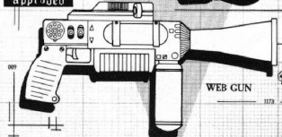
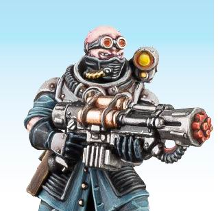

# 1230 射网枪 Webber

精校状态：中文行文已逐段精校，部分术语仍为暂定

分类：武器 / 远程武器

原文来源：https://www.bilibili.com/opus/998067669975433255

原作者：帝国神选罐头

原文时间：编辑于 2025年08月27日 17:54

[返回分类目录](目录.md) · [全书目录](../../目录.md)

<!-- A1230-B0001 -->
**英文原文**

The Webber, or web gun, is a weapon designed to restrict the movement of whatever its shot comes into contact with.

<!-- /A1230-B0001 -->

<!-- A1230-B0002 -->

原译文

射网枪，或称网枪，是一种旨在限制其射击所接触到的任何物体移动的武器。

**校订译文**

射网枪，又称网枪，是一种用于限制中弹目标行动的武器。

<!-- /A1230-B0002 -->

<!-- A1230-B0003 图片 -->

<!-- A1230-B0004 -->

原译文

Webber 射网枪

**校订译文**

Webber 射网枪

<!-- /A1230-B0004 -->

<!-- A1230-B0005 -->
## Overview 概述

<!-- /A1230-B0005 -->

<!-- A1230-B0006 -->
**英文原文**

It fires a chemical which expands into fibrous strands which entangle and immobilise anyone under it. The fibres then shrink as the victim struggles until they are crushed. Some webs contain anaesthetic, meaning the prey will not struggle, making it better for hunting. Webbing can be dissolved with a special web spray.

<!-- /A1230-B0006 -->

<!-- A1230-B0007 -->

原译文

它会释放一种化学物质，这种化学物质会膨胀成纤维束，将任何人缠绕并固定在它下面。然后，当受害者挣扎时，纤维会收缩，直到被压碎。有些网含有麻醉剂，这意味着猎物不会挣扎，更适合狩猎。网状物可以用特殊的除网喷雾溶解。

**校订译文**

它会射出一种化学物质，膨胀后形成纤维丝束，将被覆盖的人缠住，使其无法行动。目标越是挣扎，纤维就收缩得越紧，最终会将被困者挤碎。有些网含有麻醉剂，能让猎物停止挣扎，因此更适合狩猎。这些网可以用专门的除网喷剂溶解。

<!-- /A1230-B0007 -->

<!-- A1230-B0008 图片 -->

<!-- A1230-B0009 -->

原译文

Genestealer Cultist with Webber 配备射网枪的基因掠夺者异教徒

**校订译文**

Genestealer Cultist with Webber 装备射网枪的基因窃取者教徒

<!-- /A1230-B0009 -->

<!-- A1230-B0010 -->
**英文原文**

There are also relative forms of this weapon - the web pistol and the heavy webber.

<!-- /A1230-B0010 -->

<!-- A1230-B0011 -->

原译文

这种武器也有相对的形式——射网手枪和重型射网枪。

**校订译文**

这类武器还有射网手枪和重型射网枪等衍生型号。

<!-- /A1230-B0011 -->

<!-- A1230-B0012 -->
### Variants 类型

<!-- /A1230-B0012 -->

<!-- A1230-B0013 -->

原译文

Astartes Webber 阿斯塔特射网枪

**校订译文**

Astartes Webber 阿斯塔特射网枪

<!-- /A1230-B0013 -->

<!-- A1230-B0014 -->
**英文原文**

Razor Webber — Launches a web net mixed with razor-sharp strands that rips the victim apart as they try to free themselves.

<!-- /A1230-B0014 -->

<!-- A1230-B0015 -->

原译文

剃刀射网枪——推出一种混合了锋利绳索的网状物，在受害者试图挣脱时将其撕裂。

**校订译文**

剃刀射网枪——射出混有剃刀般锋利丝线的网；被困者试图挣脱时，这些丝线会将其撕裂。

<!-- /A1230-B0015 -->

本篇核心术语与暂定项

以下列出本篇出现的英文原形及核心术语表用词。同形词可能指不同对象，具体词义以本篇正文和校注为准；单复数、别名和仅见于图注的名称可能尚未列入。完整候选见[术语表](../../术语表/双语术语候选.csv)。

| 英文 | 采用中文 | 状态 |
| --- | --- | --- |
| Gun | 甘 | 暂定·官方待核 |
| Webber | 射网枪 | 暂定·官方待核 |
| Web Pistol | 射网手枪 | 暂定·官方待核 |
| Heavy Webber | 重型射网枪 | 暂定·官方待核 |
| Razor Webber | 剃刀射网枪 | 暂定·官方待核 |

